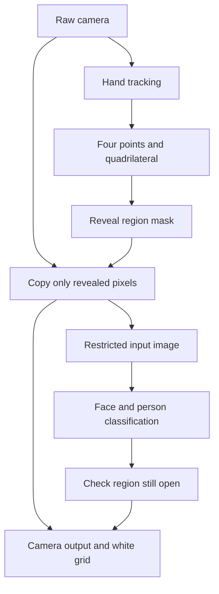

**Web Camera Tracking plan: white pixel screen, reveal region from four fingertips, and face tracking inside the reveal region**

Updated 14/09/2026 following the user's new idea. This document replaces the operating approach of the first version. It is a design plan; no software has been built or benchmarked in this update.

Updated 18/09/2026 (D-038): locking the reveal region as a **square** in the 14/09 version was a mistake. The reveal region is a **quadrilateral whose four vertices are the four fingertips**; the mask is the set of grid cells that lie inside the quadrilateral or are crossed by one of its edges (crossed cells also open). The sections below have been corrected accordingly; the square window remains only in the mouse-controlled mode for geometry checks.

**Experience goal: use four fingertips to open a quadrilateral region on the white grid screen to see the camera; face/person recognition works only on the image that is currently revealed.**

Confirmed requirements:

- The output starts as a white screen divided into cells; the user chooses the grid resolution.
- The camera input is still used for hand/finger tracking while the output is fully covered.
- Four selectable fingertip points are the four vertices of the reveal region (a quadrilateral); grid cells inside it or crossed by an edge all open.
- The reveal region shows the live camera at exactly that position. The rest stays covered in white.
- Face/human tracking runs only on the camera data of the reveal region. Covered areas must not be fed into the face/person models.
- The previously confirmed human requirement is to distinguish a person from a human-like mannequin. Face landmarks and person/mannequin classification are two separate outputs.

**The defaults below are implementation proposals and may be adjusted during the PoC.**

| Detail | Proposed default |
|---|---|
| Camera | Desktop webcam, one video source |
| Four points | Thumb and index finger of both hands; each point can be reselected |
| Reveal region | Quadrilateral of four fingertips, rasterized into a set of grid cells: cells inside the quadrilateral and cells crossed by an edge |
| Revealed image | Sharp camera image; the grid resolution only determines the size of the covering cells |
| After the window moves | Old cells close immediately; no reveal trail is kept |
| A required point is lost | Close the reveal region once the point is determined to be invalid; clear face results |
| Face tracking | Search for a face as soon as a valid reveal region exists, then process repeatedly while the region stays open |
| Face cut by the reveal region border | By default not recognized as a full face; suggest enlarging the region |
| Hand overlay | Only the four control dots and the window outline; no camera shown outside the reveal region |

**The experience flow is revised into five steps.**

1. The user chooses the camera and the grid resolution; the output already shows white before the camera starts playing.
2. The hand tracker finds hands from the raw camera. The UI guides the user to bring both hands into the frame; fingertip dots may be shown on the white background.
3. When the four selected points are valid, the app builds the quadrilateral and opens the cells inside it or crossed by its edges.
4. The camera image in the reveal region is sent to the face/human branch. Having a reveal region is the start condition; no full-camera face detection is needed beforehand to decide whether to enable the model.
5. When the hands change, the reveal region updates. When the region closes, face/human stops receiving new tasks, the current results are cleared and late results are discarded.

Here “enable ontime” means turning inference on when a reveal region exists and continuing to update in real time while it is open, not running just once. Enabling the model does not guarantee a face is found: the window may be looking at the background or exposing only a part of the face that is too small.

**The architecture has two branches with different data read permissions.**

| Branch | May read the raw camera? | When the output is fully covered |
|---|---|---|
| Hand/finger tracker | Yes, to find and control the four points | Keeps running |
| Reveal region builder | Receives only hand coordinates and config | Creates no region if points are invalid |
| Output compositor | Yes, but copies only pixels allowed by the mask | Draws white, no camera flash |
| Face detector/landmarker | No; receives only the image cropped from the reveal region | No new inference tasks |
| Person/mannequin classifier | No; receives only the reveal region content | No new inference tasks |
| Face overlay and exported data | Uses only results still valid in the current region | Clears face/person results |

Do not connect the raw video to the face model and then filter results by position. Do not merely place a white CSS layer over the video while the face model still reads the original video. The restriction rule must apply to the model's input data.

**Pixel screen design: the grid resolution is independent of the camera resolution.**

| Parameter | Example | Meaning |
|---|---|---|
| Camera input | 1280 × 720 | Detail level of the source image |
| Grid resolution | 32 × 18, 64 × 36, 128 × 72 | Number of columns and rows of the covering screen |
| Pixel/cell size | 20 × 20 on a 1280 × 720 stage with a 64 × 36 grid | Size of one displayed cell |
| Reveal size | Set of cells intersecting the quadrilateral; short side of the bounding box ≥ nMin cells | Not forced square; cells crossed by an edge also open |

The output initializes as solid white, with light gray grid lines that can be toggled. By default the revealed part shows the sharp raw camera; the face image is not pixelated to the grid resolution.

To keep cells square when the user enters any number of columns/rows, compute the cell size c = min(stageWidth / columns, stageHeight / rows), center the board and leave the padding white. The camera keeps its aspect ratio and uses one fixed transform to map onto the board; the person is not stretched to fill the board. Resize, mirror and grid changes must update the same coordinate system for hands, mask, camera and face.

The reveal region is always a set of whole cells inside the board (a point outside the board is invalid, so the quadrilateral never overflows the board); only the cells currently in the set are open. The N × N square window remains only in the mouse-controlled mode (geometry check), with edge clamping and a limit state.

**The four points are the four vertices of the reveal region quadrilateral (D-038).**

Computation in stage coordinates, after converting from camera and applying mirror:

- Select four distinct slots, each consisting of a hand track + a fingertip name. The preset uses left thumb, left index, right thumb, right index.
- Keep hand IDs over time; do not use the order of the returned array as the ID. When the hands cross and ID matching is uncertain, close the region instead of switching slots automatically.
- Smooth each point in continuous coordinates (One Euro), sort the four points by angle around the centroid into a simple polygon (no self-intersection).
- Rasterize the quadrilateral into a cell set: any cell with a positive-area intersection with the quadrilateral (inside, or crossed by an edge) opens. Per-cell hysteresis: an open cell only turns off when the quadrilateral moves more than 0.25 cells away from it; a closed cell only turns on when the quadrilateral encroaches more than 0.25 cells, to reduce flicker at the boundary.
- The region is invalid if the short side of the bounding box is under nMin cells, the area is too small (points nearly coincident or nearly collinear), a slot is missing, a point is too stale or a point leaves the frame.
- Draw the four points, the quadrilateral (dashed) and the cell set outline separately so the user sees the region derived from the hands.

The camera image is not warped to the quadrilateral: camera pixels are copied at their exact position in each open cell; a cell inside the bounding box that is not in the cell set is a "hole", stays white on the output and is filled with gray padding in the inference buffer.

**The same mask must decide both the display and the recognition data.**

Let I_t be the camera frame and M_t the binary mask of the reveal region at frame t. The background output is I_t at pixels allowed by M_t and white at all other pixels; overlays are drawn after this step.

The recognition input is built as follows:

1. Capture a frame with a frameId and timestamp; compute or attach the fresh hand result to that frame.
2. Build M_t and the window from the current config. Create only one canonical mask for both the output and recognition branches.
3. Crop/copy only the camera pixels inside the window into a new buffer, without padding with camera pixels from outside the window. If the model needs padding, use a solid color.
4. Only after the safe crop, resize/letterbox for the model. Avoid resizing the whole camera first and cropping afterwards, because interpolation at the border can bring outside pixels into the input.
5. Do not include grid lines, text, outlines or hand dots in the inference image.
6. Send this restricted buffer to the face worker; the face worker receives no reference to the raw video or the original frame.

Every auxiliary model for person/mannequin determination follows the same rule. A full-frame person model must not run in the background to help confirm a face inside the window.

**Face tracking must handle boundaries and late results.**

MediaPipe Face Landmarker has a web implementation, outputs landmarks and offers blendshape/transform options. The detect/detectForVideo calls run synchronously; the documentation suggests a Web Worker to avoid blocking the UI. [Face Landmarker Web](https://developers.google.com/edge/mediapipe/solutions/vision/face_landmarker/web_js).

First approach: initialize the model up front to reduce wait time, but send camera images only when the reveal region is valid. Use independent per-image inference as the baseline; the app links the still-visible results to form tracking. This simplifies crop window position/size changes and not keeping tracks across covered areas. Benchmark before switching to VIDEO mode and its more complex internal state management.

| Situation | Face inference | Display state |
|---|---|---|
| Fully covered screen | No tasks issued | White screen/grid; no face result |
| Window open but only background | Yes, on the reveal region image | Searching for a face |
| Window too small to read a face reliably | Tasks may be throttled/paused by a quality threshold | Suggest enlarging the region |
| Face clear enough and inside the reveal region | Yes | Candidate face; labeled person after the classification step if it passes |
| Face cut by the window border | Use only the actually exposed part; do not extend the crop outward | By default not recognized as a full face; suggest enlarging |
| Window moves away from the face | May keep searching for a face at the new position | Immediately drop old face results no longer inside the region |
| Point lost or user closes the region | Stop issuing new tasks | Clear face/label; discard results of running tasks that return later |
| Reopen after closing | Fresh inference | Do not restore old face tracks from memory |

Each task keeps the frameId, timestamp, ROI at send time, the crop→camera→output transform and the session/config epoch. Closing/reopening, changing camera, mirror, grid or layout invalidates results from the previous epoch.

When a result returns, convert coordinates using the task's original ROI, not the new window position. Accept only results that are fresh enough, from the same epoch, and whose recognized face area lies inside both the reveal region at capture time and the current reveal region. Clip all overlays to the current mask; points outside are removed from the overlay and the exported data. If the conditions are not met, drop the result; do not keep drawing predictions under the white layer.

Do not bump the epoch on every small movement, because that could discard every task while the user moves their hands continuously. Freshness and the face support area are checked per task. A conservative baseline may pause drawing the face while the window changes quickly; this behavior needs to be measured in the PoC.

A synchronous task that has started may not be cancellable midway; when the window closes, stop sending new work and discard that task's result. The image it received was still only the region validly revealed at send time.

**Distinguishing a person from a mannequin remains a separate requirement inside the visible region.**

Face landmarks do not prove a real person. The plan keeps two outputs: faceDetected and subjectType = person / mannequin / unknown. Publish the label "Người" (Person) only when the classification branch meets its criteria; otherwise show "Khuôn mặt chưa phân loại" (Unclassified face) or "Hình nộm" (Mannequin). Do not infer a mannequin just because the subject stands still.

Because the window may expose only the head or part of the body, the classification dataset must contain matching crops of people and mannequins across many window sizes, viewing angles, lighting conditions and covering borders. A model trained only on full-body images may lack signal in small windows; it needs re-evaluation. If the reveal region lacks enough information, unknown is a valid result. Highly human-like silicone mannequins are a hard group to be reported separately.

No robot/avatar classes are added. Body pose may be kept as an extension module of the project, but it does not run on the full camera in this pixel mode. If enabled later, its input is also restricted by the mask.

**Stack and modules to adjust compared with the first version.**

| Module | Technology/approach | Change |
|---|---|---|
| Camera source | getUserMedia | Kept; the video output is not shown on the main screen by itself |
| Hand tracker | MediaPipe Hand Landmarker | Runs from the raw camera; accepts multiple hands but binds four specific slots |
| Point selector | TypeScript | Add fingertip selection, ID locking and point quality |
| Quad solver | TypeScript | Filter the four points, order vertices, rasterize the quadrilateral into a cell set with hysteresis |
| Pixel compositor | Canvas 2D; consider WebGL after benchmarking | Add white background, grid, mask and camera window |
| Restricted frame builder | Canvas/OffscreenCanvas depending on actual compatibility | Add a data path containing only revealed pixels |
| Face tracker | MediaPipe Face Landmarker in a Worker | Add gating, crop coordinates and stale result protection |
| Person/mannequin | Custom detector/classifier, PyTorch→ONNX Runtime Web is a candidate | Move training data and inference to the reveal region |
| UI | React + TypeScript + Vite | Camera, grid, four points, sensitivity and reveal region state |
| Hosting | Static HTTPS | Kept; in-browser inference is the goal |

Hand Landmarker web supports multiple hands and 21 points per hand, suitable for taking fingertip points. [Hand Landmarker Web](https://developers.google.com/edge/mediapipe/solutions/vision/hand_landmarker/web_js).

Technical update from the first version: the official documentation states that MediaPipe Model Maker is no longer actively maintained. Therefore it is not chosen as the main training path for the person/mannequin branch. The PyTorch→ONNX path is a proposal that needs export, operator and in-browser performance trials before it is locked. [Model Maker](https://developers.google.com/edge/mediapipe/solutions/customization/object_detector), [ONNX Runtime Web](https://onnxruntime.ai/docs/tutorials/web/).

**Performance and camera state.**

- A 720p camera is the trial setup. Trial targets: output ≥30 FPS, hand inference ≥20 Hz, face inference in the reveal region ≥10–15 Hz on a desktop machine with a documented configuration; these are not achieved numbers.
- Person/mannequin classification may run less often than face landmarks, but the label is not kept across closing/covering of the face area.
- Each pipeline has at most one running task; drop old frames instead of building up a queue.
- Smooth the four points before building the mask and use that same cell set for output/model. There is no separate “smoothed for drawing” mask and another mask for inference.
- Adapt the model rate to the load. The grid resolution does not by itself determine the face model input size.
- When a point is lost: close on the next render after the lost state is determined; do not keep the window open with indefinitely predicted points. Set a point age limit, for example 150 ms to start trials, and tune it by benchmark.
- Camera permission denied, camera stopped, source change and background tab all return the output to the closed state. Always initialize the white background before the video to avoid a full-camera flash.

The web camera requires access permission and a secure context; deploy over HTTPS, develop on localhost. [MDN getUserMedia](https://developer.mozilla.org/en-US/docs/Web/API/MediaDevices/getUserMedia).

**The roadmap changes to focus on the mask and input restriction before optimizing recognition.**

| Phase | Work | Done criteria |
|---|---|---|
| 1: covering screen, 2–3 days | Camera, white grid, custom grid; mouse-controlled window for geometry checks | Fully white at start; only open cells are shown; no camera distortion |
| 2: four fingertips, 3–5 days | Hand tracking, slot selection, quad solver, smoothing, loss of tracking | Stable hand-following quadrilateral region, closes when points are invalid |
| 3: face inside the reveal region, 3–5 days | Restricted frame builder, face worker, coordinate mapping, stale result rejection | The model never receives covered parts; the face disappears from the output when covered |
| 4: PoC acceptance, 2–3 days | Boundary tests, resize/mirror, latency, looped video | Test report on region correctness and benchmark |
| 5: person/mannequin, about 2–4 weeks; data starts early | Window-crop data, fine-tuning, browser run, unknown and tests on new samples | Report metrics per class, window size and covering condition |
| 6: pilot, about 1 week | Optimization, trials on target devices, configuration and guidance | Usable demo on the accepted configuration |

Estimate for the pixel + hands + face PoC: about 2–3 weeks for a developer experienced in web/computer vision. The version with evaluated person/mannequin classification: about 5–8 weeks with web and ML in parallel, depending on data and model. A PoC that finds a face does not mean the person-vs-mannequin requirement is met. The milestones are provisional and are updated after phase 2 and the classification baseline.

**The most important tests must check the model's actual input.**

| Case | Required result |
|---|---|
| Startup or fewer than four points | White output; the number of face/human calls on the camera is 0 |
| Person outside the reveal region, window sees only background | Face/human input contains no pixels of the person; no face result outside the window is accepted |
| Only the covered content changes | Keep the mask/hand points and reveal region content fixed: the face/human input buffer must be identical; measured at the buffer before the model |
| Full face revealed | The face may be recognized if quality is sufficient; coordinates match the camera and the window |
| Only part of the face revealed | No extra image outside the region is taken to complete the face; no landmarks drawn under the white part |
| Covered again while a face task is running | Immediately clear the drawn result; the result returning later does not reappear |
| Window dragged to another position | Old crop results are not mapped with the new crop coordinates; the old face does not stick to the wrong position |
| A finger/hand lost, crossed hands or coincident points | The region closes when there are no longer enough valid points; it does not jump to another hand |
| Change grid, mirror, resize, camera | Results of the old configuration are cancelled; face and open cells stay aligned |
| 64 × 36 grid on a 1280 × 720 stage | 20 × 20 cells; the reveal region is the set of cells intersecting the quadrilateral, cells crossed by an edge also open |
| Person standing still and mannequin being moved | Classification does not rely on a motion/no-motion rule |
| 15-minute run | No crash, no unbounded frame queue growth, no continuous memory leak |

Mask correctness is a hard gate: in the closed area there must be no camera pixels in the recognition buffer. ML accuracy is measured separately, because the model can still predict wrongly even when the data path is correctly restricted.

For classification, the initial target is per-class precision/recall ≥90% within the chosen scope, with unknown/miss counted as missing recall of the true class. Also report the rate of mannequins labeled person, the unknown rate and results by window size. Split train/validation/test by person, mannequin sample and recording session; do not split adjacent frames into different sets. No metric has been measured in this document.

**Work backlog for the new approach.**

| ID | Work | Depends on |
|---|---|---|
| CAM-01 | Camera lifecycle, white background before video, timestamp | None |
| GRID-01 | Custom grid, square cells, viewport and mirror | CAM-01 |
| HAND-01 | Hand tracker and stable hand IDs | CAM-01 |
| HAND-02 | Fingertip selection, freshness and invalid state | HAND-01 |
| ROI-01 | Four-fingertip quadrilateral, smoothing, rasterization into cells with hysteresis (ROI-02 corrects from the square) | GRID-01, HAND-02 |
| MASK-01 | Canonical mask and compositor | ROI-01 |
| MASK-02 | Buffer containing only the reveal region, crop before resize | MASK-01 |
| FACE-01 | Face worker receives only the restricted buffer | MASK-02 |
| FACE-02 | State gate, coordinates, epoch, freshness, result clipping | FACE-01 |
| CLS-01 | Person/mannequin data as reveal region crops | MASK-01 |
| CLS-02 | Classification model, unknown and restricted input integration | CLS-01, MASK-02 |
| QA-01 | Tests for mask, late tasks and closing time | FACE-02 |
| QA-02 | Benchmark, classification metrics and device matrix | QA-01, CLS-02 |
| REL-01 | Public web deployment (GitHub Pages, custom domain, service worker), source, model/config, guidance and pilot | QA-02 |

Handover: web source, data path diagram, grid/four-point configuration, model and version, result schema, the set of test clips permitted for use, mask/performance/classification reports and run instructions. No video is saved or uploaded by default; face data export also follows the reveal region state.
