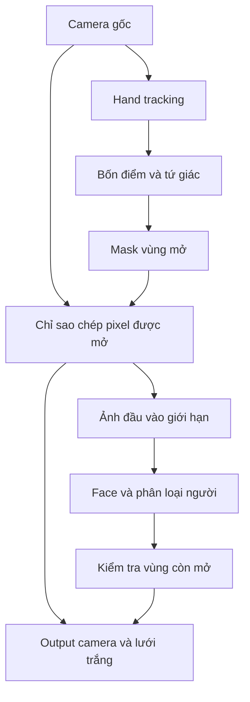

**Kế hoạch web Camera Tracking — màn pixel trắng, vùng mở bằng bốn đầu ngón tay và face tracking trong vùng mở**

Cập nhật 14/09/2026 theo ý tưởng mới của người dùng. Tài liệu này thay thế phương án vận hành ở bản đầu. Đây là kế hoạch thiết kế; chưa có phần mềm được xây hoặc benchmark trong lần cập nhật này.

Cập nhật 18/09/2026 (D-038): việc chốt vùng mở là **hình vuông** ở bản 14/09 là sai sót. Vùng mở là **tứ giác có bốn đỉnh là bốn đầu ngón tay**; mask là tập các ô lưới nằm trong tứ giác hoặc bị cạnh của tứ giác cắt qua (ô bị cắt cũng mở). Các đoạn dưới đây đã sửa theo; cửa sổ vuông chỉ còn ở chế độ điều khiển bằng chuột để kiểm hình học.

**Mục tiêu trải nghiệm: dùng bốn đầu ngón tay mở một vùng tứ giác trên màn lưới trắng để nhìn camera; nhận diện mặt/người chỉ hoạt động trên hình ảnh đang được mở.**

Các yêu cầu đã xác nhận:

- Output bắt đầu là màn trắng chia ô; người dùng chọn độ phân giải lưới.
- Input camera vẫn được dùng cho hand/finger tracking khi output bị che kín.
- Bốn điểm đầu ngón tay có thể tùy chọn, là bốn đỉnh của vùng mở (tứ giác); ô lưới nằm trong hoặc bị cạnh cắt qua đều mở.
- Vùng mở hiển thị camera trực tiếp tại đúng vị trí đó. Phần ngoài tiếp tục bị che trắng.
- Face/human tracking chỉ được chạy trên dữ liệu camera của vùng mở. Vùng bị che không được đưa vào các model mặt/người.
- Yêu cầu human đã xác nhận trước đây là phân biệt người với hình nộm giống người. Face landmarks và phân loại người/hình nộm là hai đầu ra riêng.

**Các mặc định dưới đây là đề xuất triển khai, có thể điều chỉnh khi làm PoC.**

| Chi tiết | Mặc định đề xuất |
|---|---|
| Camera | Webcam desktop, một nguồn video |
| Bốn điểm | Ngón cái và ngón trỏ của hai tay; có chọn lại từng điểm |
| Vùng mở | Tứ giác bốn đầu ngón, rasterize thành tập ô lưới: ô trong tứ giác và ô bị cạnh cắt qua |
| Hình ảnh được mở | Camera rõ nét; độ phân giải lưới chỉ quyết định kích thước ô che |
| Sau khi cửa sổ di chuyển | Ô cũ đóng lại ngay; không lưu vệt mở |
| Mất một điểm bắt buộc | Đóng vùng mở khi xác định điểm không còn hợp lệ; xóa kết quả mặt |
| Face tracking | Tìm mặt ngay khi có vùng mở hợp lệ, sau đó xử lý lặp lại khi vùng còn mở |
| Mặt bị cắt bởi biên vùng mở | Mặc định chưa công nhận một mặt đầy đủ; gợi ý mở rộng vùng |
| Overlay tay | Chỉ bốn chấm điều khiển và viền cửa sổ, không hiển thị camera ngoài vùng mở |

**Luồng trải nghiệm được sửa thành năm bước.**

1. Người dùng chọn camera và độ phân giải lưới; output đã hiển thị trắng trước khi camera bắt đầu phát.
2. Hand tracker tìm các bàn tay từ camera gốc. UI hướng dẫn đưa hai tay vào khung hình; có thể hiện các chấm đầu ngón tay trên nền trắng.
3. Khi bốn điểm đã chọn hợp lệ, ứng dụng dựng tứ giác và mở các ô nằm trong hoặc bị cạnh tứ giác cắt qua.
4. Ảnh camera ở vùng mở được gửi sang nhánh face/human. Có vùng mở là điều kiện khởi chạy; không cần phát hiện mặt ở toàn camera trước để quyết định bật model.
5. Khi tay thay đổi, vùng mở cập nhật. Khi vùng đóng, face/human dừng nhận tác vụ mới, kết quả hiện tại bị xóa và tác vụ trả về muộn bị loại.

Ở đây “enable ontime” được hiểu là bật suy luận khi có vùng mở và tiếp tục cập nhật theo thời gian thực trong lúc mở, không chỉ chạy một lần. Bật model không đồng nghĩa chắc chắn tìm thấy mặt: cửa sổ có thể đang nhìn vào nền hoặc chỉ lộ một phần quá nhỏ của khuôn mặt.

**Kiến trúc có hai nhánh với quyền đọc dữ liệu khác nhau.**

| Nhánh | Được đọc camera gốc? | Khi output bị che kín |
|---|---|---|
| Hand/finger tracker | Có, để tìm và điều khiển bốn điểm | Tiếp tục chạy |
| Bộ tạo vùng mở | Chỉ nhận tọa độ tay và cấu hình | Không tạo vùng nếu điểm không hợp lệ |
| Bộ dựng output | Có, nhưng chỉ sao chép pixel được mask cho phép | Vẽ trắng, không lóe camera |
| Face detector/landmarker | Không; chỉ nhận ảnh được cắt từ vùng mở | Không có tác vụ suy luận mới |
| Phân loại người/hình nộm | Không; chỉ nhận nội dung vùng mở | Không có tác vụ suy luận mới |
| Overlay mặt và dữ liệu xuất | Chỉ dùng kết quả còn hợp lệ trong vùng hiện tại | Xóa kết quả mặt/người |

Không nối video gốc tới face model rồi lọc kết quả theo vị trí. Cũng không chỉ đặt một lớp CSS trắng lên video trong khi face model vẫn đọc video nguyên bản. Quy tắc giới hạn phải có ở dữ liệu đầu vào của model.

**Thiết kế màn pixel: độ phân giải lưới độc lập với độ phân giải camera.**

| Tham số | Ví dụ | Ý nghĩa |
|---|---|---|
| Camera input | 1280 × 720 | Độ chi tiết của ảnh nguồn |
| Grid resolution | 32 × 18, 64 × 36, 128 × 72 | Số cột và hàng của màn che |
| Pixel/cell size | 20 × 20 ở sân khấu 1280 × 720 với lưới 64 × 36 | Kích thước một ô hiển thị |
| Reveal size | Tập ô giao với tứ giác; cạnh ngắn hộp bao ≥ nMin ô | Không ép vuông; ô bị cạnh cắt qua cũng mở |

Output khởi tạo màu trắng đặc, vạch lưới xám nhạt có thể bật/tắt. Mặc định phần được mở hiển thị camera gốc rõ nét; không pixel hóa hình ảnh mặt theo độ phân giải lưới.

Để giữ ô vuông khi người dùng nhập số cột/hàng bất kỳ, tính cạnh ô c = min(stageWidth / columns, stageHeight / rows), căn giữa bảng và để phần đệm màu trắng. Camera giữ tỷ lệ, dùng một phép biến đổi cố định để ánh xạ vào bảng; không kéo giãn người để lấp bảng. Resize, mirror và thay đổi grid phải cập nhật cùng một hệ tọa độ cho tay, mask, camera và mặt.

Vùng mở luôn là tập ô nguyên trong bảng (điểm ngoài bảng là không hợp lệ nên tứ giác không tràn bảng); chỉ các ô hiện tại thuộc tập được mở. Cửa sổ vuông N × N chỉ còn ở chế độ điều khiển bằng chuột (kiểm hình học), có kẹp mép và trạng thái giới hạn.

**Bốn điểm là bốn đỉnh của tứ giác vùng mở (D-038).**

Cách tính trong tọa độ sân khấu, sau khi đã đổi từ camera và mirror:

- Chọn bốn slot riêng biệt, mỗi slot gồm track bàn tay + tên đầu ngón. Preset dùng left thumb, left index, right thumb, right index.
- Giữ ID bàn tay theo thời gian; không dùng thứ tự mảng trả về làm ID. Khi hai tay chéo nhau và ghép ID không chắc, đóng vùng thay vì tự chuyển slot.
- Làm mượt từng điểm ở tọa độ liên tục (One Euro), sắp bốn điểm theo góc quanh tâm thành đa giác đơn (không tự cắt).
- Rasterize tứ giác thành tập ô: ô nào có phần chung diện tích dương với tứ giác (nằm trong, hoặc bị cạnh cắt qua) thì mở. Hysteresis theo ô: ô đang mở chỉ tắt khi tứ giác rời xa ô hơn 0,25 ô; ô đang tắt chỉ bật khi tứ giác lấn sâu hơn 0,25 ô, để giảm nhấp nháy ở ranh giới.
- Cạnh ngắn của hộp bao dưới nMin ô, diện tích quá nhỏ (điểm gần trùng hay gần thẳng hàng), thiếu slot, điểm quá cũ hoặc ra khỏi khung thì vùng không hợp lệ.
- Vẽ riêng bốn điểm, tứ giác (nét đứt) và viền tập ô để người dùng thấy vùng được suy ra từ tay.

Không biến dạng hình ảnh camera theo tứ giác: pixel camera được sao chép đúng vị trí trong từng ô mở; ô trong hộp bao mà không thuộc tập ô là "lỗ", vẫn trắng trên output và được tô đệm xám trong buffer suy luận.

**Cùng một mask phải quyết định cả hiển thị và dữ liệu nhận diện.**

Gọi I_t là frame camera, M_t là mask nhị phân của vùng mở ở frame t. Output ảnh nền là I_t tại pixel được M_t cho phép và màu trắng tại các pixel còn lại; overlay được vẽ sau bước này.

Đầu vào nhận diện được tạo như sau:

1. Chụp một frame với frameId và timestamp; tính hoặc gắn kết quả tay còn mới với frame đó.
2. Tạo M_t và cửa sổ theo cấu hình đang có. Chỉ tạo một bản mask chuẩn cho cả hai nhánh output và nhận diện.
3. Cắt/copy riêng pixel camera trong cửa sổ vào buffer mới, không thêm padding bằng pixel camera ở ngoài cửa sổ. Nếu cần padding cho model, dùng màu đặc.
4. Sau khi cắt an toàn mới resize/letterbox cho model. Tránh resize toàn camera trước rồi mới crop, vì nội suy ở biên có thể đưa pixel bên ngoài vào đầu vào.
5. Không đưa đường lưới, chữ, viền hoặc chấm tay vào ảnh suy luận.
6. Gửi buffer giới hạn này sang face worker; worker mặt không nhận tham chiếu video gốc hoặc frame nguyên bản.

Mọi model phụ trợ xác định người/hình nộm cũng theo cùng quy tắc. Không được dùng model người toàn khung ở nền để hỗ trợ việc xác nhận mặt trong cửa sổ.

**Face tracking cần xử lý ranh giới và kết quả trả về muộn.**

MediaPipe Face Landmarker có triển khai web, đầu ra landmarks và các tùy chọn biểu cảm/biến đổi. Các lệnh detect/detectForVideo chạy đồng bộ; tài liệu đề xuất Web Worker để tránh chặn UI. [Face Landmarker Web](https://developers.google.com/edge/mediapipe/solutions/vision/face_landmarker/web_js).

Phương án đầu tiên: khởi tạo model trước để giảm thời gian chờ, nhưng chỉ gửi ảnh camera khi vùng mở hợp lệ. Dùng suy luận từng ảnh độc lập làm baseline; ứng dụng ghép các kết quả còn nhìn thấy để tạo tracking. Cách này đơn giản hóa việc cửa sổ crop đổi vị trí/kích thước và việc không giữ track qua vùng che. Cần benchmark trước khi chuyển sang VIDEO và quản lý trạng thái nội bộ phức tạp hơn.

| Tình huống | Suy luận mặt | Trạng thái hiển thị |
|---|---|---|
| Che toàn màn hình | Không cấp tác vụ | Màn trắng/lưới; không có kết quả mặt |
| Cửa sổ mở nhưng chỉ có nền | Có, trên ảnh vùng mở | Đang tìm khuôn mặt |
| Cửa sổ quá nhỏ để đọc mặt đáng tin | Có thể tạm giảm/dừng tác vụ theo ngưỡng chất lượng | Gợi ý mở rộng vùng |
| Mặt đủ rõ và nằm trong vùng mở | Có | Candidate face; gắn nhãn người sau bước phân loại nếu đạt |
| Mặt bị biên cửa sổ cắt | Chỉ dùng phần thực sự lộ; không mở rộng crop ra ngoài | Mặc định không công nhận mặt đầy đủ; gợi ý mở rộng |
| Cửa sổ chuyển khỏi mặt | Có thể tiếp tục tìm mặt ở vị trí mới | Bỏ ngay kết quả mặt cũ không còn nằm trong vùng |
| Mất điểm hoặc người dùng đóng vùng | Dừng cấp tác vụ mới | Xóa mặt/nhãn; bỏ kết quả đang chạy trả về sau |
| Mở lại sau khi đóng | Suy luận mới | Không khôi phục track mặt cũ từ bộ nhớ |

Mỗi tác vụ giữ frameId, timestamp, ROI lúc gửi, phép biến đổi crop→camera→output và session/config epoch. Đóng/mở lại, đổi camera, mirror, grid hoặc layout làm vô hiệu các kết quả thuộc epoch trước.

Khi kết quả trả về, đổi tọa độ theo ROI gốc của tác vụ, không dùng vị trí cửa sổ mới để suy ra tọa độ. Chỉ chấp nhận kết quả đủ mới, cùng epoch và vùng mặt được công nhận nằm trong cả vùng mở lúc chụp lẫn vùng mở hiện tại. Clip tất cả overlay vào mask hiện tại; điểm nằm ngoài bị loại khỏi overlay và dữ liệu xuất. Nếu không đủ điều kiện thì bỏ kết quả, không vẽ dự đoán tiếp dưới lớp trắng.

Không tăng epoch ở mọi dịch chuyển nhỏ, vì điều đó có thể khiến tác vụ nào cũng bị bỏ khi người dùng di chuyển tay liên tục. Độ mới và vùng hỗ trợ mặt được kiểm tra theo từng tác vụ. Baseline bảo thủ có thể tạm ngừng vẽ mặt lúc cửa sổ thay đổi nhanh; đây là hành vi cần đo trong PoC.

Tác vụ đồng bộ đã bắt đầu có thể không hủy được giữa chừng; lúc đóng cửa sổ phải ngừng gửi việc mới và bỏ kết quả của tác vụ đó. Ảnh nó từng nhận vẫn chỉ là vùng được mở hợp lệ ở thời điểm gửi.

**Phân biệt người với hình nộm vẫn là yêu cầu riêng trong vùng nhìn thấy.**

Face landmarks không chứng minh đó là người thật. Kế hoạch giữ hai đầu ra: faceDetected và subjectType = person / mannequin / unknown. Chỉ công bố nhãn Người khi nhánh phân loại đạt tiêu chí; còn lại hiển thị Khuôn mặt chưa phân loại hoặc Hình nộm. Không suy ra hình nộm chỉ vì đối tượng đứng im.

Vì cửa sổ có thể chỉ lộ đầu hoặc một phần thân, bộ dữ liệu phân loại phải có các crop tương ứng từ người và hình nộm, nhiều kích thước cửa sổ, góc nhìn, ánh sáng và biên che. Model được huấn luyện chỉ trên ảnh toàn thân có thể thiếu tín hiệu ở cửa sổ nhỏ; cần đánh giá lại. Nếu vùng mở không đủ thông tin thì unknown là kết quả hợp lệ. Hình nộm silicone rất giống người là nhóm khó cần báo riêng.

Không bổ sung các lớp robot/avatar. Body pose có thể được giữ như module mở rộng của project, nhưng không chạy toàn camera trong chế độ pixel này. Nếu được bật sau này, đầu vào của nó cũng bị giới hạn bởi mask.

**Stack và các module cần chỉnh so với bản đầu.**

| Module | Công nghệ/phương án | Thay đổi |
|---|---|---|
| Camera source | getUserMedia | Giữ lại, đầu ra video không tự hiển thị lên màn chính |
| Hand tracker | MediaPipe Hand Landmarker | Chạy từ camera gốc; nhận nhiều tay nhưng gắn bốn slot cụ thể |
| Point selector | TypeScript | Thêm chọn bốn đầu ngón, khóa ID và chất lượng điểm |
| Quad solver | TypeScript | Lọc bốn điểm, sắp đỉnh, rasterize tứ giác thành tập ô với hysteresis |
| Pixel compositor | Canvas 2D; cân nhắc WebGL sau benchmark | Thêm nền trắng, lưới, mask và cửa sổ camera |
| Restricted frame builder | Canvas/OffscreenCanvas theo tương thích thực tế | Thêm đường dữ liệu chỉ chứa pixel được mở |
| Face tracker | MediaPipe Face Landmarker trong Worker | Thêm gating, tọa độ crop và chống kết quả cũ |
| Người/hình nộm | Detector/classifier tùy chỉnh, PyTorch→ONNX Runtime Web là ứng viên | Chuyển dữ liệu huấn luyện và suy luận sang vùng mở |
| UI | React + TypeScript + Vite | Camera, grid, bốn điểm, độ nhạy và trạng thái vùng mở |
| Hosting | Static HTTPS | Giữ lại; inference trong browser là mục tiêu |

Hand Landmarker web hỗ trợ nhiều bàn tay và 21 điểm mỗi bàn tay, phù hợp lấy các điểm đầu ngón. [Hand Landmarker Web](https://developers.google.com/edge/mediapipe/solutions/vision/hand_landmarker/web_js).

Cập nhật kỹ thuật từ bản đầu: tài liệu chính thức ghi MediaPipe Model Maker không còn được duy trì tích cực. Do đó, không chọn nó làm đường huấn luyện chính cho nhánh người/hình nộm. Đường PyTorch→ONNX là đề xuất cần thử export, operator và hiệu năng trên browser trước khi chốt. [Model Maker](https://developers.google.com/edge/mediapipe/solutions/customization/object_detector), [ONNX Runtime Web](https://onnxruntime.ai/docs/tutorials/web/).

**Hiệu năng và trạng thái camera.**

- Camera 720p là thiết lập thử. Mục tiêu thử nghiệm: output ≥30 FPS, hand inference ≥20 Hz, face inference trong vùng mở ≥10–15 Hz trên máy desktop được ghi rõ cấu hình; không phải số đã đạt.
- Phân loại người/hình nộm có thể chạy thưa hơn face landmarks, nhưng không giữ nhãn qua lúc đóng/che mất vùng mặt.
- Mỗi pipeline có tối đa một tác vụ đang chạy; bỏ frame cũ thay vì tích tụ hàng đợi.
- Làm mượt bốn điểm trước khi tạo mask và dùng chính tập ô đó cho output/model. Không có một mask “mượt để vẽ” và mask khác để suy luận.
- Tự điều chỉnh tần suất model theo tải. Độ phân giải grid không tự quyết định kích thước input của face model.
- Khi mất điểm: đóng ở lần render kế tiếp sau khi trạng thái mất dấu được xác định; không giữ cửa sổ mở bằng điểm dự đoán vô hạn. Đặt giới hạn tuổi điểm, ví dụ 150 ms để bắt đầu thử và điều chỉnh bằng benchmark.
- Quyền camera bị từ chối, camera dừng, đổi nguồn và tab nền đều trả output về trạng thái đóng. Luôn khởi tạo nền trắng trước video để tránh lóe toàn camera.

Camera web yêu cầu quyền truy cập và secure context; triển khai HTTPS, phát triển bằng localhost. [MDN getUserMedia](https://developer.mozilla.org/en-US/docs/Web/API/MediaDevices/getUserMedia).

**Lộ trình thay đổi tập trung vào mask và cách giới hạn đầu vào trước khi tối ưu nhận diện.**

| Giai đoạn | Công việc | Tiêu chí hoàn thành |
|---|---|---|
| 1 — màn che, 2–3 ngày | Camera, lưới trắng, grid tùy chọn; cửa sổ điều khiển bằng chuột để kiểm tra hình học | Toàn màn trắng ban đầu; chỉ các ô mở được hiện; không bóp méo camera |
| 2 — bốn đầu ngón, 3–5 ngày | Hand tracking, chọn slot, quad solver, smoothing, mất dấu | Vùng tứ giác theo tay ổn định, đóng khi điểm không hợp lệ |
| 3 — face trong vùng mở, 3–5 ngày | Restricted frame builder, face worker, ánh xạ tọa độ, loại kết quả cũ | Model không nhận phần bị che; mặt biến mất khỏi output khi bị che |
| 4 — nghiệm thu PoC, 2–3 ngày | Kiểm thử biên, resize/mirror, độ trễ, video lặp lại | Báo cáo test về đúng vùng và benchmark |
| 5 — người/hình nộm, khoảng 2–4 tuần; dữ liệu bắt đầu sớm | Dữ liệu crop theo cửa sổ, fine-tune, chạy browser, unknown và kiểm thử mẫu mới | Báo metric từng lớp, kích thước cửa sổ và điều kiện che |
| 6 — pilot, khoảng 1 tuần | Tối ưu, thử các thiết bị mục tiêu, cấu hình và hướng dẫn | Demo dùng được trên cấu hình đã nghiệm thu |

Ước lượng PoC cơ chế pixel + tay + mặt: khoảng 2–3 tuần cho developer có kinh nghiệm web/computer vision. Bản có phân loại người/hình nộm đã đánh giá: khoảng 5–8 tuần với web và ML làm song song, tùy dữ liệu và model. PoC tìm được khuôn mặt chưa đồng nghĩa đã hoàn thành yêu cầu phân biệt người với hình nộm. Các mốc là dự trù, cập nhật sau giai đoạn 2 và baseline phân loại.

**Các bài kiểm thử quan trọng nhất phải kiểm tra đầu vào thật của model.**

| Trường hợp | Kết quả bắt buộc |
|---|---|
| Khởi động hoặc chưa có bốn điểm | Output trắng; số lần gọi face/human trên camera bằng 0 |
| Người ở ngoài vùng mở, cửa sổ chỉ nhìn nền | Input face/human không chứa pixel của người; không có kết quả mặt ngoài cửa sổ được công nhận |
| Chỉ thay nội dung vùng bị che | Giữ cố định mask/điểm tay và nội dung vùng mở: buffer input face/human phải giống hệt; đo ở buffer trước model |
| Mở đủ mặt | Có thể nhận mặt nếu chất lượng đạt; tọa độ đúng với camera và cửa sổ |
| Chỉ lộ một phần mặt | Không lấy thêm ảnh ngoài vùng để hoàn thiện mặt; không vẽ landmarks dưới phần trắng |
| Che lại khi tác vụ mặt đang chạy | Xóa ngay kết quả đang vẽ; kết quả trả về sau không xuất hiện lại |
| Kéo cửa sổ sang vị trí khác | Không gắn tọa độ theo crop mới cho kết quả crop cũ; mặt cũ không bám sai vị trí |
| Mất một ngón/tay, tay chéo nhau hoặc điểm trùng | Vùng đóng khi không còn đủ điểm hợp lệ; không nhảy sang tay khác |
| Đổi grid, mirror, resize, camera | Hủy kết quả cấu hình cũ; mặt/ô mở không lệch nhau |
| Lưới 64 × 36 trên sân khấu 1280 × 720 | Ô 20 × 20; vùng mở là tập ô giao với tứ giác, ô bị cạnh cắt qua cũng mở |
| Người đứng im và hình nộm bị di chuyển | Phân loại không dựa vào quy tắc có/không chuyển động |
| Chạy 15 phút | Không crash, không hàng đợi frame tăng vô hạn, không rò bộ nhớ liên tục |

Độ đúng mask là gate cứng: ở vùng đóng không được có pixel camera trong buffer nhận diện. Độ chính xác ML đo riêng, vì model vẫn có thể dự đoán sai ngay cả khi đường dữ liệu được giới hạn đúng.

Với phân loại, mục tiêu ban đầu là precision/recall từng lớp ≥90% trong phạm vi đã chọn, unknown/miss tính vào thiếu recall của lớp thật. Báo thêm tỷ lệ hình nộm bị gán người, tỷ lệ unknown và kết quả theo kích thước cửa sổ. Chia train/validation/test theo người, mẫu hình nộm và buổi quay; không chia frame liền nhau sang các tập khác nhau. Chưa có metric nào được đo trong tài liệu này.

**Backlog giao việc cho phương án mới.**

| Mã | Công việc | Phụ thuộc |
|---|---|---|
| CAM-01 | Camera lifecycle, nền trắng trước video, timestamp | Không |
| GRID-01 | Grid tùy chọn, cell vuông, viewport và mirror | CAM-01 |
| HAND-01 | Hand tracker và ID tay ổn định | CAM-01 |
| HAND-02 | Chọn bốn đầu ngón, freshness và invalid state | HAND-01 |
| ROI-01 | Tứ giác bốn đầu ngón, smoothing, rasterize thành ô với hysteresis (ROI-02 sửa từ hình vuông) | GRID-01, HAND-02 |
| MASK-01 | Mask chuẩn và compositor | ROI-01 |
| MASK-02 | Buffer chỉ chứa vùng mở, crop trước resize | MASK-01 |
| FACE-01 | Face worker chỉ nhận restricted buffer | MASK-02 |
| FACE-02 | Gate trạng thái, tọa độ, epoch, freshness, clip kết quả | FACE-01 |
| CLS-01 | Dữ liệu người/hình nộm theo crop vùng mở | MASK-01 |
| CLS-02 | Model phân loại, unknown và tích hợp input giới hạn | CLS-01, MASK-02 |
| QA-01 | Bài kiểm thử mask, tác vụ trễ và thời điểm đóng | FACE-02 |
| QA-02 | Benchmark, metric phân loại và ma trận thiết bị | QA-01, CLS-02 |
| REL-01 | Triển khai web công khai (GitHub Pages, tên miền riêng, service worker), source, model/config, hướng dẫn và pilot | QA-02 |

Bàn giao: source web, sơ đồ đường dữ liệu, cấu hình grid/bốn điểm, model và phiên bản, schema kết quả, bộ clip kiểm thử được phép dùng, báo cáo mask/hiệu năng/phân loại và hướng dẫn chạy. Không lưu hoặc tải lên video mặc định; xuất dữ liệu mặt cũng tuân theo trạng thái vùng mở.
