# Detailed work breakdown: Web Camera Tracking

**White pixel screen · square window opened by four fingertips · face tracking only inside the reveal region**

This document analyses the original plan [Plan-Web-Camera-Tracking.md](./Plan-Web-Camera-Tracking.md) (updated 14/09/2026) and turns it into concrete work packages, starting from an empty repo. There are no time estimates: order and dependencies are the only constraints. The original backlog IDs (CAM-01, GRID-01, …) are kept for cross-reference; newly added packages have their own IDs (SETUP-00, SPIKE-00, ROI-00, TEST-00, INT-01, PERF-01, UX-01, UX-03).

How to read:

- Sections 1–3: plan analysis, points to lock down, risks, default decisions.
- Section 4: shared architecture (coordinate systems, directories, data types, frame loop, worker protocol, state machine) and the web UI layer: landing page, consent gate (4.7).
- Section 5: use case diagram, components per thread, processing flows and state machines, mapped directly to the module names in section 4.
- Section 6: work packages in execution order; each package has steps, done criteria and tests.
- Section 6: work packages in execution order; each package has steps, done criteria and tests.
- Section 7: mandatory test suite, mapped from the plan's test table.
- Sections 8–9: handover and configuration appendix.

## 1. Nature of the plan and invariants

The product is a web page that runs entirely in the browser:

- The output always starts as a white board divided into cells; the user chooses the number of columns × rows. The camera is never shown full-frame.
- The raw camera is read only by the hand tracking branch. Four fingertips (by default thumb + index finger of both hands) control a square window of N × N cells.
- Inside the window the camera is shown sharp and in the correct position; outside the window is always white; old cells close immediately when the window moves away.
- Face landmarks and person/mannequin classification run only on a buffer cropped from the window. The constraint sits at the model input data layer, not at the display layer.
- Two separate outputs: `faceDetected` and `subjectType ∈ {person, mannequin, unknown}`.
- Web UI layer (added, section 4.7): landing page with a consent button before the camera is started, stored in the browser. There is no backend, database, visitor log or admin page (D-019); the app is static files.

Invariants set by the plan. Every work package must preserve them; section 7 has a test for each invariant.

| # | Invariant | Consequence in code |
|---|---|---|
| I1 | The face/person model never receives the raw frame or a video reference | The face/classifier worker has a single API that accepts `RestrictedFrame`; importing the camera module is forbidden by lint |
| I2 | A single mask for both display and inference | `buildMask()` runs exactly once per frame; the compositor and the restricted frame builder receive the same object |
| I3 | Crop first, resize after | Copy the camera region 1:1 (integer rect) into a separate canvas, then letterbox for the model |
| I4 | White before video | The output canvas is filled white as soon as it mounts; the video element is hidden and not in the display tree |
| I5 | Inference results carry the epoch, frameId and ROI at submit time; checked on return | Never use the current window to convert the coordinates of an old task |
| I6 | Closing the window clears results and drops late results | `FaceClient.accepting = false`, compare epoch, compare taskId |
| I7 | Each pipeline has at most one running task | Drop frames when busy; no queue |
| I8 | No video is stored or uploaded by default | Data capture mode is explicitly opt-in and stores only the reveal region crop |
| I9 | Nothing leaves the browser: no backend, no API; no frame, crop, landmark, event or identifier is sent anywhere | `src/` has no `fetch`, `sendBeacon` or `WebSocket` to a server (grep in CI); e2e captures every fetch/xhr/beacon request and `/api` path, which must be 0; tests in section 7.4 |
| I10 | `getUserMedia` is only called from the `/app` page, after consent (stored in the browser) and from a user click | `assertCameraAllowed()` before every call; e2e counts calls on the landing page, which must be 0 |

## 2. Plan analysis

### 2.1 Strengths to keep

- The data-read boundary sits at the model input, verifiable by a test that reads the buffer before the model.
- The four points are the four vertices of the reveal region quadrilateral (D-038, changed from the 14/09 version that locked a square): the mask is the set of cells intersecting the quadrilateral, so the image is still not distorted, and the geometry is pure cell geometry for testing.
- Face Landmarker runs in IMAGE mode per image as the baseline: a crop that constantly changes position/size does not break the model's internal state.
- Face landmarks are separated from person/mannequin classification; `unknown` is a valid output; motion is not used as a criterion.
- A mouse-controlled mode is available to check the geometry before hands exist.

### 2.2 Unclear points in the plan, to lock down before coding

| # | Issue | Proposal (details in section 3) |
|---|---|---|
| A1 | The plan requires "the same coordinate system" for hands, mask, camera and face but does not define the root space or where mirroring applies | Define three spaces Camera / Stage / Grid; a single transform module; mirror is a flag in the transform |
| A2 | The grid has a different aspect ratio than the camera (for example 32 × 32 with a 16:9 camera): no stretching, but cover vs contain is not stated | Cover: the camera fills the board, the excess is cut off; hand points falling outside the board are invalid |
| A3 | "Keep hand IDs over time": MediaPipe Hand Landmarker does not return IDs across frames; MediaPipe handedness labels assume a mirrored (selfie) image, with a raw webcam frame the label may be reversed | Write our own `HandTracker` that matches tracks by distance + handedness; verify the handedness direction with a spike before coding |
| A4 | "Face cut by the edge": Face Landmarker still returns all 478 points even when the face is only partly visible (the model interpolates the hidden part) | Rule: the bbox from landmarks must lie inside the ROI inset by margin m; otherwise it is `partial` |
| A5 | Face Landmarker in a Web Worker needs OffscreenCanvas + WebGL in the worker; Safari is limited | Lock Chrome/Edge desktop for the PoC; spike S1 measures the real behavior; fallback CPU delegate |
| A6 | "Window too small to read a face" only says "by quality threshold" | Threshold by ROI side in camera px; below the threshold no task is issued and a hint to enlarge is shown |
| A7 | Epoch: does not increase on small shifts, but close/reopen must invalidate old results | One epoch counter; increases on camera/mirror/grid/layout change and on every closed → open; does not increase when the window shifts |
| A8 | The maximum number of faces in the window is not stated | `numFaces = 2`, full/partial status computed per face |
| A9 | No person/mannequin data capture protocol and no concrete privacy rules yet | CLS-01 defines "dataset mode": opt-in, stores only crops from `RestrictedFrame`, with participant consent |
| A10 | Does not say how to get timestamped frames or how to synchronize hand results with frames | `requestVideoFrameCallback` provides `frameId` + `mediaTime`; the mask of the current frame uses the freshest hand points (≤ 150 ms) |
| A11 | The original plan is a pure client-side static app: no backend, database, admin account or visitor log; the step before the camera is only picking a device and pressing Bắt đầu (Start), with no landing page or consent yet | Keep it a static app (D-019). Only add a landing page with a consent button and the camera gate in section 4.7 (package WEB-00). The backend, log and admin once added under D-015 are dropped; the code is in `archive/backend/`, outside the build |
| A12 | Must state clearly which data leaves the browser | Invariant I9: nothing; hosting stays "static HTTPS" as in the original plan, no SPA fallback needed thanks to `HashRouter` (D-020) |

### 2.3 Main technical risks

| Risk | Impact | Mitigation |
|---|---|---|
| MediaPipe cannot run in a Worker on the target browser | Face inference blocks the UI, the ≥ 30 FPS target is missed | Spike S1 before coding FACE-01; fallback: worker with CPU delegate, or main thread at a low rate (still keeping I1) |
| Hand ID jumps when the two hands cross | The window jumps to the other hand | The tracker has an `uncertain` state; when uncertain the window closes, as the plan specifies |
| Window flicker at cell boundaries | The mask changes constantly, the face is dropped constantly | Smoothing + hysteresis in ROI-01; unit test with a jittery point sequence |
| Pixel leakage through interpolation at the edge when the crop has scale | Violates I1 | Copy 1:1 with an integer rect, then resize; marker color test in MASK-02 |
| Face result returns after closing | Violates I6 | `accepting` flag + epoch + taskId; e2e simulates a delayed worker |
| `requestVideoFrameCallback` does not fire when the video is hidden | No frame stamp | Spike S4; fallback rAF or `MediaStreamTrackProcessor` (Chrome) |
| Lack of diverse mannequin data, especially silicone | CLS does not reach the metric | Start capturing as soon as MASK-02 is done, using the app itself to capture crops |
| React re-renders per frame | Output FPS drops | The render loop lives outside React; React only reads the store at a low frequency |

### 2.4 Proposed order changes compared to the plan

The plan orders: cover screen → four fingers → face. Because the window can be controlled by mouse from phase 1, the mask → restricted buffer → face worker branch does not depend on hand tracking. Proposal:

1. Build the face branch right after the cover screen. It is the hard gate of acceptance and the part with the most technical unknowns (worker, buffer transfer, coordinate mapping, late results).
2. Hand tracking in parallel (with two people) or right after (one person).
3. Hand + face integration is a separate package (INT-01) with its own tests.

The original backlog IDs are kept; only the execution order changes.

## 3. Decisions to lock before coding

The defaults below allow starting right away; every later change is recorded in `docs/decisions.md`.

| Decision | Default | Note |
|---|---|---|
| PoC target browser | Latest Chrome / Edge desktop | Firefox, Safari checked in QA-02, do not block the PoC |
| Camera | 1280 × 720 ideal, video only | No audio requested |
| Mirror | On (mirror-like) | A flag in the transform; the video is not flipped, the inference buffer is not flipped |
| Camera → board mapping when aspect ratios differ | Cover | The camera fills the board, the excess outside the board is cut off; hand points outside the board are invalid |
| Cell size | `c = floor(min(stageW / cols, stageH / rows))` in device px | Board centered, white padding |
| Grid presets | 32 × 18, 64 × 36 (default), 128 × 72, custom | Custom limited to 4..256 columns, 4..144 rows |
| Fingertips used | All five fingers (thumb 4, index 8, middle 12, ring 16, little 20) of every tracked hand; the reveal region is the convex hull of the valid fingertips; at least 3 points from 2 hands are required | ROI-03 (D-047) replaces the four fixed slots of HAND-02; fingers can be deselected in the UI (`hands.fingers`), `hands.minHands` 1 for one-hand mode, `reveal.minPoints` 3 |
| N min | `nMin = 3` | A bounding box of the points with its short side below `nMin` cells, or a convex hull area below `nMin² / 2` cells², is invalid (D-038, D-047) |
| ROI threshold for issuing face tasks | ROI side ≥ 64 camera px | Below the threshold: `too-small` state, no task issued |
| Maximum hand point age | 150 ms with GPU delegate, 250 ms with CPU delegate | Locked in QA-02 (D-045) from result interval + inferMs p95 |
| Maximum face result age | 250 ms | Locked in QA-02 (D-045): age on receipt p95 68 ms on a real GPU, 145 ms headless |
| Smoothing | One Euro for each coordinate of the four points (`minCutoff 1.0`, `beta 0.02`) | EMA is the fallback if something simpler is needed |
| Hysteresis | 0.25 cells | An open cell only turns off when the polygon moves more than 0.25 cells away from it; a closed cell only turns on when the polygon overlaps it by more than 0.25 cells (D-038, D-047) |
| "Full face" margin | `m = 4%` of the ROI side | The landmarks bbox must be inset inside the ROI by at least m |
| Maximum number of faces | 2 | Status per face |
| Face running mode | IMAGE | VIDEO only when a benchmark proves it better |
| Face input size | Letterbox to 256 × 256, gray padding 128 | Independent of the grid; compare black padding in QA |
| Epoch | Increases on camera, mirror, grid, layout change and on closed → open | Does not increase when the window shifts |
| Target rates | Output ≥ 30 FPS, hand ≥ 20 Hz, face 10–15 Hz, classifier 3–5 Hz | Trial targets, not measurements yet |
| Backend, database | None (D-019 replaces D-015): static app, static HTTPS hosting as in the original plan | Nothing leaves the browser; no process, DB or admin account to operate |
| Consent before camera | Page `/` has a versioned consent form, stored in `localStorage` (`wct.consent`); only after consent does the user reach `/app` and see the Bật camera (Start camera) button | Invariant I10 |

## 4. Shared architecture

### 4.1 Three coordinate spaces

Only one module, `src/core/coords.ts`, contains the transforms; everywhere else calls functions from it.

| Space | Unit | Origin | Used by |
|---|---|---|---|
| Camera (`*Cam`) | px of the camera frame, not mirrored | Raw frame, for example 1280 × 720 | Hand landmarks, `cameraRect` for cropping, face landmarks after mapping back from the crop |
| Stage (`*Stage`) | device px of the output canvas (multiplied by DPR) | Top-left corner of the canvas | The four control points, the mask's `stageRect`, overlay |
| Grid (`*Cell`) | integer cells `(col, row)`, side `n` | Board centered in the stage | `RevealWindow`, snapping |

Convention: every coordinate variable carries the suffix `Cam`, `Stage` or `Cell`. No bare `x, y`. A rect is always `{ x, y, w, h }` with integers when used for cropping or drawing.

Required functions in `coords.ts`:

- `computeLayout(stage: Size, grid: { cols, rows }, cam: Size) → Layout { stage, cols, rows, c, board: RectStage, scale, cam, camVisibleRect: RectCam }` (the camera size lives in the layout, D-026)
- `cameraToStage(pCam, layout, mirror) → pStage` and `stageToCamera(pStage, layout, mirror) → pCam`
- `windowToStageRect(win, layout) → RectStage`
- `windowToCameraRect(win, layout, mirror) → RectCam` (round each side, then clip inside the camera; the camera size comes from the layout)
- `stageToCell(pStage, layout) → { colF, rowF }` (floating point, used for hysteresis)
- `pointInBoard(pStage, layout) → boolean` (checks `out-of-board`)

### 4.2 Directory structure

```
src/
  app/            React: control panel, status, debug. Contains no render loop.
  core/           types.ts, coords.ts, grid.ts, epoch.ts, revealState.ts, config.ts, letterbox.ts, rect.ts, handLandmarks.ts
  camera/         cameraSource.ts (getUserMedia + rVFC), cameraState.ts (pure state machine), syntheticCameraSource.ts, frameSource.ts
  hands/          handProtocol.ts, hand.worker.ts (the only worker that receives the raw frame), handClient.ts, handLandmarker.ts (normalizeHandedness, detection), handTracker.ts, handPipeline.ts, fingertips.ts (every selected fingertip of every hand, ROI-03)
  reveal/         windowSource.ts (interface, WindowSample), mouseWindowSource.ts, handWindowSource.ts (fingertips → solver), hullSolver.ts (convex hull, ROI-03), oneEuro.ts, sensitivity.ts
  mask/           buildMask.ts, compositor.ts, restrictedFrame.ts
  face/           faceProtocol.ts, face.worker.ts, faceClient.ts, faceMapping.ts, faceValidate.ts
  classify/       classifierProtocol.ts, classifier.worker.ts (ONNX Runtime Web), classifierClient.ts, subjectRule.ts (unknown rule)
  dataset/        recorder.ts (dataset mode CLS-01: reveal region crop via CropTap, metadata, zip), zip.ts (pure stored zip), sinks.ts (File System Access directory, zip download, PNG encoding)
  log/            localLog.ts (local log LOG-02: metadata events, limits, filtering, CSV; pure), idbStore.ts (IndexedDB wct-log)
  debug/          probes.ts (buffer tap), wctGlobal.ts (window.__wct), cameraProbe.ts, stageProbe.ts, loopProbe.ts, faceProbe.ts, handProbe.ts, classifierProbe.ts, stats.ts, statsProbe.ts, envText.ts + envProbe.ts (browser environment, QA-02), logProbe.ts (log, LOG-02), scenarios.ts, fakeHands.ts (fake hands for e2e)
  loop/           frameLoop.ts (the loop of section 4.4, rAF), store.ts (settings, layout, epoch; read by React), closeGate.ts (no-camera, tab-hidden)
tests/
  unit/           vitest: coords, grid, cells, hullSolver, fingertips, handTracker, faceValidate, revealState, latency, stats, guidance, uiState…
  e2e/            playwright + fake camera and synthetic source: mask gate, late results, window close, stats, ux; soak/ (15 minutes); bench/ (device matrix QA-02, multiple browsers via playwright.bench.config.ts)
tools/            python: generate y4m test clips; dataset/ (common.py, label.py, split.py, stats.py, test_dataset.py: labeling, split, statistics, raw frame check); train/ (dataset.py, train.py, export_onnx.py, check_onnx.py, eval.py, metrics.py + tests: training and ONNX export, CLS-02); make-stub-classifier.mjs (stub model)
public/models/    tasks-vision wasm, hand_landmarker.task, face_landmarker.task, classifier.onnx, models.json
src/app/          pages/ (LandingPage, StagePage), session.ts (consent), gate.ts (camera gate), SettingsPanel.tsx (settings column UX-03: GridControls.tsx, FingerControls.tsx, SensitivityControls.tsx, DatasetControls.tsx + datasetText.ts, LogControls.tsx), DebugPanel.tsx (debug drawer), Guide.tsx + guidance.ts (guidance UX-01), BrandMark.tsx, useFullscreen.ts + useIdle.ts (fullscreen and presentation overlay), uiState.ts + useUiState.ts (panel state and presentation mode), tick.ts, useStageCanvas.ts (DPR-scaled canvas), LandingPreview.tsx + landingScene.ts + landing.css (landing screen UX-02, UX-03), app.css (shared tokens)
archive/backend/  backend, admin, telemetry dropped under D-019; only on the orphan branch `archive/backend` (D-024), ignored on main
docs/             plan, decisions.md, spikes.md, test and benchmark reports
```

Import rules, checked with ESLint `no-restricted-imports` (or dependency-cruiser) and run in CI:

- `src/face/**` and `src/classify/**` may only import `src/core/types.ts`, `src/core/config.ts` and the model library. `camera/**`, `hands/**`, `reveal/**`, `mask/**`, `app/**`, `loop/**` are forbidden.
- `src/hands/**` may import `camera/**` (as in the plan's read permission table).
- `src/mask/restrictedFrame.ts` is the only place that creates `RestrictedFrame`.
- `src/dataset/**` (CLS-01, I8) may only import `src/core/**`: dataset mode receives crops via the `CropTap` of restrictedFrame and never reaches the camera, canvas or raw frame (lint like face/ and classify/).
- `src/log/**` (LOG-02) may only import `src/core/**`: the log only receives metadata events (text and numbers) built by StagePage and never reaches frames, canvas or landmarks.

### 4.3 Core data types (`src/core/types.ts`)

```ts
type Point = { x: number; y: number };
type Rect = { x: number; y: number; w: number; h: number };

type FrameStamp = { frameId: number; ts: number; mediaTime?: number };

type RevealWindow = { col: number; row: number; n: number };   // square mouse window (debug)
type CellBox = { col: number; row: number; w: number; h: number };
type RevealShape =                                              // D-038, D-047
  | { kind: 'window'; window: RevealWindow }
  | { kind: 'polygon'; polygonStage: Point[] };                 // convex hull of the fingertips, stage px, vertices sorted

type RevealMask = {
  epoch: number;
  shape: RevealShape;
  box: CellBox;         // cell bounding box of the open cells
  cells: Uint8Array;    // box.w × box.h, 1 = open cell (cell inside the quadrilateral or cut by an edge)
  cellCount: number;
  stageRect: Rect;      // integer, device px, of box
  cameraRect: Rect;     // integer, camera px, clipped, of box
  holesCam: Rect[];     // camera rect of each non-open cell in box: the inference buffer fills them with padding
  limited: boolean;     // mouse window clamped at the board edge; always false for a quadrilateral
};

type CloseReason =
  | 'no-camera' | 'few-points' | 'stale-point' | 'out-of-board'   // few-points: not enough fingertips from enough hands (D-047)
  | 'too-small' | 'ambiguous-hands' | 'tab-hidden' | 'config-changed' | 'user';

type RevealState =
  | { kind: 'closed'; reason: CloseReason }
  | { kind: 'open'; mask: RevealMask };

type RestrictedFrame = {
  taskId: number; epoch: number; frameId: number; ts: number;
  roiCam: Rect;                                   // exactly mask.cameraRect at submit time
  input: ImageBitmap;                             // letterboxed image: only pixels inside roiCam + solid color padding
  letterbox: { scale: number; dx: number; dy: number; size: number };
};

type FaceResult = {
  taskId: number; epoch: number; frameId: number; ts: number; inferMs: number;
  faces: { landmarksNorm: [number, number, number][] }[];   // normalized to the letterboxed image
};

type ValidatedFace = {
  status: 'full' | 'partial';
  bboxStage: Rect;
  landmarksStage: Point[];                        // clipped to the current mask
  subjectType: 'person' | 'mannequin' | 'unknown';
  confidence?: number;
};

type FingerTip = 4 | 8 | 12 | 16 | 20;                        // thumb, index, middle, ring, little (D-047)
type FingerReason = 'stale-point' | 'out-of-board' | 'ambiguous-hands' | 'low-score';
type FingerStatus = {                                           // one selected fingertip of one track
  hand: 'left' | 'right'; trackId: number; tip: FingerTip; valid: boolean; reason?: FingerReason;
  pStage: Point; pCam: Point; ts: number; ageMs: number; score: number;
};

type FrameOutput = {
  epoch: number; frameId: number; ts: number;
  status: 'covered' | 'searching' | 'too-small' | 'face-candidate' | 'partial-face';
  reveal: null | { window: RevealWindow; stageRect: Rect; cameraRect: Rect; limited: boolean };
  points: Array<{ hand: 'left' | 'right'; tip: FingerTip; trackId: number; valid: boolean; reason?: FingerReason; pStage: Point }>;
  faces: ValidatedFace[];                         // empty when covered
};
```

### 4.4 Per-frame loop (main thread, `src/loop/frameLoop.ts`)

1. `CameraSource` emits a `FrameStamp` via `requestVideoFrameCallback` (fallback rAF).
2. If the hand pipeline is idle: send the raw frame to the hand landmarker (allowed under I1). The result returns asynchronously and updates `HandTracker` and the slots.
3. `WindowSource.current(now)` → `RevealShape | null`. The source is the mouse (debug, square window) or the hands (slots → `quadSolver`: quadrilateral of four fingertips, D-038).
4. `buildMask(shape, layout, mirror, epoch, { prev, hysteresisCells })` exactly once → `mask` (cell set: the full box for the mouse; the quadrilateral rasterized into cells with hysteresis against the previous frame's mask) or `null`. Update `RevealState`; on closed → open, `epoch++` and reset the filters; on open → closed, clear `ValidatedFace[]`, `FaceClient.rejectAll()`, `ClassifierClient.rejectAll()`.
5. Compositor: fill white → grid lines (if enabled) → if there is a mask: clip with the union path of the open cells, then `drawImage(video, cameraRect → stageRect)` of the bounding box → overlay: four dots, cell set outline and dashed quadrilateral, validated faces (drawn inside the same clip).
6. If there is a mask, the face pipeline is idle, the ROI side ≥ threshold and the rate says it is due: `buildRestrictedFrame(video, mask, stamp)` → `FaceClient.submit()`; the classifier receives the same `RestrictedFrame` at a sparser rate.
7. Result returns (asynchronously): `validateFace(result, task, currentMask, epoch, now)` → `ValidatedFace[]` used in step 5 of the next frame.
8. Emit `FrameOutput` to the outer layer (UI, export). Exported data is subject to the same gate as the overlay.

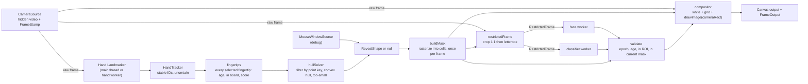

### 4.5 Face worker and classifier worker protocol

Both workers use the same protocol frame; they differ in model and result.

| Direction | Message | Content |
|---|---|---|
| main → worker | `init` | `wasmBasePath`, `modelPath`, `delegate` (`GPU` or `CPU`), model options |
| main → worker | `detect` | `RestrictedFrame` (`input` transferred) |
| worker → main | `ready` | init time |
| worker → main | `result` | `FaceResult` or `ClassifyResult { taskId, epoch, frameId, ts, probs, inferMs }` |
| worker → main | `error` | `taskId`, message |

Constraints: the worker has a single image-receiving handler, `detect`; the worker calls `input.close()` after inference; the worker retains no frame; no message carries an `HTMLVideoElement`, `MediaStream` or full-frame image. The worker is created with `new Worker(new URL('./face.worker.ts', import.meta.url), { type: 'module' })` so that Vite bundles it correctly.

### 4.6 Reveal region state machine and epoch

- `closed(reason)` → `open(mask)`: when `WindowSource` returns a valid window. Actions: `epoch++`, reset One Euro, `FaceClient.accepting = true`.
- `open` → `closed(reason)`: on the very next render after the window is found invalid (missing fingertips, stale point, out of board, side too small, uncertain crossed hands, hidden tab, camera stopped, config changed). Actions: clear faces and labels, `accepting = false`, `rejectAll()`.
- `open` → `open` with a different window: epoch unchanged. Running results are still validated against the ROI at submit time and the current mask.
- Camera, mirror, grid, resize or window source change (INT-01): `epoch++` even while closed, so that every running task is discarded.

### 4.7 Web UI layer: landing screen and consent gate

Added after the A11 review, trimmed under D-019 (the version with backend, database and admin is in `archive/backend/`, outside the build). The app is static files: no backend, no API, nothing leaves the browser (I9). This layer does only two things: the landing screen with a consent button before the camera is started, and the `assertCameraAllowed()` gate (I10). Routing uses `HashRouter` (D-020): the in-app path is the part after `#`, so `dist/` runs on any static host without SPA fallback.

#### Pages and conditions

| Path | Content | Condition |
|---|---|---|
| `/` (hash `#/`) | The web landing screen (D-023, UX-02, UX-03): eyebrow, name, one introductory sentence, three commitment lines (processed locally, nothing uploaded, camera on only when clicked), versioned consent box, Bắt đầu (Start) button, three-step stepper and an animated canvas illustration (no camera), all on one screen at 1280 × 720 and above; kiosk mode shows the consent scope line; `?mode=present` is the kiosk version (grid covering the whole screen, floating consent card) leading to `#/app?mode=present` | No `getUserMedia` call (I10); no network calls, no external fonts or images (I9) |
| `#/app` | White canvas stage (I4): three-zone top bar (brand, camera picker, Bật camera / Dừng camera (Start camera / Stop camera), camera status pill, the buttons Cài đặt, Debug, Trình diễn, Toàn màn hình, Thu hồi đồng ý (Settings, Debug, Presentation, Fullscreen, Revoke consent)), collapsible settings column on the right, debug drawer below the canvas, three-step guidance layer on the canvas (UX-01, UX-03); `?mode=present` opens presentation mode (every panel is a self-hiding floating layer, the canvas fills the screen) | Without consent (or with consent to an old version) redirect to `#/`; `getUserMedia` only in the button click handler after `assertCameraAllowed()` |

#### Consent

- `src/app/session.ts`: `CONSENT_VERSION` (date string), key `wct.consent`; `hasConsent()` is true when the stored value equals `CONSENT_VERSION`; `giveConsent()`, `revokeConsent()`, hook `useConsent()` (synchronized across tabs via the `storage` event).
- Storage scope follows `DEFAULTS.consent.scope` (D-021): `device` uses `localStorage` (kept across loads, default), `tab` uses `sessionStorage` (expires when the tab closes, for kiosk and presentation).
- Changing the consent text bumps `CONSENT_VERSION`: the user must consent again.
- If storage is blocked (private mode), consent is kept only in memory for the current session.

#### Camera gate

`src/app/gate.ts`: `currentRoute()` reads the path from the hash; `cameraGateReason()` returns `no-consent`, `wrong-page` (path is not `/app`) or `no-user-activation` (`navigator.userActivation.isActive` is false); `assertCameraAllowed()` throws when there is a reason. `CameraSource` (CAM-01) takes this function as `gate` and calls it synchronously right before every `getUserMedia`, only from the button click handler (D-025).

#### Deployment

- Dev: `npm run dev` (Vite 5173).
- Prod: `npm run build` creates `dist/`; any static HTTPS host, no SPA fallback needed (D-020). No environment variables at runtime; at build time only `VITE_BASE` (the page's base path, appendix 9.3). COOP/COEP headers (if CLS-02 needs multi-threaded wasm, D-013) are set on the static host. Public release: GitHub Pages deployed from the CI `deploy` job, service worker caching the models, custom domain, archive branch for the old backend: REL-01 (D-024, D-048).

## 5. Use case diagrams and processing flows

Conventions: use cases are drawn as rounded shapes, actors are boxes with an icon, «include» and «extend» relations are dashed. In the flow diagrams, node names match the module, function and data type names in section 4 so they can be checked directly against the code. All diagrams are written in Mermaid and render on GitHub, GitLab and VS Code (Markdown Preview Mermaid Support). Table 5.13 traces each diagram to invariants and work packages.

### 5.1 Use case diagram

Operations and end-user group:

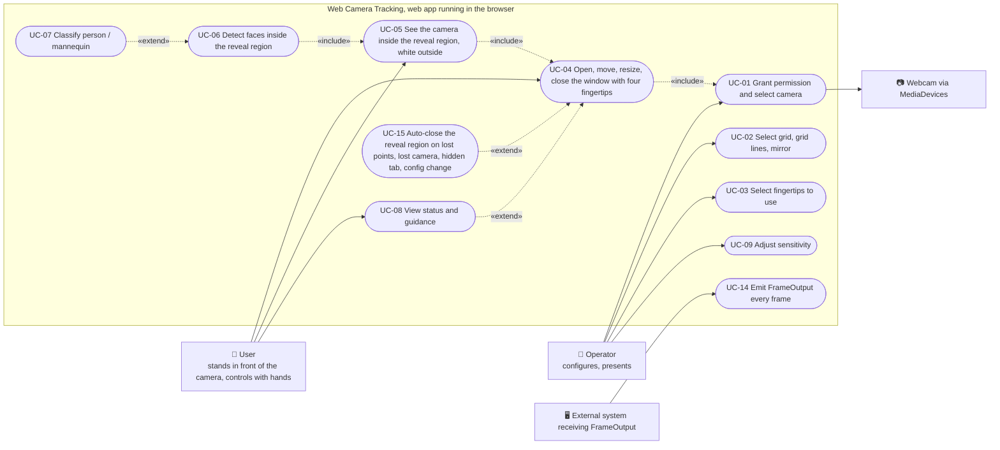

Development, testing and data capture group:

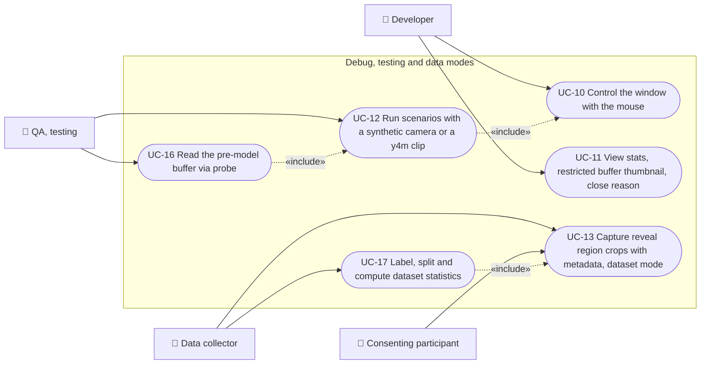

### 5.2 Summary use case specifications

| ID | Name | Primary actor | Precondition | Main flow | Result | Package |
|---|---|---|---|---|---|---|
| UC-01 | Grant permission and select camera | Operator | Page loaded, white canvas | Select device → `getUserMedia` → `CameraSource` active | Camera running, output still white | CAM-01 |
| UC-02 | Select grid, grid lines, mirror | Operator | None | Preset or custom → `computeLayout` → `epoch++` | Board centered, square cells; an open window is closed with reason config-changed | GRID-01 |
| UC-03 | Select fingertips to use | Operator | None | Remove or re-enable fingers for both hands (all five by default) | `fingers` updated, `epoch++` | HAND-02, ROI-03 |
| UC-04 | Open, move, resize, close the window by hand | User | UC-01, hand landmarker ready | Four valid slots → `solveSquare` → `buildMask` | RevealState Open or Closed following the hands | HAND-01, HAND-02, ROI-01 |
| UC-05 | See the camera inside the reveal region | User | Region open | Compositor draws the camera only inside `stageRect` | White outside the region, old cells close immediately | MASK-01 |
| UC-06 | Detect faces inside the reveal region | User | Region open, ROI side ≥ 64 px | `restrictedFrame` → `face.worker` → validate | full, partial or searching | MASK-02, FACE-01, FACE-02 |
| UC-07 | Classify person / mannequin | User | UC-06 has a valid face | `classifier.worker` on the same crop → unknown rule | person, mannequin or unknown | CLS-02 |
| UC-08 | View status and guidance | User | None | `FrameOutput.status` and `CloseReason` → message | The user knows what to do next | UX-01 |
| UC-09 | Adjust sensitivity | Operator | None | Change One Euro, hysteresis, point age, nMin | Applied immediately, written to config | ROI-01 |
| UC-10 | Control the window with the mouse | Developer | Window source mouse selected | Drag, scroll, Esc, Space | Same as UC-04 but without hands | ROI-00 |
| UC-11 | View stats and restricted buffer thumbnail | Developer | `?debug=1` | Debug panel reads the store | Sees exactly the image the model receives | FACE-01, PERF-01 |
| UC-12 | Run scenarios with a synthetic camera | QA | Playwright with a y4m clip or `SyntheticCameraSource` | `window.__scenario.run(...)` | Automated test results | TEST-00, QA-01 |
| UC-13 | Capture reveal region crops with metadata | Data collector, participant | Written consent, region open | Enable dataset mode → save crop and JSON locally | Dataset contains no raw frames | CLS-01 |
| UC-14 | Emit FrameOutput | External system | Loop running | Event every frame | Data subject to the same gate as the overlay | FACE-02 |
| UC-15 | Auto-close the reveal region | System | Region open | Detect reason → Closed → clear results | No face or label remains displayed | HAND-02, CAM-01, FACE-02 |
| UC-16 | Read the pre-model buffer via probe | QA | `?debug=1` | `onRestrictedFrame` | The hard gate can be verified | TEST-00 |
| UC-17 | Label, split, statistics | Data collector | Dataset available | Scripts in `tools/dataset` | Train/val/test splits without leakage | CLS-01 |

### 5.3 Five-step experience flow mapped to modules

This diagram shows the five experience steps of the original plan, tied to the work package that implements each step.

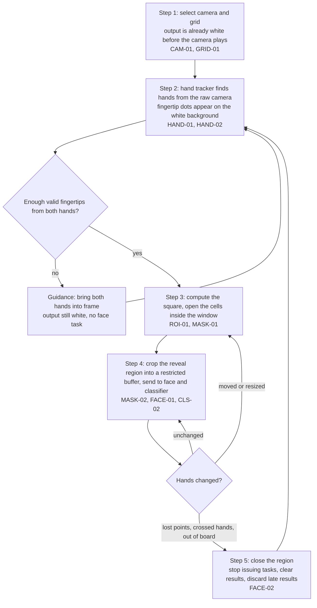

### 5.4 Component diagram by thread and data read access

There are three thread boundaries. Only three arrows carry the raw frame out of `CameraSource`: to the hand landmarker, to the compositor and to `restrictedFrame`. There is no arrow from `CameraSource` to `face.worker` or `classifier.worker`; the import rules in section 4.2 guarantee this at the source code level.

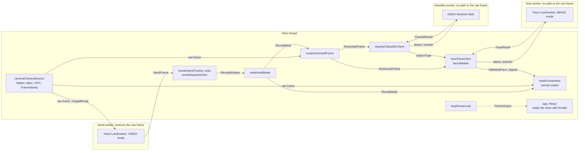

### 5.5 Startup, permission and camera lifecycle

Startup sequence. The face worker is initialized and warmed up early but receives no frame until a reveal region exists.

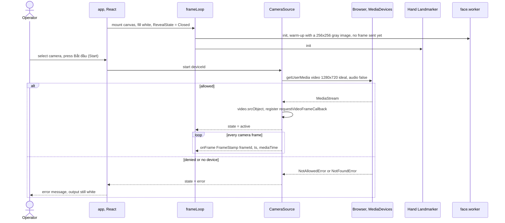

`CameraSource` lifecycle:

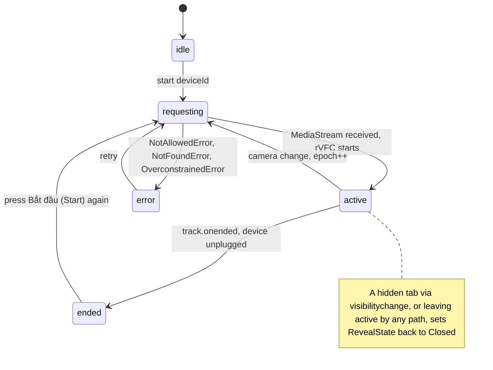

### 5.6 Single-frame flow when the region is opened by hand

This sequence is section 4.4 written as a sequence diagram. Face results return asynchronously and are used only in the next frame.


### 5.7 Reveal region state machine and epoch

This diagram formalizes section 4.6. Only two kinds of transition increment the epoch: Closed to Open and config change.

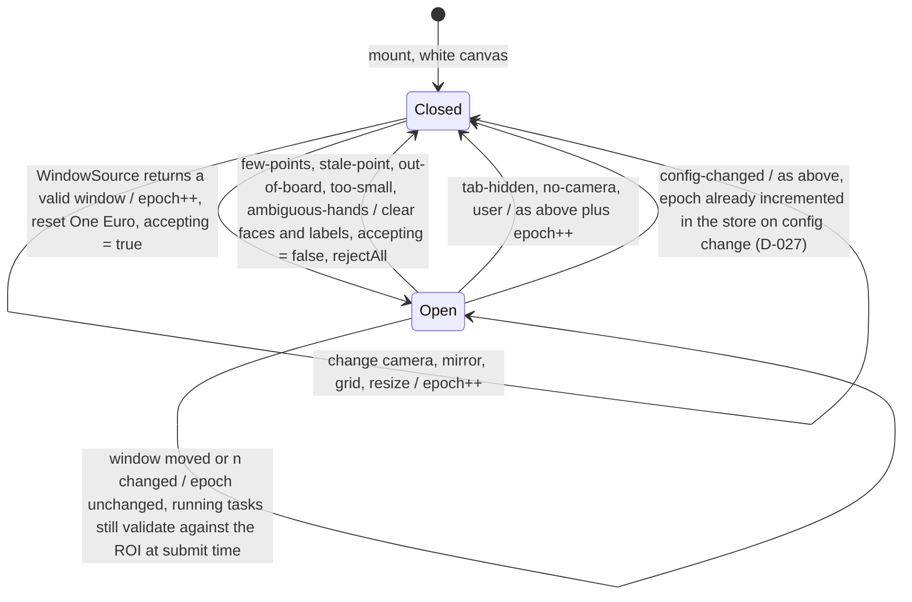

### 5.8 Hand → fingertip → window flow

Decision tree from a `HandFrame` to the open cell set or a close reason (D-038, revised in ROI-03 per D-047: every selected fingertip of every hand is a candidate point, invalid points are only excluded from the convex hull). Every branch with too few points leads to Closed with the corresponding `CloseReason`; no branch keeps the region alive with predicted points.

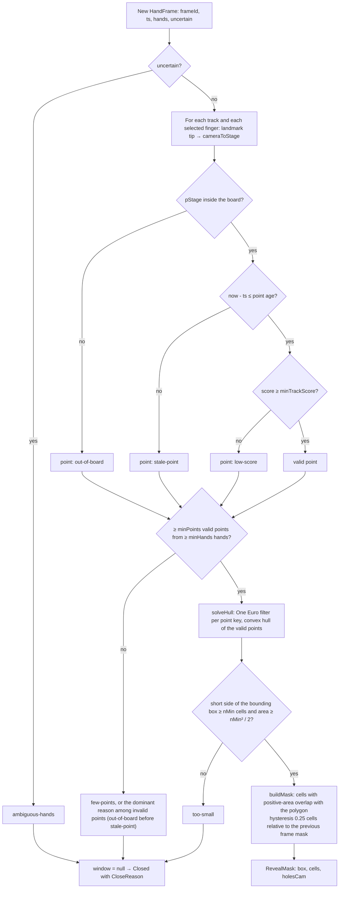

### 5.9 Restricted buffer creation flow

The only data path leading to the face worker and the classifier worker. Crop 1:1 first, letterbox after; the probe reads a copy right before the transfer.

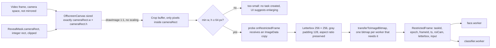

### 5.10 Face task lifecycle, late results and validate

Lifecycle of one task. A synchronous task running inside the worker cannot be cancelled midway, so `rejectAll` only marks the `taskId` for discarding when the result returns.

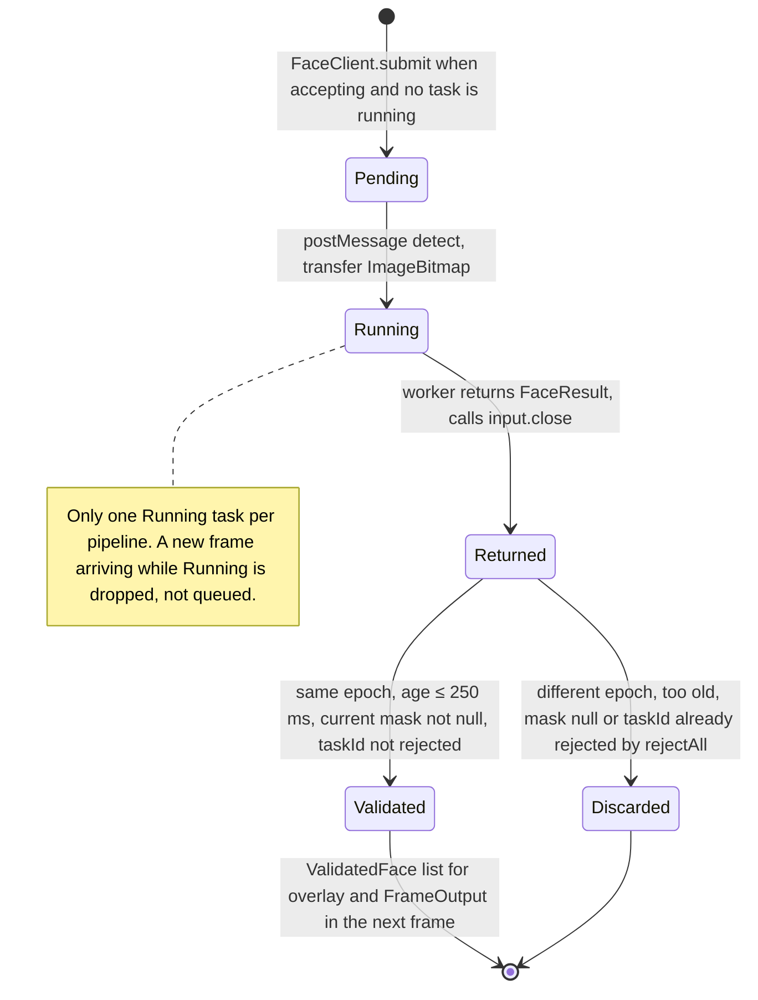

Late result after closing and reopening:

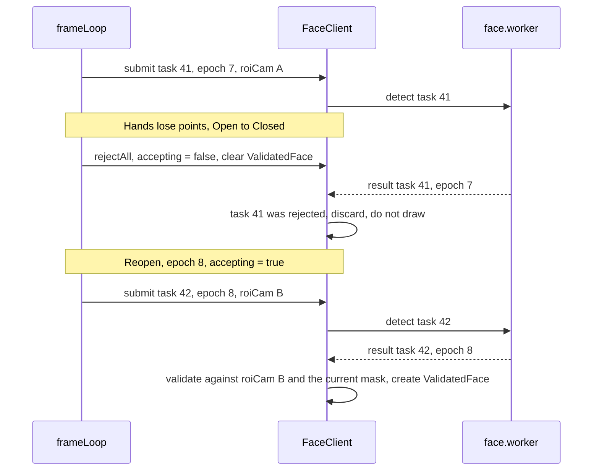

`validate` decision tree in `faceValidate.ts`:

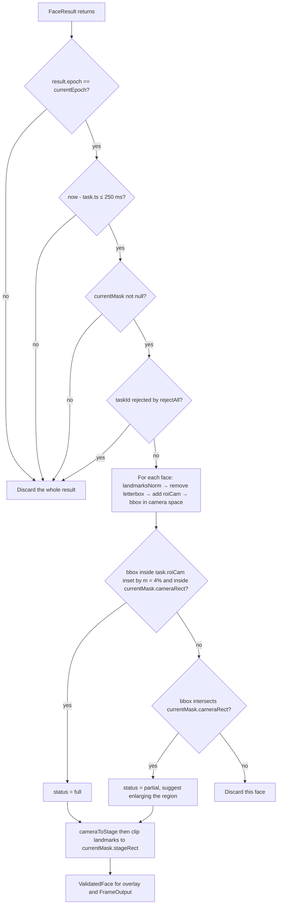

### 5.11 Person / mannequin classification flow

The classifier uses exactly the same crop as the face, receives its own `ImageBitmap` because bitmaps are transferred, runs less often and attaches the label to the validated face of the same epoch.

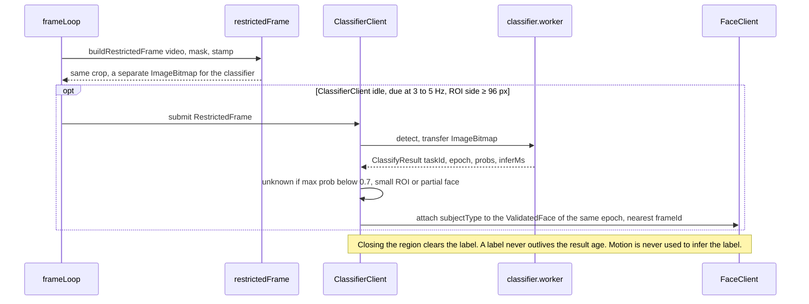

### 5.12 Dataset mode flow

Data capture mode saves only the reveal region crop and metadata, never saves the raw frame and never uploads.

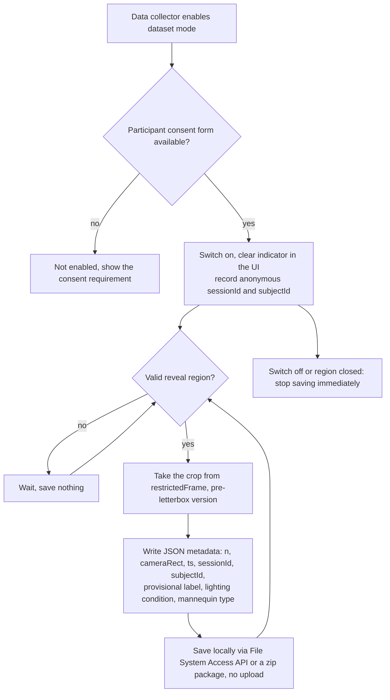

### 5.13 Traceability of diagrams, invariants and work packages

| Diagram | Invariants shown | Implementing packages |
|---|---|---|
| 5.4 components by thread | I1 | SETUP-00 (lint boundaries), FACE-01, CLS-02 |
| 5.5 startup and camera | I4 | CAM-01 |
| 5.6 single frame | I2, I7 | INT-01, PERF-01 |
| 5.7 reveal region state | I5, I6 | FACE-02, HAND-02 |
| 5.8 hand → slot → window | I7 for the hand pipeline | HAND-01, HAND-02, ROI-01 |
| 5.9 restricted buffer | I1, I2, I3 | MASK-01, MASK-02, TEST-00 |
| 5.10 face task | I5, I6, I7 | FACE-01, FACE-02, QA-01 |
| 5.11 classification | I1, I6 | CLS-02 |
| 5.12 dataset mode | I8 | CLS-01 |
| 5.14 landing page and consent gate | I9, I10 | WEB-00 |

### 5.14 Landing page use cases and flow

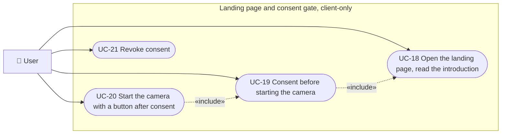

| ID | Name | Actor | Precondition | Main flow | Result | Package |
|---|---|---|---|---|---|---|
| UC-18 | Open the landing page | User | None | Open `/` | Landing page shown; camera not called; no network calls | WEB-00 |
| UC-19 | Consent | User | UC-18 | Tick consent, press Bắt đầu (Start) → `giveConsent()` writes `wct.consent` = `CONSENT_VERSION` → navigate to `#/app` | `hasConsent()` true, persists across page reload (per `consent.scope`, D-021) | WEB-00 |
| UC-20 | Start camera | User | UC-19 | Press Bật camera (Start camera) → `CameraSource.start()` calls `assertCameraAllowed()` then `getUserMedia` (CAM-01) | Camera running, output still white | WEB-00, CAM-01 |
| UC-21 | Revoke consent | User | UC-19 | Press Thu hồi đồng ý (Revoke consent) → stop camera, `revokeConsent()` → back to `#/` | `#/app` is inaccessible until consent is given again | WEB-00 |

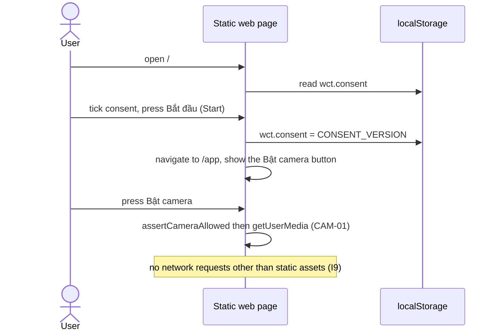

## 6. Work packages

Execution order for one person:

`SETUP-00 → SPIKE-00 → WEB-00 → CAM-01 → GRID-01 → ROI-00 → MASK-01 → TEST-00 → MASK-02 → FACE-01 → FACE-02 → HAND-01 → HAND-02 → ROI-01 → INT-01 → ROI-02 → QA-01 → PERF-01 → UX-01 → UX-02 → CLS-01 → CLS-02 → QA-02 → LOG-02 (optional) → ROI-03 → UX-03 → REL-01`

API-00, LOG-01, ADM-01, SEC-01, DEP-01 are dropped per D-019 (code in `archive/backend/`); static deployment to GitHub Pages with a custom domain is part of REL-01 (D-024, D-048). UX-02 (landing screen, D-023) depends only on WEB-00, so it can be pulled forward to any point after CAM-01; LOG-02 (local log, D-022) is optional and not a precondition of REL-01.

With two people: person A takes the branch `MASK-02 → FACE-01 → FACE-02`, person B takes the branch `HAND-01 → HAND-02 → ROI-01` once both finish phase 1; they meet at INT-01. CLS-01 data capture starts as soon as MASK-02 is done.

Common done criteria for every package: lint and tests pass; import rules pass; the related measurements show in the debug panel; README describes how to enable the feature; new decisions are recorded in `docs/decisions.md`.

### Phase 0: bootstrap and spikes

#### SETUP-00 Repo bootstrap

Depends on: none.

Steps:

1. Create a Vite + React + TypeScript (strict) project. Install `@mediapipe/tasks-vision`; dev: `vitest`, `@playwright/test`, `eslint`, `prettier`, `@vitejs/plugin-basic-ssl` (HTTPS for testing over LAN; localhost is already a secure context).
2. Download `hand_landmarker.task`, `face_landmarker.task` and the tasks-vision wasm directory into `public/models/`. Write `public/models/models.json`: name, version, sha256, download source. No CDN dependency at runtime.
3. Create the directory tree of section 4.2 with empty files that have placeholder exports; create `core/types.ts` per section 4.3 and `core/config.ts` per appendix 9.1.
4. Configure ESLint with the import rules of section 4.2; add the script `npm run lint:boundaries`.
5. Scripts: `dev`, `build`, `test:unit`, `test:e2e`, `lint`. Playwright configures Chromium with fake camera flags: `--use-fake-ui-for-media-stream --use-fake-device-for-media-stream --use-file-for-fake-video-capture=<clip.y4m>`.
6. `.gitignore` adds `data/`, `*.y4m`, and `*.onnx` outside `public/models`. Create `docs/decisions.md` and `docs/spikes.md`.
7. Startup page: the output canvas is filled white, nothing else yet.

Done criteria: `npm run dev` shows a white page; `npm run lint`, `test:unit`, `test:e2e` pass with the sample tests; README has a "Chạy" (Run) section.

#### SPIKE-00 Technical spikes

Depends on: SETUP-00. Results are recorded in `docs/spikes.md` with the machine configuration, browser and model versions.

| ID | Question | How to measure | Resulting decision |
|---|---|---|---|
| S1 | Does Face Landmarker run in a Worker with OffscreenCanvas + GPU delegate? Init and inference time for 64, 128, 256 px images? | Minimal worker, static image, measure with `performance.now()` | Delegate and execution location for FACE-01 |
| S2 | Hand Landmarker VIDEO mode at 720p: ms/frame on the main thread versus a worker (including the cost of `createImageBitmap` + transfer)? | 300 frames, take p50/p95 | Main thread or `hand.worker` for HAND-01 |
| S3 | With a raw webcam frame (not mirrored), how does MediaPipe assign the Left/Right label? | Raise the right hand, record the returned label | The `normalizeHandedness` function in HAND-01 |
| S4 | Does `requestVideoFrameCallback` fire when the video is hidden (opacity 0, outside the viewport) and when the tab is in the background? Is `MediaStreamTrackProcessor` usable? | Log 10 s for each case | How to obtain `FrameStamp` in CAM-01 |
| S5 | `drawImage` of a 1:1 sub-rect into an OffscreenCanvas then `transferToImageBitmap`: ms for 256 and 720 px crops? | 300 runs | Budget for MASK-02 |
| S6 (before CLS-02) | Does ONNX Runtime Web run a sample ONNX model with wasm and webgpu? Latency for a 128 px image? | Sample MobileNet model | Execution provider for CLS-02 |

Done criteria: measurement table in `docs/spikes.md`; the S1–S4 decisions are recorded in `docs/decisions.md`.

### Phase 0b: landing page and consent gate

#### WEB-00 Frontend: routing, landing page, consent gate

Depends on: SETUP-00.

Steps:

1. `react-router` with `HashRouter` (D-020): `#/` LandingPage, `#/app` StagePage (the existing canvas), other paths redirect to `#/`.
2. `src/app/session.ts`: `CONSENT_VERSION`, the `wct.consent` key in `localStorage` or `sessionStorage` per `DEFAULTS.consent.scope` (D-021), `hasConsent`, `giveConsent`, `revokeConsent`, the `useConsent` hook.
3. LandingPage: consent box with versioned text; the Bắt đầu (Start) button is enabled only once the box is ticked; `giveConsent()` then navigate to `#/app`. No network calls, no camera calls. The visual design is done in UX-02 (D-023).
4. StagePage: without consent (or with an old version) go back to `#/`; the Bật camera (Start camera) button goes through `assertCameraAllowed()` in `src/app/gate.ts` (hash path `/app`, consent given, `navigator.userActivation.isActive` if available); CAM-01 wires `getUserMedia` right after this function; a Thu hồi đồng ý (Revoke consent) button.
5. e2e: count `getUserMedia` on the landing page with `addInitScript`; entering `/app` without consent is redirected; after consent the canvas is white and stays so across a reload; consent of an old version is not valid; revoke; no fetch/xhr/beacon or `/api` requests at all.

Done criteria: no path reaches `getUserMedia` without going through `assertCameraAllowed()` (grep in CI); `src/` has no `fetch`, `sendBeacon`, `WebSocket` to a server (grep in CI); e2e passes.

### Phase 1: mask and geometry

#### CAM-01 Camera lifecycle

Depends on: SPIKE-00 (S4).

Steps:

1. Interface `FrameSource { width; height; drawable: CanvasImageSource; onFrame(cb: (stamp: FrameStamp) => void); stop() }`. Both `CameraSource` and `SyntheticCameraSource` (TEST-00) implement it.
2. `CameraSource`: `enumerateDevices()` after permission is granted; `getUserMedia({ video: { deviceId, width: { ideal: 1280 }, height: { ideal: 720 } }, audio: false })`; video element `muted playsInline autoplay`, kept out of the visible tree in whichever way S4 allows (do not use `display: none` if S4 shows that rVFC stops firing).
3. `FrameStamp`: `frameId` increments from 0 on each rVFC callback, `ts = performance.now()`, `mediaTime` from the metadata. Fall back to rAF when rVFC is unavailable.
4. Camera state machine: `idle → requesting → active → (ended | error)`. Handle `track.onended`, `devicechange`, `visibilitychange`. Every exit from `active` emits an event so the loop moves `RevealState` to `closed`.
5. Switching camera at runtime: stop the old track, request a new track, `epoch++`, the output stays white throughout.
6. UI: camera picker, start/stop button, message when permission is denied.

Done criteria: switching camera never flashes a full-camera frame; unplugging the physical camera moves to `ended` and the output is white; `frameId` is continuous with no duplicates.

Tests: unit for the state machine; e2e with the fake camera: when permission is denied the UI shows an error and the output is all white.

#### GRID-01 Grid, layout and coordinate systems

Depends on: CAM-01.

Steps:

1. `computeLayout` per section 4.1: integer `c`, centered board, cover-style `scale`, `camVisibleRect` is the part of the camera that actually maps onto the board.
2. Output canvas follows the DPR: `canvas.width = cssW * dpr`; `ResizeObserver` recomputes the layout and `epoch++`.
3. All transform functions of section 4.1 with the `mirror` flag.
4. UI: grid presets, custom columns × rows within limits, grid lines on/off, mirror on/off. Grid lines are light gray, drawn after the white background.
5. Debug: show `c`, `board`, `scale`, `epoch`.

Done criteria: 64 × 36 on a 1280 × 720 stage gives `c = 20`; 32 × 32 gives a centered square board with the camera in cover mode; mirror flips correctly for every consumer because all go through `coords.ts`.

Tests (unit): layout with many stage and grid sizes; `cameraToStage(stageToCamera(p)) ≈ p` with and without mirror; `windowToCameraRect` returns an integer rect inside the camera, including windows at the edge; `windowToStageRect` of adjacent cells neither overlap nor leave gaps.

#### ROI-00 Mouse-controlled window

Depends on: GRID-01.

Steps:

1. Interface `WindowSource { kind; current(now: number): WindowSample; dispose(): void }` with `WindowSample = { window: RevealWindow, limited } | { window: null, reason: CloseReason }` (D-027).
2. `MouseWindowSource`: clicking on the board opens at the pointer, dragging moves the window, the mouse wheel changes `n`, Esc closes, Space reopens. Clamped inside the board (`clampWindow` in `core/grid.ts`), always square, flagged `limited`; when the layout changes, reposition from the center in stage px.
3. UI to choose the window source: `mouse` or `hands` (hands not yet available, currently disabled); `settings.windowSource` in the store.
4. Keep this mode permanently as the debug mode and as the source for e2e tests.
5. Loop skeleton `loop/frameLoop.ts` (rAF): `WindowSource.current` → `stepReveal` (`core/revealState.ts`, epoch per section 4.6) → `buildMask` once → `paintBackground` + `drawWindowOutline`. Probe `window.__wct.loop`.

Done criteria: all board and window geometry can be checked without hands and without a camera.

#### MASK-01 Canonical mask and compositor

Depends on: ROI-00.

Steps:

1. `buildMask(window, layout, mirror, epoch, limited) → RevealMask` (already done in ROI-00, D-027). `stageRect = windowToStageRect`, `cameraRect = windowToCameraRect` (integer, clipped inside the camera; camera size taken from the layout, D-026). This is the only function that creates a mask.
2. `compositor.render(ctx, layout, { showLines, mirror, drawable, mask })` (D-028): fill the whole canvas with `#fff` → grid lines if enabled → if there is a mask and a `drawable`: `drawImage(drawable, cameraRect → stageRect)` inside `ctx.clip(stageRect)`; mirror is done with `ctx.save(); ctx.translate(); ctx.scale(-1, 1)` only within `stageRect` → overlay (window outline, the four dots if any, face) → `ctx.restore()`. `drawable` is `FrameSource.drawable`, null while the camera is not active.
3. No accumulation step: every frame redraws everything; old cells close by themselves when the window moves away.
4. Never draw video when `mask == null`. No code path does a full-frame `drawImage(source)`: `tools/check-invariants.mjs` checks that `drawImage(` appears only in `compositor.ts` and `restrictedFrame.ts`, always with 9 arguments.

Done criteria: white at startup; only the square shows the camera; a round object in the camera stays round on the output; changing the grid causes no offset between the open cells and the camera content.

Tests (e2e, using the `SyntheticCameraSource` of TEST-00): every pixel outside `stageRect` equals `(255,255,255)`; pixels inside `stageRect` match the color of the corresponding camera region; after moving the window, the old position is white on the very next frame.

#### TEST-00 Synthetic camera source, probes and test clips

Depends on: CAM-01, MASK-01 (done in parallel with MASK-01).

Steps:

1. `SyntheticCameraSource` implements `FrameSource`: draws into a canvas according to a scenario: magenta background outside the designated region, a green "person" region at configured coordinates, a static face image (only using permitted images) at a configured position, optionally moving over time.
2. `debug/probes.ts`: `onRestrictedFrame(cb)` receives an `ImageData` copy of the buffer exactly as sent to the worker; `onOutputFrame(cb)` receives the `ImageData` of the output canvas; counters `faceDetectSubmitted`, `faceDetectDropped`, `classifierSubmitted`. Enabled only with `?debug=1`.
3. `debug/scenarios.ts`: scenarios runnable from tests (`window.__scenario.run('coverAll')`, `'windowAt(col,row,n)'`, `'moveWindow(...)'`, `'delayWorker(ms)'`; QA-01 adds `'faceMaxAge(ms)'` to relax the maximum age of face results).
4. `tools/make_test_clips.py`: generates y4m files with ffmpeg from synthetic scenarios (no real people) for Playwright to use as the fake camera; clips with real faces are used locally only and never committed.

Implementation note (D-029): the synthetic source and probes are enabled with `#/app?debug=1&source=synthetic`; scenarios control the window through `MouseWindowSource.setWindow`, `moveWindow`, `resizeWindow`, `close`; `onRestrictedFrame` and `wantsRestrictedFrame` are available, MASK-02 calls `emitRestrictedFrame` right before the transfer; `delayWorker` writes `probes.workerDelayMs` for FACE-02; y4m clips need ffmpeg (the development machine currently lacks it, only `--dry-run` is checked).

Done criteria: Playwright runs with the fake camera; the MASK-01 pixel tests pass; the probe can read the buffer before the model.

### Phase 2: restricted buffer and face inside the reveal region

#### MASK-02 Restricted frame builder

Depends on: MASK-01, TEST-00.

Steps:

1. `buildRestrictedFrame(source, mask, stamp, epoch, taskId) → RestrictedFrame | { kind: 'too-small' }`.
2. Crop step: an `OffscreenCanvas` of exactly `cameraRect.w × cameraRect.h` (reused, resized only when the size changes); `drawImage(source, rx, ry, rw, rh, 0, 0, rw, rh)`; the source is the video, never the output canvas.
3. If `min(rw, rh) < 64` return `too-small` and create no task.
4. Letterbox step: a 256 × 256 canvas filled with gray 128, draw the crop centered with its aspect ratio preserved, compute `letterbox { scale, dx, dy, size }`; `transferToImageBitmap()`; if both face and classifier need this frame, create one bitmap per worker from the same letterbox canvas.
5. No overlay, grid, outline or dots in the image, because the crop is taken from the video.
6. Call the `onRestrictedFrame` probe with a copy before the transfer.
7. Do not mirror the buffer: the buffer is in camera space; mirror applies only when mapping results to the stage.

Implementation note (D-030): `createRestrictedFrameBuilder({ probes })` keeps two reusable canvases and returns `build(source: FrameSource, mask, stamp, epoch, taskId, copies) → { kind: 'ok', frames } | too-small | no-frame`; it takes a `FrameSource` rather than a loose drawable, so the source cannot be the output canvas (`check:invariants` forbids DOM in this file). The letterbox math lives in `core/letterbox.ts` (`computeLetterbox`, `letterboxNormToCam`, `camToLetterbox`) for FACE-02 to use. The loop calls build at step 6 at the `face.targetHz` rate when the region is open and a new frame exists; there is no worker yet, so the bitmap is closed immediately; `taskId` increments from 1 only on ok. The debug bar shows the task count, the crop size and a hint to enlarge when too small.

Done criteria: the buffer contains only pixels inside `cameraRect` plus gray padding; no pixel from outside the ROI, not even a 1 px border.

Tests (e2e, hard gate):

- Outside the window is magenta: the magenta pixel count in the buffer is 0 for many window positions and sizes, including windows at the edge and the smallest window.
- Keep the content inside the window, change the content outside it: the hashes of the two buffers are equal.
- `n` changes: buffer size and `letterbox` follow the formula; mapping a crop corner point back to the camera lands on the `cameraRect` corner.
- When `closed`: the number of `buildRestrictedFrame` calls is 0.

#### FACE-01 Face worker receives only the restricted buffer

Depends on: MASK-02, SPIKE-00 (S1).

Steps:

1. `face.worker.ts`: `init` creates `FilesetResolver.forVisionTasks('/models/wasm')`, `FaceLandmarker.createFromOptions` with `runningMode: 'IMAGE'`, `numFaces: 2`, delegate per S1, `outputFaceBlendshapes: false`, `outputFacialTransformationMatrixes: false`. Warm up with one 256 × 256 gray image right after init.
2. `detect(RestrictedFrame)`: `faceLandmarker.detect(input)` → `FaceResult` with `landmarksNorm` relative to the letterbox image and `inferMs`; `input.close()` in `finally`.
3. `FaceClient` (main): initializes the worker at app start; `submit(frame)` only when `accepting && !busy`, otherwise drop and increment the counter; stores `pendingTask { taskId, epoch, frameId, ts, roiCam, letterbox }`; `rejectAll()` clears pending and marks every old taskId as rejected.
4. Initial rate control: at most 15 Hz; lower it when the `inferMs` p50 exceeds the budget.
5. Debug: show `inferMs`, `submitted`, `dropped`, a thumbnail of the buffer just sent (visual evidence of I1).

Implementation note (D-031): the protocol is in `face/faceProtocol.ts`; `FaceClient.start()` when `StagePage` mounts; `submit()` always takes ownership of the bitmap; `rejectAll()` keeps busy until the worker returns; rate `max(1000 / face.targetHz, p50 inferMs)`; the loop toggles `accepting` with the reveal region and calls `rejectAll` on close or epoch change; probe `window.__wct.face`; the thumbnail is drawn with `putImageData` from `onRestrictedFrame`. Validation, coordinate mapping and overlay belong to FACE-02.

Done criteria: the worker has only one message type that carries an image; the UI stays ≥ 30 FPS while inference runs; `lint:boundaries` passes for `src/face/**`.

Tests: unit for the import boundary; e2e: while `closed` for 5 s continuously, `faceDetectSubmitted` does not increase; when the window opens onto a background-only region, a task is submitted and the result is empty.

#### FACE-02 State gate, coordinates, epoch, freshness, clip

Depends on: FACE-01.

Steps:

1. `faceMapping.ts`: `landmarksNorm → crop px` (remove the letterbox) → `cam px` (add `roiCam.x, roiCam.y`) → `stage` via the `cameraToStage` of the layout belonging to the task's epoch. bbox = min/max of the landmarks in camera space.
2. `faceValidate.ts`: `validate(result, task, currentMask, currentEpoch, now) → ValidatedFace[]`:
   - reject if `result.epoch !== currentEpoch`, if `now - task.ts > 250 ms`, if `currentMask == null`, if the taskId was hit by `rejectAll`;
   - for each face: bbox inside `task.roiCam` inset by `m = 4%` of the ROI side and inside `currentMask.cameraRect` → `full`; intersects `currentMask.cameraRect` but not fully inside → `partial`; no intersection → reject;
   - `landmarksStage` keeps only the points inside `currentMask.stageRect`.
3. The face overlay is drawn inside the `ctx.clip(stageRect)` of the current mask; `partial` draws a dashed bbox outline and no landmarks outside the region.
4. UI states: `covered`, `searching`, `too-small`, `face-candidate`, `partial-face` with hint messages ("mở rộng vùng" (enlarge the region), "đang tìm khuôn mặt" (searching for a face)).
5. State transitions per section 4.6; `FrameOutput` is emitted through the `EventTarget` of `frameLoop`.

Implementation note (D-032): `validateFace` returns a rejection reason (`epoch`, `rejected-task`, `stale`, `no-mask`) or `ValidatedFace[]`; rect math is in `core/rect.ts`; the loop validates as soon as a result arrives (via `FaceClient.subscribeResults`), keeps the face until the next result, clears it on close or epoch change, and expires it after 4 × `faceResultMaxAgeMs`; overlay inside `clip(stageRect)`; `FrameOutput` in `snapshot().output` and the `frame` event of `loop.events`; `delayWorker` delays at `FaceClient.resultDelayMs`. The e2e with a real face runs locally with `public/spike-assets/face.png` and skips itself when the file is missing.

Done criteria: covering again makes the face disappear on the very next frame; moving the window does not drag the old face along; a cut-off face shows `partial` with no landmarks under the white area; results returned after closing are not shown.

Tests: unit `validate` with cases for old epoch, over age, bbox outside the ROI, partial bbox, rejected taskId; e2e: `delayWorker(500)` then close the window, no overlay afterwards; move the window while a task is running, the result (if it still intersects the mask) is drawn per the old ROI, not the new one.

### Phase 3: four fingertips

#### HAND-01 Hand landmarker and stable hand IDs

Depends on: CAM-01, SPIKE-00 (S2, S3).

Steps:

1. Wrapper around `HandLandmarker` with `runningMode: 'VIDEO'`, `numHands: 2`, `detectForVideo(source, ts)`. Runs on the main thread or in `hand.worker.ts` depending on S2. This worker is allowed to receive the raw frame; name the file clearly to distinguish it from `face.worker.ts`.
2. `normalizeHandedness(label, mirror)` based on the S3 result, returns left/right hand in the user's sense.
3. `HandTracker`: track `{ id, handedness, palmCenterCam, bboxCam, lastSeenTs, score }`. Each frame: matching cost = palm center distance (normalized by camera width) + penalty if handedness differs; accept when cost < 0.15; if two matching options differ in cost by < 0.03, mark that frame `uncertain` and keep the old tracks; a track not seen for more than 150 ms is deleted; an unmatched detection creates a track with a new id.
4. Output `HandFrame { frameId, ts, hands: Track[], uncertain: boolean }` stored in the store.
5. Debug: draw id and handedness next to each hand (only on the white background, no camera drawing).

Done criteria: ids stay unchanged while both hands move normally for 30 s; crossed hands yield `uncertain` instead of swapping ids.

Tests: unit tests of the tracker with synthetic sequences: two points crossing each other, one hand disappearing and reappearing elsewhere (new id), a hand standing still (id kept); e2e with a synthetic hand clip or a real clip used locally.

Implementation note (D-033): `hand.worker.ts` is a module worker in VIDEO mode (protocol `hands/handProtocol.ts`, `detect` carries the full-frame bitmap, not mirrored); `HandClient` (`hands/handClient.ts`) is the only place in `src/` that calls `createImageBitmap` (checked by `check:invariants`), one frame at a time, no queueing; `normalizeHandedness(label, { inputMirrored, swap })` in `hands/handLandmarker.ts` is consistent with the raw frame, inverted by the `settings.handednessSwap` flag (checkbox "Đảo trái/phải" (Swap left/right), D-010); pure `HandTracker` in `hands/handTracker.ts` with a penalty of 0.1 for a different label (< 0.15), label change after 3 consecutive opposite frames (id kept), track deleted when older than 150 ms and absent for at least 2 consecutive updates (a slow pipeline does not delete a track over a single miss); `HandFrame` kept in `HandPipeline` (`hands/handPipeline.ts`, `latest`), read via `loop.snapshot().hands` and `window.__wct.hands`, not put into `StageStore`. The loop feeds the pipeline only when the window source is "Tay" (Hands) (the hand worker is initialized lazily on the first feed); there is no `HandWindowSource` yet, so the region closes with `missing-slot` until INT-01. The debug overlay (`compositor.drawHands`) draws on the white background after the border. The 10-second check with a real right hand could not be done on the development machine (the tooling environment has no webcam): the operator selects the "Tay" source, raises the right hand, the label must be "Phải" (Right); if reversed, turn on "Đảo trái/phải". E2E with real hands runs locally with `public/spike-assets/hands.jpg`, skipped automatically when missing.

#### HAND-02 Four slots, freshness, invalid states

Depends on: HAND-01, GRID-01.

Steps:

1. Config `slots: SlotConfig[4]` with a default preset; UI to change hand and finger for each slot; landmark indices: thumb 4, index 8, middle 12, ring 16, little 20.
2. For each `HandFrame`: for each slot find the track with matching handedness, take the tip landmark → multiply by camera size → `cameraToStage` → store `{ pStage, ts, trackId }`.
3. A slot is valid when: it has a point, `now - ts ≤ 150 ms`, `pStage` lies inside the board, the `HandFrame` is not `uncertain`, the track score is sufficient. The invalidity reason is written to `FrameOutput.points[i].reason`.
4. Overlay: four dots colored by slot; a dot is dimmed when the slot is stale, hidden when lost.
5. Guidance UI: "đưa hai tay vào khung hình" (bring both hands into the frame) when a slot is missing, naming the missing slots.

Done criteria: losing a finger turns the slot invalid within at most 150 ms plus one render frame; no slot ever switches to the other hand on its own.

Tests: unit tests for freshness and validity conditions; e2e: scenario of one hand leaving the frame in a synthetic clip.

Implementation note (D-034): pure `hands/slots.ts`: `evaluateSlots(frame, configs, layout, mirror, now)` takes for each slot the track of the same hand with the highest score (never the other hand), the tip landmark already in camera px (the bitmap is the raw frame) → `cameraToStage`; reasons by the priority of section 5.8: `ambiguous-hands`, `missing-slot`, `out-of-board`, `stale-point` (age = now − last time the track was seen, ≤ `freshness.pointMaxAgeMs`), plus `low-score` (score < `hands.minTrackScore`, closes with `missing-slot`); `slotsCloseReason`, `slotsGuidance` ("Đưa hai tay vào khung hình: thiếu …" (Bring both hands into the frame: missing …)), `toPoints`. Slots are not stored separately: they are re-evaluated every render frame from the pipeline's latest `HandFrame` (a track not seen again carries an old `lastSeenTs`, so it becomes `stale-point` on its own and then `missing-slot` when the tracker deletes it). `settings.slots` in `StageStore` (a change means `epoch++`, the loop closes the window with `config-changed`), the `SlotControls` UI is shown only when the source is hands. Slot dots (`compositor.drawSlots`) are drawn after the hand overlay, dimmed when invalid, hidden when there is no point. `FrameOutput.points` is filled every frame when the source is hands; `statusMessage(output, slots)` names the missing slots while the region is covered. There is no solver yet, so the hand source closes with the per-slot reason, and with `missing-slot` when all four slots are present (ROI-01 replaces this with the window).

#### ROI-01 Square solver: square, smoothing, snapping, edge limits (replaced by ROI-02, D-038)

Depends on: HAND-02, ROI-00.

Steps:

1. `oneEuro.ts`: One Euro filter for scalar values; used for `cx`, `cy`, `side`.
2. `solveSquare(points: Point[4], layout, prev: SolverState, now) → { window: RevealWindow | null; limited: boolean; reason?: CloseReason; state }`:
   - center = mean of the four points; side = `min(bboxW, bboxH)` in stage px;
   - filter center and side; `sideCells = side / c`; if `sideCells < nMin` → invalid (`too-small`);
   - `n = clamp(round(sideCells), nMin, nMax)` with hysteresis 0.25 relative to `prev.n`;
   - `col, row` from the center: `colF = (cx - board.x) / c - n / 2`, rounded with hysteresis 0.25 relative to `prev.col, prev.row`;
   - clamp into the board, keep it square, set `limited`.
3. `HandWindowSource`: combines slots + solver; resets `state` on closed → open.
4. Sensitivity UI: `minCutoff`, `beta`, hysteresis, `nMin`; show `limited` when clamped.

Done criteria: with hands held still the window does not flicker; spreading or pinching the hands changes `n` smoothly; near the edge it stays square and has the `limited` state.

Tests (unit): a point sequence jittering ±3 px around a cell boundary does not change cell; a linear motion sequence changes cell exactly when it exceeds the hysteresis; four nearly coincident points give `too-small`; a point outside the board gives `out-of-board`.

Implementation note (D-035, D-036): pure `oneEuro.ts` and `squareSolver.ts` with the state as an immutable record (`SolverState`: three filters and the most recent requested window as the hysteresis reference); hysteresis is relative to the **requested** window (before clamping), so `limited` stays as long as the hands keep asking for a window that overflows the board; when n changes, col, row are re-rounded around the center; `too-small` also has hysteresis while open (closes when dropping below `nMin − 0.25`). `HandWindowSource` solves exactly once per new `HandFrame` with `frame.ts` as the time reference (filtering at the hand result rate), returns a `WindowSample` with `slots` so the loop does not evaluate slots itself; resets on closed → open, layout change, mirror change or slot config change. Sensitivity (`settings.sensitivity`: minCutoff, beta, hysteresis, nMin, point age) is adjusted on the "Độ nhạy" (Sensitivity) bar (only when the source is hands), applied immediately, no epoch change; `statusMessage` reports "chạm mép bảng (bị kẹp)" (touching the board edge, clamped) and "quá gần nhau" (too close together). Fake hands for e2e: `window.__scenario.hands(spec)` → `HandPipeline.setFake` (`debug/fakeHands.ts`), the worker does not run when faking.

#### ROI-02 Quadrilateral reveal region: the four fingertips are the four vertices, the mask is a cell set (revises ROI-01, D-038)

Depends on: ROI-01, INT-01. Reason: the 14/09 version locking the reveal region to a square was a mistake; the requirement is an arbitrary four-sided quadrilateral whose four vertices are the four fingertips, and white cells cut by an edge also open.

Steps:

1. Pure `core/cells.ts`: `orderPolygon` (sorts vertices by angle around the center), `polygonOverlapsRect` (intersection of positive area: a vertex inside the cell, a cell corner inside the polygon, an edge passing through the cell interior; touching an edge does not count), `rasterizePolygon(poly, grid, { prev, hysteresisCells })` → `CellSet { box, cells, cellCount }` with per-cell hysteresis, `cellOutlineEdges`, `stageRectInsideCells`, `stageRectTouchesCells`, `stagePointInCells`.
2. Types: `RevealShape` (window | quad), `RevealMask` = box + cells + holesCam (section 4.3); `WindowSample` returns `shape`; `FrameOutput.reveal` carries `shape`, `box`, `cells`.
3. `reveal/quadSolver.ts` replaces `squareSolver.ts`: One Euro per coordinate, too-small based on the short side of the bounding box and the area (with hysteresis while open), no snapping, no clamping.
4. `buildMask(shape, layout, mirror, epoch, { limited, prev, hysteresisCells })`: mouse → full box; quadrilateral → rasterize with `prev` being the previous frame's mask of the same open session; `holesCam` = camera rects of the cells inside the box that are not open.
5. Compositor: clip path is the union of open cells (a single rect for a full box), one `drawImage` of the bounding box, boundary edge outline inset 1 px, dashed quadrilateral; the face is clipped with the same path. `restrictedFrame`: paints gray padding over `holesCam` on the crop canvas before letterboxing. `validateFace`: full/partial/dropped based on the union of open cells; landmarks inside holes are filtered out. The loop closes with `too-small` if the cell set is empty.
6. Documentation: the original plan (goals, defaults table, flow, backlog), sections 2.1, 3, 4.3, 4.4, 5.6, 5.8, README, D-038.

Done criteria: when the four fingertips form a skewed trapezoid, exactly the cells cut by an edge open and cells outside the quadrilateral but inside the bounding box are white; the inference buffer has no pixels from holes (hard gate); with hands held still the cell set does not flicker; the face is full only when entirely inside open cells.

Tests: section 7.17.

Implementation note (D-038): per-cell hysteresis keeps the old state for an edge that still overlaps by less than 0.25 cells (when the hands move, the old column at the edge leaves after the new column enters); the fake-hands e2e computes the bounding box by this rule. The mouse window keeps the ROI-00 behavior (edge clamping, `limited`) because it is a geometry checking tool; the mouse e2e cases only change the read path to `mask.shape.window`.

#### ROI-03 Reveal region is the convex hull of the fingertips of the whole hands (revises HAND-02 and ROI-02, D-047)

Depends on: ROI-02, QA-02. Reason: four slots hard-bound to hand and finger can only use two fingers per hand; the requirement is to track the whole hand and compute the reveal region from every fingertip.

Steps:

1. `core/types.ts`: `FingerTip`, `FingerStatus`, `FingerReason`; `RevealShape` `polygon` (replaces `quad`); `CloseReason` `few-points` (replaces `missing-slot`); `FrameOutput.points` has one element per selected fingertip of each track. `core/cells.ts`: `convexHull` (monotone chain, collinear points dropped). `core/config.ts`: `hands.fingers` (default all five), `hands.minHands` (2), `reveal.minPoints` (3); `slots` removed.
2. `hands/fingertips.ts` (replaces `slots.ts`): `evaluateFingertips` for every track × selected finger (uncertain, out of board, point age, score); invalid points are only excluded; `fingertipsCloseReason` (ambiguous-hands, then when there are not enough points: the dominant reason out-of-board > stale-point, with low-score and a missing hand counted as few-points), `toPoints`, `fingertipsGuidance` (number of valid points, missing hand, points out of board, stale), `describeFingertips`.
3. `reveal/hullSolver.ts` (replaces `quadSolver.ts`): One Euro keyed by `${trackId}:${tip}` (points entering or leaving do not shift other points), convex hull, too-small based on the short side of the bounding box and the area as in D-038 (with hysteresis while open). `HandWindowSource` receives `fingers`, `minHands`.
4. Polygon `buildMask` (convex hull of `polygonStage`), compositor draws fingertip dots colored by hand and a dashed polygon, store `fingers` (sorted, deduplicated, non-empty; a change means epoch++), `FingerControls` bar replaces `SlotControls` (the last finger cannot be removed), UX-01 guidance and `statusMessage` by point count, `fingers-stat` line, `fingers(...)` scenario, landing screen illustration colored by hand.
5. Tests in section 7.26 (the geometry cases of 7.15, 7.17 stay unchanged with two fingers, thumb and index, via the `fingers(4,8)` scenario); documentation in sections 3, 4.2, 5.8, 9.1, README, D-047.

Done criteria: two hands with all five fingers raised open exactly the convex hull of the ten fingertips (the cell set matches a recomputation with the same pure function in Node); one stale or out-of-board point does not close the region as long as at least 3 points from 2 hands remain; removing one hand closes with `few-points` and the face is cleared in the same frame; the ROI-01, ROI-02 cases stay unchanged with two fingers.

Tests: section 7.26.

Implementation note (D-047): the reveal region is the **convex hull** (not the polygon connecting the fingertips by angle, because with ten points that polygon self-intersects and is jagged); **two hands** are still required (`minHands` 2) to keep the framing gesture and so that removing one hand still closes the region as in INT-01; one hand with all five fingers and `minHands` 1 gives a region the size of the hand (not used for the PoC). Invalid points are excluded instead of closing: a loosely held hand, a covered finger or one at the edge only shrinks the region. The close reason when points are missing is chosen from the dominant reason of the invalid points so the guidance says the right thing to do; `low-score` counts as a missing hand (label not yet clear). The One Euro filter is keyed per point, so a reappearing finger starts a fresh filter and is not dragged from another point. The geometry e2e (`solver.spec`) runs with `fingers(4,8)` so the four fingertips form a rectangle as before; the new case with five fingers recomputes the cell set in Node from the same fake-hands definition and `convexHull`, `rasterizePolygon`; `hands.spec` with real hands has 10 points and removes the little finger via the Đầu ngón dùng (Fingertips used) bar. `restricted.spec` (hard gate with holes) runs with five fingers: the convex hull of ten points has holes inside the bounding box. Not yet done: trying with a webcam and real hands in many poses (still pending as in INT-01).

### Phase 4: integration and PoC acceptance

#### INT-01 Integrating hands with face in the reveal region

Depends on: FACE-02, ROI-01.

Steps:

1. Connect `HandWindowSource` to the loop of section 4.4; switch the window source mouse/hands in the UI.
2. Synchronization: the current frame's mask uses the freshest hand points; if the hand pipeline lags more than 150 ms, the slots go stale and the window closes by the HAND-02 rule.
3. Switching the window source counts as a config change: `epoch++`.
4. Run all scenarios of section 7 with real hands on the development machine and record the results.

Done criteria: open, move and resize the window with the hands; the face appears in the reveal region; removing one hand closes the region and the face disappears.

Implementation note (D-037): steps 1 and 2 already exist since ROI-01 (`HandWindowSource` in `sources.hands`, the current frame's mask uses the latest `HandFrame`, an over-age point makes the slot stale and closes the region). Step 3: `StageStore` increments the epoch when `windowSource` changes (no layout recomputation), the loop closes with `config-changed`. Added `loop/closeGate.ts` (`cameraGate`, `visibilityGate`) for section 4.6: the loop asks the gates before the window source every frame and closes immediately inside the event (`closeNow`: close, clear the face, `rejectAll`, `accepting = false`, paint white, emit `FrameOutput`) because rAF does not run while the tab is hidden; a camera stop increments the epoch twice (CameraSource and `stepReveal`), accepted. Step 4 (real hands on the development machine) could not be done: the tooling environment has no webcam, e2e uses fake hands (`__scenario.hands`) with a synthetic scene and a local `face.png`. The mouse window e2e cases with a real camera (7.7, the `windowAt` scenario in 7.9) start the fake camera first because of the no-camera gate; mask.spec compares pixels directly in the page after pausing the video and playing it again (watchdog 500 ms). ClassifierClient is connected in CLS-02.

#### QA-01 Test suite for mask, late tasks, close timing

Depends on: INT-01.

Steps: complete every test in section 7 in automated form (unit + e2e), run in CI; write `docs/test-report-mask.md` recording each case, how it is measured, the result, model version and browser.

Done criteria: the hard gate (no camera pixels outside the ROI in the inference buffer) passes in every case; no case is measured by eye.

Implementation note (D-039): the section 7 test suite is fully automated; QA-01 adds the missing cases of table 7.1 (moving the window and changing config while a task is running, crossed hands, pixel comparison after a grid change), measures the hard gate a second way (reference image, `installGateAudit`) in every case using the synthetic source, records each case's measurements in annotations, adds JSON reporters for Vitest and Playwright (`reports/`), `tools/test-report.mjs` generating the results part of `docs/test-report-mask.md`, and GitHub Actions CI (`.github/workflows/ci.yml`, section 7.18). Cases needing local assets are skipped automatically in CI; the real-hands case with a webcam remains manual (section 7.16).

#### PERF-01 Performance, rate control, soak

Depends on: INT-01.

Steps:

1. Stats overlay: output FPS, hand Hz, face Hz, classifier Hz, `inferMs` p50/p95, dropped frame count, epoch, state.
2. Automatic rate control: face target 10–15 Hz, reduced when `inferMs` is high; hand runs every frame when idle; classifier 3–5 Hz.
3. No per-frame allocation beyond the mandatory `ImageBitmap`; `close()` every bitmap; reuse OffscreenCanvas.
4. React reads the store only via `useSyncExternalStore` with throttling; no per-frame setState.
5. 15-minute soak with Playwright and a looping clip: record memory (`performance.measureUserAgentSpecificMemory` needs COOP/COEP; otherwise DevTools heap snapshots at start/end), FPS, pending task count never above 1.
6. Try Canvas 2D first; switch the compositor to WebGL only if the measurements fall short.

Done criteria: measurements on a machine of stated configuration clearly meet or miss the targets, with a table in `docs/benchmark.md`; the soak does not crash and memory does not grow continuously.

Implementation note (D-040): step 1: `core/latency.ts` (sliding window p50/p95, ring buffer, no allocation) used for the inferMs of `FaceClient`, `HandClient` (adds `p95InferMs`) and for draw time and loop tick (`LoopSnapshot.timing`); `debug/stats.ts` is a 250 ms sampler computing output fps, face, hand and classifier Hz over a 2 s window, plus drops (buffer not sent because the face worker is busy, hand frame skipped because the worker is busy), pending tasks, epoch, state; overlay line `stats-stat` and `window.__wct.stats` (`debug/statsProbe.ts`). Step 2: keeps the FACE-01 rate `max(1000 / targetHz, p50)` (one task at a time, so it never exceeds 12 Hz and slows down on its own when slow), hands receive a new frame as soon as idle, classifier at 3 to 5 Hz connected in CLS-02. Step 3: reviewed the bitmap path (closed in the worker after detect, in the client when it cannot be sent), crop and letterbox canvases reused, latency windows on fixed arrays; small per-frame allocations (`FrameOutput`, quadrilateral mask) kept and confirmed by the soak not to grow the heap. Step 4: already correct (`useSyncExternalStore` at a 250 ms rate, description strings; sampler at the same rate). Step 5: `tests/soak/soak.spec.ts` with `playwright.soak.config.ts` (`npm run test:soak`, `SOAK_MINUTES` default 15, `SOAK_SAMPLE_S` 30): heap after GC, nodes, listeners via CDP `Performance.getMetrics` (`measureUserAgentSpecificMemory` not used because it needs COOP/COEP), real hands on `hands.jpg` when the local image exists, otherwise fake hands following an orbit (`FakeHandsSpec.orbit`); `tools/benchmark-report.mjs` generates `docs/benchmark.md`. Step 6: Canvas 2D kept (draw time p95 in the benchmark). 15-minute soak result on the development machine: every applicable target met except hand ≥ 20 Hz (10 Hz headless, 15 Hz in Chromium with a real GPU and the CPU delegate: measured manually once, `docs/benchmark.md` section 3); QA-02 re-measures automatically on Chrome and Edge with a real GPU and moves hands to the GPU delegate (29 Hz, D-045).

#### UX-01 States, guidance and exits

Depends on: INT-01.

Steps: a message for each `FrameOutput.status` and each `CloseReason`; fullscreen for the stage; hidden tab, camera loss, camera switch return the output to white with a notice; compact settings panel: camera, grid, mirror, four slots, sensitivity; separate debug panel.

Done criteria: a new user can open the window by following the on-screen guidance without further explanation.

Implementation note (D-041): pure `src/app/guidance.ts`: `buildGuidance` returns the step (1 camera, 2 window, 3 face), tone, title, one guidance sentence and the close reason being explained; one message for each camera phase (`cameraPhase`: off, requesting, switching when requesting right after active, active, stalled, hidden, ended, error, synthetic), each `CloseReason` by window source (hands: missing slot names the four fingertips when no hand is seen yet and the missing slots once seen; stale-point, out-of-board, too-small, ambiguous-hands, config-changed; mouse: open with the mouse, config-changed reminds of Space) and each `FrameOutput.status` while open (sentence adjusted by source, plus an edge-touching sentence when `limited`); priority camera > hidden tab > worker loading or error > close reason > status. `Guide.tsx` is a floating layer under the canvas with `pointer-events: none` (window dragging still reaches the canvas), `aria-live` and `data-step`, `data-tone`, `data-reason` for e2e; the FACE-02 `statusMessage` is kept as a debug line. Fullscreen (`useFullscreen.ts`): Fullscreen API on the root `.stage` element, button and F key (ignored while typing in an input); the top bar and the two panels (`.chrome`) become absolute overlays and hide themselves after 2.5 s without interaction, so the canvas does not resize and the epoch does not increment when the overlay shows or hides. `SettingsPanel.tsx` gathers grid, mirror, window source, swap left/right, four slots and sensitivity (camera stays in the top bar because it is always needed); `DebugPanel.tsx` gathers every old `data-testid` line and the thumbnail; both collapse via `hidden` (debug lines stay in the DOM for the old e2e to read), the open or closed state is saved per tab in sessionStorage `wct.ui` (`uiState.ts`), the debug panel is open by default only with `?debug=1`. Clicking the canvas removes focus from the input (MouseWindowSource) so Esc, Space, F act immediately. Hidden tab, camera loss, camera switch: the loop already returns the output to white since INT-01; UX-01 adds the corresponding step 1 message. Still pending: a person who has not been briefed tries it with a real webcam (done criteria), recorded in 7.20.

#### UX-02 Landing screen

Depends on: WEB-00 (only the existing landing page is needed; can be done at any time after CAM-01, recommended together with UX-01 for a consistent visual language).

Steps:

1. Design the `#/` page as the web landing screen (D-023): app name, one introductory sentence, a static illustration (white grid and square window, no camera image), three privacy commitment lines, a versioned consent checkbox and the Bắt đầu (Start) button on one screen, no scrolling at 1280 × 720 and above.
2. Keep the WEB-00 form structure and behavior: the Bắt đầu button is enabled only when checked; `giveConsent()` then navigate to `#/app`; the "đã đồng ý trước đó" (already consented) block with a direct entry link; no camera call, no network call, no font or image loaded from a CDN (I9: every resource lives in `dist/`).
3. Move styles into `src/app/landing.css`; colors, type and spacing use CSS variables shared with the stage so UX-01 can reuse them; respect `prefers-reduced-motion` if there is any motion.
4. Kiosk mode: when `DEFAULTS.consent.scope = 'tab'` (D-021), show the line "đồng ý chỉ có hiệu lực trong tab này" (consent is valid only in this tab).
5. Check keyboard and screen reader: tab order, label for the consent checkbox, contrast meets AA.

Done criteria: the WEB-00 e2e (section 7.4) passes unchanged; Lighthouse accessibility ≥ 90; `npm run build` has no external resources; screenshots added to `docs/`.

Implementation note (D-042): step 1: `LandingPage` is a two-column grid (text 7/13, illustration 6/13) vertically centered within `100dvh`, one column below 900 px; name, one introductory sentence, three commitment lines (check marks drawn with CSS), consent checkbox on a `surface` background, Bắt đầu button, three steps with the same labels as the UX-01 guidance layer (`GUIDE_STEPS`) and the `LandingIllustration.tsx` illustration (inline SVG: a 16 × 9 cell board, four fingertips in the HAND-02 slot colors as the four corners of a quadrilateral, the compositor's blue-bordered window, a stylized face inside the window, white outside it; `aria-hidden`, description in `figcaption`). Step 2: form, `CONSENT_VERSION`, `giveConsent()`, the "đã đồng ý trước đó" block unchanged; e2e 7.4 passes unchanged. Step 3: `src/app/landing.css`; color, type and spacing variables declared on `:root` in `app.css` and reused by the stage (`--ink`, `--ink-muted`, `--line`, `--accent` #1967d2 to reach 4.5:1 also on the `surface` background, `--ok`, `--warn`, `--error`, `--radius`, `--space-*`, `--font`); the only motion is the marching dashed quadrilateral, disabled under `prefers-reduced-motion`. Step 4: `consentScopeNote(scope)` in `session.ts`, only `tab` has the line "đồng ý chỉ có hiệu lực trong tab này". Step 5: Tab order is consent checkbox → Bắt đầu (a disabled button is skipped) or → direct entry link; the consent checkbox label is the versioned text; `:focus-visible` with an accent outline; contrast measured in e2e (all text ≥ 4.5:1). Lighthouse 13.4.1 on Chrome 153 (`npx lighthouse http://localhost:5173/#/ --only-categories=accessibility,best-practices`): accessibility 100, best-practices 96 (only deducted for MediaPipe's INFO line written via console.error), run manually on 2026-09-18, not part of CI. Screenshots: `npm run screenshots` (`tools/screenshots.mjs`, Playwright's Chromium on the Vite dev server on port 5175) writes `docs/screenshots/landing-1280x720.png`, `landing-1920x1080.png`, `landing-390x844.png` and `stage-guide-1280x720.png` (the stage with the UX-01 guidance layer).

#### UX-03 UI refinement, settings column and presentation mode

Depends on: UX-01, UX-02, CLS-01, LOG-02, ROI-03 (touches every existing control bar). Originates from the proposal of 2026-09-19 (three options: A refinement, B settings column, C presentation with a demo mockup) after measuring the dev build at 1280 × 720: with Cài đặt (Settings) open (source Tay, Thu dữ liệu (Data capture)) and Debug open, seven bars take 395 px and the canvas has 325 px left (45 %, 9 px cells); 39 controls across 7 bars with no group labels; the top bar wraps to two lines (81 px) when the status sentence is long; the default `button` is solid black, so Bật camera (Start camera), Đặt lại độ nhạy (Reset sensitivity), Bắt đầu thu (Start capture), Xóa nhật ký (Clear log) all carry the same weight; the debug panel is a single 12 px line scrolling horizontally.

Steps (order A → B → C, each step runs the related e2e):

0. Common foundation in `app.css`: control size token (`--ctl-h` 32 px), button tiers (default is an outlined secondary button; `.primary`, `.danger`, `.link`, `.sm`), light background for status, select and input share border and corner radius, checkbox drawn as a toggle switch, chips, status pill. No external font or image (I9): the select arrow and check mark are SVG data URIs.
1. A1 top bar in three zones: brand (link back to the landing page) and camera | status pill with a dot colored by phase, flexible and truncated with an ellipsis (still `role=status` with the full sentence) | Cài đặt, Debug, Trình diễn, Toàn màn hình, Thu hồi đồng ý (Settings, Debug, Present, Fullscreen, Revoke consent); one line at 1280 px even with the log enabled.
2. A2 settings bars become titled sections (Lưới, Cửa sổ, Đầu ngón, Độ nhạy, Thu dữ liệu, Nhật ký cục bộ: Grid, Window, Fingertips, Sensitivity, Data capture, Local log), labels above controls, toggle switches replace checkboxes, chips replace finger checkboxes; Đảo trái/phải only when the source is hands. Every `aria-label`, button name and `data-testid` stays unchanged.
3. A3 debug panel becomes a readable three-column monospace grid, 88 px thumbnail; the content of each `data-testid` line is unchanged.
4. A4 guidance layer: the three steps are progress pills (check mark for completed steps); landing screen: eyebrow, horizontal connected stepper, consent box with an accent border when checked, 44 px Bắt đầu button.
5. B1 settings column: `SettingsPanel` is a 320 px `aside` on the right, `.stage` becomes a `.chrome` column + a `.body` row (`.main` holding `.view` and the debug drawer, then `aside`); collapsing via `hidden` returns the width (epoch++, D-041); selecting the Tay source only adds sections in the column, the canvas size does not change. Below 900 px the column becomes a sheet under the canvas.
6. B2 sensitivity is a slider paired with a number input of the same value (the slider is `aria-hidden` and not focusable by Tab, because the same label would make `getByLabel` ambiguous); the window source keeps a `<select>` so the 14 `selectOption` calls in e2e stay unchanged.
7. B3 debug drawer under the canvas (at most 150 px, scrollable); the landing screen illustration becomes an animated canvas `LandingPreview` with pure geometry in `landingScene.ts` using the app's exact math (`convexHull`, `rasterizePolygon`, the face full/partial rule), no camera, no image, no `drawImage`, a single static frame under `prefers-reduced-motion`.
8. C1 presentation mode: `ui.present` in `uiState` (default from `?mode=present`, saved in `wct.ui`), Trình diễn (Present) button (`aria-pressed`); `useIdle` split out of `useFullscreen`; the `.overlay` class is shared by fullscreen and presentation: `.chrome`, `aside` and the drawer are all absolute, so the canvas fills the whole `.stage`, opening a panel does not resize the canvas and does not close the window; hides itself after 2.5 s without interaction, leaving a hint bar.
9. C2 floating layer: the top bar becomes a floating pill at the top center, the settings column a glass sheet on the right, debug a dark HUD at the top left, the guidance layer a large-type `.hud` variant; the kiosk landing screen `?mode=present` (grid covering the whole screen with a drifting sample window, floating consent card, 56 px button) leads into `#/app?mode=present`.
10. Tests and documentation: e2e `present.spec.ts` (section 7.28), update `ux.spec` (wider instead of taller) and `start.spec` (canvas instead of svg); unit tests for `uiState`, `landingScene`; `npm run screenshots` adds `stage-present-1280x720.png` and `landing-kiosk-1280x720.png`; D-049.

Done criteria: at 1280 × 720 with every panel open, grid cells ≥ 12 px and the top bar on one line; no more black buttons; every old e2e passes with the two edits named above; opening or closing panels in presentation mode does not change the epoch; the landing screen is still one screen, AA, no external resources.

Implementation note (D-049): step 0: `app.css` rewritten around tokens; the default `button` is a secondary button, `.primary` only on Bật camera / Đổi camera (Start camera / Switch camera), Bắt đầu (landing) and Bắt đầu thu, `.danger` on Xóa nhật ký and Xóa mẫu trong bộ nhớ (Clear log and Clear samples in memory). Step 1: `StagePage` top bar; `statusTone` (off, wait, on, warn, error) from the camera snapshot; `.bar.top` `flex-wrap: nowrap` from 900 px, pill `flex: 0 1 auto` with `.text` truncated; enabling the log adds text while the bar stays 48 px. Step 2: `GridControls` (two sections Lưới, Cửa sổ), `FingerControls` (chips), `SensitivityControls` (slider + number input), `DatasetControls`, `LogControls` become `section.sec`; `getByLabel('Đảo trái/phải')` exists only when the source is hands (the real-hands e2e selects hands first). Step 3: `DebugPanel` with `.dbg > .stats` as a 3-column grid and the thumbnail on the right. Step 4: `Guide` progress pills (`.steps li .n`), `Guide.hud`; `LandingPage` eyebrow, `.consent-card.agreed`, stepper. Steps 5–7: layout `.stage > .chrome + .body > (.main > .view + #debug-panel) + aside#settings-panel`; the panel section of `ux.spec` changes one assertion (collapsing the column → larger `stageSize.w`); `LandingIllustration.tsx` removed, replaced by `LandingPreview.tsx` + `landingScene.ts` (geometry unit tests: points and cells inside the board, convex hull ≥ 3 vertices, kiosk window clamped inside the board, face full/partial). Steps 8–9: `useIdle.ts`, `uiState.present`, `.stage.overlay` (+ `.fullscreen`, `.present`, `.idle`), `.present-hint`; `?mode=present` on `#/` and `#/app` (`useSearchParams`, the value saved in the tab takes priority like `debugOpen`; entering by URL starts with the settings column closed). E2E measurements (Chromium headless 1280 × 720): top bar 48 px with and without the log; column 320 px; canvas 960 × 672 (mouse) = 960 × 672 (hands); everything open 960 × 522, 14 px cells, drawer 150 px, column collapsed 1280 × 522; presentation canvas 1280 × 720 equal to `.stage`, opening the column and debug keeps size and epoch unchanged; kiosk: contrast of title 16.1:1, intro 10.5:1, three steps 6.1:1. Screenshots in `docs/screenshots/`. Accepted: in presentation mode the 320 px settings sheet covers the right part of the board (the board is centered); the top bar pill is nearly the full screen width at 1280 when every button is shown.

### Phase 5: person and mannequin

#### CLS-01 Person/mannequin data from reveal-region crops

Depends on: MASK-02 (starts as soon as MASK-02 is done, in parallel with the other packages).

Steps:

1. Capture protocol: written consent from the participant; describe the purpose, the storage location and the right to deletion.
2. "Dataset mode" in the app: enabled explicitly by a toggle with an indicator; saves only crops from `RestrictedFrame` (the version before letterbox) with JSON metadata: `n`, `cameraRect`, `ts`, `sessionId`, anonymous `subjectId`, provisional label, lighting condition, mannequin type; never saves the raw frame; stores locally (File System Access API or zip download), no upload.
3. Capture matrix: persons (several people, several outfits), mannequins (plastic, fabric, lifelike silicone), small/medium/large windows, windows at the center and at the edge (head cut off, shoulders cut off), strong/weak/back lighting, tilted angles, partial occlusion; "background only" and "hands only" samples for the negative/unknown class; special cases: a person standing still, a mannequin being moved.
4. Labeling: `person`, `mannequin`, `unknown` (not enough information), `background`. A simple labeling tool in `tools/dataset/label.py` or by directory.
5. Split train/val/test by `subjectId` and `sessionId`; the script `tools/dataset/split.py` checks that no session appears in two splits.
6. Statistics by class, window size and condition; written to `docs/dataset.md`.

Done criteria: the dataset has statistics, a leakage check and a consent form; no raw frame is in the dataset.

Implementation note (D-043): step 1: protocol and consent form template in `docs/dataset.md` (section 2, appendix A); the app does not allow Bắt đầu thu (Start capture) until "người tham gia đã ký đồng ý" (participant has signed the consent) is checked, and writes `participantConsent` to `session.json`. Step 2: `createRestrictedFrameBuilder` takes `crops: CropTap` (type in `core/types.ts`): after the 1:1 crop step and the hole padding fill, before letterbox, it asks `wants(ts)` then `emit(ImageData, CropMeta)` (epoch, frameId, ts, taskId, roiCam, bounding box in cells, cell count, hole count); pure `dataset/recorder.ts` (PNG encoder, clock, randomness and sink injected) holds the toggle, the session (`sessionId`, anonymous `subjectId`, provisional label, lighting, mannequin type, notes), the rate based on frame ts (default 2 Hz, `DEFAULTS.dataset`), at most 300 samples per session, `SampleMeta` metadata (`cameraRect`, `crop`, `cellsBox`, `cellCount`, `holes`, `n`, `sizeClass` by short side in px, `position` and `edges` relative to the camera edges, `grid`, `mirror`); storage: a directory via the File System Access API (`dataset/sinks.ts`, written straight through as `<sessionId>/<id>.png`, `<id>.json`, `session.json`) or memory followed by a plain stored zip download (`dataset/zip.ts`, no library); the `DatasetControls` bar in the settings panel, a red indicator "Đang thu dữ liệu · n mẫu" (Capturing data · n samples) on the canvas (also in fullscreen), `window.__wct.dataset` for e2e; `src/dataset/**` is subject to the same boundary lint as face/ and classify/. Step 3: capture matrix in `docs/dataset.md` section 4 (the "sessions" column is updated as capture proceeds). Step 4: `tools/dataset/label.py` (list, set, from-dirs by the `_labels/<label>/` directory, check, csv), final label `labelFinal`, the app's provisional label is kept as is; `check` detects PNGs equal to or larger than the camera frame (raw frame), wrong size, missing files, missing consent. Step 5: `tools/dataset/split.py` splits by `subjectId` (greedy by sample count, the first three subjects spread evenly), writes `splits.json` and `splits.csv`, checks that no session or subject is in two splits (exit 1). Step 6: `tools/dataset/stats.py` generates tables by label, window size, lighting, mannequin type, position and split into `docs/dataset.md` between two markers. Python 3 standard library only; `python -m unittest discover -s tools/dataset` (also in CI). Still pending: real capture with participants and mannequins (no real data on the development machine); the "no raw frame" criterion is checked automatically on every sample (e2e and `check`).

#### CLS-02 Classification model, unknown and restricted-input integration

Depends on: CLS-01, MASK-02, SPIKE-00 (S6).

Steps:

1. PyTorch: small backbone (MobileNetV3-small or EfficientNet-B0), input 128 or 160, 2-class output `person / mannequin`; augmentation that mimics the real pipeline: off-edge crops, gray letterbox, reduced resolution; training with the splits from CLS-01.
2. `unknown` rule: `max(prob) < 0.7` or ROI side < 96 px or too much `partial` face; no motion is used.
3. Export ONNX opset 17; verify with onnxruntime Python on the same input; record in `models.json`.
4. `classifier.worker.ts` with ONNX Runtime Web (wasm, try webgpu); same protocol as section 4.5 and same import rules as face; `ClassifierClient` receives the same crop (no separate crop is created; each worker gets its own `ImageBitmap` because of transfer), one task in flight, rate 3–5 Hz.
5. Attach the label to `ValidatedFace` with the latest `epoch` and `frameId`; closing the region clears the label; a label never outlives the allowed result age.
6. UI: "Người" (Person), "Hình nộm" (Mannequin), "Khuôn mặt chưa phân loại" (Unclassified face) with confidence.

Done criteria: section 7.3 metrics on the test split; the demo shows labels in the reveal region; `lint:boundaries` passes for `src/classify/**`.

Tests: unit for the unknown rule; e2e boundary: the classifier receives only `RestrictedFrame`; offline: a moved mannequin and a person standing still do not change label with motion.

Implementation note (D-044): the pipeline is built before a real dataset exists, with a **stub model** `public/models/classifier-stub.onnx` (360 bytes, `tools/make-stub-classifier.mjs` hand-encodes the ONNX protobuf, generated in `models:fetch`, not committed): GlobalAveragePool → Flatten → Gemm, person = G − (R + B) / 2 on the normalized mean color, so synthetic scenes give deterministic labels (green → person, magenta → mannequin, gray → 0.5/0.5). Steps 1 and 3: `tools/train/` (dataset.py with augmentation that mimics the pipeline: off-edge crops, gray letterbox 128, reduced resolution, flip, jitter; train.py MobileNetV3-small or EfficientNet-B0, input 128 or 160, class balancing, best checkpoint by val; export_onnx.py opset 17 fixed input, names `input`/`logits`; check_onnx.py compares torch and onnxruntime; eval.py section 7.3 metrics written to `docs/classifier-report.md`), cannot run yet on the development machine (no torch) and needs a real dataset; pure metrics.py has unittests. Step 2: `classify/subjectRule.ts` (`decideSubject`: no result yet, max(prob) < 0.7, ROI side < 96 px, partial face with under 60 % visible → unknown; `ValidatedFace.visible` added in faceValidate). Step 4: `classifierProtocol.ts` has the same shape as the face protocol; `classifier.worker.ts` initializes lazily when the region opens for the first time (the loop calls `start()`; a page that never opens the region spends no ORT wasm), loads `onnxruntime-web/webgpu` when `navigator.gpu.requestAdapter()` returns an adapter (the headless shell has `navigator.gpu` but no adapter), otherwise `onnxruntime-web`, `wasmPaths` per environment (`DEFAULTS.classifier.ortPathsDev/Prod`, `models:fetch` copies the 4 loader files into `public/models/ort/`), single-threaded wasm, warm-up with a zero tensor, draws the bitmap letterboxed to 128 on its own canvas (9-argument drawImage, the source can only be `RestrictedFrame.input`; `check-invariants` allows this file), normalization `(x / 255 − 0.45) / 0.225`, softmax; `ClassifierClient` like FaceClient (one task, rejectAll, rate `max(250, p50)`); the loop creates a second bitmap of the same crop (`copies`) when the classifier is idle, the rate interval has elapsed and ROI side ≥ 96 px, counting `classifierSubmitted`. Step 5: results gated by epoch, rejected taskId, age ≤ `resultMaxAgeMs` 600, region still open; `LoopSnapshot.subject` and `classifyGate`; a label is kept at most `labelMaxAgeMs` 1.5 s, attached to each face (`subjectType`, `confidence`) whenever a face or classification result arrives, cleared on close or epoch change. Step 6: the compositor draws the labels "Người", "Hình nộm", "Khuôn mặt chưa phân loại" (Person, Mannequin, Unclassified face) with a percentage on the bbox (fillRect + fillText inside the clip), the guidance layer states the label, `classifier-stat` in the debug panel, `stats` has the classification Hz. The section 7.3 metric criterion awaits the real model; `lint:boundaries` covers `src/classify/**`.

### Phase 6: benchmark, pilot and handover

#### QA-02 Benchmark, classification metrics, device matrix

Depends on: PERF-01, CLS-02.

Steps: run the PERF-01 benchmark suite on the target machines (record CPU, GPU, browser, version); test Firefox and Safari (state clearly what is unsupported and which fallback is used); report classification metrics by class and by window size, the rate of mannequins labeled as person, the unknown rate; tune point age, result age and hysteresis and record the locked values.

Done criteria: `docs/benchmark.md` and `docs/classifier-report.md` are complete; the locked parameters are updated in `core/config.ts`.

Implementation note (D-045): an automated benchmark replaces manual measurement: `tests/bench/bench.spec.ts` with `playwright.bench.config.ts` (`npm run test:bench`) runs on every available browser: Chromium headless shell (SwiftShader, lower bound, also the CI environment), Chrome and Edge installed on the machine via `channel` (nothing downloaded; real GPU even when headless), Playwright's Firefox and WebKit when installed; four test cases (section 7.24): environment (`debug/envProbe.ts` + `envText.ts`: browser, threads, WebGL renderer, WebGPU adapter, the ten APIs the app relies on with their fallbacks; `window.__wct.env`, the `env-stat` line), mouse window on `face.png` with an in-page rAF collector (interval between two results, age when the gate accepts, over-age results), classification forced to wasm (`ep=wasm`), real hands on CPU then GPU (`hands=CPU\|GPU`, fingertip jitter on a still image). `tools/benchmark-report.mjs` merges `reports/bench-*.json` into `docs/benchmark-matrix.json` and generates section 5 of `docs/benchmark.md` (environment, measurements, locked parameters against measurements); a manual `bench` job in CI. Results on the development machine (i5-12500H, RTX 3050; Chrome and Edge 153): hands with the GPU delegate 28.5 to 29.5 Hz versus CPU 10.5 to 11 Hz (headless SwiftShader: GPU 2 Hz, CPU 9.5 Hz); face 11.5 Hz (p50 30 ms, age at acceptance p95 68 ms); classification 4 Hz with the stub, wasm 4.7 ms faster than webgpu 19.6 ms (S6 with MobileNetV2 showed the opposite, so D-013 is kept); draw p95 0.4 ms. Locked parameters: `hands.delegate` `auto` (`hands/handDelegate.ts`: GPU on hardware, CPU on a software renderer or without WebGL, replaces D-009), `freshness.pointMaxAgeMs` 150 ms (GPU) and `pointMaxAgeMsCpu` 250 ms (CPU, placed into the default sensitivity per delegate), keep `faceResultMaxAgeMs` 250, `classifier.resultMaxAgeMs` 600, `labelMaxAgeMs` 1500, `hysteresisCells` 0.25; `tests/unit/config.test.ts` keeps the relation to the target rates. Not yet done: Firefox and Safari (no binary; API and fallback table per MDN and the manual test procedure in benchmark.md section 5), section 7.3 classification metrics and the unknown threshold (awaiting the real model), a run with real human hands on a webcam.

#### LOG-02 Local log (optional)

Depends on: UX-01. Done only when the operator needs to review sessions on the presentation machine (D-022); not a prerequisite of REL-01.

Steps:

1. `src/app/localLog.ts`: writes metadata events (`consent`, `camera-start`, `camera-stop`, `camera-error`, `reveal-open`, `reveal-close` with `CloseReason`, `config-change`) to IndexedDB `wct-log`, each record `{ ts, type, payload ≤ 1 KB }`; never writes frames, crops, landmarks or images.
2. Limits: at most 10 000 records or 30 days, oldest deleted first; a Xóa nhật ký (Clear log) button.
3. An in-place viewer table in the settings panel (filter by type, by date) and a Xuất CSV (Export CSV) button using a `Blob` and a download; no network path (I9).
4. A toggle to turn logging on/off, off by default; the state is shown in the control bar.

Done criteria: e2e: after a session with the camera on and the region opened, the exported CSV has exactly the expected event types and no field contains image data; `page.on('request')` sees no request other than static resources.

Implementation note (D-046): pure core `src/log/localLog.ts` (seven event types, an injected asynchronous `LogStore`, a sequential write queue, a payload over 1 KB of JSON is replaced with `{ truncated, keys }`, cleanup at `start()` and every 50 writes: delete records older than 30 days then trim to 10 000 oldest first, filter by type and local date, CSV `ts,time,type,payload`, toggle persisted in localStorage `wct.log` off by default, `logOnce` for the session's consent because StrictMode runs effects twice, `start()` can reopen after `dispose()`); the IndexedDB store `wct-log` in `src/log/idbStore.ts` (object store `events` with an auto-increment key, index `ts`, one transaction per method), falling back to an in-memory store when it cannot open. `lint:boundaries` covers `src/log/**` (only `core/**`): the log module has no path to frames, canvas or landmarks; StagePage builds payloads from a snapshot of strings and numbers: `consent` (version, scope) when enabled and once when the app opens with logging on, `camera-start` (size, fps, device name), `camera-stop` (reason, including the user stopping), `camera-error` (type, message), `reveal-open` (epoch, source, shape, cell box, cell count, edge contact), `reveal-close` (epoch, `CloseReason`), `config-change` (the changed keys and new values). The `LogControls` bar in the settings panel: toggle, record count, in-place viewer table (filter by type and date, newest first, 200 rows), Xuất CSV (Export CSV; `Blob` + `<a download>` via `downloadBytes`), Xóa nhật ký (Clear log); the top bar shows `nhật ký bật · N` (log on · N) when enabled (takes no space when off: the top bar is `flex-wrap`, and extra text would wrap the bar and resize the canvas mid-session). `window.__wct.log` (`debug/logProbe.ts`) reads, clears, cleans up, and `appendRaw` lets e2e check the limits without waiting 30 days. No network path (I9): e2e `page.on('request')` sees no request other than static resources.

#### REL-01 Public web deployment, documentation and pilot

Depends on: QA-02. Goal (D-048, replaces the deployment part of D-024): the app has a public HTTPS address so anyone can open it directly in the browser instead of cloning the repo. The primary option is GitHub Pages deployed from CI, with a custom domain bought later and attached on top. The app stays purely static (D-019) and nothing leaves the browser (I9), so the host side has no server, no runtime environment variables and no user data.

Current state measured on 2026-09-19 before the work: the repo has no commit and no remote. `dist/` is 253 MB, consisting of `spike-assets/` 114 MB (spike assets used only for local e2e, copied by Vite from `public/`), `models/` 86 MB and `assets/` 54 MB (of which about 52 MB of ORT wasm is bundled in duplicate with `models/ort/` and never loaded at runtime); largest file 27 MB (`ort-wasm-simd-threaded.jsep.wasm`). Every model path in `core/config.ts` is absolute from the root (`/models/...`). GitHub Pages limits: site 1 GB, soft bandwidth 100 GB/month, deploy artifact under 10 GB, a deploy over 10 minutes is cancelled; HTTP headers cannot be set (COOP/COEP is only needed if CLS-02 uses multi-threaded wasm, D-013: not needed). The first load downloads about 35 to 50 MB (hand model 7.8 MB, face 3.8 MB, MediaPipe wasm 11 MB, ORT wasm 13 to 27 MB), that is about 2 000 first loads per month within the bandwidth limit; Cloudflare Pages is not chosen because of its 25 MiB per-file limit.

The pre-work review (2026-09-20, D-050) found three things the D-048 plan had missed, now folded into the steps: (a) the production build lacks the ORT loader for WebGPU: the classifier worker loads `onnxruntime-web/webgpu` when an adapter exists and that bundle requests the `ort-wasm-simd-threaded.asyncify.{mjs,wasm}` pair, while `models.json` only copies the `jsep` pair and the plain pair; dev does not expose this because `wasmPaths` points to `node_modules`, so on the public page a machine with a GPU gets a 404 and classification dies; (b) Playwright 1.63 handles requests issued by the service worker at the context level: `page.route` does not intercept them and `page.on('request')` does not see them, so the service worker test case must use `context.setOffline` and `context.on('request')`; (c) `@mediapipe/tasks-vision` 1.0.1 sends usage statistics to `https://odml.pa.googleapis.com/v1/log` every 60 s from the worker (no option to disable), violating I9 in a way `check:invariants` cannot catch because the code lives in the library.

Steps:

1. First commit and remote (done 2026-09-20; repo `Lorah101204/Finger_And_Face_Tracking`, page `https://lorah101204.github.io/Finger_And_Face_Tracking/`). Check that `git status` no longer shows `.task`, wasm, `public/spike-assets/`, `dist/`, `test-results/`, `reports/`, `.claude/` (298 files, 2.6 MB); the orphan branch `archive/backend` contains only `archive/backend/`, `main` ignores that directory (D-024); push both; Settings → Pages → Source: GitHub Actions (operator); branch protection on `main` requiring green CI before merge (not set yet).
2. Base path (done). `vite.config.ts` reads `base` from the build variable `VITE_BASE` via `loadEnv` and `resolveBase()` (default `/`, must have the form `/` or `/name/`, otherwise the build stops; appendix 9.3); `core/config.ts` adds `withBase(path, base = import.meta.env.BASE_URL)` and `modelUrls(base, dev)`, which returns the set of paths for the wasm, the hand, face and classifier models and the ORT loader per environment; the three consumers (`defaultInit` of face and hand, `defaultClassifierInit`) call `modelUrls()`, `DEFAULTS` keeps the `/models/...` form so unit tests and appendix 9.1 are unchanged; workers are unchanged because Vite adds the base itself for `new Worker(new URL(...))`; `HashRouter` (D-020) is unchanged. Without a domain the page lives at `https://<user>.github.io/<repo>/` and CI builds with `VITE_BASE=/<repo>/`; with a domain it is `/`. Dev, e2e and invariant I9 (`/models/`, `/node_modules/`) are unchanged because dev is always `/`.
3. Build and loader cleanup (done). `models.json`: `ort.files` is the `asyncify` pair (webgpu bundle) and the `jsep` pair (wasm bundle), dropping the plain pair no bundle uses; `wasm.files` is only the two files `vision_wasm_module_internal.{js,wasm}` that `FilesetResolver.forVisionTasks(base, useModuleLoader)` requests (dropping classic and nosimd, 22 MB less); `models:fetch` copies by list and deletes files no longer in the manifest; the unit test `basePath.test.ts` reads the two bundles in `node_modules` to cross-check the loader names against the manifest (bug (a) does not recur when ORT is upgraded). `vite.config.ts` sets `resolve.conditions` to `['onnxruntime-web-use-extern-wasm', ...defaultClientConditions]` so Vite picks `ort.min.mjs` and `ort.webgpu.min.mjs` (loaders that load from `wasmPaths`) instead of bundling another 55 MB of duplicate wasm into `dist/assets`; the `wctBuild` plugin at `closeBundle` deletes `dist/spike-assets` (keeping `public/spike-assets/` for dev and local e2e; closes item a of R-06 in REVIEW-ROI-01), replaces the two keys in `dist/sw.js`, prints the `dist/` size and the largest file. Result: `dist/` 80 MB (`models/` 76 MB, `assets/` 1 MB), largest file 28.3 MB.
4. CI and the `deploy` job (done, not yet run for real because there was no repo). The `check` job builds with `VITE_BASE` from the repository variable `vars.PAGES_BASE`, default `/<repo>/` from `github.event.repository.name`; after `build`: check `test ! -e dist/spike-assets`, `dist/sw.js` has no placeholder left, print the size; run `npm run test:deploy` on that same `dist/`; `upload-pages-artifact@v4` on push to `main` (PRs only keep the `dist` artifact for 7 days). The `deploy` job: `needs: check`, push to `main` only, `permissions: { contents: read, pages: write, id-token: write }`, `environment: github-pages` with `url` from `deploy-pages`, `concurrency` group `pages` without cancellation, `configure-pages@v5` then `deploy-pages@v4`, the address printed in the summary. Workflow concurrency only cancels old runs for pull requests, not on `main`, so a deploy is never cut short. No `.nojekyll` or `CNAME` needed in `public/`. Rollback: rerun the `deploy` job of the old commit in the Actions tab, or revert and push.
5. Service worker (done; mandatory for the public build, no longer optional as in D-024). Plain `public/sw.js` (not bundled, no dependencies; ESLint with serviceworker globals), registered from `src/app/registerSw.ts` in `main.tsx` only when `import.meta.env.PROD` and `navigator.serviceWorker` exist, after the `load` event, scope is the base. Two caches: `wct-models-<12 hex sha256 of models.json>` (12 hex chars of the sha256 of models.json) for `models/*` (survives many app deploys) and `wct-app-<12 hex sha256 of the dist/assets file list>` (12 hex chars of the sha256 of the dist/assets file list) for `assets/*` and the page; both keys are placeholders replaced at build time (no `models.json` fetch in the worker). `models/*` and `assets/*` are cache-first, the page is network-first with a cached fallback for opening offline; the cache key is the URL without hash, looked up with `ignoreVary` (vite preview returns `Vary: Origin`, a CDN may return `Vary: Accept-Encoding`; without ignoring Vary a module script request carrying `Origin` never matches the cached copy); only status 200 is cached; `activate` deletes `wct-*` with other keys then `clients.claim()`; `install` calls `skipWaiting()`. No precache at install: once the worker is ready, `StagePage` sends `warm` with the page's assets from Resource Timing (`pickWarmAssets`) and `modelWarmList()` (MediaPipe module wasm, three models), so on the very first load everything except the ORT loader is already in cache; the ORT loader (asyncify or jsep depending on the machine) is cached when the classifier worker loads it via fetch, also on the first load because it initializes lazily after the worker has taken control of the page. Changing a model changes `models.json`, the key changes and the old cache is deleted on the next load. The kiosk option `navigator.storage.persist()` is not done yet.
6. Enforcing I9 at runtime (done, added relative to D-048). `src/core/networkGuard.ts`: `installSameOriginGuard(scope)` replaces the scope's `fetch` with a same-origin-only version (cross-origin: rejected in place with a `TypeError`, no packet leaves; counts the allowed calls and lists the blocked ones); called at the top of the three workers (`face`, `hand`, `classifier`) and `main.tsx`; `check:invariants` requires every `*.worker.ts` and `main.tsx` to call this function. MediaPipe catches the error, logs `net-send-failed` and stops sending. The service worker blocks a second time: cross-origin requests get `Response.error()`. The `sw.spec` test case checks at the context level (including service worker requests) that there is no cross-origin request across three loads.
7. Domain (not done). Buy a domain (any TLD; record it in README and `docs/deploy.md` once available). DNS at the registrar: four A records for the apex to `185.199.108.153`, `185.199.109.153`, `185.199.110.153`, `185.199.111.153` (AAAA `2606:50c0:8000::153` to `2606:50c0:8003::153`), `www` CNAME `<user>.github.io`; Settings → Pages → Custom domain, wait for the DNS check (`dig <domain> +noall +answer -t A`, with the domain in place of `<domain>`), enable Enforce HTTPS (may take up to 24 hours before it can be enabled); change the repository variable `PAGES_BASE` to `/` and push to rebuild with base `/`. Until then the temporary address is `https://<user>.github.io/<repo>/`.
8. Post-deployment checks and `docs/deploy.md` (skeleton exists, measurements await the real deploy): open `https://<address>/` and `.../#/app` directly in Chrome and Edge (Firefox, Safari manually per `docs/benchmark.md`): grant camera permission over HTTPS, face and hand workers ready, the window can be opened; DevTools Network: every request same-origin, total download on the first and the second load (from the service worker); Application → Cache Storage has `wct-models-*` and `wct-app-*`; Lighthouse accessibility ≥ 90 on the deployed page. This is also when the real-hand trial still owed from INT-01 and ROI-03 is run. `docs/deploy.md` records the address, date, commit, how to deploy and roll back, how to attach the domain, download measurements and host limits.
9. Handover documentation (section 8): README with the public address at the top, how to run, configuration (`core/config.ts`, `consent.scope`), browser limitations; the data path diagram (section 4.4) and the `FrameOutput` schema in `docs/`; the list of models and versions; the set of test clips cleared for use; mask, performance and classification reports. The README states clearly: "nothing leaves the browser" applies at the application layer; the static host (GitHub Pages) records visitor IPs under GitHub's policy like any web server.
10. Pilot session on the public page with the accepted configuration (QA-02); feedback recorded as a backlog in `docs/deploy.md`.

Done criteria: green CI on `main` including `test:deploy` and the `deploy` job; the page opens at the public address (GitHub subdomain first, custom domain after purchase) and `#/app` opens directly; the second load does not re-download the models (the service worker test case in section 7.27 and the DevTools measurements in `docs/deploy.md`); `dist/` has no `spike-assets/`; no network request outside the page's origin, including from libraries; someone else clones the repo, follows the README and reproduces the test results.

Implementation note (D-050, 2026-09-20): step 1 done on 2026-09-20 (repo, two branches, push; the first CI run was red at Mermaid because diagram 5.7 had a `;` in a transition description that the local check missed by reading only the last two lines, fixed; the untracked assets on the development machine were deleted during branch operations in GitHub Desktop, recreated with `npm ci`, `models:fetch` and the new `spikes:fetch` script with pinned sha256 of the MediaPipe sample images); steps 2, 3, 4, 5, 6 and the documentation part of 9 are done and checked locally; steps 1, 7, 8, 10 await the operator's GitHub account and domain. `test:deploy` measurements (table 7.27): with `VITE_BASE=/` and `/repo/`, on Chromium headless shell (EP wasm → jsep loader) and Chrome 153 with GPU (EP webgpu → asyncify loader): the first load downloads 12 `models/` + `assets/` responses of about 40 MB, the model cache has 7 files and the app cache 7 files on that same load; the second load serves 12/12 responses from the service worker and the worker goes to the network only once (the page, network-first); the third load offline still has the face and classifier workers ready and the region opens; 64 requests across three loads, 27 to `models/`, 0 cross-origin. Bug found while writing the test case: the first version of the service worker did not use `ignoreVary`, so the offline load could not get the assets (vite preview returns `Vary: Origin`), fixed and documented in the code.

## 7. Mandatory test suite

### 7.1 Mapping the plan's test table to how it is carried out

| Case in the plan | How it is checked | Type | Package |
|---|---|---|---|
| Startup or four points not yet available | Output is all white pixels; `faceDetectSubmitted` and `classifierSubmitted` equal 0 | e2e | MASK-01, FACE-01 |
| Person outside the reveal region, window sees only background | Synthetic: the "person" area in a marker color outside the window; the buffer has none of that color; `faces` is empty | e2e | MASK-02, FACE-02 |
| Only the content of the covered area changes | Hash of the buffer before the model is equal across two frames | e2e | MASK-02 |
| Full face revealed | Clip with a face (used locally): `status = full`; stage bbox matches the known face position within tolerance | local e2e | FACE-02 |
| Only part of the face revealed | `status = partial`; the output probe has no overlay pixels outside `stageRect` | e2e | FACE-02 |
| Cover again while a face task is running | `delayWorker(500)` then close: no overlay and `faces` is empty afterwards | e2e | FACE-02 |
| Drag the window to another position | Old task results are mapped by `task.roiCam`; unit compares coordinates; local e2e `faceGate.spec` moves the window while a task is running: the old ROI result is accepted (`faceGate.lastAccepted`), the face does not move with the window | unit + local e2e | FACE-02, QA-01 |
| One finger lost, crossed hands, coincident points | Tracker unit; slot invalid; solver `too-small`; region closes, ids are not swapped; fake-hands e2e: missing hand → `missing-slot`, uncertain frame → `ambiguous-hands`, four points close together → `too-small` | unit + e2e | HAND-01, HAND-02, ROI-01, QA-01 |
| Change grid, mirror, resize, camera | `epoch` increases (`grid.spec`); results from the old epoch are rejected: `face.spec` changes the grid or mirror while a task is running; pixels of open cells match the camera after changing mirror and grid (`mask.spec`) | e2e | GRID-01, FACE-02, QA-01 |
| 64 × 36 grid on 1280 × 720 | `c = 20`; `stageRect` of an N × N window is square | unit | GRID-01 |
| Person standing still and mannequin being moved | Separate test set; the model has no temporal input | offline | CLS-02 |
| 15-minute run | Soak: memory, pending ≤ 1, stable FPS (`tests/soak/soak.spec.ts`, section 7.19, `docs/benchmark.md`) | long e2e | PERF-01 |

### 7.2 Hard gate

In every case, the buffer fed to the face worker and the classifier worker contains no camera pixels outside the mask's `cameraRect` at send time (with a quadrilateral mask, cells inside the bounding box that are not open are gray padding). Measured at the `onRestrictedFrame` probe, not on screen. This is a merge-blocking condition.

QA-01 (D-039) measures in two independent ways: (1) marker colors in `restricted.spec` (magenta background outside the window, blue covering exactly `cameraRect`, a pixel with r ≠ g is a trace from outside the ROI, the 1 px border control must get through); (2) reference images in every case that uses the synthetic source: `installGateAudit` (`tests/e2e/helpers.ts`) rebuilds in the page a reference image from the scene definition only within the buffer's `roiCam` (1:1 crop, gray holes, letterbox with the same formula) and compares it pixel by pixel with the buffer, a deviation above 2 levels is a failure; `expectGateClean` at the end of the case asserts 0 deviating buffers and records the number of measured buffers in annotations. Aggregated results are in `docs/test-report-mask.md`.

### 7.3 Classification metrics

- Per-class precision and recall ≥ 90% on the test set split by person, mannequin and recording session; `unknown` and misses count as missing recall of the true class.
- Also report: the rate of mannequins labeled as person; the unknown rate; results by window size (small/medium/large) and by edge-cropping condition.
- Silicone mannequins are reported separately.

### 7.4 Landing page and consent gate tests

| Case | How it is checked | Type | Package |
|---|---|---|---|
| Landing page does not call `getUserMedia` | `addInitScript` wraps `navigator.mediaDevices.getUserMedia` to count calls; at `#/` and at `#/app` before pressing Bật camera (Start camera) the count is 0 | e2e | WEB-00 |
| Opening `#/app` without consent | Redirects to `#/` | e2e | WEB-00 |
| Consent is kept | After Bắt đầu (Start), `localStorage` `wct.consent` = `CONSENT_VERSION`; reloading `#/app` stays there | e2e | WEB-00 |
| Consent from an old version | Set `wct.consent` = an old value then open `#/app`: back to `#/`, the Bắt đầu button is not yet enabled | e2e | WEB-00 |
| Revoke | Press Thu hồi đồng ý (Revoke consent): back to `#/`, the key is removed, `#/app` cannot be entered | e2e | WEB-00 |
| No server calls | `page.on('request')`: no fetch/xhr/ping/eventsource requests and no `/api` path in the whole flow | e2e | WEB-00 |

### 7.5 Camera tests (CAM-01)

| Case | How it is checked | Type | Package |
|---|---|---|---|
| State machine | `reduceCamera`: idle → requesting → active → ended or error; active → requesting when switching camera; ended and error → requesting on retry; `stop` returns to idle; events in the wrong state are ignored; `leftActive` is true on every exit from active | unit | CAM-01 |
| Camera close reason | `cameraCloseReason`: active with frames → null; `stalled` → `no-camera`; `hidden` → `tab-hidden` (takes priority); not yet active → `no-camera` | unit | CAM-01 |
| Error mapping | `NotAllowedError` → `not-allowed`, `NotFoundError` → `not-found`, `OverconstrainedError` → `overconstrained`, `NotReadableError` → `not-readable`, others → `unknown` | unit | CAM-01 |
| Start the fake camera | Press Bật camera: `getUserMedia` is called exactly once, status is running, the video element is hidden (`opacity` 0), the canvas stays all white, no network requests; probe `window.__wct.camera`: after at least 20 frames `gaps = 0`, `duplicates = 0`; Dừng camera (Stop camera) returns to idle | e2e | CAM-01 |
| Permission denied | Fake `getUserMedia` throws `NotAllowedError`: the UI reports the denial, canvas white; pressing again calls `getUserMedia` once more (error → requesting) | e2e | CAM-01 |
| Camera unplugged | Fire the `ended` event on the track: status ended, message that the camera has stopped, canvas white; pressing Bật camera runs it again | e2e | CAM-01 |
| Watchdog and camera switch | `video.pause()`: after `noFrameWatchdogMs` reports that no frames are received; `play()`: the report clears. Switching camera: `epoch` increases, `frameId` keeps increasing, no duplicates | e2e | CAM-01 |
| Paths to `getUserMedia` | `tools/check-invariants.mjs`: `getUserMedia(` only in `src/camera/cameraSource.ts`; `src/` has no `fetch(`, `sendBeacon`, `WebSocket`, `XMLHttpRequest`, `EventSource` | script | WEB-00, CAM-01 |

### 7.6 Grid and coordinate system tests (GRID-01)

| Case | How it is checked | Type | Package |
|---|---|---|---|
| Layout | 64 × 36 on 1280 × 720 gives `c = 20`, the board fills the stage, `scale = 1`; 32 × 32 on 1280 × 720 gives `c = 22`, board 704 × 704 at (288, 8), `camVisibleRect` = 720 × 720 at x = 280; many stage and grid sizes: `c` is an integer per the formula, the board lies inside the stage, center offset ≤ 1 px; a 0 × 0 stage does not throw | unit | GRID-01 |
| Transforms | `cameraToStage(stageToCamera(p)) ≈ p` and vice versa, with and without mirror, three layouts; mirror maps the camera's left edge to the board's right edge, vertical unchanged | unit | GRID-01 |
| Window rect | `windowToStageRect` of adjacent cells share an edge, integer; a window covering the whole board equals `board` exactly; `windowToCameraRect` is integer, lies inside the camera including the four board corners, with and without mirror; adjacent cells share an edge in camera space | unit | GRID-01 |
| Preset and custom | presets give the three sizes; `clampGrid` clamps to 4..256 columns, 4..144 rows, rounds down, NaN goes to the lower bound | unit | GRID-01 |
| Stage store | changing stage size, camera, cols, rows, mirror does epoch++ and recomputes the layout; grid lines do not change the epoch; a null camera uses the default camera | unit | GRID-01 |
| Canvas by DPR | `canvas.width = round(clientWidth × dpr)`; `stageSize` in the `window.__wct.stage` probe matches; `c`, `board` follow the formula with the real size; the first vertical line inside the board and the board corner are gray `#e6e6e6`, cell centers white; with lines off every sample is white and the epoch is unchanged | e2e | GRID-01 |
| Change grid in the UI | preset 32 × 18: epoch + 1, `c` recomputed; 1000 columns clamped to 256, 10 rows, the select goes to Tùy chỉnh (Custom); mirror off: epoch + 1 | e2e | GRID-01 |
| Resize the browser window | `setViewportSize`: `stageSize` and `c` recomputed, epoch increases | e2e | GRID-01 |

### 7.7 Mouse window and reveal region state machine tests (ROI-00)

| Case | How it is checked | Type | Package |
|---|---|---|---|
| `clampWindow` | inside the board unchanged; negative or over-the-edge col, row clamped to the boundary and `limited`; n clamped to [nMin, min(cols, rows)]; fractional values rounded | unit | ROI-00 |
| `windowAtCenter` | the board center gives a centered window; a board corner gives negative col, row (not yet clamped); the returned rect's center is within c/2 of the requested center | unit | ROI-00 |
| `buildMask` | stageRect and cameraRect equal coords.ts exactly, carry epoch and limited, copy the window; cameraRect is integer and inside the camera | unit | ROI-00 |
| `stepReveal` | closed → open: epoch++ before the mask is built, the mask carries the new epoch; open → open does not change the epoch; closing because of hands does not change it; closing for tab-hidden, no-camera, user: epoch++; config-changed does not change it (the store already incremented); closed → closed only changes the reason | unit | ROI-00 |
| Space and Esc | Space opens n = 8 at the board center, epoch + 1, mask.epoch = epoch; blue border at the inner edge of stageRect, the first cell center is white; Esc closes with `user`, epoch + 1, the border disappears, canvas white | e2e | ROI-00 |
| Click, drag, clamp, scroll | clicking at the center of cell (10, 6) opens (7, 3, 8); dragging to (30, 20) gives (27, 17); dragging to the board corner clamps to (cols − 8, rows − 8), `limited`, red border, rect touches the board edge; scrolling up n = 9, scrolling down twice n = 7, still inside the board | e2e | ROI-00 |
| Change grid while open | select 32 × 18: closes with config-changed then reopens around the old center (12, 5, 8), not limited, epoch + 2 (store and reopen) | e2e | ROI-00 |
| Window source | select defaults to `mouse`, the `hands` option is disabled | e2e | ROI-00 |

### 7.8 Mask and compositor tests (MASK-01)

| Case | How it is checked | Type | Package |
|---|---|---|---|
| `render` without mask | fake ctx: the first call is a white fill of the whole canvas; no `drawImage`, no `clip`, no border | unit | MASK-01 |
| `render` with mask, no camera yet | no `drawImage`; still draws the border inside stageRect | unit | MASK-01 |
| `render` without mirror | `save` → `rect(stageRect)` → `clip` → `drawImage(cameraRect → stageRect)` with 9 arguments → `restore`; exactly one drawImage; the border is the last call | unit | MASK-01 |
| `render` with mirror | `translate(s.x + s.w, s.y)`, `scale(-1, 1)` after `clip`, `drawImage(cameraRect → (0, 0, s.w, s.h))` | unit | MASK-01 |
| Camera pixels only inside stageRect | fake camera, open the window, pause the video, compare 25 interior points (excluding the border) with a reference image drawn in the page from the same cameraRect and mirror: difference ≤ 8; more than 5 points are not white; 4 points just outside stageRect are white or grid lines | e2e | MASK-01 |
| Mirror off | closes with config-changed then reopens; matches the non-mirrored reference; the middle row differs from before the flip in at least one point | e2e | MASK-01 |
| Move window, close window | drag to the top-left corner: 5 points in the old rect are white or grid lines right after two frames; Esc: inside the new rect white, the whole canvas white | e2e | MASK-01 |
| drawImage paths | `check:invariants`: `drawImage(` only in `src/mask/compositor.ts`, `src/mask/restrictedFrame.ts`, `src/camera/syntheticCameraSource.ts` (draws into the synthetic camera) and always with 9 arguments | script | MASK-01 |
| Change grid while open | Select 32 × 18: epoch + 2, the window reopens; 25 points inside the window match a reference drawn from the new layout's `cameraRect` (difference ≤ 8), 4 points outside are white | e2e | QA-01 |

### 7.9 Synthetic source, probe and scenario tests (TEST-00)

| Case | How it is checked | Type | Package |
|---|---|---|---|
| Synthetic source | `#/app?debug=1&source=synthetic`: `camSize` = 1280 × 720, `getUserMedia` is not called, the Bật camera button is disabled, the status reads "tổng hợp" (synthetic); `__scenario.list()` has all six scenarios (including `faceMaxAge` from QA-01) | e2e | TEST-00 |
| Exact colors inside the window | `windowAt(cols − 10, 10, 8)` (right half, mirror on): 9 points inside the window are exactly (0, 255, 0); outside the window white or grid lines; `moveWindow(2, 10)`: (255, 0, 255) and the old position white; mirror off: the left window becomes green; `resizeWindow(5)`; `coverAll`: everything white | e2e | TEST-00 |
| Output probe | `onOutputFrame` receives `ImageData` of the canvas size at least 3 times; `counters.outputFrames` increases, `faceDetectSubmitted` = 0; `delayWorker(500)` records `workerDelayMs`; `scene()` changing the person area to cover the full frame makes the left window green too | e2e | TEST-00 |
| Debug only | `?debug=1` without `source`: the real camera is still the source, probes on, `scene()` returns null, scenarios can place the window; without `?debug=1`: no `__wct.probes`, no `__scenario` | e2e | TEST-00 |
| y4m clip | `python tools/make_test_clips.py --dry-run` prints a valid ffmpeg command; with ffmpeg present it creates `tests/e2e/fixtures/camera.y4m` and Playwright uses it automatically | script | TEST-00 |

### 7.10 Restricted buffer tests (MASK-02)

Measured at the `onRestrictedFrame` probe with the synthetic source (`#/app?debug=1&source=synthetic`), not on screen (hard gate 7.2). Color scheme: blue `(0, 0, 255)` inside the window, magenta `(255, 0, 255)` outside, gray padding 128; a valid pixel always has r = g, a pixel with r ≠ g is a magenta trace.

| Case | How it is checked | Type | Package |
|---|---|---|---|
| Buffer has no pixels outside `cameraRect` | The person area is placed exactly at `cameraRect`; the count of r ≠ g pixels is 0 for the smallest window at the top-left corner, at the bottom-right corner, a medium window, a large window (scale < 1) and with mirror off; the probe's `roiCam` equals `cameraRect`; image 256 × 256 | e2e | MASK-02 |
| The measurement detects a 1 px deviation | Control: shrinking the person area by 1 px on each side makes the magenta border inside `cameraRect` appear in the buffer | e2e | MASK-02 |
| Blue and gray areas match the letterbox | The blue pixel count is between `⌊w·scale − 2⌋·⌊h·scale − 2⌋` and `⌈w·scale + 1⌉·⌈h·scale + 1⌉`; blue plus gray covers nearly the whole image | e2e | MASK-02 |
| Only the content outside the window changes | FNV hashes of two buffers are equal when the background color changes; they differ when the color inside the window changes | e2e | MASK-02 |
| Change n | `lastCrop` equals `cameraRect`; `letterbox` follows the formula; the crop's bottom-right corner maps back exactly to the `cameraRect` corner | e2e | MASK-02 |
| Closed creates no tasks | `builds`, `tooSmall` are 0 before the window opens and stay flat over 15 frames after `coverAll`; the probe receives nothing more | e2e | MASK-02 |
| Window too small | Grid 128 × 72, n = 3: `too-small`, `builds` = 0, `lastTaskId` = −1, the debug bar reports too small; enlarging gives `taskId` = the number of ok builds | e2e | MASK-02 |
| Order and arguments | Unit with a fake canvas: 1:1 crop of the exact rect from the video, letterbox from the crop canvas (gray fill first), the probe reads before transfer; canvases are reused; `copies = 2` redraws and transfers twice; too-small and no-frame do not touch the canvas | unit | MASK-02 |
| Letterbox math | Unit: `computeLetterbox` for square, landscape, portrait crops; crop ↔ letterbox ↔ camera round-trip mapping | unit | MASK-02 |

### 7.11 Face worker tests (FACE-01)

| Case | How it is checked | Type | Package |
|---|---|---|---|
| Import boundary | Unit reads `src/face/**`, `src/classify/**`: every import points only to `./`, `../core/` or the model library; the worker does not touch `HTMLVideoElement`, `MediaStream`, `getUserMedia`, `drawImage`; `input.close()` is present | unit | FACE-01 |
| FaceClient | Fake worker: `init` per D-008; not ready, not accepting or busy drops and closes the bitmap; `detect` transfers the right bitmap; when the result returns it is idle and `onResult` receives the stored task (copies of `roiCam`, `letterbox`); `rejectAll` stays busy until the result returns then rejects it; unknown results are rejected; p50 over a sliding window and rate `max(1000 / targetHz, p50)`; task error, init error, `onerror`, `postMessage` throwing, `dispose` | unit | FACE-01 |
| Real worker in Chromium | Synthetic-source e2e: wait for `ready` (GPU or CPU); closed for 5 s gives `faceDetectSubmitted` = 0; opening onto the background produces tasks, `results` > 0, `lastFaces` = 0, `errors` = 0, probe counts match; the thumbnail center is magenta; closing turns `accepting` off, sends nothing more, nothing pending remains | e2e | FACE-01 |

### 7.12 Face gate, coordinates and overlay tests (FACE-02)

| Case | How it is checked | Type | Package |
|---|---|---|---|
| Reject the whole result | Unit `validateFace`: old epoch, taskId ≤ `rejectedUpTo`, age > 250 ms (exactly 250 is still accepted), null mask | unit | FACE-02 |
| Full, partial, dropped | Unit: a face fully inside the ROI inset by 4% and inside the mask → full with `bboxStage`, `landmarksStage` at the right coordinates; touching the edge within the 4% margin → partial; window moved → bbox follows the old ROI, partial, only landmarks inside the new `stageRect` are kept; no intersection → dropped and `dropped` counted; mirror flips the x axis | unit | FACE-02 |
| Mapping and rect | Unit `faceMapping` (norm → camera via letterbox and roiCam; camera rect → stage with mirror), `core/rect` | unit | FACE-02 |
| Overlay | Unit compositor: the face is drawn after the video in its own save/clip(stageRect)/restore, before the border; full is solid, partial `setLineDash(6, 4)`; landmarks are 2 px dots; no mask means nothing is drawn | unit | FACE-02 |
| Client | Unit `FaceClient`: `subscribeResults` after the rejectAll filter; `resultDelayMs` stays busy and returns after the right delay | unit | FACE-02 |
| No face | Synthetic-source e2e: `covered` when closed, `searching` when open onto the background, `faces` empty, the gate accepts 0-face results without rejecting; the `frame` event fires every frame with the status; status message | e2e | FACE-02 |
| Full face revealed (local) | `face.png` in the synthetic scene: `face-candidate`, `full`, > 400 landmarks all inside `stageRect`, bbox inside `stageRect`, bbox mapped back to camera lies inside the image; overlay-colored pixels outside `stageRect` = 0 | local e2e | FACE-02 |
| Only part of the face revealed (local) | The window cuts off 35% of the face: `partial-face`, landmarks only inside `stageRect`, overlay outside = 0, message asks to widen | local e2e | FACE-02 |
| Cover again while a task is running (local) | `delayWorker(500)` then `coverAll`: `covered`, `faces` empty immediately and after 900 ms, canvas white; reopening brings the face back with a new epoch; a 500 ms delay while open increases `rejected.stale`, the face expires, `searching` | local e2e | FACE-02 |
| Change config while a task is running | Synthetic source: `delayWorker(3000)`, `waitForFunction` polls by rAF in the page until a task has just been sent (`busy`) then changes the grid (next time: mirror): by the time `FaceClient.stats.discarded` + 1 is reached, `faceGate.accepted`, `rejected.epoch`, `rejected['rejected-task']` stay flat (read in the same evaluate pass); the window reopens with a new epoch, `delayWorker(0)` then `faceGate.lastAccepted.epoch` equals the current epoch, `rejected.epoch` unchanged | e2e | QA-01 |
| Move the window while a task is running (local) | `faceMaxAge(4000)` and `delayWorker(1000)`, poll by rAF until a task has just been sent then `moveWindow` by 3 cells: the first result the gate accepts after the move has `faceGate.lastAccepted.roiCam` equal to the old ROI, age > 250 ms, with a face; the face center is within 12 px of where it was before the move, landmarks inside the new stageRect; the next result from the new ROI also places the face at that same spot | local e2e | QA-01 |

### 7.13 Hand landmarker and hand ID tests (HAND-01)

| Case | How it is checked | Type | Package |
|---|---|---|---|
| Tracker | Unit `HandTracker`: a still hand keeps its id; two correctly labeled hands passing each other keep id and handedness, not uncertain; two hands with the same label crossing → `uncertain` frame, tracks unchanged, no new track; disappearing then reappearing farther than the threshold → new track, over 150 ms and absent for 2 updates → old track removed, id not reused; a slow pipeline (one result per second) keeps the id through one absence, prolonged uncertain removes it; a label flickering for one frame keeps id and handedness, reversed for 3 consecutive frames changes handedness and keeps the id; a different label farther than 0.05 of the width is not matched; changing camera size or `reset()` clears tracks; threshold options | unit | HAND-01 |
| Handedness and detection | Unit `normalizeHandedness` (identity, `swap`, `inputMirrored`, unknown label → null) and `resultToDetections` (camera px, palm center, bbox, unknown labels dropped) | unit | HAND-01 |
| Client | Unit `HandClient` with a fake worker: default init per D-009, ready/busy gating, bitmap transfer and closing when it cannot be sent, results and listeners, mismatched frameId dropped, frame error and init error, dispose while waiting for a bitmap and restart | unit | HAND-01 |
| Pipeline | Unit `createHandPipeline`: lazy start, sends a new frameId only when idle, result → `latest`, changing swap resets the tracker (new ids), reset, dispose and remount | unit | HAND-01 |
| Overlay | Unit compositor: without a mask it still draws bbox, 5 fingertips, center, label; faded when older than 150 ms; dashed with a question mark when uncertain; mirror; drawn after the border, no extra drawImage | unit | HAND-01 |
| Boundaries | Unit: `hand.worker.ts` only `detectForVideo` (warm-up and detect), closes bitmaps, does not touch video; `hands/**` does not import `face/`, `classify/`; `createImageBitmap(` only in `handClient.ts`; `check:invariants` with the same rules | unit + script | HAND-01 |
| No hands | Synthetic-source e2e: the hand worker is not initialized in mouse mode; selecting "Tay" (Hands) makes it ready, `HandFrame` empty, region closed with `missing-slot`, canvas white, the face worker receives nothing; leaving the hand source stops sending and clears; roi.spec: selecting "Tay" closes the open window | e2e | HAND-01 |
| Two real hands (local) | `hands.jpg` in the synthetic scene: labels per S3 (the lower hand on the left of the frame is left, the upper hand on the right is right), landmarks inside the image, two-color overlay on a white background, the window stays closed; once stable no tracks are created or removed; when the image moves the ids persist over ≥ 4 results; enabling "Đảo trái/phải" (Swap left/right) flips the labels and gives new ids | local e2e | HAND-01 |

### 7.14 Four-slot tests (HAND-02)

After ROI-03 (D-047) the four slots are replaced by every selected fingertip of every hand (`hands/fingertips.ts`); the cases below move to `fingertips.test` and section 7.26 (correct hand, correct finger, age, out of board, uncertain, score, guidance); the table is kept for traceability.

| Case | How it is checked | Type | Package |
|---|---|---|---|
| Valid | Unit `evaluateSlots`: two fresh hands → four valid slots, `pCam` is the tip landmark of the correct hand, `pStage` = `cameraToStage`, age, `trackId`; `toPoints`, `describeSlots`; other slot configurations (little 20, middle 12) | unit | HAND-02 |
| Missing, no hand substitution | No `HandFrame` or a missing hand → `missing-slot`, the slot does not take the other hand; guidance names the missing slot | unit | HAND-02 |
| Freshness | Exactly 150 ms is valid, 151 ms `stale-point`; `maxAgeMs` option | unit | HAND-02 |
| Out of board, mirror | A point outside the camera area shown on the board → `out-of-board` (takes priority over stale); mirror flips the x axis | unit | HAND-02 |
| Uncertain, score | Uncertain frame → `ambiguous-hands` has the highest priority; low score → `low-score` (closes with `missing-slot`); two tracks for the same hand take the higher score | unit | HAND-02 |
| Store, overlay | Changing a slot → epoch++ without recomputing the layout, setting the same value changes nothing; the compositor draws 8 px dots at the right positions, faded when invalid, missing slots not drawn, after the hand overlay | unit | HAND-02 |
| One hand leaves the frame (local) | `hands.jpg` shifted right: four slots have points on the correct track and landmark; changing slot 3 to Trái-út (Left-little) gives epoch +2 and the point follows the left hand; the image moves right → slots 3, 4 `missing-slot`, slots 1, 2 still follow the left hand, region closed with `missing-slot`, message "Đưa hai tay vào khung hình: thiếu Phải-cái, Phải-trỏ" (Bring both hands into the frame: missing Right-thumb, Right-index) | local e2e | HAND-02 |
| Crossed hands | `solver.spec`: fake hands with `uncertain: true` → closes with `ambiguous-hands`, four slots invalid with the same reason, faces empty, canvas white, epoch unchanged, message "hai tay chéo nhau" (crossed hands); once uncrossed → reopens the same box with epoch + 1 | e2e | QA-01 |

### 7.15 Square solver and hand window tests (ROI-01, the square part replaced by 7.17)

After ROI-03 the e2e cases of `solver.spec` run with the two thumbs and index fingers (scenario `fingers(4,8)`) so the geometric expectations stay the same; the reason `missing-slot` reads as `few-points`.

| Case | How it is checked | Type | Package |
|---|---|---|---|
| One Euro | Unit `stepOneEuro`: the first sample has no lag, still input stays unchanged, a step converges monotonically (above 95 % after 0.5 s at 60 Hz), beta reduces lag when fast, ±3 px jitter has reduced amplitude, dt ≤ 0 is skipped | unit | ROI-01 |
| Square | Unit `solveSquare`: center = mean, side = min(bboxW, bboxH), n = round(side / c), col, row from the center, `measure`; a point outside the board → `out-of-board` without touching state; four nearly coincident points → `too-small` (exactly nMin cells opens) | unit | ROI-01 |
| Hysteresis | ±3 px jitter around a cell boundary does not change the cell (with and without the filter; hysteresis 0 flickers); linear motion (filter off) changes the cell exactly when crossing 0.75 and goes back when dropping below 0.25; n has hysteresis and col, row are re-rounded around the center when n changes; `too-small` has hysteresis while open | unit | ROI-01 |
| Edge clamp, options | An off-center window that overflows → clamped, square, `limited` persists across solves, pulling back clears the clamp; `nMin` per option, nMin above nMax takes nMax | unit | ROI-01 |
| HandWindowSource | No frame → `missing-slot` with slots; all four slots → opens the right cells, the same frame is not solved again; point age per sensitivity; closed → open jumps directly (open → open still has One Euro lag); changing layout, slots, mirror, `reset()` → solver reset; `too-small` from the solver, a smaller nMin opens, uncertain → `ambiguous-hands`; `describeHandWindow` | unit | ROI-01 |
| Sensitivity, store, fake | `clampSensitivity` clamps and replaces NaN; store: changing sensitivity does not change the epoch, the same value keeps the object; `setFake` generates a frame per feed, the worker does not start; `fakeHandFrame` has 21 landmarks, tips at the right positions, bounded and repeatable jitter | unit | ROI-01 |
| Hand window with fake hands | E2E `solver.spec`: fake hands open the right cells (28, 14, 8), video shows in the window, still and ±3 px camera jitter for 800 ms does not change cells or epoch, moving 4 cells and growing to n = 10 does not change the epoch, leaving the hand source closes with `user`, no points remain, canvas white | e2e | ROI-01 |
| too-small, edge clamp, sensitivity | E2E: a 2.5-cell side → `too-small` with four valid slots and the message "quá gần nhau" (too close together); hands shifted down → clamped to row 28, `limited`, square, touching the bottom edge, red border, message "chạm mép bảng" (touching the board edge); a 300 ms stale point → `stale-point`, raising "Tuổi điểm" (Point age) to 500 → opens, "Đặt lại" (Reset) → closes; "N min" 9 → `too-small`, 3 → opens n = 8, the epoch only increases on reopen | e2e | ROI-01 |
| Real hands (local) | In `hands.spec` with `hands.jpg`: raising "Tuổi điểm" to 1000 ms opens the window, n is close to the short side of the four points in cells (±1.5), the center is close to the mean of the four points (±2 cells), over 6 results every observed open state is the same window | local e2e | ROI-01 |

### 7.16 Hands with face integration, camera gate and tab tests (INT-01)

| Case | How it is checked | Type | Package |
|---|---|---|---|
| Gate | Unit `cameraGate`: active with frames → null, stalled → `no-camera`, hidden tab takes priority → `tab-hidden`, idle or requesting → `no-camera`, notifies via subscribe and can be unsubscribed; `visibilityGate`: hidden → `tab-hidden`, registers and removes `visibilitychange` | unit | INT-01 |
| Store | Changing `windowSource` → epoch++ without recomputing the layout; setting the same source changes nothing | unit | INT-01 |
| Source change, hidden tab | Synthetic e2e: Space opens → select hands: closes with `missing-slot`, epoch +1; back to mouse: reopens, epoch +3; override `visibilityState` and fire `visibilitychange`: closes with `tab-hidden` in the same pass (before rAF), epoch +1, `accepting` off, canvas white, message; visible again: reopens with epoch +1; with fake hands it also closes immediately and reopens on the same cells | e2e | INT-01 |
| Camera stopped | Fake-camera e2e: with the camera off Space does not open (`no-camera`); on, it opens; "Dừng camera" (Stop camera) → `no-camera`, `accepting` off, canvas white; on again → opens; pausing the video (watchdog 500 ms) → `no-camera`; play → opens | e2e | INT-01 |
| Hands open, face receives | Synthetic e2e: fake hands open the window → the face worker receives buffers (`faceDetectSubmitted` > 0, status `searching`); removing the right hand → closes with `missing-slot`, faces empty, slots 3, 4 missing, `accepting` off, no more buffers sent within 700 ms, message about missing Phải-cái, Phải-trỏ (Right-thumb, Right-index) | e2e | INT-01 |
| Real face (local) | `face.png`: fake hands surround the face (a 300 px camera square) → `face-candidate` with bbox inside stageRect and the face overlay on the canvas; removing the left hand → the snapshot right after closing already has no face, face overlay 0 pixels, `accepting` off | local e2e | INT-01 |
| Real hands, webcam | Run all of section 7 with real hands on the development machine (step 4) | manual, pending | INT-01 |

### 7.17 Quadrilateral reveal region and cell set tests (ROI-02)

After ROI-03 the quadrilateral is a special case of the convex hull (`polygon`): `quadSolver.test` becomes `hullSolver.test` (section 7.26), `rasterizePolygon` is unchanged.

| Case | How it is checked | Type | Package |
|---|---|---|---|
| Cell geometry | Unit `core/cells`: sorting vertices into a simple polygon (a bow-tie has area 0), point in polygon, segment intersecting an open rectangle, `polygonOverlapsRect` (vertex inside the cell, cell corner inside the polygon, edge crossing through; touching an edge and sharing an edge do not count), rasterizing a grid-aligned rectangle (cells only touching an edge do not open), a skewed quadrilateral (cells crossed by an edge open, cells outside are off), enter/exit hysteresis at 0.25 cells, clamping to the grid, rect and point lookup by cell, boundary edges | unit | ROI-02 |
| buildMask | Mouse: full box, no holes, rect from coords; a cell-aligned quadrilateral: full box; a skewed triangle: holes in the right cells with integer camera rects (including mirror); hysteresis against the previous mask, skipped if the previous mask was mouse | unit | ROI-02 |
| Solver | `solveQuad`: the quadrilateral is sorted by angle, bounding box and area measured; out of board; nearly coincident and nearly collinear → `too-small` (exactly nMin opens); too-small hysteresis; One Euro reduces jitter; nMin option; input point order has no effect | unit | ROI-02 |
| Compositor, buffer, face | Compositor: one clip rect per open cell, one drawImage of the bounding box, border along boundary edges (no strokeRect), dashed quadrilateral, face clipped with the same path; restrictedFrame: pads exactly the holes on the crop canvas between crop and letterbox; validateFace: partial on the diagonal with landmarks in holes filtered out, a face inside a hole dropped, full on the open region | unit | ROI-02 |
| Fake hands | E2E `solver.spec`: a 12.3 × 8.2 cell rectangle → a full 12 × 8 box of 96 cells (an edge overlap under 0.25 cells does not turn on), video inside the box, blue border, still and ±3 px jitter does not change cells or epoch, moving 4 cells (the old edge column kept by hysteresis) and growing does not change the epoch; a skewed trapezoid: a 12 × 9 box with holes, cells crossed by an edge open, cells outside off, holes white on the canvas; too-small, point age, N min, hysteresis 0 opens two more columns and two more rows | e2e | ROI-02 |
| Hard gate with holes | E2E `restricted.spec`: a skewed trapezoid, the blue area covers the camera bounding box → the buffer has no magenta, the blue pixel count is roughly proportional to open cells, the rest is gray; the 1 px border control gets through | e2e | ROI-02 |
| Real hands (local) | `hands.spec` with `hands.jpg`: the quadrilateral mask's bounding box is off by at most two cells from the four points' bounding box, the four points lie inside the box expanded by one cell, over 8 results the box changes at most once and the cell count differs by at most 3 | local e2e | ROI-02 |

### 7.18 Reports and CI (QA-01)

| Item | How | Type | Package |
|---|---|---|---|
| Measurements per test case | `note(description)` (description) writes the `đo` (measure) annotation, `expectGateClean(page, minFrames)` writes the `gate cứng` (hard gate) annotation (`tests/e2e/helpers.ts`); the Playwright JSON reporter writes `reports/e2e.json`; Vitest `--reporter=json --outputFile=reports/unit.json` (not under `test-results/` because Playwright wipes that directory at the start of every run) | e2e + unit | QA-01 |
| Mask report | `tools/test-report.mjs` reads the two JSON files, `public/models/models.json`, Playwright's `browsers.json` (Chromium version) and `os` (CPU, RAM, OS) and writes the "Run results" section between the two markers `<!-- report:begin -->` and `<!-- report:end -->` of `docs/test-report-mask.md`; the rest of the document is hand-written (how measurements are taken, late tasks, close timing, cases not yet automated). `npm run test:report` runs unit, e2e then generates; `npm run test:report:write` only generates; exits non-zero if any case fails | script | QA-01 |
| CI | `.github/workflows/ci.yml` (push to `main`, pull request): Node 24, `npm ci`, cache of `public/models/*.task` keyed by the sha256 of the manifest, `models:fetch`, `lint`, `lint:boundaries`, `check:invariants`, `prettier --check`, `playwright install --with-deps chromium`, Mermaid of WORK-BREAKDOWN and Plan, unit (JSON), e2e (`CI=true`: 2 workers, one retry, a retried result is written as "pass (retry)" (pass (retry)) in the report), `build` with `VITE_BASE` (repository variable `PAGES_BASE`, default `/<repo>/`), clean-build check, `test:deploy` on `dist/`, report generation (including `reports/deploy.json`); artifacts `reports/`, `test-results/` (traces on failure), `docs/test-report-mask.md`, `dist/` (PR, 7 days) and the Pages artifact (push to `main`); the `deploy` job (REL-01, D-048, D-050) publishes the Pages artifact to GitHub Pages after `check` on push to `main` (section 7.27) | CI | QA-01, REL-01 |

### 7.19 Performance, overlay and soak tests (PERF-01)

| Test case | How it is checked | Type | Package |
|---|---|---|---|
| Latency window | Unit `createLatencyWindow`: empty → 0, one sample, p50 = sorted[floor((n − 1) / 2)] as in the old FaceClient, p95 = sorted[floor(0.95 · (n − 1))], the sliding window drops old samples, reset, minimum size 1 | unit | PERF-01 |
| Sampler | Unit `createStats` with fake now and scheduler: fewer than 2 samples → 0 Hz; Hz = Δcount / Δt between the oldest and newest sample; a 2 s window keeps 9 samples at 250 ms; a decreasing counter is not allowed to go negative; start once, stop cancels, notify after every sample; `describeStats` is one line | unit | PERF-01 |
| Client p95 | Unit FaceClient, HandClient: `p95InferMs` from the same sample window as p50 (toMatchObject) | unit | PERF-01 |
| Fake hand orbit | Unit `fakeHandFrame` with `orbit`: both hands shift by the same vector (r·cos, r·sin) with phase 2π·now / periodMs; no orbit or period 0 → stationary | unit | PERF-01 |
| Performance overlay | E2E `stats.spec`: open the mouse window on the synthetic source: ≥ 8 samples, output fps > 5, face > 0 and ≤ 12.5 Hz (rate control), p95 ≥ p50, pending ≤ 1, classifier ≥ 0 Hz (CLS-02 initializes lazily), tick ≥ 30 samples, submit interval ≥ max(83 ms, p50); the `stats-stat` line has the right format; `coverAll` → face 0 Hz, classifier 0 Hz, pending 0, `covered`, the loop still draws; record measurements | e2e | PERF-01 |
| Fake hands on an orbit | E2E `stats.spec`: orbit of 3 cells / 4 s: the box changes position (> 2 times in 4.5 s) while the epoch stays the same, the region stays open, pending ≤ 1, fps > 5, the hand worker does not run (`fed` 0) | e2e | PERF-01 |
| Soak | `tests/soak/soak.spec.ts` (`npm run test:soak`): every sample has no page error, pending ≤ 1, fps > 0; overall: heap in the last third versus the first ≤ 15 % or ≤ 8 MB, nodes ≤ +200, listeners ≤ +100, final fps ≥ 60 % of the initial, the face still produces results, region open in > 90 % of samples, gate audit clean; raw samples written to `reports/soak-samples.json`, table in `docs/benchmark.md` | long e2e | PERF-01 |

### 7.20 State, guidance, panel and fullscreen tests (UX-01)

| Test case | How it is checked | Type | Package |
|---|---|---|---|
| Messages | Unit `buildGuidance`: the seven camera phases each have their own title and take precedence over every other reason; active and synthetic with a no-camera close means waiting for the first frame; `cameraPhase` (wasActive → switching; hidden before stalled); hand source: all nine `CloseReason` values have a message and a `reason`, the six hand-caused reasons are distinguishable from each other, too-small states nMin, a missing slot names the four fingertips per the slot configuration when no hand is seen yet and the still-missing slots once one is seen, hand worker loading or failed takes precedence; mouse source: nine reasons, config-changed mentions Space, too-small is separate; reveal region: four distinct states with a tone, `limited` adds the touching-edge sentence, too-small and partial-face say how to fix it per source, face worker loading or failed takes precedence | unit | UX-01 |
| Panel state | Unit `uiState`: write then read back; missing key or null storage → defaults (a copy); corrupt JSON, wrong type → each field falls back to its default; storage throws → defaults and writing does not throw | unit | UX-01 |
| Three steps with the fake camera | E2E `ux.spec`: step 1 "Bật camera để bắt đầu" (Start the camera to begin), guidance layer `pointer-events: none`; start camera → step 2 "Mở cửa sổ bằng chuột" (Open a window with the mouse) (reason user, key hint); Space → step 3 "Đang tìm khuôn mặt trong cửa sổ" (Looking for a face in the window), empty reason; `windowAt(−3, −3, 8)` → touching-edge sentence, move inward → gone; Esc → step 2; Dừng camera (Stop camera) → step 1, white canvas; record the message sequence | e2e | UX-01 |
| Close reasons with fake hands | E2E `ux.spec` synthetic source, hand source: "Đang nạp bộ nhận diện tay" (Loading the hand detector) or "Đưa hai bàn tay vào trước camera" (Bring both hands in front of the camera), no key hint; left hand only → "Còn thiếu đầu ngón" (Fingertips still missing) naming Phải-cái, Phải-trỏ (right thumb, right index); both hands → step 3; `uncertain` → "Hai tay chéo nhau" (Crossed hands); age 1000 ms → "Mất dấu đầu ngón" (Lost track of a fingertip); side of 1 cell → "Bốn đầu ngón quá gần nhau" (The four fingertips are too close together); left hand outside the camera → "Đầu ngón ra ngoài bảng" (Fingertip outside the board); hidden tab → step 1 "Tab đang ẩn" (Tab is hidden) (warn), visible again → step 3; disable the fake → back to the worker; gate audit clean | e2e | UX-01 |
| Panels | E2E `ux.spec`: without `?debug=1` → debug panel closed (button aria-expanded false, the `stage-status` line still in the DOM), settings panel open; collapse settings → canvas wider (right-hand column since UX-03; before that it was taller), epoch++; open debug → canvas shorter; reload keeps the state (sessionStorage `wct.ui`); reopen with `?debug=1` (after deleting the key) → debug open by default | e2e | UX-01 |
| Fullscreen | E2E `ux.spec`: button → `fullscreenElement`, `.stage.fullscreen`, `.chrome` absolute, canvas exactly equal to `.stage`; 2.5 s without interaction → `.idle`, opacity 0, epoch unchanged; move the mouse → shown again, epoch unchanged; F inside an input has no effect, click the canvas then F exits; F re-enters, the Thoát toàn màn hình (Exit fullscreen) button; when `fullscreenEnabled` is false the button is hidden and the case notes this then skips | e2e | UX-01 |
| Newcomer with a webcam | A person who has not been briefed can open the window using only the on-screen guidance (UX-01 done criterion) | manual, pending | UX-01 |

### 7.21 Landing screen tests (UX-02)

| Test case | How it is checked | Type | Package |
|---|---|---|---|
| WEB-00 unchanged | The four cases of section 7.4 (`landing.spec`) pass unchanged after the redesign | e2e | UX-02 |
| Consent scope | Unit `consentScopeNote`: `tab` has the line "chỉ có hiệu lực trong tab này" (only valid in this tab), `device` (default) does not; `CONSENT_VERSION` is an ISO date | unit | UX-02 |
| One screen, no external resources | E2E `start.spec`: at 1280 × 720 and 1920 × 1080, `scrollHeight ≤ clientHeight`, `scrollWidth ≤ clientWidth`; title, introduction, three commitments, consent checkbox, button and illustration all fully within the viewport; no `img` tag; the illustration is an `aria-hidden` `canvas` with a `figcaption` (UX-03 replaced the SVG); the consent form carries a version; no network request to any other host (`page.on('request')`, including fonts and images); stylesheets only from the dev server; system fonts; record measurements | e2e | UX-02 |
| Phone | E2E `start.spec` 390 × 844: one column, no horizontal scroll, tick the box and the Bắt đầu (Start) button becomes enabled and can be scrolled to | e2e | UX-02 |
| Keyboard | E2E `start.spec`: Tab from body to the consent checkbox (the disabled button is skipped), the checkbox name is the versioned consent form, Space ticks, Tab to Bắt đầu, Enter goes to `#/app`; previously consented: the second Tab reaches the "Vào thẳng màn hình" (Go straight to the screen) link, Enter goes to `#/app` | e2e | UX-02 |
| AA contrast | E2E `start.spec`: computes the WCAG contrast ratio from `getComputedStyle` (text color against the nearest non-transparent background) for the title, introduction, commitments, consent label, muted text, links on the surface background, the Bắt đầu button, the three steps, the caption: normal text ≥ 4.5:1, large text ≥ 3:1; record measurements | e2e | UX-02 |
| Lighthouse | `npx lighthouse` accessibility ≥ 90 on the dev server (recorded in the UX-02 note: 100) | manual | UX-02 |
| Screenshots | `npm run screenshots` writes four images to `docs/screenshots/` | script | UX-02 |

### 7.22 Dataset mode and dataset tool tests (CLS-01)

| Test case | How it is checked | Type | Package |
|---|---|---|---|
| CropTap | Unit `restrictedFrame`: without `wants` no `getImageData`; with `wants` it `emit`s an ImageData of the exact crop size (before letterbox, after drawImage of the video) along with epoch, frameId, ts, taskId, roiCam, bounding box in cells, cell count, hole count | unit | CLS-01 |
| Recorder | Unit `recorder`: `sizeClassOf`, `edgesOf`, anonymous `defaultFields`; not enabled or no consent → `start()` returns false and the tap does not want frames; rate by frame ts (2 Hz: 500 ms, not accepted while encoding); metadata has every field (`cameraRect`, `crop`, `cellsBox`, `n`, `sizeClass`, `position`, `edges`, `grid`, `mirror`); stop writes `stoppedAt` and the sample count; the zip has exactly `<sessionId>/<id>.png`, `<id>.json`, `session.json`; the sink writes through and reports errors; max samples stops automatically; turning the switch off ends the session; changing the label mid-session is written into later samples; `describeRecorder` | unit | CLS-01 |
| Zip | Unit `zip`: standard crc32; local header, central directory, EOCD; UTF-8 names (flag 0x800), stored; `listZip` and `readZipEntry` read back intact; empty zip; unexpected bytes throw | unit | CLS-01 |
| Dataset mode | E2E `dataset.spec` synthetic source: without consent the Bắt đầu thu (Start capture) button is disabled and nothing is captured even with the region open; when enabled the indicator shows and the code field is locked; samples decoded in the page have the size of `cameraRect`, pixels match the scene (green left, magenta right, boundary exactly at x = 640 − roi.x, four corners), metadata has the right label, condition, `n`, `position`; ts spacing ≥ 500 ms; no sample equals the camera frame; closing the region stops capture, reopening resumes; Dừng thu (Stop capture) turns the indicator off, `stoppedAt`, no further capture; the downloaded zip has exactly the right number of PNGs (signature and IHDR with the right size) and JSON files, `session.json` matches the session; turning the switch off hides the fields; no network requests; gate audit clean; record measurements | e2e | CLS-01 |
| Camera edge, rate | E2E `dataset.spec`: window at (0, 0) with mirror → `position` edge, `edges` top and right, `cameraRect` touches the edge; 10 Hz rate → ts spacing ≥ 100 ms | e2e | CLS-01 |
| Python tools | `tools/dataset/test_dataset.py` (unittest, standard library): reads a temporary dataset with minimal PNGs; `check` is clean on valid data and reports raw frames, missing consent, missing PNG, orphan PNG; `label.py` set, from-dirs (unknown ids skipped, `_labels/` not read as a session), csv, missing id exits 1; `split.py` every sample assigned, two sessions of the same subject in the same split, every split has a subject, the largest subject goes to train, a fake leak is detected, writes splits.json and csv; `stats.py` tables by label, size, split and writes between the two markers of the document | unit (Python) | CLS-01 |
| Real capture | Capture per the matrix in `docs/dataset.md` section 4 with participants who have signed and mannequins; then `check`, `split.py`, `stats.py --doc` | manual, pending | CLS-01 |

### 7.23 Person and mannequin classification tests (CLS-02)

| Test case | How it is checked | Type | Package |
|---|---|---|---|
| Unknown rule | Unit `subjectRule`: no result yet → unknown 0; argmax with confidence = max(prob); below 0.7 → low-confidence; ROI < 96 px → roi-small even when confident; partial with < 60 % visible → partial, full is not checked; priority order; labels in the configured order; `subjectText`; `softmax` is stable | unit | CLS-02 |
| Client | Unit `classifierClient` with a fake worker: init (loader per environment, model stub, EP, normalization), starting twice creates nothing extra; not-ready, not-accepting, busy close the bitmap; submit transfers the bitmap; a result for the right task → listener, p50/p95 by window rank, `lastProbs`, interval `max(250, p50)`; rejectAll drops late results; task error and init error; dispose | unit | CLS-02 |
| Model stub | Unit `stubModel`: hand-encoded ONNX loaded with onnxruntime-web (Node, wasm), names `input`/`logits`, green → person > 0.999, magenta → mannequin, gray → 0.5/0.5 | unit | CLS-02 |
| Pipeline | E2E `classify.spec` synthetic source: before the region opens the worker is not initialized and nothing is submitted (`submitted` 0, `classifierSubmitted` 0); open 10 cells on the green half → worker ready (wasm or webgpu), the gate accepts ≥ 3 results, `subject.probs[0]` > 0.99, correct epoch, correct `roiShortPx`, no epoch or no-mask rejections, `classifierSubmitted` equals `submitted` (I1), the `classifier-stat` line has probs; ≤ 5 Hz (+1) over 2 s; a scene drifting at 20 px/s is still person (motion is not used); move to magenta → mannequin in the same epoch; a 3-cell window (< 96 px) submits nothing more and the label expires after 1.5 s; close the region → label cleared, accepting off, nothing more submitted, the gate accepts nothing more; record measurements; gate audit clean | e2e | CLS-02 |
| Label on the face (local) | E2E `classify.spec` with `face.png`: a 16-cell window around the face → the face has a valid `subjectType`, `subject.epoch` equals the epoch, confidence equals max(prob) when a label exists, closing the region clears the face and the label | local e2e | CLS-02 |
| Metrics | `tools/train/test_metrics.py` (unittest): the same unknown rule as the app; precision, recall where unknown and wrong assignments count as missed recall and labeled background counts as FP; target 0.9; grouped by size, position, mannequin type; Markdown | unit (Python) | CLS-02 |
| Real model | Training, export, `check_onnx.py`, `eval.py --doc` on the test split (section 7.3); measure EP and Hz on the target machine (QA-02) | manual, pending | CLS-02 |

### 7.24 Benchmark, device matrix and locked parameters (QA-02)

| Test case | How it is checked | Type | Package |
|---|---|---|---|
| Pure environment | Unit `envText`: `browserFromUa` (Edge before Chrome, headless Chrome, Firefox, Safari, other); `shortGpu` (ANGLE D3D11 → GPU name, SwiftShader → CPU, unknown string kept as is, cut at 60 characters, null); `missingFeatures` in declaration order and the four required features; `describeEnv` | unit | QA-02 |
| Locked parameters consistent | Unit `config`: point age ≥ 2 hand intervals at 20 Hz and equal to `trackDropMs`, CPU point age ≥ 2 intervals at 10 Hz; face result age ≥ 1 interval of `face.targetHz`; classifier result age ≥ 1 interval of `classifier.targetHz`; label age ≥ 2 classifier intervals; hysteresis within (0, 0.5) | unit | QA-02 |
| Hand delegate | Unit `handDelegate`: SwiftShader, llvmpipe, Microsoft Basic Render, missing WebGL are software; NVIDIA, Intel, Apple are hardware; `auto` → GPU on hardware, CPU on software or missing WebGL; an explicit pref wins; the config default is `auto` and the CPU point age is larger than the GPU one | unit | QA-02 |
| Browser environment | Bench `bench.spec` case 1 (each project of `playwright.bench.config.ts`): `window.__wct.env.snapshot()` and `gpuAdapter()`, the `env-stat` line; asserts the four required APIs (module worker, OffscreenCanvas, ImageBitmap, wasm SIMD) and secure context; face worker ready, records delegate and init; records browser, WebGL GPU, WebGPU adapter, missing APIs | bench | QA-02 |
| Mouse window | Bench case 2: `face.png` (local) or the synthetic background, `BENCH_SECONDS` seconds: stats every second (fps, face and classifier Hz, p50/p95, draw, tick) and an rAF-driven collector in the page records the timestamp of every result (p50/p95/max interval) and the age at gate acceptance for face and classifier; the number of results rejected as too old; fps > 5, face and classifier results present, pending ≤ 1; record measurements | bench | QA-02 |
| Classifier on wasm | Bench case 3: `ep=wasm` → EP is wasm, init, warm-up, infer p50/p95, Hz; compared with the default EP of case 2 | bench | QA-02 |
| Hands on CPU and GPU (local) | Bench case 4 with `hands.jpg`: `hands=CPU` then `hands=GPU` (page reload), point age 1000 ms: actual delegate, init, Hz, p50/p95, result interval, region-open ratio, thumb and index fingertip jitter (σ in camera px and cells) on a still image; results on both | local bench | QA-02 |
| Matrix and locked parameters | `tools/benchmark-report.mjs`: merges `reports/bench-*.json` into `docs/benchmark-matrix.json` (one row per machine + GPU + browser + headless), environment table, measurements and parameter cross-check: point age ≥ p95 interval + p95 infer of the hands (locked delegate); p95 age at acceptance ≤ 80 % of the max age and 0 too old for face and classifier; label age ≥ 2 × the classifier p95 interval; hysteresis ≥ 3σ jitter | script | QA-02 |
| Firefox, Safari | `npx playwright install firefox webkit` then `npm run test:bench` (the project is added automatically when the binary exists); or open `#/app?debug=1&source=synthetic` in that browser and read the `env-stat`, `face-stat`, `hands-stat`, `classifier-stat` lines; record in the browser table of `docs/benchmark.md` | manual, pending | QA-02 |
| Classifier metrics | Waits for the real model (sections 7.3, 7.23) | manual, pending | QA-02 |

### 7.25 Local log tests (LOG-02)

| Test case | How it is checked | Type | Package |
|---|---|---|---|
| Log core | Unit `localLog` with an in-memory store: the switch is off by default, only "1" means on, null storage or a throwing storage does not throw out; `setEnabled` writes storage, `onEnable`, listener; `fitPayload` keeps ≤ 1 KB and replaces a large payload with a trace; off writes nothing, on writes in order with the ts of `now`; `start()` counts the existing store, deletes records older than 30 days, trims to `maxRecords` oldest first; automatic pruning after `pruneEvery`; `clear`, `prune`; a Promise store makes writes wait; a throwing store → `snapshot.error` and `onError`; `logOnce` once per type; `dispose` blocks writes and `start()` reopens; `filterEvents` by type and local date; `toCsv` header, ISO, JSON wrapped and quotes escaped | unit | LOG-02 |
| Real session | E2E `log.spec` fake camera: off by default (no key, 0 records, starting then stopping the camera writes nothing); turn on → consent, key `wct.log` = 1, top bar `nhật ký bật · N` (log on · N) (when off there is no `log-stat`); start camera, Space, Esc, change grid to 32 × 18, stop camera → exactly the type set {consent, camera-start, reveal-open, reveal-close, config-change, camera-stop} in order, correct payloads (consent version and scope, reveal-open mouse source 64 cells, reveal-close `user`, config-change cols 32 rows 18, camera-stop `user`), every payload ≤ 1 KB with no image-like key and no data URL; Xuất CSV (Export CSV) downloads `wct-log-<date>.csv` with the right number of rows and columns; the table filters by type and date; reload keeps the switch (localStorage) and the records (IndexedDB) plus a new consent; Xóa nhật ký (Clear log) → 0 and after reload only consent remains; when off, opening the region writes nothing; `page.on('request')` has no requests other than static resources; record measurements | e2e | LOG-02 |
| Limits | E2E `log.spec` synthetic source: `appendRaw` 3 records older than 30 days and 10 005 new records → exactly 10 000 remain, no record older than 30 days, the oldest remaining is the 6th (consent and the first 5 were trimmed), `log-count` 10000; date filter; Xóa nhật ký → 0 | e2e | LOG-02 |

### 7.26 Whole-hand fingertip convex hull tests (ROI-03)

| Test case | How it is checked | Type | Package |
|---|---|---|---|
| Fingertips | Unit `fingertips`: two fresh hands → 10 valid points with the right finger, hand, age, trackId, score, stage coordinates (mirror flips the x axis); only the selected fingers; no HandFrame → empty, `few-points` with the guidance "Đưa hai bàn tay vào khung hình" (Bring both hands into the frame); 150 ms valid, 151 ms `stale-point` and when one hand is entirely stale it closes with `stale-point`, with `minHands` 1 it opens; outside the board → `out-of-board` takes priority over stale, the remaining points stay valid, if the other hand has enough it stays open; uncertain → `ambiguous-hands` has the highest priority; low score → `low-score` counts as missing; one hand with enough points is still `few-points` (naming the missing hand), selecting one finger → 2 points `few-points` (with `minPoints` 2 it opens), two tracks with the same label count as one hand; `toPoints` copies pStage; `describeFingertips` | unit | ROI-03 |
| Convex hull | Unit `hullSolver`: `convexHull` of four shuffled corners → a rectangle, drops interior points and points on edges, fewer than three distinct points returns the points, collinear points do not form a polygon, ten fingertips with every point inside the hull; `solveHull` measures bounding box, area, point count, filters keyed by point (points entering and leaving do not skew); below `minPoints` → `few-points`, outside the board → `out-of-board`, c = 0, state untouched; too-small when too close, collinear, or nearly collinear along a diagonal (bounding box large enough but small area); too-small hysteresis; One Euro reduces jitter and when stationary the polygon equals the raw points | unit | ROI-03 |
| Window source | Unit `handWindowSource`: no HandFrame → `few-points`; two fingers per hand → a rectangle, no re-solve on the same frame; five fingers → 10 points, the convex hull contains every point and is larger; point age follows sensitivity; a missing hand → `few-points`, with `minHands` 1 it opens with five points; closed → open starts over; changing layout, fingers or mirror resets; too-small and uncertain; two frames with the same ts | unit | ROI-03 |
| Store, config, guidance, drawing | Unit `store` (`fingers` sorted, duplicates removed, unknown indices removed, empty falls back to default, a change → epoch++), `config` (five fingers, `minHands` 2, `minPoints` 3), `guidance` (no hand seen names the selected fingers and the number of points needed; one hand with enough points → "Còn thiếu đầu ngón" naming the missing hand; stale point → "Mất dấu đầu ngón"), `compositor` (8 px dots colored per hand, dimmed when invalid, no text) | unit | ROI-03 |
| Two fingers (old geometry) | E2E `solver.spec` with `fingers(4,8)`: the cases of 7.15, 7.17 (correct cell set, jitter, move, zoom, skewed polygon with holes, too-small, point age, sensitivity, crossed hands) unchanged | e2e | ROI-03 |
| Five fingers | E2E `solver.spec`: default five fingers → `polygon`, 10 valid points from both hands; box, cell count and cell set match a recomputation in Node from the same fake hands (`fakeHandFrame` → `evaluateFingertips` → `convexHull` → `rasterizePolygon`); larger than 96 cells and has holes; the `fingers-stat`, `solver-stat`, `reveal-stat` lines; removing three fingers via the Đầu ngón dùng (Fingertips used) bar → a BOX rectangle of 96 cells with a new epoch, 4 points; the last finger cannot be removed; record measurements; gate audit clean | e2e | ROI-03 |
| Real hands (local) | E2E `hands.spec` with `hands.jpg`: 10 points with the right hand, finger and landmark; convex hull window following the real hands; remove the little finger → epoch increments, 8 points, re-enable → 10; right hand leaves the frame → closes with `few-points`, left-hand points kept, guidance "chưa thấy tay phải" (right hand not seen yet) | local e2e | ROI-03 |
| Integration, guidance, gate | E2E `integration.spec` (remove one hand → `few-points`, 5 left-hand points, face cleared, nothing more submitted), `ux.spec` (reasons and messages: "Còn thiếu đầu ngón" naming the missing hand, "Các đầu ngón quá gần nhau" (The fingertips are too close together)), `restricted.spec` (hard gate with a ten-point convex hull with holes), `roi.spec`, `grid.spec` (default `fingers`) | e2e | ROI-03 |

### 7.27 Deployment and service worker tests (REL-01)

| Test case | How it is checked | Type | Package |
|---|---|---|---|
| Base path | Unit `basePath.test.ts`: `withBase` with base `/`, `/repo/`, missing trailing slash, no doubled slashes; `modelUrls('/repo/', false)` returns all five paths under `/repo/models/`; dev uses `node_modules`; `modelWarmList` contains only files produced by the manifest; `resolveBase` in `vite.config.ts` accepts `/`, `/repo/`, `/a/b/` and throws on `repo/`, `/repo`, `//` | unit | REL-01 |
| Loader matches bundle | Unit `basePath.test.ts`: `classifier.worker.ts` loads only the two ORT entries; with the `onnxruntime-web-use-extern-wasm` condition, each entry's bundle (read from `exports` in `node_modules`) requests the right loader names, every name exists in `models.json` and in `node_modules`; `vite.config.ts` puts that condition before the default conditions; the MediaPipe wasm manifest has only the two module + SIMD files | unit | REL-01 |
| I9 runtime lock | Unit `networkGuard.test.ts`: same-origin (absolute, relative, `Request`) passes through intact; cross-origin, different port, different protocol, malformed URL are rejected with `TypeError` without calling the original fetch; counter and blocked list (max 50); installing a second time does not wrap again; `uninstall`. `check:invariants`: the three `*.worker.ts` and `main.tsx` call `installSameOriginGuard(` | unit + lint | REL-01 |
| Service worker (pure) | Unit `sw.test.ts` loads `public/sw.js` into `node:vm` (scope `/repo/`): install `skipWaiting`; activate deletes other `wct-*` keys, keeps the two current keys, does not touch foreign caches, `clients.claim`; `models/*` cache-first (no fetch the second time, 404 not cached, key drops the hash, `ignoreVary`); `assets/*` cache-first; pages network-first, writing the page key and using the cached copy when offline, an uncached asset while offline returns the error; cross-origin `Response.error()` without fetch; same-origin outside the scope, POST, `sw.js` are not intercepted; `warm` caches models, assets, pages, skips unknown and already-present URLs, reports `warmed` with the count of new entries | unit | REL-01 |
| Registration and warm | Unit `registerSw.test.ts`: `serviceWorkerUrl(base)`; registers after `load` with url and scope per base; dev, unsupported, `register` throwing → false without throwing; `pickWarmAssets` takes the page (hash and query dropped) and assets under `base/assets/`, drops duplicates and anything else; `warmServiceWorker` sends `{ type: 'warm', urls }` to the active worker, false in dev, when empty or when there is no worker yet | unit | REL-01 |
| Clean build | CI after `build`: `test ! -e dist/spike-assets`, `test -f dist/sw.js`, `dist/sw.js` no longer contains `__WCT_`; the `wctBuild` plugin prints the size of `dist/` and the largest file (80 MB, 28.3 MB); the Pages artifact is the very `dist/` that passed `test:deploy` | CI | REL-01 |
| Production build via preview | E2E `tests/deploy/sw.spec.ts` with `playwright.deploy.config.ts` (`npm run test:deploy`, after `npm run build` with the same `VITE_BASE`): `webServer` is `vite preview` on port 4174, project `chromium` (headless shell, EP wasm → jsep loader) and `chrome` when Chrome is on the machine (WebGPU → asyncify loader); one shared context, sequential: (1) the key in `dist/sw.js` matches the sha256 of `models.json`; (2) the first page blocks `register`, sets consent, creates two old `wct-*` caches; (3) first load of `#/app?debug=1&source=synthetic`: face worker ready, open a 10-cell window, classifier worker ready, `navigator.serviceWorker.controller` present, `caches.keys()` is exactly the two keys (old caches deleted), the model cache has 7 files (wasm module js + wasm, three models, the loader pair per EP), the app cache has the page, `index-*.js`, `face.worker-*.js`; (4) second load: controlled from the start, every `models/` and `assets/` response is `fromServiceWorker()`, requests the worker sends to the network (`request.serviceWorker()`) contain no `models/` or `assets/` (real cache hits); (5) third load with `context.setOffline(true)`: page, assets, models, loader from cache, face and classifier workers ready, region open; (6) `context.on('request')` across all three loads has no other origin (I9). `note()` records EP, loader, cached file count, MB downloaded on first load, request count | e2e (preview) | REL-01 |
| Deploy | The `deploy` job runs only after `check` on push to `main`; `page_url` printed in the summary; opening `https://<address>/#/app` directly returns the app page (no 404 thanks to the hash) | CI + manual | REL-01 |
| Smoke on the public site | Chrome, Edge (Firefox, Safari manually per `docs/benchmark.md`): camera permission, face and hand workers ready, open a window; DevTools: same-origin requests, total download on first and second load, Cache Storage `wct-models-*`, `wct-app-*`; Lighthouse accessibility ≥ 90; record in `docs/deploy.md` | manual | REL-01 |
| Domain | `dig <domain> +noall +answer -t A` returns the four GitHub Pages IPs; `https://<domain>/` and `https://www.<domain>/` open with a valid certificate; `http://` redirects to `https://` | manual | REL-01 |

### 7.28 Refined UI, settings column and presentation mode tests (UX-03)

| Test case | How it is checked | Type | Package |
|---|---|---|---|
| UI state | Unit `uiState`: the `present` field is written then read back; an old record missing the field takes the page default (`?mode=present` → true) | unit | UX-03 |
| Illustration geometry | Unit `landingScene`: grid centered per the GRID-01 formula; ten fingertips inside the board at every t, convex hull ≥ 3 vertices, cell set non-empty and inside the board, face full; the kiosk window is square and clamped inside the board, 18 × 18 cells, face full at times, partial or none at times | unit | UX-03 |
| Top bar and button tiers | E2E `present.spec`: `.bar.top` ≤ 56 px with a long status sentence, unchanged when the log is on; `role=status` keeps the full sentence and has a dot; Bật camera (Start camera) has the accent background, Cài đặt (Settings) does not, Xóa nhật ký (Clear log) has red text, no button has a black background; record measurements | e2e | UX-03 |
| Settings column and drawers | E2E `present.spec`: the column is 320 px static, canvas + column = `.stage`; selecting Tay (Hands) does not change `stageSize`, epoch +1; dragging the N min slider → the number field and the store change together, epoch unchanged; unticking the Ngón út (Little finger) chip → `fingers` [4, 8, 12, 16], the label is a `.chip`; opening Thu dữ liệu (Data capture) and Debug: drawer ≤ 150 px, canvas shorter, cells ≥ 12 px; collapsing the column: canvas exactly 320 px wider; record measurements | e2e | UX-03 |
| Presentation mode | E2E `present.spec` synthetic source: the Trình diễn (Present) button `aria-pressed`; `.stage.present.overlay`, `.chrome` and `aside` absolute, canvas equal to `.stage`; open the mouse window then show the settings column and debug: `stageSize` and epoch unchanged, the window stays open, guidance `.hud`; 2.5 s without interaction → `.idle`, `.chrome` opacity 0, guidance opacity 1, the hint line shows; move the mouse → shown again; gate audit clean; reload keeps presentation; turn off → `.chrome` static; `?mode=present` without `wct.ui` → presentation on by default, settings column closed | e2e | UX-03 |
| Kiosk | E2E `present.spec`: `/#/?mode=present` has `main.landing.kiosk`, the `data-variant=window` canvas exactly equals the viewport, no `img`, no scroll, no request outside the origin (ignoring the worker's same-origin `blob:`); contrast of title, introduction, consent label, three steps on the card ≥ 4.5:1 (title ≥ 3:1); tick then Bắt đầu → `#/app?mode=present` with `.stage.present` and the Trình diễn button already on | e2e | UX-03 |
| Old layout still correct | E2E `ux.spec` (7.20): collapse the column → canvas wider (instead of taller), open debug → shorter, state kept across reload; fullscreen: `.chrome` absolute, canvas equal to `.stage`, auto-hide; `start.spec` (7.21): the illustration is `figure.landing-art canvas` `aria-hidden` with a figcaption, one screen, AA, no external resources; every other spec passes unchanged (labels, testids, button names unchanged) | e2e | UX-03 |
| Screenshots | `npm run screenshots` additionally writes `stage-present-1280x720.png` and `landing-kiosk-1280x720.png` | script | UX-03 |

## 8. Handover

- Web source, static build, run and configuration guide.
- Data path diagram and the `FrameOutput` schema.
- Grid configuration, the four slots, sensitivity and the locked parameters.
- Models and versions (`models.json`), including the ONNX classifier.
- The set of test clips cleared for use and the script that generates synthetic clips.
- Mask report (QA-01), performance (PERF-01, QA-02), classification (QA-02), spike and decisions.
- Public web address, how to deploy and roll back, how to attach the domain, first and second load measurements (`docs/deploy.md`, REL-01).
- No video is stored or uploaded by default; face data export follows the reveal region state.

## 9. Appendices

### 9.1 Default parameters (`src/core/config.ts`)

```ts
export const DEFAULTS = {
  camera: { width: 1280, height: 720 },
  grid: { cols: 64, rows: 36, showLines: true, mirror: true,
          custom: { minCols: 4, maxCols: 256, minRows: 4, maxRows: 144 } },
  reveal: { nMin: 3, minPoints: 3, hysteresisCells: 0.25, oneEuro: { minCutoff: 1.0, beta: 0.02, dCutoff: 1.0 } },
  hands: { numHands: 2, fingers: [4, 8, 12, 16, 20], minHands: 2, matchCostMax: 0.15, ambiguityDelta: 0.03, trackDropMs: 150, trackDropFrames: 2,
           handednessPenalty: 0.1, relabelFrames: 3, minTrackScore: 0.5, delegate: 'auto', handednessSwap: false },
  freshness: { pointMaxAgeMs: 150, pointMaxAgeMsCpu: 250, faceResultMaxAgeMs: 250 },
  face: { minRoiPx: 64, inputSize: 256, padGray: 128, numFaces: 2, targetHz: 12, fullFaceMarginRatio: 0.04 },
  classifier: { targetHz: 4, unknownThreshold: 0.7, minRoiPx: 96, executionProviders: ['webgpu', 'wasm'],
                resultMaxAgeMs: 600, labelMaxAgeMs: 1500, partialMinVisible: 0.6 },
} as const;
```

### 9.2 References

- Hand Landmarker Web: https://developers.google.com/edge/mediapipe/solutions/vision/hand_landmarker/web_js
- Face Landmarker Web: https://developers.google.com/edge/mediapipe/solutions/vision/face_landmarker/web_js
- ONNX Runtime Web: https://onnxruntime.ai/docs/tutorials/web/
- getUserMedia: https://developer.mozilla.org/en-US/docs/Web/API/MediaDevices/getUserMedia
- requestVideoFrameCallback: https://developer.mozilla.org/en-US/docs/Web/API/HTMLVideoElement/requestVideoFrameCallback
- One Euro filter: https://gery.casiez.net/1euro/

### 9.3 Environment variables

There are no runtime environment variables (static app, D-019). In development there is only `VITE_HTTPS=1` to enable Vite's self-signed HTTPS when testing on the LAN (D-005). At build time there is `VITE_BASE`: the base path of the site, default `/`, must have the form `/` or `/name/` (starts and ends with `/`, checked by `resolveBase()` in `vite.config.ts`, the build stops if it is wrong); `vite preview` and `test:deploy` read the same variable; CI sets it from the repository variable `PAGES_BASE`, default `/<repo>/` for GitHub Pages without a domain and `/` once the domain is attached (REL-01, D-048, D-050). In Git Bash on Windows set `MSYS_NO_PATHCONV=1` so that `/repo/` is not converted to a Windows path. The old backend's variables live in `archive/backend/.env.example`.
