# Kế hoạch công việc chi tiết: Web Camera Tracking

**Màn pixel trắng · cửa sổ vuông mở bằng bốn đầu ngón tay · face tracking chỉ trong vùng mở**

Tài liệu này phân tích bản kế hoạch gốc [Plan-Web-Camera-Tracking.md](./Plan-Web-Camera-Tracking.md) (cập nhật 14/09/2026) và chuyển nó thành các gói công việc cụ thể, bắt đầu từ repo trống. Không có ước lượng thời gian: thứ tự và phụ thuộc là ràng buộc duy nhất. Mã backlog gốc (CAM-01, GRID-01, …) được giữ nguyên để đối chiếu; các gói thêm mới có mã riêng (SETUP-00, SPIKE-00, ROI-00, TEST-00, INT-01, PERF-01, UX-01, UX-03).

Cách đọc:

- Mục 1–3: phân tích kế hoạch, điểm cần chốt, rủi ro, quyết định mặc định.
- Mục 4: kiến trúc dùng chung (hệ tọa độ, thư mục, kiểu dữ liệu, vòng lặp frame, giao thức worker, máy trạng thái) và lớp giao diện web: trang chào, cổng đồng ý (4.7).
- Mục 5: sơ đồ use case, thành phần theo thread, luồng xử lý và máy trạng thái, đối chiếu thẳng với tên module ở mục 4.
- Mục 6: các gói công việc theo thứ tự làm; mỗi gói có bước làm, tiêu chí hoàn thành và kiểm thử.
- Mục 6: các gói công việc theo thứ tự làm; mỗi gói có bước làm, tiêu chí hoàn thành và kiểm thử.
- Mục 7: bộ kiểm thử bắt buộc, ánh xạ từ bảng test của kế hoạch.
- Mục 8–9: bàn giao và phụ lục cấu hình.

## 1. Bản chất kế hoạch và các bất biến

Sản phẩm là một trang web chạy hoàn toàn trong trình duyệt:

- Output luôn bắt đầu là bảng trắng chia ô; người dùng chọn số cột × hàng. Camera không bao giờ hiển thị toàn khung.
- Camera gốc chỉ được đọc bởi nhánh hand tracking. Bốn đầu ngón tay (mặc định ngón cái + ngón trỏ của hai tay) điều khiển một cửa sổ vuông N × N ô.
- Trong cửa sổ hiển thị camera rõ nét đúng vị trí; ngoài cửa sổ luôn trắng; ô cũ đóng ngay khi cửa sổ dời đi.
- Face landmarks và phân loại người/hình nộm chỉ chạy trên buffer được cắt từ cửa sổ. Ràng buộc nằm ở tầng dữ liệu đầu vào model, không phải ở tầng hiển thị.
- Hai đầu ra tách biệt: `faceDetected` và `subjectType ∈ {person, mannequin, unknown}`.
- Lớp giao diện web (bổ sung, mục 4.7): trang chào với nút đồng ý trước khi bật camera, lưu trong trình duyệt. Không có backend, cơ sở dữ liệu, nhật ký người vào web hay trang admin (D-019); ứng dụng là tệp tĩnh.

Các bất biến kế hoạch đặt ra. Mọi gói công việc phải giữ chúng; mục 7 có test cho từng bất biến.

| # | Bất biến | Hệ quả khi code |
|---|---|---|
| I1 | Model mặt/người không bao giờ nhận frame gốc hay tham chiếu video | Worker mặt/phân loại chỉ có một API nhận `RestrictedFrame`; cấm import module camera bằng lint |
| I2 | Một mask duy nhất cho cả hiển thị lẫn suy luận | `buildMask()` chạy đúng một lần mỗi frame; compositor và restricted frame builder nhận cùng object |
| I3 | Cắt trước, resize sau | Copy 1:1 vùng camera (rect nguyên) vào canvas riêng, sau đó mới letterbox cho model |
| I4 | Trắng trước video | Canvas output fill trắng ngay khi mount; video element ẩn, không nằm trong cây hiển thị |
| I5 | Kết quả suy luận mang epoch, frameId, ROI lúc gửi; kiểm tra khi trả về | Không dùng cửa sổ hiện tại để quy đổi tọa độ của tác vụ cũ |
| I6 | Đóng cửa sổ thì xóa kết quả và bỏ kết quả trả về muộn | `FaceClient.accepting = false`, so epoch, so taskId |
| I7 | Mỗi pipeline tối đa một tác vụ đang chạy | Drop frame khi bận; không có hàng đợi |
| I8 | Không lưu hay tải lên video mặc định | Chế độ thu dữ liệu là opt-in rõ ràng và chỉ lưu crop vùng mở |
| I9 | Không có gì rời trình duyệt: không backend, không API; không frame, crop, landmark, sự kiện hay định danh nào được gửi đi | `src/` không có `fetch`, `sendBeacon`, `WebSocket` tới máy chủ (grep trong CI); e2e bắt mọi yêu cầu fetch/xhr/beacon và đường dẫn `/api`, phải bằng 0; test ở mục 7.4 |
| I10 | `getUserMedia` chỉ được gọi từ trang `/app`, sau khi đã đồng ý (lưu trong trình duyệt) và từ hành động bấm của người dùng | `assertCameraAllowed()` trước mọi lần gọi; e2e đếm số lần gọi ở trang chào bằng 0 |

## 2. Phân tích kế hoạch

### 2.1 Điểm mạnh cần giữ nguyên

- Ranh giới quyền đọc dữ liệu đặt ở đầu vào model, kiểm chứng được bằng test đọc buffer trước model.
- Bốn điểm là bốn đỉnh của tứ giác vùng mở (D-038, sửa từ bản 14/09 vốn chốt hình vuông): mask là tập ô giao với tứ giác nên vẫn không biến dạng ảnh, hình học thuần trên ô để test.
- Face Landmarker chạy IMAGE mode từng ảnh làm baseline: crop đổi vị trí/kích thước liên tục không phá trạng thái nội bộ của model.
- Tách face landmarks khỏi phân loại người/hình nộm; `unknown` là đầu ra hợp lệ; không dùng chuyển động làm tiêu chí.
- Có sẵn chế độ điều khiển bằng chuột để kiểm tra hình học trước khi có tay.

### 2.2 Điểm chưa rõ trong kế hoạch, cần chốt trước khi code

| # | Vấn đề | Đề xuất (chi tiết ở mục 3) |
|---|---|---|
| A1 | Kế hoạch yêu cầu "cùng một hệ tọa độ" cho tay, mask, camera, mặt nhưng chưa định nghĩa không gian gốc và nơi áp dụng mirror | Định nghĩa ba không gian Camera / Stage / Grid; một module transform duy nhất; mirror là một flag trong transform |
| A2 | Lưới có tỷ lệ khác camera (ví dụ 32 × 32 với camera 16:9): không kéo giãn, nhưng chưa nói cover hay contain | Cover: camera phủ kín bảng, phần thừa bị cắt; điểm tay rơi ngoài bảng là không hợp lệ |
| A3 | "Giữ ID bàn tay theo thời gian": MediaPipe Hand Landmarker không trả ID xuyên frame; nhãn handedness của MediaPipe giả định ảnh đã mirror (selfie), với frame webcam thô nhãn có thể ngược | Tự viết `HandTracker` ghép track theo khoảng cách + handedness; xác minh chiều handedness bằng spike trước khi code |
| A4 | "Mặt bị biên cắt": Face Landmarker vẫn trả đủ 478 điểm dù mặt chỉ lộ một phần (model nội suy phần khuất) | Quy tắc: bbox từ landmarks phải nằm trong ROI lùi vào biên m; ngược lại là `partial` |
| A5 | Face Landmarker trong Web Worker cần OffscreenCanvas + WebGL trong worker; Safari hạn chế | Chốt Chrome/Edge desktop cho PoC; spike S1 đo thực tế; fallback CPU delegate |
| A6 | "Cửa sổ quá nhỏ để đọc mặt" chỉ nói "theo ngưỡng chất lượng" | Ngưỡng theo cạnh ROI trong px camera; dưới ngưỡng thì không cấp tác vụ và hiện gợi ý mở rộng |
| A7 | Epoch: không tăng khi dịch nhỏ, nhưng đóng/mở lại phải vô hiệu kết quả cũ | Một bộ đếm epoch; tăng khi đổi camera/mirror/grid/layout và mỗi lần closed → open; không tăng khi cửa sổ dịch |
| A8 | Không nói số mặt tối đa trong cửa sổ | `numFaces = 2`, trạng thái full/partial tính riêng từng mặt |
| A9 | Chưa có giao thức thu dữ liệu người/hình nộm và quy tắc riêng tư cụ thể | CLS-01 định nghĩa "dataset mode": opt-in, chỉ lưu crop từ `RestrictedFrame`, có đồng ý của người tham gia |
| A10 | Chưa nói cách lấy frame có timestamp và cách đồng bộ kết quả tay với frame | `requestVideoFrameCallback` cấp `frameId` + `mediaTime`; mask của frame hiện tại dùng điểm tay tươi nhất (≤ 150 ms) |
| A11 | Kế hoạch gốc là ứng dụng tĩnh thuần client: không có backend, cơ sở dữ liệu, tài khoản admin, nhật ký người vào web; bước trước camera chỉ là chọn thiết bị và bấm Bắt đầu, chưa có trang chào và đồng ý | Giữ nguyên là ứng dụng tĩnh (D-019). Chỉ thêm trang chào với nút đồng ý và cổng camera ở mục 4.7 (gói WEB-00). Backend, nhật ký, admin từng được thêm theo D-015 đã bỏ; mã ở `archive/backend/`, ngoài build |
| A12 | Phải nói rõ dữ liệu nào rời trình duyệt | Bất biến I9: không có gì; hosting giữ "static HTTPS" như kế hoạch gốc, không cần SPA fallback nhờ `HashRouter` (D-020) |

### 2.3 Rủi ro kỹ thuật chính

| Rủi ro | Ảnh hưởng | Giảm thiểu |
|---|---|---|
| MediaPipe không chạy được trong Worker trên trình duyệt mục tiêu | Face inference chặn UI, mất mục tiêu ≥ 30 FPS | Spike S1 trước khi code FACE-01; dự phòng: worker với CPU delegate, hoặc main thread với rate thấp (vẫn giữ I1) |
| Hand ID nhảy khi hai tay chéo nhau | Cửa sổ nhảy sang tay khác | Tracker có trạng thái `uncertain`; khi uncertain thì đóng cửa sổ, đúng như kế hoạch |
| Nhấp nháy cửa sổ ở ranh giới ô | Mask đổi liên tục, mặt bị bỏ liên tục | Smoothing + hysteresis trong ROI-01; unit test với chuỗi điểm có jitter |
| Rò pixel qua nội suy ở biên khi crop có scale | Vi phạm I1 | Copy 1:1 với rect nguyên rồi mới resize; test màu đánh dấu ở MASK-02 |
| Kết quả mặt trả về sau khi đóng | Vi phạm I6 | Cờ `accepting` + epoch + taskId; e2e giả lập worker trễ |
| `requestVideoFrameCallback` không bắn khi video ẩn | Không có frame stamp | Spike S4; fallback rAF hoặc `MediaStreamTrackProcessor` (Chrome) |
| Thiếu dữ liệu hình nộm đa dạng, nhất là silicone | CLS không đạt metric | Bắt đầu thu ngay khi MASK-02 hoàn thành, dùng chính app để thu crop |
| React re-render theo frame | FPS output tụt | Vòng lặp render nằm ngoài React; React chỉ đọc store theo tần suất thấp |

### 2.4 Đề xuất điều chỉnh thứ tự so với kế hoạch

Kế hoạch xếp: màn che → bốn ngón → face. Vì cửa sổ điều khiển được bằng chuột ngay từ giai đoạn 1, nhánh mask → restricted buffer → face worker không phụ thuộc hand tracking. Đề xuất:

1. Làm nhánh face ngay sau màn che. Đây là gate cứng của nghiệm thu và là phần có nhiều ẩn số kỹ thuật nhất (worker, transfer buffer, ánh xạ tọa độ, kết quả muộn).
2. Hand tracking làm song song (nếu có hai người) hoặc ngay sau đó (một người).
3. Tích hợp tay + face là một gói riêng (INT-01) với test riêng.

Mã backlog gốc giữ nguyên; chỉ đổi thứ tự thực hiện.

## 3. Quyết định chốt trước khi code

Các mặc định dưới đây cho phép bắt đầu ngay; mỗi thay đổi sau này ghi vào `docs/decisions.md`.

| Quyết định | Mặc định | Ghi chú |
|---|---|---|
| Trình duyệt mục tiêu PoC | Chrome / Edge desktop bản mới nhất | Firefox, Safari kiểm tra ở QA-02, không chặn PoC |
| Camera | 1280 × 720 ideal, video only | Không xin audio |
| Mirror | Bật (kiểu gương soi) | Là flag trong transform; không flip video, không flip buffer suy luận |
| Ánh xạ camera → bảng khi khác tỷ lệ | Cover | Camera phủ kín bảng, phần thừa ngoài bảng bị cắt; điểm tay ngoài bảng là không hợp lệ |
| Cạnh ô | `c = floor(min(stageW / cols, stageH / rows))` theo px thiết bị | Bảng căn giữa, phần đệm trắng |
| Preset lưới | 32 × 18, 64 × 36 (mặc định), 128 × 72, custom | Custom giới hạn 4..256 cột, 4..144 hàng |
| Đầu ngón dùng | Cả năm ngón (cái 4, trỏ 8, giữa 12, áp út 16, út 20) của mọi bàn tay đang theo dõi; vùng mở là bao lồi các đầu ngón hợp lệ; cần ít nhất 3 điểm của 2 tay | ROI-03 (D-047) thay bốn slot cố định của HAND-02; UI bỏ bớt ngón được (`hands.fingers`), `hands.minHands` 1 cho chế độ một tay, `reveal.minPoints` 3 |
| N min | `nMin = 3` | Cạnh ngắn hộp bao của các điểm dưới `nMin` ô, hoặc diện tích bao lồi dưới `nMin² / 2` ô², là không hợp lệ (D-038, D-047) |
| Ngưỡng ROI để cấp tác vụ mặt | Cạnh ROI ≥ 64 px camera | Dưới ngưỡng: trạng thái `too-small`, không cấp tác vụ |
| Tuổi điểm tay tối đa | 150 ms với GPU delegate, 250 ms với CPU delegate | Chốt ở QA-02 (D-045) theo khoảng cách kết quả + inferMs p95 |
| Tuổi kết quả mặt tối đa | 250 ms | Chốt ở QA-02 (D-045): tuổi lúc nhận p95 68 ms trên GPU thật, 145 ms headless |
| Smoothing | One Euro cho từng tọa độ của bốn điểm (`minCutoff 1.0`, `beta 0.02`) | EMA là fallback nếu cần đơn giản |
| Hysteresis | 0.25 ô | Ô đang mở chỉ tắt khi đa giác rời xa ô hơn 0.25 ô; ô đang tắt chỉ bật khi đa giác lấn sâu hơn 0.25 ô (D-038, D-047) |
| Biên "mặt đầy đủ" | `m = 4%` cạnh ROI | bbox landmarks phải lùi vào trong ROI ít nhất m |
| Số mặt tối đa | 2 | Trạng thái riêng từng mặt |
| Face running mode | IMAGE | VIDEO chỉ khi benchmark chứng minh tốt hơn |
| Kích thước input face | Letterbox về 256 × 256, đệm xám 128 | Không phụ thuộc grid; so sánh đệm đen ở QA |
| Epoch | Tăng khi đổi camera, mirror, grid, layout và khi closed → open | Không tăng khi cửa sổ dịch chuyển |
| Tần suất mục tiêu | Output ≥ 30 FPS, hand ≥ 20 Hz, face 10–15 Hz, classifier 3–5 Hz | Là mục tiêu thử, chưa phải số đo |
| Backend, cơ sở dữ liệu | Không có (D-019 thay D-015): ứng dụng tĩnh, hosting static HTTPS như kế hoạch gốc | Không có gì rời trình duyệt; không phải vận hành tiến trình, DB, tài khoản admin |
| Đồng ý trước camera | Trang `/` có văn bản đồng ý có phiên bản, lưu `localStorage` (`wct.consent`); chỉ sau khi đồng ý mới vào `/app` và mới hiện nút Bật camera | Bất biến I10 |

## 4. Kiến trúc dùng chung

### 4.1 Ba không gian tọa độ

Chỉ một module `src/core/coords.ts` chứa phép biến đổi; mọi nơi khác gọi hàm từ đó.

| Không gian | Đơn vị | Gốc | Ai dùng |
|---|---|---|---|
| Camera (`*Cam`) | px của frame camera, chưa mirror | Frame gốc, ví dụ 1280 × 720 | Hand landmarks, `cameraRect` để crop, face landmarks sau khi ánh xạ ngược từ crop |
| Stage (`*Stage`) | px thiết bị của canvas output (đã nhân DPR) | Góc trên trái canvas | Bốn điểm điều khiển, `stageRect` của mask, overlay |
| Grid (`*Cell`) | ô nguyên `(col, row)`, cạnh `n` | Bảng căn giữa trong stage | `RevealWindow`, snapping |

Quy ước: mọi biến tọa độ mang hậu tố `Cam`, `Stage` hoặc `Cell`. Không có `x, y` trần. Rect luôn là `{ x, y, w, h }` số nguyên khi dùng để crop hoặc vẽ.

Hàm bắt buộc trong `coords.ts`:

- `computeLayout(stage: Size, grid: { cols, rows }, cam: Size) → Layout { stage, cols, rows, c, board: RectStage, scale, cam, camVisibleRect: RectCam }` (kích thước camera nằm trong layout, D-026)
- `cameraToStage(pCam, layout, mirror) → pStage` và `stageToCamera(pStage, layout, mirror) → pCam`
- `windowToStageRect(win, layout) → RectStage`
- `windowToCameraRect(win, layout, mirror) → RectCam` (làm tròn từng cạnh rồi clip trong camera; kích thước camera lấy từ layout)
- `stageToCell(pStage, layout) → { colF, rowF }` (số thực, dùng cho hysteresis)
- `pointInBoard(pStage, layout) → boolean` (kiểm `out-of-board`)

### 4.2 Cấu trúc thư mục

```
src/
  app/            React: panel điều khiển, trạng thái, debug. Không chứa vòng lặp render.
  core/           types.ts, coords.ts, grid.ts, epoch.ts, revealState.ts, config.ts, letterbox.ts, rect.ts, handLandmarks.ts
  camera/         cameraSource.ts (getUserMedia + rVFC), cameraState.ts (máy trạng thái thuần), syntheticCameraSource.ts, frameSource.ts
  hands/          handProtocol.ts, hand.worker.ts (worker duy nhất nhận frame gốc), handClient.ts, handLandmarker.ts (normalizeHandedness, detection), handTracker.ts, handPipeline.ts, fingertips.ts (mọi đầu ngón đã chọn của mọi tay, ROI-03)
  reveal/         windowSource.ts (interface, WindowSample), mouseWindowSource.ts, handWindowSource.ts (đầu ngón → solver), hullSolver.ts (bao lồi, ROI-03), oneEuro.ts, sensitivity.ts
  mask/           buildMask.ts, compositor.ts, restrictedFrame.ts
  face/           faceProtocol.ts, face.worker.ts, faceClient.ts, faceMapping.ts, faceValidate.ts
  classify/       classifierProtocol.ts, classifier.worker.ts (ONNX Runtime Web), classifierClient.ts, subjectRule.ts (quy tắc unknown)
  dataset/        recorder.ts (dataset mode CLS-01: crop vùng mở qua CropTap, metadata, zip), zip.ts (zip stored thuần), sinks.ts (thư mục File System Access, tải zip, mã hóa PNG)
  log/            localLog.ts (nhật ký cục bộ LOG-02: sự kiện metadata, giới hạn, lọc, CSV; thuần), idbStore.ts (IndexedDB wct-log)
  debug/          probes.ts (tap buffer), wctGlobal.ts (window.__wct), cameraProbe.ts, stageProbe.ts, loopProbe.ts, faceProbe.ts, handProbe.ts, classifierProbe.ts, stats.ts, statsProbe.ts, envText.ts + envProbe.ts (môi trường trình duyệt, QA-02), logProbe.ts (nhật ký, LOG-02), scenarios.ts, fakeHands.ts (tay giả lập cho e2e)
  loop/           frameLoop.ts (vòng lặp mục 4.4, rAF), store.ts (cài đặt, layout, epoch; đọc bởi React), closeGate.ts (no-camera, tab-hidden)
tests/
  unit/           vitest: coords, grid, cells, hullSolver, fingertips, handTracker, faceValidate, revealState, latency, stats, guidance, uiState…
  e2e/            playwright + camera giả và nguồn tổng hợp: mask gate, kết quả muộn, đóng cửa sổ, stats, ux; soak/ (15 phút); bench/ (ma trận thiết bị QA-02, nhiều trình duyệt qua playwright.bench.config.ts)
tools/            python: tạo clip test y4m; dataset/ (common.py, label.py, split.py, stats.py, test_dataset.py: gán nhãn, chia tập, thống kê, kiểm frame gốc); train/ (dataset.py, train.py, export_onnx.py, check_onnx.py, eval.py, metrics.py + test: huấn luyện và export ONNX, CLS-02); make-stub-classifier.mjs (model stub)
public/models/    wasm của tasks-vision, hand_landmarker.task, face_landmarker.task, classifier.onnx, models.json
src/app/          pages/ (LandingPage, StagePage), session.ts (đồng ý), gate.ts (cổng camera), SettingsPanel.tsx (cột cài đặt UX-03: GridControls.tsx, FingerControls.tsx, SensitivityControls.tsx, DatasetControls.tsx + datasetText.ts, LogControls.tsx), DebugPanel.tsx (ngăn kéo debug), Guide.tsx + guidance.ts (hướng dẫn UX-01), BrandMark.tsx, useFullscreen.ts + useIdle.ts (lớp phủ toàn màn hình và trình diễn), uiState.ts + useUiState.ts (trạng thái panel và chế độ trình diễn), tick.ts, useStageCanvas.ts (canvas theo DPR), LandingPreview.tsx + landingScene.ts + landing.css (màn hình bắt đầu UX-02, UX-03), app.css (token dùng chung)
archive/backend/  backend, admin, telemetry đã bỏ theo D-019; chỉ ở nhánh orphan `archive/backend` (D-024), ignore trên main
docs/             kế hoạch, decisions.md, spikes.md, báo cáo test và benchmark
```

Quy tắc import, kiểm tra bằng ESLint `no-restricted-imports` (hoặc dependency-cruiser) và chạy trong CI:

- `src/face/**` và `src/classify/**` chỉ được import `src/core/types.ts`, `src/core/config.ts` và thư viện model. Cấm `camera/**`, `hands/**`, `reveal/**`, `mask/**`, `app/**`, `loop/**`.
- `src/hands/**` được import `camera/**` (đúng theo bảng quyền đọc của kế hoạch).
- `src/mask/restrictedFrame.ts` là nơi duy nhất tạo `RestrictedFrame`.
- `src/dataset/**` (CLS-01, I8) chỉ được import `src/core/**`: dataset mode nhận crop qua `CropTap` của restrictedFrame, không với tới camera, canvas hay frame gốc (lint như face/ và classify/).
- `src/log/**` (LOG-02) chỉ được import `src/core/**`: nhật ký chỉ nhận sự kiện metadata (chữ và số) do StagePage xây, không với tới frame, canvas hay landmark.

### 4.3 Kiểu dữ liệu cốt lõi (`src/core/types.ts`)

```ts
type Point = { x: number; y: number };
type Rect = { x: number; y: number; w: number; h: number };

type FrameStamp = { frameId: number; ts: number; mediaTime?: number };

type RevealWindow = { col: number; row: number; n: number };   // cửa sổ vuông của chuột (debug)
type CellBox = { col: number; row: number; w: number; h: number };
type RevealShape =                                              // D-038, D-047
  | { kind: 'window'; window: RevealWindow }
  | { kind: 'polygon'; polygonStage: Point[] };                 // bao lồi các đầu ngón, px stage, đã sắp đỉnh

type RevealMask = {
  epoch: number;
  shape: RevealShape;
  box: CellBox;         // hộp bao theo ô của các ô mở
  cells: Uint8Array;    // box.w × box.h, 1 = ô mở (ô trong tứ giác hoặc bị cạnh cắt qua)
  cellCount: number;
  stageRect: Rect;      // nguyên, px thiết bị, của box
  cameraRect: Rect;     // nguyên, px camera, đã clip, của box
  holesCam: Rect[];     // rect camera của từng ô trong box không mở: buffer suy luận tô đệm
  limited: boolean;     // cửa sổ chuột bị kẹp ở mép bảng; tứ giác luôn false
};

type CloseReason =
  | 'no-camera' | 'few-points' | 'stale-point' | 'out-of-board'   // few-points: chưa đủ đầu ngón của đủ tay (D-047)
  | 'too-small' | 'ambiguous-hands' | 'tab-hidden' | 'config-changed' | 'user';

type RevealState =
  | { kind: 'closed'; reason: CloseReason }
  | { kind: 'open'; mask: RevealMask };

type RestrictedFrame = {
  taskId: number; epoch: number; frameId: number; ts: number;
  roiCam: Rect;                                   // đúng bằng mask.cameraRect lúc gửi
  input: ImageBitmap;                             // ảnh letterbox: chỉ pixel trong roiCam + đệm màu đặc
  letterbox: { scale: number; dx: number; dy: number; size: number };
};

type FaceResult = {
  taskId: number; epoch: number; frameId: number; ts: number; inferMs: number;
  faces: { landmarksNorm: [number, number, number][] }[];   // chuẩn hóa theo ảnh letterbox
};

type ValidatedFace = {
  status: 'full' | 'partial';
  bboxStage: Rect;
  landmarksStage: Point[];                        // đã clip vào mask hiện tại
  subjectType: 'person' | 'mannequin' | 'unknown';
  confidence?: number;
};

type FingerTip = 4 | 8 | 12 | 16 | 20;                        // cái, trỏ, giữa, áp út, út (D-047)
type FingerReason = 'stale-point' | 'out-of-board' | 'ambiguous-hands' | 'low-score';
type FingerStatus = {                                           // một đầu ngón đã chọn của một track
  hand: 'left' | 'right'; trackId: number; tip: FingerTip; valid: boolean; reason?: FingerReason;
  pStage: Point; pCam: Point; ts: number; ageMs: number; score: number;
};

type FrameOutput = {
  epoch: number; frameId: number; ts: number;
  status: 'covered' | 'searching' | 'too-small' | 'face-candidate' | 'partial-face';
  reveal: null | { window: RevealWindow; stageRect: Rect; cameraRect: Rect; limited: boolean };
  points: Array<{ hand: 'left' | 'right'; tip: FingerTip; trackId: number; valid: boolean; reason?: FingerReason; pStage: Point }>;
  faces: ValidatedFace[];                         // rỗng khi covered
};
```

### 4.4 Vòng lặp mỗi frame (main thread, `src/loop/frameLoop.ts`)

1. `CameraSource` phát `FrameStamp` qua `requestVideoFrameCallback` (fallback rAF).
2. Nếu hand pipeline rảnh: gửi frame gốc cho hand landmarker (được phép theo I1). Kết quả về bất đồng bộ, cập nhật `HandTracker` và slots.
3. `WindowSource.current(now)` → `RevealShape | null`. Nguồn là chuột (debug, cửa sổ vuông) hoặc tay (slots → `quadSolver`: tứ giác bốn đầu ngón, D-038).
4. `buildMask(shape, layout, mirror, epoch, { prev, hysteresisCells })` đúng một lần → `mask` (tập ô: hộp đầy với chuột; tứ giác rasterize thành ô với hysteresis so với mask frame trước) hoặc `null`. Cập nhật `RevealState`; nếu chuyển closed → open thì `epoch++` và reset bộ lọc; nếu open → closed thì xóa `ValidatedFace[]`, `FaceClient.rejectAll()`, `ClassifierClient.rejectAll()`.
5. Compositor: fill trắng → vạch lưới (nếu bật) → nếu có mask: clip bằng path hợp các ô mở rồi `drawImage(video, cameraRect → stageRect)` của hộp bao → overlay: bốn chấm, viền tập ô và tứ giác nét đứt, mặt đã validate (vẽ trong cùng clip).
6. Nếu có mask, face pipeline rảnh, cạnh ROI ≥ ngưỡng và đến lượt theo rate: `buildRestrictedFrame(video, mask, stamp)` → `FaceClient.submit()`; classifier nhận cùng `RestrictedFrame` theo rate thưa hơn.
7. Kết quả về (bất đồng bộ): `validateFace(result, task, currentMask, epoch, now)` → `ValidatedFace[]` dùng ở bước 5 của frame kế tiếp.
8. Phát `FrameOutput` cho lớp ngoài (UI, export). Dữ liệu xuất chịu cùng gate với overlay.

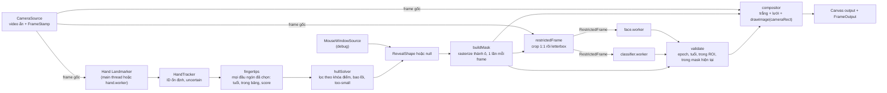

### 4.5 Giao thức worker mặt và worker phân loại

Hai worker dùng cùng khung giao thức; khác nhau ở model và kết quả.

| Chiều | Message | Nội dung |
|---|---|---|
| main → worker | `init` | `wasmBasePath`, `modelPath`, `delegate` (`GPU` hoặc `CPU`), tùy chọn model |
| main → worker | `detect` | `RestrictedFrame` (transfer `input`) |
| worker → main | `ready` | thời gian init |
| worker → main | `result` | `FaceResult` hoặc `ClassifyResult { taskId, epoch, frameId, ts, probs, inferMs }` |
| worker → main | `error` | `taskId`, thông báo |

Ràng buộc: worker chỉ có một handler nhận ảnh là `detect`; worker gọi `input.close()` sau khi suy luận; worker không giữ lại frame nào; không có message nào mang `HTMLVideoElement`, `MediaStream` hay frame toàn khung. Worker tạo bằng `new Worker(new URL('./face.worker.ts', import.meta.url), { type: 'module' })` để Vite đóng gói đúng.

### 4.6 Máy trạng thái vùng mở và epoch

- `closed(reason)` → `open(mask)`: khi `WindowSource` trả cửa sổ hợp lệ. Hành động: `epoch++`, reset One Euro, `FaceClient.accepting = true`.
- `open` → `closed(reason)`: ngay lần render kế tiếp sau khi xác định không hợp lệ (thiếu đầu ngón, điểm cũ, ra ngoài bảng, cạnh quá nhỏ, tay chéo không chắc, tab ẩn, camera dừng, đổi cấu hình). Hành động: xóa mặt và nhãn, `accepting = false`, `rejectAll()`.
- `open` → `open` với cửa sổ khác: không đổi epoch. Kết quả đang chạy vẫn được validate theo ROI lúc gửi và mask hiện tại.
- Đổi camera, mirror, grid, resize, nguồn cửa sổ (INT-01): `epoch++` ngay cả khi đang closed, để mọi tác vụ đang chạy bị loại.

### 4.7 Lớp giao diện web: màn hình bắt đầu và cổng đồng ý

Bổ sung sau rà soát A11, thu gọn theo D-019 (bản có backend, cơ sở dữ liệu và admin nằm ở `archive/backend/`, ngoài build). Ứng dụng là tệp tĩnh: không có backend, không có API, không có gì rời trình duyệt (I9). Lớp này chỉ làm hai việc: màn hình bắt đầu với nút đồng ý trước khi bật camera, và cổng `assertCameraAllowed()` (I10). Định tuyến bằng `HashRouter` (D-020): đường dẫn trong app là phần sau `#`, nên `dist/` chạy trên mọi host tĩnh mà không cần SPA fallback.

#### Trang và điều kiện

| Đường dẫn | Nội dung | Điều kiện |
|---|---|---|
| `/` (hash `#/`) | Màn hình bắt đầu của web (D-023, UX-02, UX-03): eyebrow, tên, một câu giới thiệu, ba dòng cam kết (xử lý tại chỗ, không tải lên, camera chỉ bật khi bấm), hộp đồng ý có phiên bản, nút Bắt đầu, stepper ba bước và minh họa động bằng canvas (không camera), tất cả trên một màn ở 1280 × 720 trở lên; chế độ kiosk hiện dòng phạm vi đồng ý; `?mode=present` là bản kiosk (lưới phủ cả màn, thẻ đồng ý nổi) dẫn vào `#/app?mode=present` | Không gọi `getUserMedia` (I10); không gọi mạng, không font hay ảnh ngoài (I9) |
| `#/app` | Sân khấu canvas trắng (I4): thanh trên ba vùng (brand, chọn camera, Bật camera / Dừng camera, pill trạng thái camera, nút Cài đặt, Debug, Trình diễn, Toàn màn hình, Thu hồi đồng ý), cột cài đặt bên phải thu gọn được, ngăn kéo debug dưới canvas, lớp hướng dẫn ba bước trên canvas (UX-01, UX-03); `?mode=present` mở chế độ trình diễn (mọi panel là lớp nổi tự ẩn, canvas chiếm cả màn) | Chưa đồng ý (hoặc đồng ý phiên bản cũ) thì chuyển về `#/`; `getUserMedia` chỉ trong handler bấm nút sau `assertCameraAllowed()` |

#### Đồng ý

- `src/app/session.ts`: `CONSENT_VERSION` (chuỗi ngày), khóa `wct.consent`; `hasConsent()` đúng khi giá trị lưu bằng `CONSENT_VERSION`; `giveConsent()`, `revokeConsent()`, hook `useConsent()` (đồng bộ giữa các tab qua sự kiện `storage`).
- Phạm vi lưu theo `DEFAULTS.consent.scope` (D-021): `device` dùng `localStorage` (giữ qua các lần mở, mặc định), `tab` dùng `sessionStorage` (hết hiệu lực khi đóng tab, cho kiosk và trình diễn).
- Đổi văn bản đồng ý thì tăng `CONSENT_VERSION`: người dùng phải đồng ý lại.
- Storage bị chặn (chế độ riêng tư) thì chỉ giữ trong bộ nhớ của phiên hiện tại.

#### Cổng camera

`src/app/gate.ts`: `currentRoute()` đọc đường dẫn từ hash; `cameraGateReason()` trả `no-consent`, `wrong-page` (đường dẫn không phải `/app`) hoặc `no-user-activation` (`navigator.userActivation.isActive` sai); `assertCameraAllowed()` ném lỗi khi có lý do. `CameraSource` (CAM-01) nhận hàm này làm `gate` và gọi đồng bộ ngay trước mỗi `getUserMedia`, chỉ từ handler bấm nút (D-025).

#### Triển khai

- Dev: `npm run dev` (Vite 5173).
- Prod: `npm run build` tạo `dist/`; host tĩnh HTTPS bất kỳ, không cần SPA fallback (D-020). Không có biến môi trường lúc chạy; lúc build chỉ có `VITE_BASE` (gốc đường dẫn của trang, phụ lục 9.3). Header COOP/COEP (nếu CLS-02 cần wasm đa luồng, D-013) đặt ở host tĩnh. Bản công khai: GitHub Pages triển khai từ job `deploy` của CI, service worker cache model, tên miền riêng, nhánh lưu trữ backend cũ: REL-01 (D-024, D-048).

## 5. Sơ đồ use case và luồng xử lý

Quy ước: use case vẽ bằng hình bo tròn, tác nhân là hộp có biểu tượng, quan hệ «include» và «extend» là nét đứt. Trong các sơ đồ luồng, tên node trùng tên module, hàm và kiểu dữ liệu ở mục 4 để đối chiếu thẳng với code. Mọi sơ đồ viết bằng Mermaid, render được trên GitHub, GitLab và VS Code (Markdown Preview Mermaid Support). Bảng 5.13 truy vết từng sơ đồ về bất biến và gói công việc.

### 5.1 Sơ đồ use case

Nhóm vận hành và người dùng cuối:

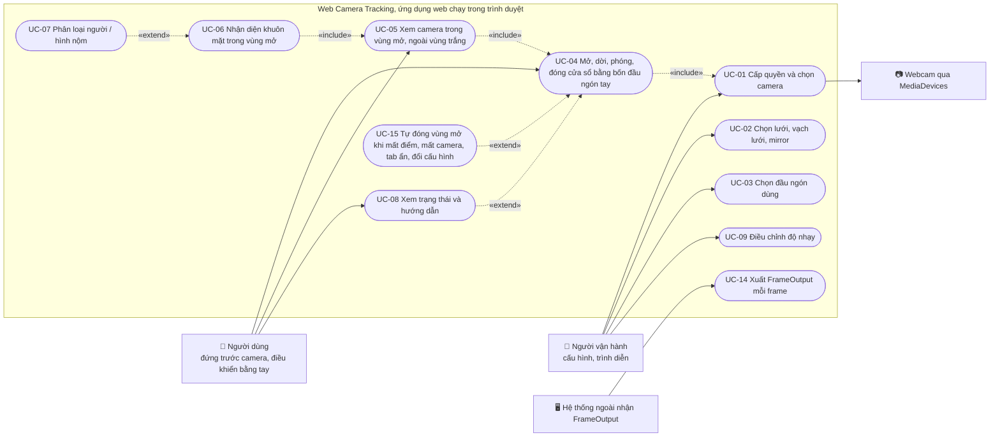

Nhóm phát triển, kiểm thử và thu dữ liệu:

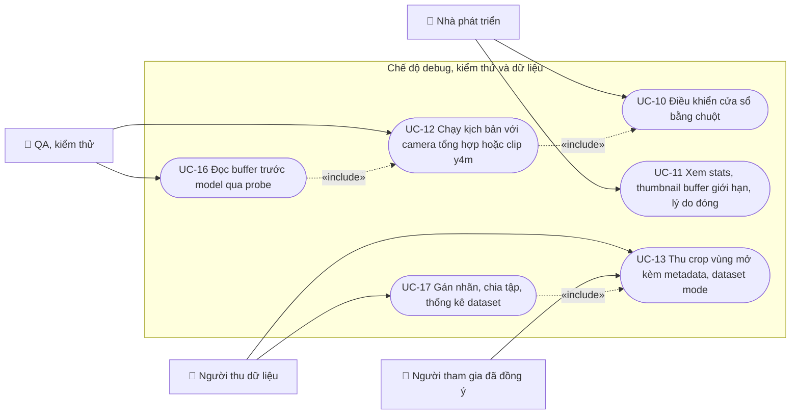

### 5.2 Đặc tả use case tóm tắt

| Mã | Tên | Tác nhân chính | Điều kiện trước | Luồng chính | Kết quả | Gói |
|---|---|---|---|---|---|---|
| UC-01 | Cấp quyền và chọn camera | Người vận hành | Trang đã tải, canvas trắng | Chọn thiết bị → `getUserMedia` → `CameraSource` active | Camera chạy, output vẫn trắng | CAM-01 |
| UC-02 | Chọn lưới, vạch lưới, mirror | Người vận hành | Không | Preset hoặc custom → `computeLayout` → `epoch++` | Bảng căn giữa, ô vuông; cửa sổ đang mở bị đóng với lý do config-changed | GRID-01 |
| UC-03 | Chọn đầu ngón dùng | Người vận hành | Không | Bỏ bớt hay bật lại ngón cho cả hai tay (mặc định cả năm) | `fingers` cập nhật, `epoch++` | HAND-02, ROI-03 |
| UC-04 | Mở, dời, phóng, đóng cửa sổ bằng tay | Người dùng | UC-01, hand landmarker sẵn sàng | Bốn slot hợp lệ → `solveSquare` → `buildMask` | RevealState Open hoặc Closed theo tay | HAND-01, HAND-02, ROI-01 |
| UC-05 | Xem camera trong vùng mở | Người dùng | Vùng mở | Compositor vẽ camera chỉ trong `stageRect` | Ngoài vùng trắng, ô cũ đóng ngay | MASK-01 |
| UC-06 | Nhận diện khuôn mặt trong vùng mở | Người dùng | Vùng mở, cạnh ROI ≥ 64 px | `restrictedFrame` → `face.worker` → validate | full, partial hoặc searching | MASK-02, FACE-01, FACE-02 |
| UC-07 | Phân loại người / hình nộm | Người dùng | UC-06 có mặt hợp lệ | `classifier.worker` trên cùng crop → quy tắc unknown | person, mannequin hoặc unknown | CLS-02 |
| UC-08 | Xem trạng thái và hướng dẫn | Người dùng | Không | `FrameOutput.status` và `CloseReason` → thông điệp | Người dùng biết phải làm gì tiếp | UX-01 |
| UC-09 | Điều chỉnh độ nhạy | Người vận hành | Không | Đổi One Euro, hysteresis, tuổi điểm, nMin | Áp dụng ngay, ghi vào config | ROI-01 |
| UC-10 | Điều khiển cửa sổ bằng chuột | Nhà phát triển | Chọn nguồn cửa sổ mouse | Kéo, lăn, Esc, Space | Như UC-04 nhưng không cần tay | ROI-00 |
| UC-11 | Xem stats và thumbnail buffer giới hạn | Nhà phát triển | `?debug=1` | Panel debug đọc store | Thấy chính xác ảnh model nhận | FACE-01, PERF-01 |
| UC-12 | Chạy kịch bản với camera tổng hợp | QA | Playwright với clip y4m hoặc `SyntheticCameraSource` | `window.__scenario.run(...)` | Kết quả test tự động | TEST-00, QA-01 |
| UC-13 | Thu crop vùng mở kèm metadata | Người thu dữ liệu, người tham gia | Đồng ý bằng văn bản, vùng mở | Bật dataset mode → lưu crop và JSON cục bộ | Dataset không chứa frame gốc | CLS-01 |
| UC-14 | Xuất FrameOutput | Hệ thống ngoài | Vòng lặp chạy | Sự kiện mỗi frame | Dữ liệu chịu cùng gate với overlay | FACE-02 |
| UC-15 | Tự đóng vùng mở | Hệ thống | Vùng mở | Phát hiện lý do → Closed → xóa kết quả | Không còn mặt hay nhãn nào hiển thị | HAND-02, CAM-01, FACE-02 |
| UC-16 | Đọc buffer trước model qua probe | QA | `?debug=1` | `onRestrictedFrame` | Kiểm được gate cứng | TEST-00 |
| UC-17 | Gán nhãn, chia tập, thống kê | Người thu dữ liệu | Có dataset | Scripts trong `tools/dataset` | Tập train/val/test không rò rỉ | CLS-01 |

### 5.3 Luồng trải nghiệm năm bước ánh xạ sang module

Sơ đồ này là năm bước trải nghiệm của kế hoạch gốc, gắn với gói công việc thực hiện từng bước.

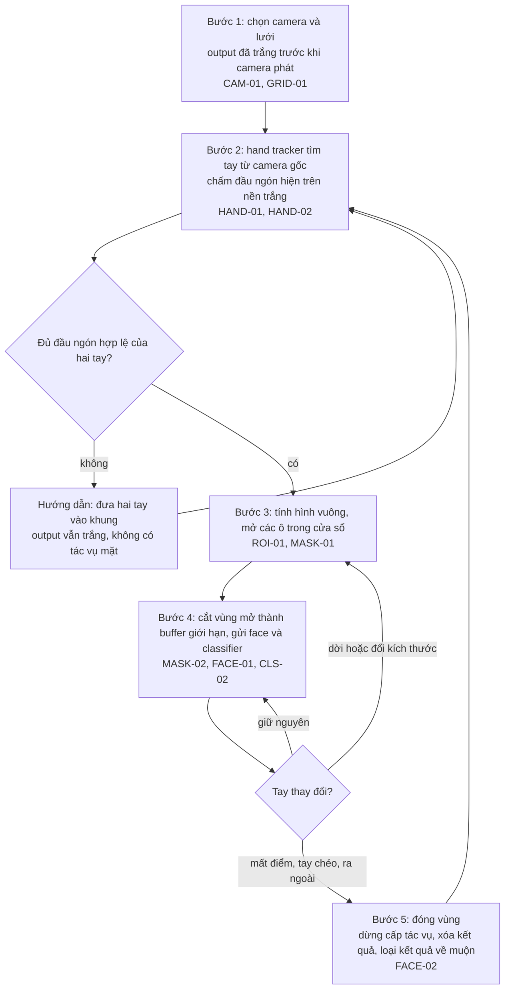

### 5.4 Sơ đồ thành phần theo thread và quyền đọc dữ liệu

Có ba ranh giới thread. Chỉ có ba mũi tên mang frame gốc rời khỏi `CameraSource`: tới hand landmarker, tới compositor và tới `restrictedFrame`. Không có mũi tên nào từ `CameraSource` tới `face.worker` hay `classifier.worker`; quy tắc import ở mục 4.2 bảo đảm điều đó ở mức mã nguồn.

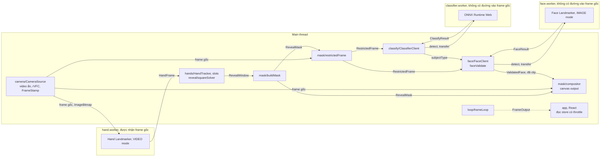

### 5.5 Khởi động, cấp quyền và vòng đời camera

Trình tự khởi động. Worker mặt được khởi tạo và warm-up sớm nhưng không nhận frame nào cho tới khi có vùng mở.

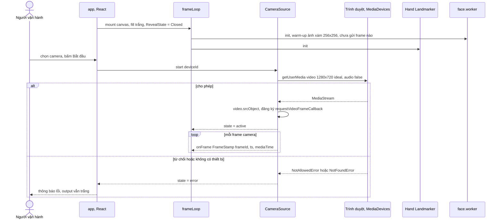

Vòng đời `CameraSource`:

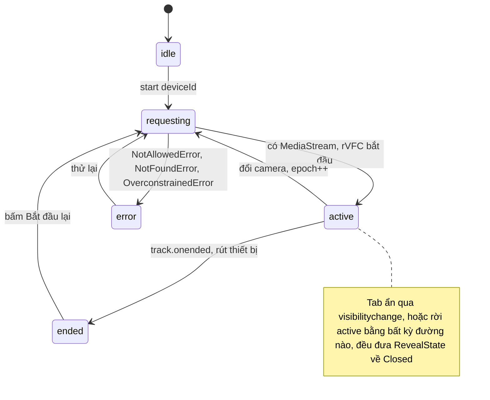

### 5.6 Luồng một frame khi vùng mở bằng tay

Trình tự này là mục 4.4 viết dưới dạng sequence. Kết quả mặt về bất đồng bộ và chỉ được dùng ở frame kế tiếp.

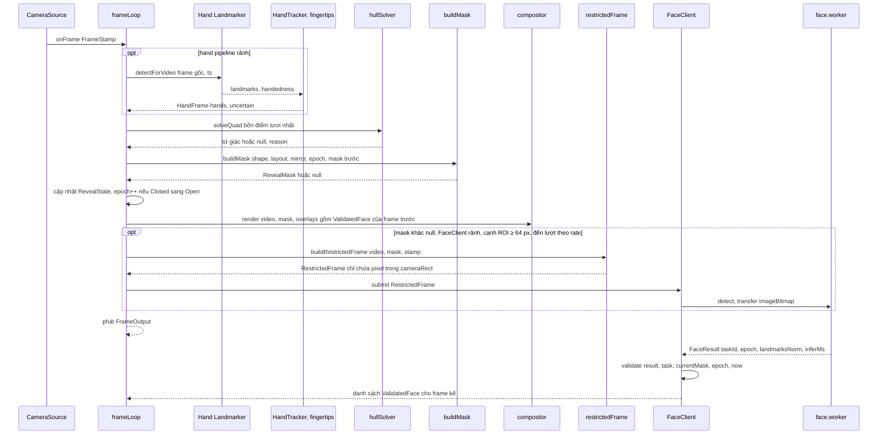

### 5.7 Máy trạng thái vùng mở và epoch

Sơ đồ này hình thức hóa mục 4.6. Chỉ hai loại chuyển làm tăng epoch: Closed sang Open và đổi cấu hình.

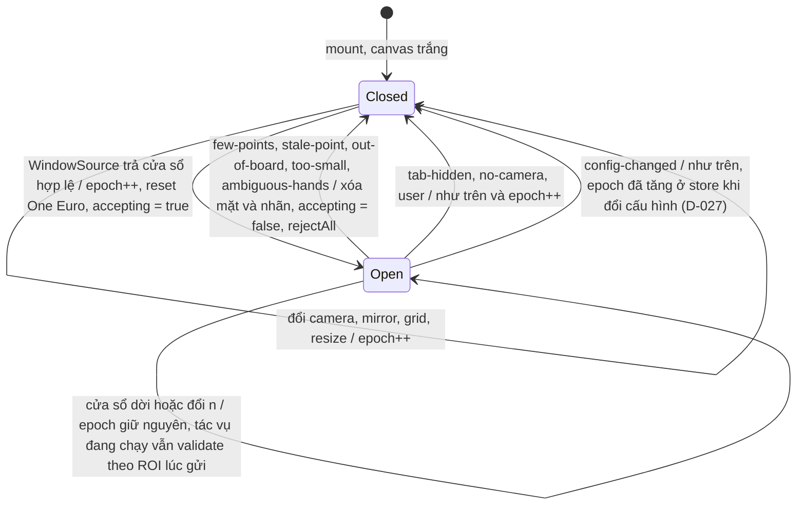

### 5.8 Luồng tay → đầu ngón → cửa sổ

Cây quyết định từ một `HandFrame` tới tập ô mở hoặc lý do đóng (D-038, sửa ở ROI-03 theo D-047: mọi đầu ngón đã chọn của mọi tay là điểm ứng viên, điểm không hợp lệ chỉ bị loại khỏi bao lồi). Mọi nhánh không đủ điểm đều dẫn tới Closed với `CloseReason` tương ứng; không có nhánh nào giữ vùng bằng điểm dự đoán.

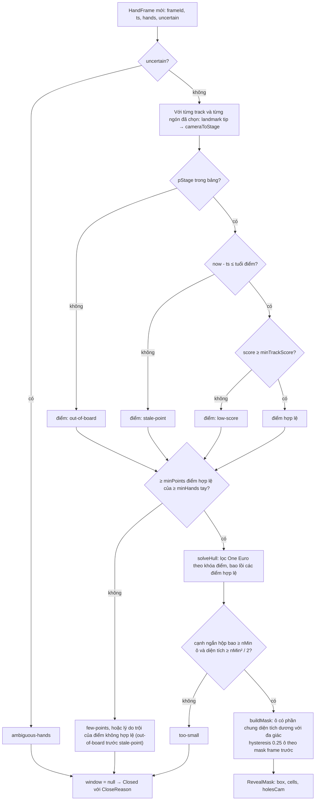

### 5.9 Luồng tạo buffer giới hạn

Đường dữ liệu duy nhất dẫn tới worker mặt và worker phân loại. Crop 1:1 trước, letterbox sau; probe đọc bản sao ngay trước khi transfer.

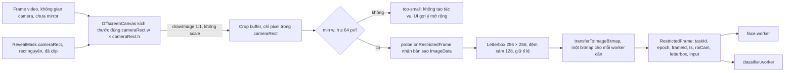

### 5.10 Vòng đời tác vụ mặt, kết quả về muộn và validate

Vòng đời một tác vụ. Tác vụ đồng bộ đang chạy trong worker không hủy được giữa chừng, nên `rejectAll` chỉ đánh dấu `taskId` để loại khi kết quả về.

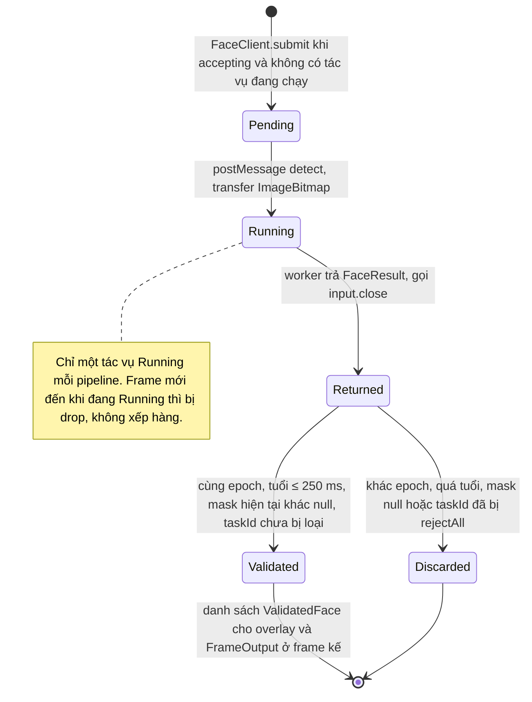

Kết quả về muộn sau khi đóng và mở lại:

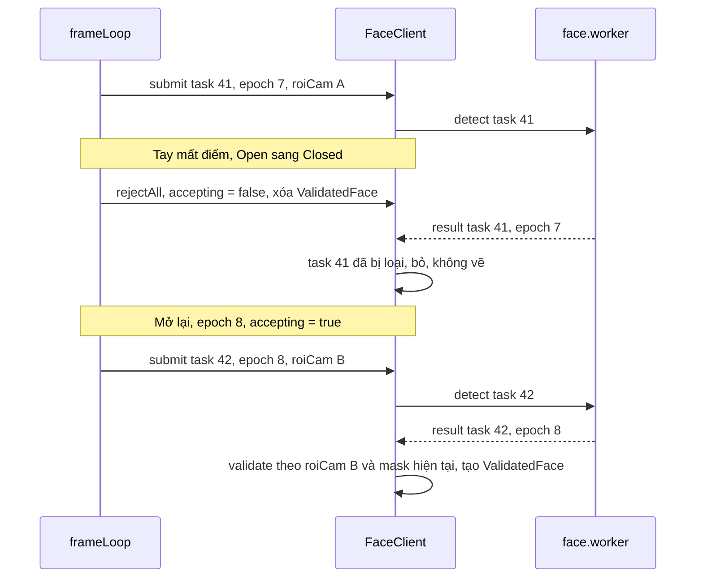

Cây quyết định `validate` trong `faceValidate.ts`:

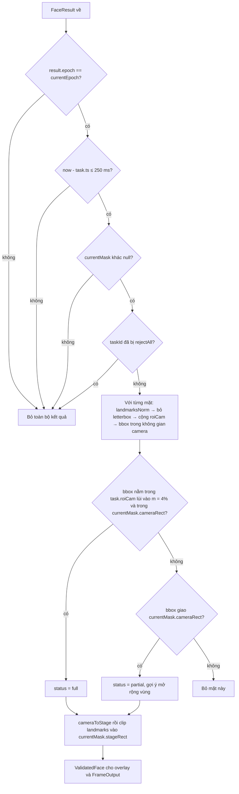

### 5.11 Luồng phân loại người / hình nộm

Classifier dùng đúng crop của face, nhận một `ImageBitmap` riêng vì bitmap bị transfer, chạy thưa hơn và gắn nhãn vào mặt đã validate cùng epoch.

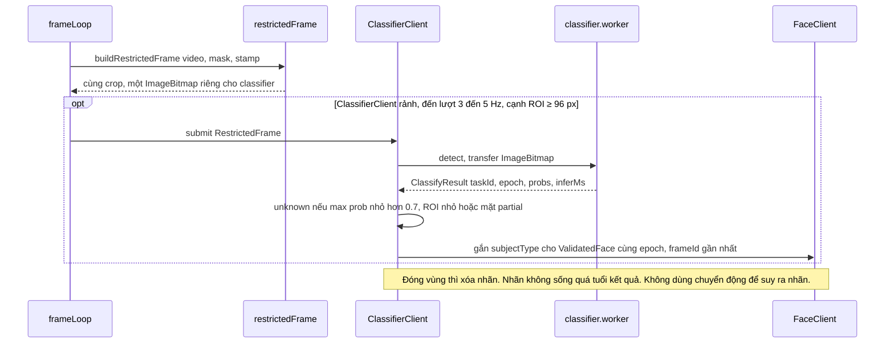

### 5.12 Luồng dataset mode

Chế độ thu dữ liệu chỉ lưu crop vùng mở và metadata, không bao giờ lưu frame gốc và không upload.

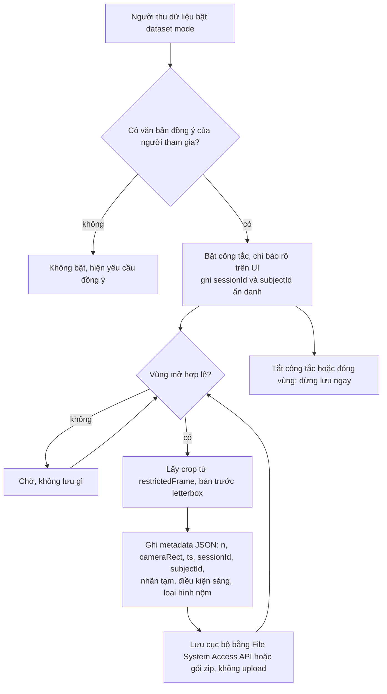

### 5.13 Truy vết sơ đồ, bất biến và gói công việc

| Sơ đồ | Bất biến được thể hiện | Gói thực hiện |
|---|---|---|
| 5.4 thành phần theo thread | I1 | SETUP-00 (lint boundaries), FACE-01, CLS-02 |
| 5.5 khởi động và camera | I4 | CAM-01 |
| 5.6 một frame | I2, I7 | INT-01, PERF-01 |
| 5.7 trạng thái vùng mở | I5, I6 | FACE-02, HAND-02 |
| 5.8 tay → slot → cửa sổ | I7 cho hand pipeline | HAND-01, HAND-02, ROI-01 |
| 5.9 buffer giới hạn | I1, I2, I3 | MASK-01, MASK-02, TEST-00 |
| 5.10 tác vụ mặt | I5, I6, I7 | FACE-01, FACE-02, QA-01 |
| 5.11 phân loại | I1, I6 | CLS-02 |
| 5.12 dataset mode | I8 | CLS-01 |
| 5.14 trang chào và cổng đồng ý | I9, I10 | WEB-00 |

### 5.14 Use case và luồng trang chào

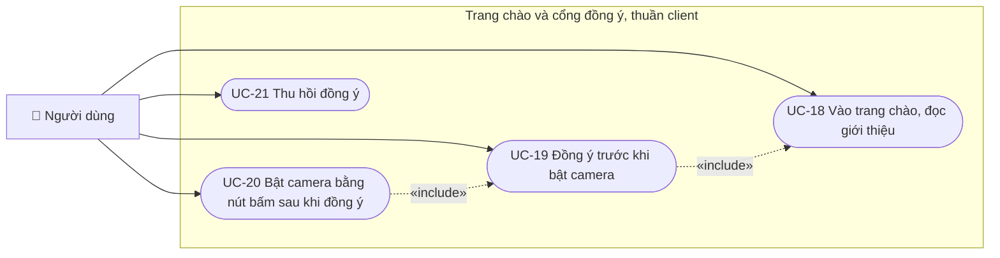

| Mã | Tên | Tác nhân | Điều kiện trước | Luồng chính | Kết quả | Gói |
|---|---|---|---|---|---|---|
| UC-18 | Vào trang chào | Người dùng | Không | Mở `/` | Trang chào hiện; chưa gọi camera; không gọi mạng | WEB-00 |
| UC-19 | Đồng ý | Người dùng | UC-18 | Tích đồng ý, bấm Bắt đầu → `giveConsent()` ghi `wct.consent` = `CONSENT_VERSION` → chuyển `#/app` | `hasConsent()` đúng, giữ qua tải lại trang (theo `consent.scope`, D-021) | WEB-00 |
| UC-20 | Bật camera | Người dùng | UC-19 | Bấm Bật camera → `CameraSource.start()` gọi `assertCameraAllowed()` rồi `getUserMedia` (CAM-01) | Camera chạy, output vẫn trắng | WEB-00, CAM-01 |
| UC-21 | Thu hồi đồng ý | Người dùng | UC-19 | Bấm Thu hồi đồng ý → dừng camera, `revokeConsent()` → về `#/` | `#/app` không vào được cho tới khi đồng ý lại | WEB-00 |

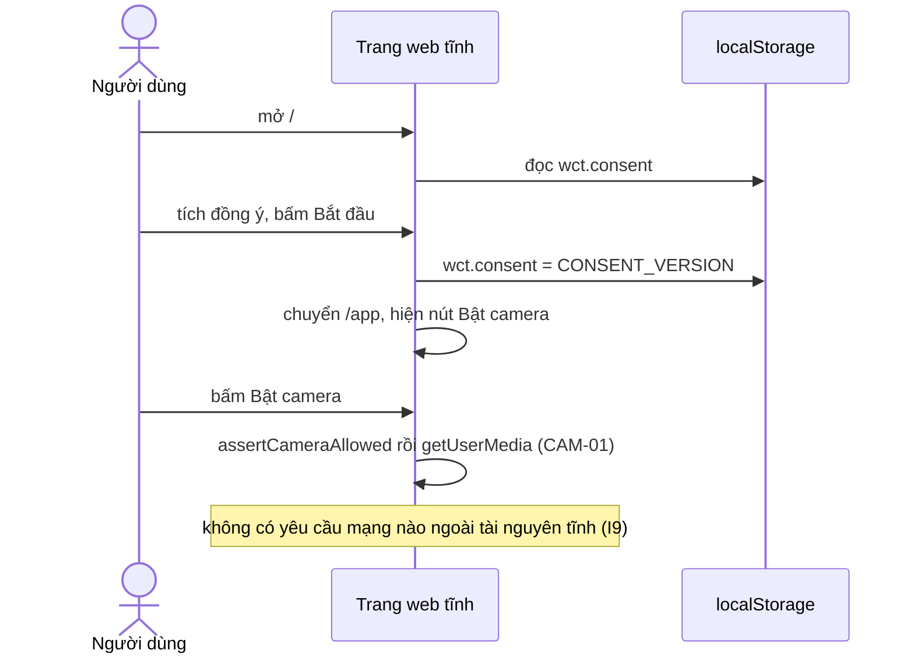

## 6. Các gói công việc

Thứ tự thực hiện cho một người:

`SETUP-00 → SPIKE-00 → WEB-00 → CAM-01 → GRID-01 → ROI-00 → MASK-01 → TEST-00 → MASK-02 → FACE-01 → FACE-02 → HAND-01 → HAND-02 → ROI-01 → INT-01 → ROI-02 → QA-01 → PERF-01 → UX-01 → UX-02 → CLS-01 → CLS-02 → QA-02 → LOG-02 (tùy chọn) → ROI-03 → UX-03 → REL-01`

API-00, LOG-01, ADM-01, SEC-01, DEP-01 đã bỏ theo D-019 (mã ở `archive/backend/`); triển khai tĩnh lên GitHub Pages với tên miền riêng nằm trong REL-01 (D-024, D-048). UX-02 (màn hình bắt đầu, D-023) chỉ phụ thuộc WEB-00 nên có thể kéo lên bất kỳ lúc nào sau CAM-01; LOG-02 (nhật ký cục bộ, D-022) là tùy chọn, không phải điều kiện của REL-01.

Với hai người: người A làm nhánh `MASK-02 → FACE-01 → FACE-02`, người B làm nhánh `HAND-01 → HAND-02 → ROI-01` sau khi cả hai xong giai đoạn 1; gặp nhau ở INT-01. Thu dữ liệu CLS-01 bắt đầu ngay khi MASK-02 xong.

Tiêu chí hoàn thành chung cho mọi gói: lint và test pass; quy tắc import pass; số đo liên quan hiện ở debug panel; README mô tả cách bật tính năng; quyết định mới ghi vào `docs/decisions.md`.

### Giai đoạn 0: khởi tạo và spike

#### SETUP-00 Khởi tạo repo

Phụ thuộc: không.

Bước làm:

1. Tạo project Vite + React + TypeScript (strict). Cài `@mediapipe/tasks-vision`; dev: `vitest`, `@playwright/test`, `eslint`, `prettier`, `@vitejs/plugin-basic-ssl` (HTTPS cho thử trên LAN; localhost đã là secure context).
2. Tải `hand_landmarker.task`, `face_landmarker.task` và thư mục wasm của tasks-vision vào `public/models/`. Ghi `public/models/models.json`: tên, phiên bản, sha256, nguồn tải. Không phụ thuộc CDN lúc chạy.
3. Tạo cây thư mục mục 4.2 với file rỗng có export placeholder; tạo `core/types.ts` theo mục 4.3 và `core/config.ts` theo phụ lục 9.1.
4. Cấu hình ESLint quy tắc import mục 4.2; thêm script `npm run lint:boundaries`.
5. Scripts: `dev`, `build`, `test:unit`, `test:e2e`, `lint`. Playwright cấu hình Chromium với flags camera giả: `--use-fake-ui-for-media-stream --use-fake-device-for-media-stream --use-file-for-fake-video-capture=<clip.y4m>`.
6. `.gitignore` thêm `data/`, `*.y4m`, và `*.onnx` ngoài `public/models`. Tạo `docs/decisions.md` và `docs/spikes.md`.
7. Trang khởi động: canvas output fill trắng, chưa có gì khác.

Tiêu chí hoàn thành: `npm run dev` hiện trang trắng; `npm run lint`, `test:unit`, `test:e2e` chạy pass với test mẫu; README có mục "Chạy".

#### SPIKE-00 Spike kỹ thuật

Phụ thuộc: SETUP-00. Kết quả ghi vào `docs/spikes.md` với cấu hình máy, trình duyệt, phiên bản model.

| Mã | Câu hỏi | Cách đo | Quyết định rút ra |
|---|---|---|---|
| S1 | Face Landmarker có chạy trong Worker với OffscreenCanvas + GPU delegate không? Thời gian init và infer cho ảnh 64, 128, 256 px? | Worker tối giản, ảnh tĩnh, đo `performance.now()` | Delegate và nơi chạy cho FACE-01 |
| S2 | Hand Landmarker VIDEO mode ở 720p: ms/frame trên main thread so với worker (kể cả chi phí `createImageBitmap` + transfer)? | 300 frame, lấy p50/p95 | Main thread hay `hand.worker` cho HAND-01 |
| S3 | Với frame webcam thô (chưa mirror), MediaPipe gán nhãn Left/Right thế nào? | Giơ tay phải, ghi nhãn trả về | Hàm `normalizeHandedness` trong HAND-01 |
| S4 | `requestVideoFrameCallback` có bắn khi video ẩn (opacity 0, ngoài viewport) và khi tab nền không? `MediaStreamTrackProcessor` có dùng được không? | Log 10 s mỗi trường hợp | Cách lấy `FrameStamp` trong CAM-01 |
| S5 | `drawImage` sub-rect 1:1 vào OffscreenCanvas rồi `transferToImageBitmap`: ms cho crop 256 và 720 px? | 300 lần | Ngân sách cho MASK-02 |
| S6 (trước CLS-02) | ONNX Runtime Web chạy được model ONNX mẫu với wasm và webgpu? Latency ảnh 128 px? | Model MobileNet mẫu | Execution provider cho CLS-02 |

Tiêu chí hoàn thành: bảng số đo trong `docs/spikes.md`; các quyết định S1–S4 ghi vào `docs/decisions.md`.

### Giai đoạn 0b: trang chào và cổng đồng ý

#### WEB-00 Frontend: định tuyến, trang chào, cổng đồng ý

Phụ thuộc: SETUP-00.

Bước làm:

1. `react-router` với `HashRouter` (D-020): `#/` LandingPage, `#/app` StagePage (canvas hiện có), đường dẫn khác chuyển về `#/`.
2. `src/app/session.ts`: `CONSENT_VERSION`, khóa `wct.consent` trong `localStorage` hoặc `sessionStorage` theo `DEFAULTS.consent.scope` (D-021), `hasConsent`, `giveConsent`, `revokeConsent`, hook `useConsent`.
3. LandingPage: hộp đồng ý với văn bản có phiên bản; nút Bắt đầu chỉ bật khi đã tích; `giveConsent()` rồi chuyển `#/app`. Không gọi mạng, không gọi camera. Giao diện thẩm mỹ làm ở UX-02 (D-023).
4. StagePage: chưa đồng ý (hoặc phiên bản cũ) thì về `#/`; nút Bật camera đi qua `assertCameraAllowed()` trong `src/app/gate.ts` (đường dẫn hash `/app`, đã đồng ý, `navigator.userActivation.isActive` nếu có); CAM-01 nối `getUserMedia` ngay sau hàm này; nút Thu hồi đồng ý.
5. e2e: đếm `getUserMedia` ở trang chào bằng `addInitScript`; vào `/app` khi chưa đồng ý bị chuyển hướng; sau đồng ý canvas trắng và giữ qua tải lại; đồng ý phiên bản cũ không hiệu lực; thu hồi; không có yêu cầu fetch/xhr/beacon hay `/api` nào.

Tiêu chí hoàn thành: không đường nào tới `getUserMedia` mà không qua `assertCameraAllowed()` (grep trong CI); `src/` không có `fetch`, `sendBeacon`, `WebSocket` tới máy chủ (grep trong CI); e2e pass.

### Giai đoạn 1: màn che và hình học

#### CAM-01 Camera lifecycle

Phụ thuộc: SPIKE-00 (S4).

Bước làm:

1. Interface `FrameSource { width; height; drawable: CanvasImageSource; onFrame(cb: (stamp: FrameStamp) => void); stop() }`. `CameraSource` và `SyntheticCameraSource` (TEST-00) cùng implement.
2. `CameraSource`: `enumerateDevices()` sau khi có quyền; `getUserMedia({ video: { deviceId, width: { ideal: 1280 }, height: { ideal: 720 } }, audio: false })`; video element `muted playsInline autoplay`, đặt ngoài cây hiển thị theo cách S4 cho phép (không dùng `display: none` nếu S4 cho thấy rVFC ngừng bắn).
3. `FrameStamp`: `frameId` tăng dần từ 0 cho mỗi callback rVFC, `ts = performance.now()`, `mediaTime` từ metadata. Fallback rAF nếu không có rVFC.
4. Máy trạng thái camera: `idle → requesting → active → (ended | error)`. Bắt `track.onended`, `devicechange`, `visibilitychange`. Mọi lối ra khỏi `active` phát sự kiện để vòng lặp chuyển `RevealState` sang `closed`.
5. Đổi camera lúc chạy: dừng track cũ, xin track mới, `epoch++`, output giữ trắng suốt quá trình.
6. UI: chọn camera, nút bắt đầu/dừng, thông báo khi bị từ chối quyền.

Tiêu chí hoàn thành: đổi camera không lóe khung hình toàn camera; rút camera vật lý đưa về `ended` và output trắng; `frameId` liên tục không trùng.

Kiểm thử: unit máy trạng thái; e2e camera giả: từ chối quyền thì UI báo lỗi và output toàn trắng.

#### GRID-01 Lưới, layout và hệ tọa độ

Phụ thuộc: CAM-01.

Bước làm:

1. `computeLayout` theo mục 4.1: `c` nguyên, bảng căn giữa, `scale` kiểu cover, `camVisibleRect` là phần camera thực sự ánh xạ lên bảng.
2. Canvas output theo DPR: `canvas.width = cssW * dpr`; `ResizeObserver` tính lại layout và `epoch++`.
3. Toàn bộ hàm transform mục 4.1 với flag `mirror`.
4. UI: preset lưới, custom cột × hàng có giới hạn, bật/tắt vạch lưới, bật/tắt mirror. Vạch lưới màu xám nhạt vẽ sau nền trắng.
5. Debug: hiện `c`, `board`, `scale`, `epoch`.

Tiêu chí hoàn thành: 64 × 36 trên stage 1280 × 720 cho `c = 20`; 32 × 32 cho bảng vuông căn giữa với camera cover; mirror đảo đúng chiều cho mọi consumer vì cùng đi qua `coords.ts`.

Kiểm thử (unit): layout với nhiều kích thước stage và grid; `cameraToStage(stageToCamera(p)) ≈ p` có và không mirror; `windowToCameraRect` trả rect nguyên nằm trong camera, kể cả cửa sổ sát mép; `windowToStageRect` của các ô kề nhau không chồng và không hở.

#### ROI-00 Cửa sổ điều khiển bằng chuột

Phụ thuộc: GRID-01.

Bước làm:

1. Interface `WindowSource { kind; current(now: number): WindowSample; dispose(): void }` với `WindowSample = { window: RevealWindow, limited } | { window: null, reason: CloseReason }` (D-027).
2. `MouseWindowSource`: bấm trên bảng mở tại con trỏ, kéo để dời cửa sổ, lăn chuột để đổi `n`, phím Esc đóng, phím Space mở lại. Kẹp trong bảng (`clampWindow` ở `core/grid.ts`), luôn vuông, đánh dấu `limited`; layout đổi thì đặt lại từ tâm px stage.
3. UI chọn nguồn cửa sổ: `mouse` hoặc `hands` (hands chưa có, hiện disabled); `settings.windowSource` trong store.
4. Giữ chế độ này vĩnh viễn làm chế độ debug và làm nguồn cho test e2e.
5. Khung vòng lặp `loop/frameLoop.ts` (rAF): `WindowSource.current` → `stepReveal` (`core/revealState.ts`, epoch theo mục 4.6) → `buildMask` một lần → `paintBackground` + `drawWindowOutline`. Probe `window.__wct.loop`.

Tiêu chí hoàn thành: kiểm tra được mọi hình học bảng và cửa sổ mà không cần tay, không cần camera.

#### MASK-01 Mask chuẩn và compositor

Phụ thuộc: ROI-00.

Bước làm:

1. `buildMask(window, layout, mirror, epoch, limited) → RevealMask` (đã làm ở ROI-00, D-027). `stageRect = windowToStageRect`, `cameraRect = windowToCameraRect` (nguyên, đã clip trong camera; kích thước camera lấy từ layout, D-026). Đây là hàm duy nhất tạo mask.
2. `compositor.render(ctx, layout, { showLines, mirror, drawable, mask })` (D-028): fill `#fff` toàn canvas → vạch lưới nếu bật → nếu có mask và `drawable`: `drawImage(drawable, cameraRect → stageRect)` trong `ctx.clip(stageRect)`; mirror thực hiện bằng `ctx.save(); ctx.translate(); ctx.scale(-1, 1)` chỉ trong phạm vi `stageRect` → overlay (viền cửa sổ, bốn chấm nếu có, mặt) → `ctx.restore()`. `drawable` là `FrameSource.drawable`, null khi camera chưa active.
3. Không có bước tích lũy: mỗi frame vẽ lại toàn bộ; ô cũ tự đóng khi cửa sổ dời đi.
4. Không vẽ video khi `mask == null`. Không có đường code nào `drawImage(source)` toàn khung: `tools/check-invariants.mjs` kiểm `drawImage(` chỉ ở `compositor.ts` và `restrictedFrame.ts`, luôn 9 tham số.

Tiêu chí hoàn thành: khởi động trắng; chỉ hình vuông hiện camera; vật tròn trong camera vẫn tròn trên output; đổi grid không lệch giữa ô mở và nội dung camera.

Kiểm thử (e2e, dùng `SyntheticCameraSource` của TEST-00): mọi pixel ngoài `stageRect` bằng `(255,255,255)`; pixel trong `stageRect` khớp màu vùng camera tương ứng; sau khi dời cửa sổ, vị trí cũ trắng ngay frame kế tiếp.

#### TEST-00 Nguồn camera tổng hợp, probe và clip test

Phụ thuộc: CAM-01, MASK-01 (làm song song với MASK-01).

Bước làm:

1. `SyntheticCameraSource` implement `FrameSource`: vẽ vào canvas theo kịch bản: nền magenta ngoài vùng chỉ định, vùng "người" màu xanh lá ở tọa độ cấu hình, ảnh mặt tĩnh (chỉ dùng ảnh được phép) ở vị trí cấu hình, có thể di chuyển theo thời gian.
2. `debug/probes.ts`: `onRestrictedFrame(cb)` nhận bản sao `ImageData` của buffer đúng như gửi cho worker; `onOutputFrame(cb)` nhận `ImageData` canvas output; đếm `faceDetectSubmitted`, `faceDetectDropped`, `classifierSubmitted`. Chỉ bật khi `?debug=1`.
3. `debug/scenarios.ts`: kịch bản có thể chạy từ test (`window.__scenario.run('coverAll')`, `'windowAt(col,row,n)'`, `'moveWindow(...)'`, `'delayWorker(ms)'`; QA-01 thêm `'faceMaxAge(ms)'` nới tuổi tối đa của kết quả mặt).
4. `tools/make_test_clips.py`: tạo file y4m bằng ffmpeg từ kịch bản tổng hợp (không có người thật) để Playwright dùng làm camera giả; clip có mặt người thật chỉ dùng cục bộ, không commit.

Ghi chú thực hiện (D-029): nguồn tổng hợp và probe bật bằng `#/app?debug=1&source=synthetic`; kịch bản điều khiển cửa sổ qua `MouseWindowSource.setWindow`, `moveWindow`, `resizeWindow`, `close`; `onRestrictedFrame` và `wantsRestrictedFrame` có sẵn, MASK-02 gọi `emitRestrictedFrame` ngay trước transfer; `delayWorker` ghi `probes.workerDelayMs` cho FACE-02; clip y4m cần ffmpeg (máy phát triển hiện không có, chỉ kiểm `--dry-run`).

Tiêu chí hoàn thành: Playwright chạy được với camera giả; test pixel của MASK-01 pass; probe đọc được buffer trước model.

### Giai đoạn 2: buffer giới hạn và face trong vùng mở

#### MASK-02 Restricted frame builder

Phụ thuộc: MASK-01, TEST-00.

Bước làm:

1. `buildRestrictedFrame(source, mask, stamp, epoch, taskId) → RestrictedFrame | { kind: 'too-small' }`.
2. Bước cắt: `OffscreenCanvas` kích thước đúng `cameraRect.w × cameraRect.h` (tái sử dụng, chỉ resize khi kích thước đổi); `drawImage(source, rx, ry, rw, rh, 0, 0, rw, rh)`; nguồn là video, không bao giờ là canvas output.
3. Nếu `min(rw, rh) < 64` trả `too-small`, không tạo tác vụ.
4. Bước letterbox: canvas 256 × 256 fill xám 128, vẽ crop giữ tỉ lệ vào giữa, tính `letterbox { scale, dx, dy, size }`; `transferToImageBitmap()`; nếu cả face và classifier cần frame này thì tạo một bitmap cho mỗi worker từ cùng canvas letterbox.
5. Không có overlay, lưới, viền hay chấm trong ảnh vì crop lấy từ video.
6. Gọi probe `onRestrictedFrame` với bản sao trước khi transfer.
7. Không mirror buffer: buffer ở không gian camera; mirror chỉ áp dụng khi ánh xạ kết quả sang stage.

Ghi chú thực hiện (D-030): `createRestrictedFrameBuilder({ probes })` giữ hai canvas tái sử dụng và trả `build(source: FrameSource, mask, stamp, epoch, taskId, copies) → { kind: 'ok', frames } | too-small | no-frame`; nhận `FrameSource` chứ không nhận drawable rời nên nguồn không thể là canvas output (`check:invariants` cấm DOM trong file này). Toán letterbox ở `core/letterbox.ts` (`computeLetterbox`, `letterboxNormToCam`, `camToLetterbox`) để FACE-02 dùng. Vòng lặp gọi build ở bước 6 theo nhịp `face.targetHz` khi vùng mở và có frame mới; chưa có worker nên bitmap được đóng ngay; `taskId` tăng từ 1 chỉ khi ok. Thanh debug hiện số tác vụ, cỡ crop và gợi ý mở rộng khi quá nhỏ.

Tiêu chí hoàn thành: buffer chỉ chứa pixel trong `cameraRect` cộng đệm xám; không có pixel nào từ ngoài ROI kể cả 1 px biên.

Kiểm thử (e2e, gate cứng):

- Ngoài cửa sổ là magenta: đếm pixel magenta trong buffer bằng 0 cho nhiều vị trí và kích thước cửa sổ, gồm cửa sổ sát mép và cửa sổ nhỏ nhất.
- Giữ nguyên nội dung trong cửa sổ, đổi nội dung ngoài cửa sổ: hash hai buffer bằng nhau.
- `n` thay đổi: kích thước buffer và `letterbox` đúng công thức; ánh xạ ngược một điểm góc crop về camera trùng góc `cameraRect`.
- Khi `closed`: số lần gọi `buildRestrictedFrame` bằng 0.

#### FACE-01 Face worker chỉ nhận restricted buffer

Phụ thuộc: MASK-02, SPIKE-00 (S1).

Bước làm:

1. `face.worker.ts`: `init` tạo `FilesetResolver.forVisionTasks('/models/wasm')`, `FaceLandmarker.createFromOptions` với `runningMode: 'IMAGE'`, `numFaces: 2`, delegate theo S1, `outputFaceBlendshapes: false`, `outputFacialTransformationMatrixes: false`. Warm-up một ảnh xám 256 × 256 ngay sau init.
2. `detect(RestrictedFrame)`: `faceLandmarker.detect(input)` → `FaceResult` với `landmarksNorm` theo ảnh letterbox và `inferMs`; `input.close()` trong `finally`.
3. `FaceClient` (main): khởi tạo worker lúc app start; `submit(frame)` chỉ khi `accepting && !busy`, ngược lại drop và tăng đếm; lưu `pendingTask { taskId, epoch, frameId, ts, roiCam, letterbox }`; `rejectAll()` xóa pending và đánh dấu mọi taskId cũ là bị loại.
4. Rate control ban đầu: tối đa 15 Hz; giảm khi `inferMs` p50 vượt ngân sách.
5. Debug: hiện `inferMs`, `submitted`, `dropped`, thumbnail buffer vừa gửi (bằng chứng trực quan của I1).

Ghi chú thực hiện (D-031): giao thức ở `face/faceProtocol.ts`; `FaceClient.start()` lúc mount `StagePage`; `submit()` luôn nhận quyền sở hữu bitmap; `rejectAll()` giữ busy tới khi worker trả về; nhịp `max(1000 / face.targetHz, p50 inferMs)`; vòng lặp bật/tắt `accepting` theo vùng mở và `rejectAll` khi đóng hoặc đổi epoch; probe `window.__wct.face`; thumbnail vẽ bằng `putImageData` từ `onRestrictedFrame`. Validate, ánh xạ tọa độ và overlay là FACE-02.

Tiêu chí hoàn thành: worker chỉ có một loại message mang ảnh; UI vẫn ≥ 30 FPS khi suy luận chạy; `lint:boundaries` pass cho `src/face/**`.

Kiểm thử: unit boundary import; e2e: khi `closed` liên tục 5 s, `faceDetectSubmitted` không tăng; khi mở cửa sổ vào vùng chỉ có nền, có tác vụ được gửi và kết quả rỗng.

#### FACE-02 Gate trạng thái, tọa độ, epoch, freshness, clip

Phụ thuộc: FACE-01.

Bước làm:

1. `faceMapping.ts`: `landmarksNorm → crop px` (bỏ letterbox) → `cam px` (cộng `roiCam.x, roiCam.y`) → `stage` qua `cameraToStage` của layout thuộc epoch tác vụ. bbox = min/max của landmarks trong không gian camera.
2. `faceValidate.ts`: `validate(result, task, currentMask, currentEpoch, now) → ValidatedFace[]`:
   - loại nếu `result.epoch !== currentEpoch`, nếu `now - task.ts > 250 ms`, nếu `currentMask == null`, nếu taskId đã bị `rejectAll`;
   - với từng mặt: bbox nằm trong `task.roiCam` lùi vào `m = 4%` cạnh ROI và nằm trong `currentMask.cameraRect` → `full`; giao với `currentMask.cameraRect` nhưng không nằm trọn → `partial`; không giao → loại;
   - `landmarksStage` chỉ giữ điểm nằm trong `currentMask.stageRect`.
3. Overlay mặt vẽ trong `ctx.clip(stageRect)` của mask hiện tại; `partial` vẽ viền bbox nét đứt và không vẽ landmark ngoài vùng.
4. Trạng thái UI: `covered`, `searching`, `too-small`, `face-candidate`, `partial-face` với thông điệp gợi ý ("mở rộng vùng", "đang tìm khuôn mặt").
5. Chuyển trạng thái theo mục 4.6; `FrameOutput` phát qua `EventTarget` của `frameLoop`.

Ghi chú thực hiện (D-032): `validateFace` trả lý do loại (`epoch`, `rejected-task`, `stale`, `no-mask`) hoặc `ValidatedFace[]`; toán rect ở `core/rect.ts`; vòng lặp validate ngay khi kết quả về (qua `FaceClient.subscribeResults`), giữ mặt tới kết quả kế, xóa khi đóng hoặc đổi epoch, hết hạn sau 4 × `faceResultMaxAgeMs`; overlay trong `clip(stageRect)`; `FrameOutput` trong `snapshot().output` và sự kiện `frame` của `loop.events`; `delayWorker` trễ ở `FaceClient.resultDelayMs`. E2E có mặt thật chạy cục bộ với `public/spike-assets/face.png`, tự bỏ qua khi thiếu.

Tiêu chí hoàn thành: che lại thì mặt biến mất ngay frame kế tiếp; dời cửa sổ không kéo mặt cũ theo; mặt bị cắt hiện `partial` và không có landmark dưới vùng trắng; kết quả trả về sau khi đóng không hiện.

Kiểm thử: unit `validate` với ca epoch cũ, quá tuổi, bbox ngoài ROI, bbox partial, taskId bị loại; e2e: `delayWorker(500)` rồi đóng cửa sổ, không có overlay sau đó; dời cửa sổ trong lúc tác vụ chạy, kết quả (nếu còn giao mask) vẽ theo ROI cũ, không theo ROI mới.

### Giai đoạn 3: bốn đầu ngón

#### HAND-01 Hand landmarker và ID tay ổn định

Phụ thuộc: CAM-01, SPIKE-00 (S2, S3).

Bước làm:

1. Wrapper `HandLandmarker` với `runningMode: 'VIDEO'`, `numHands: 2`, `detectForVideo(source, ts)`. Chạy main thread hoặc `hand.worker.ts` theo S2. Worker này được phép nhận frame gốc; đặt tên file rõ ràng để phân biệt với `face.worker.ts`.
2. `normalizeHandedness(label, mirror)` theo kết quả S3, trả về tay trái/phải theo nghĩa người dùng.
3. `HandTracker`: track `{ id, handedness, palmCenterCam, bboxCam, lastSeenTs, score }`. Mỗi frame: chi phí ghép = khoảng cách tâm lòng bàn tay (chuẩn hóa theo bề rộng camera) + phạt nếu handedness khác; chấp nhận khi chi phí < 0.15; nếu hai phương án ghép có chi phí chênh nhau < 0.03 thì đánh dấu `uncertain` cho frame đó và giữ nguyên track cũ; track không thấy quá 150 ms thì xóa; detection không ghép được tạo track với id mới.
4. Đầu ra `HandFrame { frameId, ts, hands: Track[], uncertain: boolean }` lưu vào store.
5. Debug: vẽ id và handedness cạnh mỗi tay (chỉ trên nền trắng, không vẽ camera).

Tiêu chí hoàn thành: id không đổi khi hai tay di chuyển bình thường trong 30 s; hai tay chéo nhau cho `uncertain` thay vì hoán đổi id.

Kiểm thử: unit tracker với chuỗi tổng hợp: hai điểm đi ngang qua nhau, một tay biến mất rồi xuất hiện lại chỗ khác (id mới), tay đứng yên (id giữ); e2e với clip tay tổng hợp hoặc clip thật dùng cục bộ.

Ghi chú thực hiện (D-033): `hand.worker.ts` là module worker VIDEO mode (giao thức `hands/handProtocol.ts`, `detect` mang bitmap toàn khung chưa mirror); `HandClient` (`hands/handClient.ts`) là nơi duy nhất gọi `createImageBitmap` trong `src/` (`check:invariants` kiểm), một frame tại một thời điểm, không xếp hàng; `normalizeHandedness(label, { inputMirrored, swap })` ở `hands/handLandmarker.ts` đồng nhất với frame thô, đảo theo cờ `settings.handednessSwap` (checkbox "Đảo trái/phải", D-010); `HandTracker` thuần ở `hands/handTracker.ts` với phạt nhãn khác 0,1 (< 0,15), đổi nhãn sau 3 frame ngược liên tiếp (giữ id), xóa track khi quá 150 ms và vắng ít nhất 2 lần cập nhật liên tiếp (pipeline chậm không xóa track vì một lần bỏ lỡ); `HandFrame` giữ ở `HandPipeline` (`hands/handPipeline.ts`, `latest`), đọc qua `loop.snapshot().hands` và `window.__wct.hands`, không đưa vào `StageStore`. Vòng lặp feed pipeline chỉ khi nguồn cửa sổ là "Tay" (worker tay khởi tạo lười ở lần feed đầu); chưa có `HandWindowSource` nên vùng đóng với `missing-slot` tới INT-01. Overlay debug (`compositor.drawHands`) vẽ trên nền trắng sau viền. Bước kiểm 10 giây với tay phải thật chưa làm được trên máy phát triển (môi trường công cụ không có webcam): người vận hành chọn nguồn "Tay", giơ tay phải, nhãn phải là "Phải"; ngược thì bật "Đảo trái/phải". E2E có tay thật chạy cục bộ với `public/spike-assets/hands.jpg`, tự bỏ qua khi thiếu.

#### HAND-02 Bốn slot, freshness, trạng thái không hợp lệ

Phụ thuộc: HAND-01, GRID-01.

Bước làm:

1. Config `slots: SlotConfig[4]` với preset mặc định; UI đổi tay và ngón cho từng slot; chỉ số landmark: cái 4, trỏ 8, giữa 12, áp út 16, út 20.
2. Mỗi `HandFrame`: với từng slot tìm track có handedness khớp, lấy landmark tip → nhân kích thước camera → `cameraToStage` → lưu `{ pStage, ts, trackId }`.
3. Slot hợp lệ khi: có điểm, `now - ts ≤ 150 ms`, `pStage` nằm trong bảng, `HandFrame` không `uncertain`, track score đủ. Lý do không hợp lệ ghi vào `FrameOutput.points[i].reason`.
4. Overlay: bốn chấm màu theo slot; chấm mờ khi slot cũ, ẩn khi mất.
5. UI hướng dẫn: "đưa hai tay vào khung hình" khi thiếu slot, nêu slot còn thiếu.

Tiêu chí hoàn thành: mất một ngón thì slot chuyển không hợp lệ trong tối đa 150 ms cộng một frame render; không có slot nào tự chuyển sang tay khác.

Kiểm thử: unit freshness và điều kiện hợp lệ; e2e: kịch bản một tay rời khung trong clip tổng hợp.

Ghi chú thực hiện (D-034): `hands/slots.ts` thuần: `evaluateSlots(frame, configs, layout, mirror, now)` với từng slot lấy track cùng tay có score cao nhất (không bao giờ tay khác), landmark tip đã ở px camera (bitmap là frame gốc) → `cameraToStage`; lý do theo ưu tiên mục 5.8: `ambiguous-hands`, `missing-slot`, `out-of-board`, `stale-point` (tuổi = now − lần thấy cuối của track, ≤ `freshness.pointMaxAgeMs`), thêm `low-score` (score < `hands.minTrackScore`, đóng với `missing-slot`); `slotsCloseReason`, `slotsGuidance` ("Đưa hai tay vào khung hình: thiếu …"), `toPoints`. Slot không lưu riêng: đánh giá lại mỗi frame render từ `HandFrame` mới nhất của pipeline (track chưa thấy lại mang `lastSeenTs` cũ nên tự thành `stale-point` rồi `missing-slot` khi tracker xóa). `settings.slots` trong `StageStore` (đổi thì `epoch++`, vòng lặp đóng cửa sổ với `config-changed`), UI `SlotControls` chỉ hiện khi nguồn là tay. Chấm slot (`compositor.drawSlots`) vẽ sau overlay tay, mờ khi không hợp lệ, ẩn khi không có điểm. `FrameOutput.points` điền mỗi frame khi nguồn là tay; `statusMessage(output, slots)` nêu slot thiếu khi vùng đang che. Chưa có solver nên nguồn tay đóng với lý do theo slot, và `missing-slot` khi đủ bốn slot (ROI-01 thay bằng cửa sổ).

#### ROI-01 Square solver: hình vuông, smoothing, snapping, giới hạn biên (đã thay bằng ROI-02, D-038)

Phụ thuộc: HAND-02, ROI-00.

Bước làm:

1. `oneEuro.ts`: bộ lọc One Euro cho giá trị vô hướng; dùng cho `cx`, `cy`, `side`.
2. `solveSquare(points: Point[4], layout, prev: SolverState, now) → { window: RevealWindow | null; limited: boolean; reason?: CloseReason; state }`:
   - tâm = trung bình bốn điểm; cạnh = `min(bboxW, bboxH)` trong px stage;
   - lọc tâm và cạnh; `sideCells = side / c`; nếu `sideCells < nMin` → không hợp lệ (`too-small`);
   - `n = clamp(round(sideCells), nMin, nMax)` với hysteresis 0.25 so với `prev.n`;
   - `col, row` từ tâm: `colF = (cx - board.x) / c - n / 2`, làm tròn với hysteresis 0.25 so với `prev.col, prev.row`;
   - kẹp vào bảng, giữ vuông, đặt `limited`.
3. `HandWindowSource`: ghép slots + solver; reset `state` khi closed → open.
4. UI độ nhạy: `minCutoff`, `beta`, hysteresis, `nMin`; hiện `limited` khi bị kẹp.

Tiêu chí hoàn thành: tay giữ yên thì cửa sổ không nhấp nháy; tách hoặc chụm tay đổi `n` mượt; sát mép vẫn vuông và có trạng thái `limited`.

Kiểm thử (unit): chuỗi điểm jitter ±3 px quanh ranh giới ô không đổi ô; chuỗi di chuyển tuyến tính đổi ô đúng thời điểm vượt hysteresis; bốn điểm gần trùng cho `too-small`; điểm ngoài bảng cho `out-of-board`.

Ghi chú thực hiện (D-035, D-036): `oneEuro.ts` và `squareSolver.ts` thuần với trạng thái là record bất biến (`SolverState`: ba bộ lọc và cửa sổ yêu cầu gần nhất làm mốc hysteresis); hysteresis so với cửa sổ **yêu cầu** (chưa kẹp) nên `limited` giữ nguyên chừng nào tay còn đòi cửa sổ tràn bảng; n đổi thì col, row làm tròn lại quanh tâm; `too-small` cũng có hysteresis khi đang mở (đóng khi xuống dưới `nMin − 0,25`). `HandWindowSource` giải đúng một lần cho mỗi `HandFrame` mới với mốc `frame.ts` (lọc theo nhịp kết quả tay), trả `WindowSample` kèm `slots` nên vòng lặp không tự đánh giá slot; reset khi closed → open, đổi layout, mirror hay cấu hình slot. Độ nhạy (`settings.sensitivity`: minCutoff, beta, hysteresis, nMin, tuổi điểm) chỉnh trên thanh "Độ nhạy" (chỉ khi nguồn là tay), áp dụng ngay, không đổi epoch; `statusMessage` nêu "chạm mép bảng (bị kẹp)" và "quá gần nhau". Tay giả lập cho e2e: `window.__scenario.hands(spec)` → `HandPipeline.setFake` (`debug/fakeHands.ts`), worker không chạy khi giả lập.

#### ROI-02 Vùng mở tứ giác: bốn đầu ngón là bốn đỉnh, mask là tập ô (sửa ROI-01, D-038)

Phụ thuộc: ROI-01, INT-01. Lý do: bản 14/09 chốt vùng mở hình vuông là sai sót; yêu cầu là tứ giác bốn cạnh bất kỳ với bốn đỉnh là bốn đầu ngón, ô trắng bị cạnh cắt qua cũng mở.

Bước làm:

1. `core/cells.ts` thuần: `orderPolygon` (sắp đỉnh theo góc quanh tâm), `polygonOverlapsRect` (phần chung diện tích dương: đỉnh trong ô, góc ô trong đa giác, cạnh đi qua phần trong ô; chạm cạnh không tính), `rasterizePolygon(poly, grid, { prev, hysteresisCells })` → `CellSet { box, cells, cellCount }` với hysteresis theo ô, `cellOutlineEdges`, `stageRectInsideCells`, `stageRectTouchesCells`, `stagePointInCells`.
2. Kiểu: `RevealShape` (window | quad), `RevealMask` = box + cells + holesCam (mục 4.3); `WindowSample` trả `shape`; `FrameOutput.reveal` mang `shape`, `box`, `cells`.
3. `reveal/quadSolver.ts` thay `squareSolver.ts`: One Euro từng tọa độ, too-small theo cạnh ngắn hộp bao và diện tích (có hysteresis khi đang mở), không snap, không kẹp.
4. `buildMask(shape, layout, mirror, epoch, { limited, prev, hysteresisCells })`: chuột → hộp đầy; tứ giác → rasterize với `prev` là mask frame trước cùng phiên mở; `holesCam` = rect camera của ô trong hộp không mở.
5. Compositor: clip path hợp ô mở (hộp đầy thì một rect), một `drawImage` hộp bao, viền cạnh biên lùi 1 px, tứ giác nét đứt; mặt clip cùng path. `restrictedFrame`: tô đệm xám `holesCam` trên canvas crop trước letterbox. `validateFace`: full/partial/bỏ theo hợp ô mở; landmark trong lỗ bị lọc. Vòng lặp đóng `too-small` nếu tập ô rỗng.
6. Tài liệu: kế hoạch gốc (mục tiêu, bảng mặc định, luồng, backlog), mục 2.1, 3, 4.3, 4.4, 5.6, 5.8, README, D-038.

Tiêu chí hoàn thành: bốn đầu ngón tạo hình thang lệch thì đúng các ô bị cạnh cắt qua mở và ô ngoài tứ giác trong hộp bao trắng; buffer suy luận không có pixel của lỗ (gate cứng); tay giữ yên thì tập ô không nhấp nháy; mặt chỉ full khi trọn trong ô mở.

Kiểm thử: mục 7.17.

Ghi chú thực hiện (D-038): hysteresis theo ô làm mép còn lấn dưới 0,25 ô giữ trạng thái cũ (dời tay thì cột cũ ở mép rời sau cột mới vào); e2e tay giả lập tính hộp bao theo quy tắc này. Cửa sổ chuột giữ nguyên hành vi ROI-00 (kẹp mép, `limited`) vì là công cụ kiểm hình học; các ca e2e chuột chỉ đổi đường đọc `mask.shape.window`.

#### ROI-03 Vùng mở là bao lồi các đầu ngón của toàn bộ bàn tay (sửa HAND-02 và ROI-02, D-047)

Phụ thuộc: ROI-02, QA-02. Lý do: bốn slot gắn cứng tay và ngón chỉ dùng được hai ngón mỗi bàn tay; yêu cầu là theo dõi cả bàn tay và tính vùng mở từ mọi đầu ngón.

Bước làm:

1. `core/types.ts`: `FingerTip`, `FingerStatus`, `FingerReason`; `RevealShape` `polygon` (thay `quad`); `CloseReason` `few-points` (thay `missing-slot`); `FrameOutput.points` một phần tử mỗi đầu ngón đã chọn của mỗi track. `core/cells.ts`: `convexHull` (monotone chain, bỏ điểm thẳng hàng). `core/config.ts`: `hands.fingers` (mặc định cả năm), `hands.minHands` (2), `reveal.minPoints` (3); bỏ `slots`.
2. `hands/fingertips.ts` (thay `slots.ts`): `evaluateFingertips` cho mọi track × ngón đã chọn (uncertain, ngoài bảng, tuổi điểm, score); điểm không hợp lệ chỉ bị loại; `fingertipsCloseReason` (ambiguous-hands, rồi khi chưa đủ điểm: lý do trội out-of-board > stale-point, low-score và thiếu tay tính là few-points), `toPoints`, `fingertipsGuidance` (số điểm hợp lệ, tay còn thiếu, điểm ngoài bảng, cũ), `describeFingertips`.
3. `reveal/hullSolver.ts` (thay `quadSolver.ts`): One Euro theo khóa `${trackId}:${tip}` (điểm vào ra không làm lệch điểm khác), bao lồi, too-small theo cạnh ngắn hộp bao và diện tích như D-038 (có hysteresis khi đang mở). `HandWindowSource` nhận `fingers`, `minHands`.
4. `buildMask` đa giác (bao lồi của `polygonStage`), compositor chấm đầu ngón màu theo tay và đa giác nét đứt, store `fingers` (sắp, bỏ trùng, không rỗng; đổi thì epoch++), thanh `FingerControls` thay `SlotControls` (không cho bỏ ngón cuối), hướng dẫn UX-01 và `statusMessage` theo số điểm, dòng `fingers-stat`, kịch bản `fingers(...)`, minh họa màn hình bắt đầu màu theo tay.
5. Kiểm thử mục 7.26 (các ca hình học của 7.15, 7.17 giữ nguyên với hai ngón cái, trỏ qua kịch bản `fingers(4,8)`); tài liệu mục 3, 4.2, 5.8, 9.1, README, D-047.

Tiêu chí hoàn thành: hai tay giơ đủ năm ngón mở đúng bao lồi của mười đầu ngón (tập ô khớp tính lại bằng cùng hàm thuần trong Node); một điểm cũ hay ra ngoài bảng không đóng vùng chừng nào còn đủ 3 điểm của 2 tay; bỏ một tay thì đóng `few-points` và mặt xóa cùng frame; các ca ROI-01, ROI-02 giữ nguyên với hai ngón.

Kiểm thử: mục 7.26.

Ghi chú thực hiện (D-047): vùng mở là **bao lồi** (không phải đa giác nối các đầu ngón theo góc, vì với mười điểm cách đó tự cắt và có răng cưa); vẫn cần **hai tay** (`minHands` 2) để giữ cử chỉ đóng khung và để bỏ một tay vẫn đóng vùng như INT-01; một tay đủ năm ngón với `minHands` 1 cho vùng bằng bàn tay (không dùng cho PoC). Điểm không hợp lệ bị loại thay vì đóng: tay cầm hờ, ngón bị che hay ra mép chỉ làm vùng co lại. Lý do đóng khi thiếu điểm chọn theo lý do trội của các điểm không hợp lệ để hướng dẫn đúng việc phải làm; `low-score` tính như thiếu tay (nhãn chưa rõ). Bộ lọc One Euro theo khóa điểm nên ngón xuất hiện lại bắt đầu lọc mới, không kéo từ điểm khác. E2E hình học (`solver.spec`) chạy với `fingers(4,8)` để bốn đầu ngón tạo hình chữ nhật như cũ; ca mới với năm ngón tính lại tập ô trong Node từ cùng định nghĩa tay giả lập và `convexHull`, `rasterizePolygon`; `hands.spec` với tay thật có 10 điểm và bỏ ngón út qua thanh Đầu ngón dùng. `restricted.spec` (gate cứng với lỗ) chạy với năm ngón: bao lồi mười điểm có lỗ trong hộp bao. Chưa làm được: thử với webcam và tay thật cầm nhiều tư thế (còn chờ như INT-01).

### Giai đoạn 4: tích hợp và nghiệm thu PoC

#### INT-01 Tích hợp tay với face trong vùng mở

Phụ thuộc: FACE-02, ROI-01.

Bước làm:

1. Nối `HandWindowSource` vào vòng lặp mục 4.4; chuyển nguồn cửa sổ mouse/hands trong UI.
2. Đồng bộ: mask của frame hiện tại dùng điểm tay tươi nhất; nếu hand pipeline trễ quá 150 ms thì slot cũ và cửa sổ đóng theo quy tắc HAND-02.
3. Chuyển nguồn cửa sổ được coi là đổi cấu hình: `epoch++`.
4. Chạy toàn bộ kịch bản ở mục 7 bằng tay thật trên máy phát triển và ghi nhận.

Tiêu chí hoàn thành: dùng tay mở, dời, phóng cửa sổ; mặt hiện trong vùng mở; bỏ một tay thì vùng đóng và mặt biến mất.

Ghi chú thực hiện (D-037): bước 1 và 2 đã có từ ROI-01 (`HandWindowSource` trong `sources.hands`, mask của frame hiện tại dùng `HandFrame` mới nhất, điểm quá tuổi thì slot cũ và vùng đóng). Bước 3: `StageStore` tăng epoch khi đổi `windowSource` (không tính lại layout), vòng lặp đóng với `config-changed`. Thêm `loop/closeGate.ts` (`cameraGate`, `visibilityGate`) cho mục 4.6: vòng lặp hỏi gate trước nguồn cửa sổ mỗi frame và đóng ngay trong sự kiện (`closeNow`: đóng, xóa mặt, `rejectAll`, `accepting = false`, vẽ trắng, phát `FrameOutput`) vì tab ẩn thì rAF không chạy; camera dừng tăng epoch hai lần (CameraSource và `stepReveal`), chấp nhận. Bước 4 (tay thật trên máy phát triển) chưa làm được: môi trường công cụ không có webcam, e2e dùng tay giả lập (`__scenario.hands`) với cảnh tổng hợp và `face.png` cục bộ. Các ca e2e cửa sổ chuột với camera thật (7.7, kịch bản `windowAt` ở 7.9) bật camera giả trước vì gate no-camera; mask.spec so pixel ngay trong trang khi dừng video rồi phát lại (watchdog 500 ms). ClassifierClient nối ở CLS-02.

#### QA-01 Bộ test mask, tác vụ trễ, thời điểm đóng

Phụ thuộc: INT-01.

Bước làm: hoàn thiện mọi test ở mục 7 dạng tự động (unit + e2e), chạy trong CI; viết `docs/test-report-mask.md` ghi từng ca, cách đo, kết quả, phiên bản model và trình duyệt.

Tiêu chí hoàn thành: gate cứng (không có pixel camera ngoài ROI trong buffer suy luận) pass ở mọi ca; không có ca nào đo bằng quan sát mắt thường.

Ghi chú thực hiện (D-039): bộ test mục 7 đã đủ dạng tự động; QA-01 bổ sung các ca còn thiếu của bảng 7.1 (dời cửa sổ và đổi cấu hình khi tác vụ đang chạy, hai tay chéo nhau, so pixel sau đổi lưới), đo gate cứng bằng cách thứ hai (ảnh tham chiếu, `installGateAudit`) ở mọi ca dùng nguồn tổng hợp, ghi số đo của từng ca vào annotations, thêm JSON reporter cho Vitest và Playwright (`reports/`), `tools/test-report.mjs` sinh phần kết quả của `docs/test-report-mask.md`, và CI GitHub Actions (`.github/workflows/ci.yml`, mục 7.18). Ca cần asset cục bộ tự bỏ qua trong CI; ca tay thật với webcam vẫn thủ công (mục 7.16).

#### PERF-01 Hiệu năng, rate control, soak

Phụ thuộc: INT-01.

Bước làm:

1. Stats overlay: FPS output, hand Hz, face Hz, classifier Hz, `inferMs` p50/p95, số frame drop, epoch, trạng thái.
2. Rate control tự động: mục tiêu face 10–15 Hz, giảm khi `inferMs` cao; hand chạy mỗi frame khi rảnh; classifier 3–5 Hz.
3. Không cấp phát mỗi frame ngoài `ImageBitmap` bắt buộc; `close()` mọi bitmap; tái sử dụng OffscreenCanvas.
4. React chỉ đọc store qua `useSyncExternalStore` với throttle; không setState theo frame.
5. Soak 15 phút bằng Playwright với clip lặp: ghi bộ nhớ (`performance.measureUserAgentSpecificMemory` cần COOP/COEP; nếu không thì heap snapshot DevTools đầu/cuối), FPS, số tác vụ pending không vượt 1.
6. Thử Canvas 2D trước; chỉ chuyển WebGL cho compositor nếu số đo không đạt.

Tiêu chí hoàn thành: số đo trên máy cấu hình ghi rõ đạt hoặc không đạt mục tiêu, có bảng trong `docs/benchmark.md`; soak không crash, không tăng bộ nhớ liên tục.

Ghi chú thực hiện (D-040): bước 1: `core/latency.ts` (cửa sổ trượt p50/p95, ghi vòng, không cấp phát) dùng cho inferMs của `FaceClient`, `HandClient` (thêm `p95InferMs`) và thời gian vẽ, tick của vòng lặp (`LoopSnapshot.timing`); `debug/stats.ts` là sampler 250 ms tính fps output, Hz mặt, tay, phân loại trên cửa sổ 2 s, kèm rớt (buffer không gửi được vì worker mặt bận, frame tay bỏ vì worker bận), tác vụ chờ, epoch, trạng thái; dòng overlay `stats-stat` và `window.__wct.stats` (`debug/statsProbe.ts`). Bước 2: giữ nhịp `max(1000 / targetHz, p50)` của FACE-01 (một tác vụ tại một thời điểm nên không vượt 12 Hz và tự giảm khi chậm), tay nhận frame mới ngay khi rảnh, classifier 3 đến 5 Hz nối ở CLS-02. Bước 3: rà đường bitmap (đóng ở worker sau detect, ở client khi không gửi được), canvas crop và letterbox tái sử dụng, cửa sổ trễ trên mảng cố định; cấp phát nhỏ mỗi frame (`FrameOutput`, mask tứ giác) giữ nguyên và được soak xác nhận không tăng heap. Bước 4: đã đúng từ trước (`useSyncExternalStore` với nhịp 250 ms, chuỗi mô tả; sampler cùng nhịp). Bước 5: `tests/soak/soak.spec.ts` với `playwright.soak.config.ts` (`npm run test:soak`, `SOAK_MINUTES` mặc định 15, `SOAK_SAMPLE_S` 30): heap sau GC, node, listener qua CDP `Performance.getMetrics` (không dùng `measureUserAgentSpecificMemory` vì cần COOP/COEP), tay thật trên `hands.jpg` khi có ảnh cục bộ, không thì tay giả lập chạy quỹ đạo (`FakeHandsSpec.orbit`); `tools/benchmark-report.mjs` sinh `docs/benchmark.md`. Bước 6: giữ Canvas 2D (thời gian vẽ p95 trong benchmark). Kết quả soak 15 phút trên máy phát triển: mọi mục tiêu áp dụng đạt trừ hand ≥ 20 Hz (10 Hz headless, 15 Hz trong Chromium có GPU thật với CPU delegate: đo thủ công một lần, `docs/benchmark.md` mục 3); QA-02 đo lại tự động trên Chrome và Edge với GPU thật và chuyển tay sang GPU delegate (29 Hz, D-045).

#### UX-01 Trạng thái, hướng dẫn và các lối thoát

Phụ thuộc: INT-01.

Bước làm: thông điệp cho từng trạng thái `FrameOutput.status` và từng `CloseReason`; toàn màn hình cho stage; tab ẩn, mất camera, đổi camera đưa output về trắng có thông báo; panel cài đặt gọn: camera, lưới, mirror, bốn slot, độ nhạy; panel debug tách riêng.

Tiêu chí hoàn thành: người mới dùng mở được cửa sổ theo hướng dẫn trên màn hình mà không cần giải thích thêm.

Ghi chú thực hiện (D-041): `src/app/guidance.ts` thuần: `buildGuidance` trả bước (1 camera, 2 cửa sổ, 3 khuôn mặt), tone, tiêu đề, một câu hướng dẫn và lý do đóng đang giải thích; một thông điệp cho từng pha camera (`cameraPhase`: off, requesting, switching khi requesting ngay sau active, active, stalled, hidden, ended, error, synthetic), từng `CloseReason` theo nguồn cửa sổ (tay: thiếu slot nêu tên bốn đầu ngón khi chưa thấy tay và slot còn thiếu khi đã thấy; stale-point, out-of-board, too-small, ambiguous-hands, config-changed; chuột: mở bằng chuột, config-changed nhắc Space) và từng `FrameOutput.status` khi mở (câu sửa theo nguồn, thêm câu chạm mép khi `limited`); ưu tiên camera > tab ẩn > worker đang nạp hay lỗi > lý do đóng > trạng thái. `Guide.tsx` là lớp nổi dưới canvas với `pointer-events: none` (kéo cửa sổ vẫn tới canvas), `aria-live` và `data-step`, `data-tone`, `data-reason` cho e2e; `statusMessage` của FACE-02 giữ làm dòng debug. Toàn màn hình (`useFullscreen.ts`): Fullscreen API trên phần tử gốc `.stage`, nút và phím F (bỏ qua khi gõ trong ô nhập); thanh trên và hai panel (`.chrome`) thành lớp phủ absolute và tự ẩn sau 2,5 s không tương tác nên canvas không đổi kích thước, epoch không tăng khi lớp phủ hiện hay ẩn. `SettingsPanel.tsx` gom lưới, mirror, nguồn cửa sổ, đảo trái/phải, bốn slot và độ nhạy (camera ở thanh trên vì luôn cần); `DebugPanel.tsx` gom mọi dòng `data-testid` cũ và thumbnail; cả hai thu gọn bằng `hidden` (dòng debug vẫn trong DOM cho e2e cũ đọc), trạng thái mở hay đóng lưu sessionStorage `wct.ui` theo tab (`uiState.ts`), panel debug mặc định mở chỉ khi `?debug=1`. Bấm lên canvas bỏ focus khỏi ô nhập (MouseWindowSource) để Esc, Space, F chạy ngay. Tab ẩn, mất camera, đổi camera: vòng lặp đã đưa output về trắng từ INT-01; UX-01 thêm thông điệp bước 1 tương ứng. Còn chờ: một người chưa được giải thích thử với webcam thật (tiêu chí hoàn thành), ghi ở 7.20.

#### UX-02 Màn hình bắt đầu

Phụ thuộc: WEB-00 (chỉ cần trang chào hiện có; làm được bất kỳ lúc nào sau CAM-01, khuyến nghị cùng UX-01 để thống nhất ngôn ngữ hình ảnh).

Bước làm:

1. Thiết kế trang `#/` thành màn hình bắt đầu của web (D-023): tên ứng dụng, một câu giới thiệu, hình minh họa tĩnh (lưới trắng và cửa sổ vuông, không dùng ảnh camera), ba dòng cam kết riêng tư, hộp đồng ý có phiên bản và nút Bắt đầu trên cùng một màn, không cuộn ở 1280 × 720 trở lên.
2. Giữ nguyên cấu trúc form và hành vi của WEB-00: nút Bắt đầu chỉ bật khi đã tích; `giveConsent()` rồi chuyển `#/app`; khối "đã đồng ý trước đó" với đường dẫn vào thẳng; không gọi camera, không gọi mạng, không tải font hay ảnh từ CDN (I9: mọi tài nguyên nằm trong `dist/`).
3. Tách kiểu vào `src/app/landing.css`; màu, chữ và khoảng cách dùng biến CSS chung với sân khấu để UX-01 dùng lại; tôn trọng `prefers-reduced-motion` nếu có chuyển động.
4. Chế độ kiosk: khi `DEFAULTS.consent.scope = 'tab'` (D-021) hiện dòng "đồng ý chỉ có hiệu lực trong tab này".
5. Kiểm tra bàn phím và trình đọc màn hình: thứ tự tab, nhãn cho hộp đồng ý, tương phản đạt AA.

Tiêu chí hoàn thành: e2e của WEB-00 (mục 7.4) pass không đổi; Lighthouse accessibility ≥ 90; `npm run build` không có tài nguyên ngoài; ảnh chụp màn hình đưa vào `docs/`.

Ghi chú thực hiện (D-042): bước 1: `LandingPage` là lưới hai cột (chữ 7/13, minh họa 6/13) căn giữa theo chiều dọc trong `100dvh`, một cột dưới 900 px; tên, một câu giới thiệu, ba dòng cam kết (dấu tích vẽ bằng CSS), hộp đồng ý trên nền `surface`, nút Bắt đầu, ba bước cùng nhãn với lớp hướng dẫn UX-01 (`GUIDE_STEPS`) và minh họa `LandingIllustration.tsx` (SVG inline: bảng 16 × 9 ô, bốn đầu ngón màu slot của HAND-02 là bốn góc tứ giác, cửa sổ viền xanh của compositor, trong cửa sổ là khuôn mặt cách điệu, ngoài cửa sổ trắng; `aria-hidden`, mô tả ở `figcaption`). Bước 2: form, `CONSENT_VERSION`, `giveConsent()`, khối "đã đồng ý trước đó" giữ nguyên; e2e 7.4 pass không đổi. Bước 3: `src/app/landing.css`; biến màu, chữ, khoảng cách khai báo ở `:root` trong `app.css` và sân khấu dùng lại (`--ink`, `--ink-muted`, `--line`, `--accent` #1967d2 để đạt 4,5:1 cả trên nền `surface`, `--ok`, `--warn`, `--error`, `--radius`, `--space-*`, `--font`); chuyển động duy nhất là nét đứt tứ giác chạy, tắt theo `prefers-reduced-motion`. Bước 4: `consentScopeNote(scope)` trong `session.ts`, chỉ `tab` có dòng "đồng ý chỉ có hiệu lực trong tab này". Bước 5: thứ tự Tab là hộp đồng ý → Bắt đầu (nút chưa bật bị bỏ qua) hoặc → liên kết vào thẳng; nhãn hộp đồng ý là văn bản có phiên bản; `:focus-visible` viền accent; tương phản đo trong e2e (mọi chữ ≥ 4,5:1). Lighthouse 13.4.1 trên Chrome 153 (`npx lighthouse http://localhost:5173/#/ --only-categories=accessibility,best-practices`): accessibility 100, best-practices 96 (chỉ trừ dòng INFO của MediaPipe ghi qua console.error), chạy tay ngày 2026-09-18, không nằm trong CI. Ảnh chụp: `npm run screenshots` (`tools/screenshots.mjs`, Chromium của Playwright trên dev server Vite cổng 5175) ghi `docs/screenshots/landing-1280x720.png`, `landing-1920x1080.png`, `landing-390x844.png` và `stage-guide-1280x720.png` (sân khấu với lớp hướng dẫn UX-01).

#### UX-03 Tinh chỉnh giao diện, cột cài đặt và chế độ trình diễn

Phụ thuộc: UX-01, UX-02, CLS-01, LOG-02, ROI-03 (đụng mọi thanh điều khiển hiện có). Xuất phát từ đề xuất ngày 2026-09-19 (ba phương án A tinh chỉnh, B cột cài đặt, C trình diễn với demo mockup) sau khi đo bản dev ở 1280 × 720: mở Cài đặt (nguồn Tay, Thu dữ liệu) và Debug thì bảy thanh chiếm 395 px, canvas còn 325 px (45 %, ô 9 px); 39 control trên 7 thanh không có nhãn nhóm; thanh trên xuống hai dòng (81 px) khi câu trạng thái dài; `button` mặc định đen đặc nên Bật camera, Đặt lại độ nhạy, Bắt đầu thu, Xóa nhật ký cùng trọng lượng; panel debug là một dòng 12 px cuộn ngang.

Bước làm (thứ tự A → B → C, mỗi bước chạy e2e liên quan):

0. Nền chung trong `app.css`: token cỡ control (`--ctl-h` 32 px), bậc nút (mặc định là nút phụ viền; `.primary`, `.danger`, `.link`, `.sm`), nền nhạt cho trạng thái, select và ô nhập cùng viền và bo góc, checkbox vẽ thành công tắc, chip, pill trạng thái. Không font hay ảnh ngoài (I9): mũi tên select và dấu tích là SVG data URI.
1. A1 thanh trên ba vùng: brand (liên kết về trang chào) và camera | pill trạng thái có chấm màu theo pha, co giãn và cắt bớt bằng dấu ba chấm (vẫn `role=status` với câu đầy đủ) | Cài đặt, Debug, Trình diễn, Toàn màn hình, Thu hồi đồng ý; một dòng ở 1280 px kể cả khi nhật ký bật.
2. A2 các thanh cài đặt thành mục có tiêu đề (Lưới, Cửa sổ, Đầu ngón, Độ nhạy, Thu dữ liệu, Nhật ký cục bộ), nhãn trên control, công tắc thay checkbox, chip thay checkbox ngón; Đảo trái/phải chỉ khi nguồn là tay. Mọi `aria-label`, tên nút và `data-testid` giữ nguyên.
3. A3 panel debug thành lưới ba cột chữ mono đọc được, thumbnail 88 px; nội dung từng dòng `data-testid` không đổi.
4. A4 lớp hướng dẫn: ba bước là pill tiến trình (dấu tích cho bước đã xong); màn hình bắt đầu: eyebrow, stepper ngang có nối, hộp đồng ý viền accent khi đã tích, nút Bắt đầu 44 px.
5. B1 cột cài đặt: `SettingsPanel` là `aside` 320 px bên phải, `.stage` thành cột `.chrome` + hàng `.body` (`.main` gồm `.view` và ngăn kéo debug, rồi `aside`); thu gọn bằng `hidden` trả lại chiều rộng (epoch++, D-041); chọn nguồn Tay chỉ thêm mục trong cột, không đổi cỡ canvas. Dưới 900 px cột thành tấm dưới canvas.
6. B2 độ nhạy là thanh trượt kèm ô số cùng giá trị (thanh trượt `aria-hidden`, không nhận Tab, vì cùng nhãn làm `getByLabel` trùng); nguồn cửa sổ giữ `<select>` để 14 chỗ `selectOption` trong e2e không đổi.
7. B3 ngăn kéo debug dưới canvas (tối đa 150 px, cuộn); minh họa màn hình bắt đầu thành canvas động `LandingPreview` với hình học thuần `landingScene.ts` dùng đúng toán của app (`convexHull`, `rasterizePolygon`, quy tắc mặt full/partial), không camera, không ảnh, không `drawImage`, một khung tĩnh khi `prefers-reduced-motion`.
8. C1 chế độ trình diễn: `ui.present` trong `uiState` (mặc định theo `?mode=present`, lưu `wct.ui`), nút Trình diễn (`aria-pressed`); `useIdle` tách từ `useFullscreen`; lớp `.overlay` dùng chung cho toàn màn hình và trình diễn: `.chrome`, `aside`, ngăn kéo đều absolute nên canvas chiếm trọn `.stage`, mở panel không đổi cỡ canvas, không đóng cửa sổ; tự ẩn sau 2,5 s không tương tác, còn vạch gợi ý.
9. C2 lớp nổi: thanh trên thành pill nổi giữa trên, cột cài đặt thành tấm kính bên phải, debug thành HUD tối trên trái, lớp hướng dẫn bản `.hud` chữ lớn; màn hình bắt đầu kiosk `?mode=present` (lưới phủ cả màn với cửa sổ mẫu trôi, thẻ đồng ý nổi, nút 56 px) dẫn vào `#/app?mode=present`.
10. Kiểm thử và tài liệu: e2e `present.spec.ts` (mục 7.28), sửa `ux.spec` (rộng hơn thay vì cao hơn) và `start.spec` (canvas thay svg); unit `uiState`, `landingScene`; `npm run screenshots` thêm `stage-present-1280x720.png` và `landing-kiosk-1280x720.png`; D-049.

Tiêu chí hoàn thành: ở 1280 × 720 mở hết panel thì ô lưới ≥ 12 px và thanh trên một dòng; không còn nút đen; mọi e2e cũ pass với hai chỗ sửa nêu trên; chế độ trình diễn mở hay đóng panel không đổi epoch; màn hình bắt đầu vẫn một màn, AA, không tài nguyên ngoài.

Ghi chú thực hiện (D-049): bước 0: `app.css` viết lại quanh token; `button` mặc định là nút phụ, `.primary` chỉ ở Bật camera / Đổi camera, Bắt đầu (landing) và Bắt đầu thu, `.danger` ở Xóa nhật ký và Xóa mẫu trong bộ nhớ. Bước 1: `StagePage` thanh trên; `statusTone` (off, wait, on, warn, error) từ snapshot camera; `.bar.top` `flex-wrap: nowrap` từ 900 px, pill `flex: 0 1 auto` với `.text` cắt bớt; nhật ký bật thêm chữ mà thanh vẫn 48 px. Bước 2: `GridControls` (hai mục Lưới, Cửa sổ), `FingerControls` (chip), `SensitivityControls` (thanh trượt + ô số), `DatasetControls`, `LogControls` thành `section.sec`; `getByLabel('Đảo trái/phải')` chỉ có khi nguồn là tay (e2e tay thật đã chọn tay trước). Bước 3: `DebugPanel` với `.dbg > .stats` lưới 3 cột và thumbnail bên phải. Bước 4: `Guide` pill tiến trình (`.steps li .n`), `Guide.hud`; `LandingPage` eyebrow, `.consent-card.agreed`, stepper. Bước 5–7: bố cục `.stage > .chrome + .body > (.main > .view + #debug-panel) + aside#settings-panel`; `ux.spec` mục panel đổi một khẳng định (thu gọn cột → `stageSize.w` lớn hơn); `LandingIllustration.tsx` bỏ, `LandingPreview.tsx` + `landingScene.ts` thay (unit test hình học: điểm và ô trong bảng, bao lồi ≥ 3 đỉnh, cửa sổ kiosk kẹp trong bảng, mặt full/partial). Bước 8–9: `useIdle.ts`, `uiState.present`, `.stage.overlay` (+ `.fullscreen`, `.present`, `.idle`), `.present-hint`; `?mode=present` trên `#/` và `#/app` (`useSearchParams`, giá trị đã lưu trong tab được ưu tiên như `debugOpen`; vào bằng URL thì cột cài đặt đóng sẵn). Số đo e2e (Chromium headless 1280 × 720): thanh trên 48 px có và không có nhật ký; cột 320 px; canvas 960 × 672 (chuột) = 960 × 672 (tay); mở hết 960 × 522, ô 14 px, ngăn kéo 150 px, thu gọn cột 1280 × 522; trình diễn canvas 1280 × 720 bằng `.stage`, mở cột và debug giữ nguyên cỡ và epoch; kiosk: tương phản tiêu đề 16,1:1, giới thiệu 10,5:1, ba bước 6,1:1. Ảnh chụp ở `docs/screenshots/`. Chấp nhận: ở chế độ trình diễn tấm cài đặt 320 px che phần bảng bên phải (bảng căn giữa); pill thanh trên rộng gần hết màn ở 1280 khi mọi nút hiện.

### Giai đoạn 5: người và hình nộm

#### CLS-01 Dữ liệu người/hình nộm theo crop vùng mở

Phụ thuộc: MASK-02 (bắt đầu ngay khi MASK-02 xong, song song với các gói khác).

Bước làm:

1. Giao thức thu: đồng ý bằng văn bản của người tham gia; mô tả mục đích, nơi lưu, quyền xóa.
2. "Dataset mode" trong app: bật rõ ràng bằng công tắc có chỉ báo; chỉ lưu crop từ `RestrictedFrame` (bản trước letterbox) kèm metadata JSON: `n`, `cameraRect`, `ts`, `sessionId`, `subjectId` ẩn danh, nhãn tạm, điều kiện sáng, loại hình nộm; không lưu frame gốc; lưu cục bộ (File System Access API hoặc tải zip), không upload.
3. Ma trận thu: người (nhiều người, nhiều trang phục), hình nộm (nhựa, vải, silicone giống người), cửa sổ nhỏ/vừa/lớn, cửa sổ ở giữa và ở mép (cắt đầu, cắt vai), ánh sáng mạnh/yếu/ngược sáng, góc nghiêng, che khuất một phần; mẫu "chỉ nền" và "chỉ tay" cho lớp negative/unknown; ca đặc biệt: người đứng im, hình nộm được di chuyển.
4. Gán nhãn: `person`, `mannequin`, `unknown` (không đủ thông tin), `background`. Công cụ gán nhãn đơn giản trong `tools/dataset/label.py` hoặc theo thư mục.
5. Chia tập train/val/test theo `subjectId` và `sessionId`; script `tools/dataset/split.py` kiểm tra không có session nào xuất hiện ở hai tập.
6. Thống kê theo lớp, kích thước cửa sổ, điều kiện; ghi `docs/dataset.md`.

Tiêu chí hoàn thành: dataset có thống kê, có kiểm tra rò rỉ, có văn bản đồng ý; không có frame gốc nào trong dataset.

Ghi chú thực hiện (D-043): bước 1: giao thức và mẫu văn bản đồng ý ở `docs/dataset.md` (mục 2, phụ lục A); app không cho Bắt đầu thu khi chưa tích "người tham gia đã ký đồng ý" và ghi `participantConsent` vào `session.json`. Bước 2: `createRestrictedFrameBuilder` nhận `crops: CropTap` (kiểu ở `core/types.ts`): sau bước crop 1:1 và tô đệm lỗ, trước letterbox, hỏi `wants(ts)` rồi `emit(ImageData, CropMeta)` (epoch, frameId, ts, taskId, roiCam, hộp bao theo ô, số ô, số lỗ); `dataset/recorder.ts` thuần (mã hóa PNG, đồng hồ, ngẫu nhiên, sink tiêm vào) giữ công tắc, phiên (`sessionId`, `subjectId` ẩn danh, nhãn tạm, ánh sáng, loại hình nộm, ghi chú), nhịp theo ts frame (mặc định 2 Hz, `DEFAULTS.dataset`), tối đa 300 mẫu mỗi phiên, metadata `SampleMeta` (`cameraRect`, `crop`, `cellsBox`, `cellCount`, `holes`, `n`, `sizeClass` theo cạnh ngắn px, `position` và `edges` theo mép camera, `grid`, `mirror`); nơi lưu: thư mục qua File System Access API (`dataset/sinks.ts`, ghi xuyên qua `<sessionId>/<id>.png`, `<id>.json`, `session.json`) hoặc bộ nhớ rồi tải zip stored thuần (`dataset/zip.ts`, không thư viện); thanh `DatasetControls` trong panel cài đặt, chỉ báo đỏ "Đang thu dữ liệu · n mẫu" trên canvas (cả toàn màn hình), `window.__wct.dataset` cho e2e; `src/dataset/**` chịu cùng lint biên với face/ và classify/. Bước 3: ma trận thu ở `docs/dataset.md` mục 4 (cột "phiên" cập nhật khi thu). Bước 4: `tools/dataset/label.py` (list, set, from-dirs theo thư mục `_labels/<nhãn>/`, check, csv), nhãn cuối `labelFinal`, nhãn tạm của app giữ nguyên; `check` phát hiện PNG bằng hoặc vượt khung camera (frame gốc), sai cỡ, thiếu file, thiếu đồng ý. Bước 5: `tools/dataset/split.py` chia theo `subjectId` (tham lam theo số mẫu, ba subject đầu chia đều), ghi `splits.json` và `splits.csv`, kiểm không session hay subject nào ở hai tập (thoát 1). Bước 6: `tools/dataset/stats.py` sinh bảng theo nhãn, cỡ cửa sổ, ánh sáng, loại hình nộm, vị trí và tập vào `docs/dataset.md` giữa hai mốc. Chỉ thư viện chuẩn Python 3; `python -m unittest discover -s tools/dataset` (cả trong CI). Còn chờ: thu thật với người tham gia và hình nộm (không có dữ liệu thật trên máy phát triển); tiêu chí "không có frame gốc" được kiểm tự động ở mọi mẫu (e2e và `check`).

#### CLS-02 Model phân loại, unknown và tích hợp input giới hạn

Phụ thuộc: CLS-01, MASK-02, SPIKE-00 (S6).

Bước làm:

1. PyTorch: backbone nhỏ (MobileNetV3-small hoặc EfficientNet-B0), input 128 hoặc 160, đầu ra 2 lớp `person / mannequin`; augment mô phỏng đúng đường chạy: crop lệch biên, letterbox xám, giảm độ phân giải; huấn luyện với tập chia ở CLS-01.
2. Quy tắc `unknown`: `max(prob) < 0.7` hoặc cạnh ROI < 96 px hoặc mặt `partial` quá nhiều; không dùng chuyển động.
3. Export ONNX opset 17; kiểm tra bằng onnxruntime Python cùng đầu vào; ghi `models.json`.
4. `classifier.worker.ts` với ONNX Runtime Web (wasm, thử webgpu); cùng giao thức mục 4.5 và cùng quy tắc import như face; `ClassifierClient` nhận cùng crop (không tạo crop khác; mỗi worker nhận một `ImageBitmap` riêng vì transfer), một tác vụ đang chạy, rate 3–5 Hz.
5. Gắn nhãn vào `ValidatedFace` cùng `epoch` và `frameId` gần nhất; đóng vùng thì xóa nhãn; nhãn không tồn tại quá tuổi kết quả cho phép.
6. UI: "Người", "Hình nộm", "Khuôn mặt chưa phân loại" kèm độ tin cậy.

Tiêu chí hoàn thành: metric mục 7.3 trên tập test; demo có nhãn trong vùng mở; `lint:boundaries` pass cho `src/classify/**`.

Kiểm thử: unit quy tắc unknown; e2e boundary: classifier chỉ nhận `RestrictedFrame`; offline: hình nộm được di chuyển và người đứng im không đổi nhãn theo chuyển động.

Ghi chú thực hiện (D-044): làm đường ống trước khi có dataset thật, với **model stub** `public/models/classifier-stub.onnx` (360 byte, `tools/make-stub-classifier.mjs` mã hóa protobuf ONNX tay, sinh trong `models:fetch`, không commit): GlobalAveragePool → Flatten → Gemm, person = G − (R + B) / 2 trên màu trung bình đã chuẩn hóa, nên cảnh tổng hợp cho nhãn xác định (xanh lá → person, magenta → mannequin, xám → 0,5/0,5). Bước 1 và 3: `tools/train/` (dataset.py với augment mô phỏng đường chạy: crop lệch biên, letterbox xám 128, giảm độ phân giải, lật, jitter; train.py MobileNetV3-small hoặc EfficientNet-B0, input 128 hay 160, cân bằng lớp, checkpoint tốt nhất theo val; export_onnx.py opset 17 input cố định, tên `input`/`logits`; check_onnx.py so torch và onnxruntime; eval.py metric mục 7.3 ghi `docs/classifier-report.md`), chưa chạy được trên máy phát triển (không có torch) và cần dataset thật; metrics.py thuần có unittest. Bước 2: `classify/subjectRule.ts` (`decideSubject`: chưa có kết quả, max(prob) < 0,7, cạnh ROI < 96 px, mặt partial nhìn thấy dưới 60 % → unknown; `ValidatedFace.visible` thêm ở faceValidate). Bước 4: `classifierProtocol.ts` cùng khung với mặt; `classifier.worker.ts` khởi tạo lười khi vùng mở lần đầu (vòng lặp gọi `start()`; trang không mở vùng không tốn wasm ORT), nạp `onnxruntime-web/webgpu` khi `navigator.gpu.requestAdapter()` trả adapter (headless shell có `navigator.gpu` nhưng không có adapter), không thì `onnxruntime-web`, `wasmPaths` theo môi trường (`DEFAULTS.classifier.ortPathsDev/Prod`, `models:fetch` copy 4 file loader vào `public/models/ort/`), wasm đơn luồng, warm-up tensor 0, vẽ bitmap letterbox về 128 trên canvas riêng (drawImage 9 tham số, nguồn chỉ có thể là `RestrictedFrame.input`; `check-invariants` cho phép file này), chuẩn hóa `(x / 255 − 0,45) / 0,225`, softmax; `ClassifierClient` như FaceClient (một tác vụ, rejectAll, nhịp `max(250, p50)`); vòng lặp tạo bitmap thứ hai của cùng crop (`copies`) khi classifier rảnh, đến nhịp và cạnh ROI ≥ 96 px, đếm `classifierSubmitted`. Bước 5: gate kết quả theo epoch, taskId đã loại, tuổi ≤ `resultMaxAgeMs` 600, vùng còn mở; `LoopSnapshot.subject` và `classifyGate`; nhãn giữ tối đa `labelMaxAgeMs` 1,5 s, gắn vào từng mặt (`subjectType`, `confidence`) mỗi khi có kết quả mặt hay phân loại, xóa khi đóng hay đổi epoch. Bước 6: compositor vẽ nhãn "Người", "Hình nộm", "Khuôn mặt chưa phân loại" kèm phần trăm trên bbox (fillRect + fillText trong clip), lớp hướng dẫn nêu nhãn, `classifier-stat` trong panel debug, `stats` có Hz phân loại. Tiêu chí metric mục 7.3 chờ model thật; `lint:boundaries` phủ `src/classify/**`.

### Giai đoạn 6: benchmark, pilot và bàn giao

#### QA-02 Benchmark, metric phân loại, ma trận thiết bị

Phụ thuộc: PERF-01, CLS-02.

Bước làm: chạy bộ benchmark PERF-01 trên các máy mục tiêu (ghi CPU, GPU, trình duyệt, phiên bản); kiểm tra Firefox và Safari (ghi rõ cái nào không hỗ trợ và fallback nào được dùng); báo metric phân loại theo lớp, theo kích thước cửa sổ, tỷ lệ hình nộm bị gán người, tỷ lệ unknown; tinh chỉnh tuổi điểm, tuổi kết quả, hysteresis và ghi lại giá trị chốt.

Tiêu chí hoàn thành: `docs/benchmark.md` và `docs/classifier-report.md` đầy đủ; các tham số chốt cập nhật vào `core/config.ts`.

Ghi chú thực hiện (D-045): benchmark tự động thay cho đo tay: `tests/bench/bench.spec.ts` với `playwright.bench.config.ts` (`npm run test:bench`) chạy trên từng trình duyệt có sẵn: Chromium headless shell (SwiftShader, cận dưới, cũng là môi trường CI), Chrome và Edge cài trên máy qua `channel` (không tải gì; GPU thật kể cả headless), Firefox và WebKit của Playwright khi đã cài; bốn ca (mục 7.24): môi trường (`debug/envProbe.ts` + `envText.ts`: trình duyệt, luồng, WebGL renderer, adapter WebGPU, mười API app dựa vào kèm fallback; `window.__wct.env`, dòng `env-stat`), cửa sổ chuột trên `face.png` với bộ thu theo rAF trong trang (khoảng cách giữa hai kết quả, tuổi lúc gate nhận, kết quả quá tuổi), phân loại ép wasm (`ep=wasm`), tay thật CPU rồi GPU (`hands=CPU\|GPU`, rung đầu ngón trên ảnh tĩnh). `tools/benchmark-report.mjs` gộp `reports/bench-*.json` vào `docs/benchmark-matrix.json` và sinh mục 5 của `docs/benchmark.md` (môi trường, số đo, tham số chốt so với số đo); job `bench` thủ công trong CI. Kết quả trên máy phát triển (i5-12500H, RTX 3050; Chrome và Edge 153): tay GPU delegate 28,5 đến 29,5 Hz so với CPU 10,5 đến 11 Hz (headless SwiftShader: GPU 2 Hz, CPU 9,5 Hz); mặt 11,5 Hz (p50 30 ms, tuổi lúc nhận p95 68 ms); phân loại 4 Hz với stub, wasm 4,7 ms nhanh hơn webgpu 19,6 ms (S6 với MobileNetV2 ngược lại nên giữ D-013); vẽ p95 0,4 ms. Tham số chốt: `hands.delegate` `auto` (`hands/handDelegate.ts`: GPU trên phần cứng, CPU trên phần mềm hay thiếu WebGL, thay D-009), `freshness.pointMaxAgeMs` 150 ms (GPU) và `pointMaxAgeMsCpu` 250 ms (CPU, đặt vào độ nhạy mặc định theo delegate), giữ `faceResultMaxAgeMs` 250, `classifier.resultMaxAgeMs` 600, `labelMaxAgeMs` 1500, `hysteresisCells` 0,25; `tests/unit/config.test.ts` giữ quan hệ với nhịp mục tiêu. Chưa làm được: Firefox và Safari (không có binary; bảng API và fallback theo MDN cùng cách kiểm thủ công ở benchmark.md mục 5), metric phân loại mục 7.3 và ngưỡng unknown (chờ model thật), run tay người thật với webcam.

#### LOG-02 Nhật ký cục bộ (tùy chọn)

Phụ thuộc: UX-01. Chỉ làm khi người vận hành cần xem lại phiên trên máy trình diễn (D-022); không phải điều kiện của REL-01.

Bước làm:

1. `src/app/localLog.ts`: ghi sự kiện metadata (`consent`, `camera-start`, `camera-stop`, `camera-error`, `reveal-open`, `reveal-close` kèm `CloseReason`, `config-change`) vào IndexedDB `wct-log`, mỗi bản ghi `{ ts, type, payload ≤ 1 KB }`; không bao giờ ghi frame, crop, landmark hay ảnh.
2. Giới hạn: tối đa 10 000 bản ghi hoặc 30 ngày, xóa cũ trước; nút Xóa nhật ký.
3. Bảng xem tại chỗ trong panel cài đặt (lọc theo loại, theo ngày) và nút Xuất CSV bằng `Blob` và tải xuống; không có đường mạng nào (I9).
4. Công tắc bật/tắt ghi nhật ký, mặc định tắt; trạng thái hiện ở thanh điều khiển.

Tiêu chí hoàn thành: e2e: sau một phiên có bật camera và mở vùng, CSV xuất ra có đúng các loại sự kiện và không có trường nào chứa dữ liệu ảnh; `page.on('request')` không thấy yêu cầu nào ngoài tài nguyên tĩnh.

Ghi chú thực hiện (D-046): lõi thuần `src/log/localLog.ts` (bảy loại sự kiện, `LogStore` bất đồng bộ tiêm vào, hàng đợi ghi tuần tự, payload quá 1 KB JSON thay bằng `{ truncated, keys }`, dọn lúc `start()` và mỗi 50 lần ghi: xóa quá 30 ngày rồi cắt còn 10 000 cũ trước, lọc theo loại và ngày địa phương, CSV `ts,time,type,payload`, công tắc lưu localStorage `wct.log` mặc định tắt, `logOnce` cho consent của phiên vì StrictMode chạy effect hai lần, `start()` mở lại được sau `dispose()`); kho IndexedDB `wct-log` ở `src/log/idbStore.ts` (object store `events` khóa tự tăng, index `ts`, mỗi phương thức một transaction), không mở được thì kho bộ nhớ. `lint:boundaries` phủ `src/log/**` (chỉ `core/**`): module nhật ký không có đường tới frame, canvas hay landmark; StagePage xây payload từ snapshot chữ và số: `consent` (phiên bản, phạm vi) khi bật và một lần lúc mở app đang bật, `camera-start` (cỡ, fps, tên thiết bị), `camera-stop` (lý do, kể cả người dùng dừng), `camera-error` (loại, thông điệp), `reveal-open` (epoch, nguồn, hình, hộp ô, số ô, chạm mép), `reveal-close` (epoch, `CloseReason`), `config-change` (các khóa đổi và giá trị mới). Thanh `LogControls` trong panel cài đặt: công tắc, số bản ghi, bảng xem tại chỗ (lọc loại và ngày, mới nhất trước, 200 dòng), Xuất CSV (`Blob` + `<a download>` qua `downloadBytes`), Xóa nhật ký; thanh trên hiện `nhật ký bật · N` khi đang bật (tắt thì không chiếm chỗ: thanh trên `flex-wrap`, thêm chữ làm thanh xuống dòng và canvas đổi cỡ giữa phiên). `window.__wct.log` (`debug/logProbe.ts`) đọc, xóa, dọn và `appendRaw` để e2e kiểm giới hạn mà không chờ 30 ngày. Không có đường mạng (I9): e2e `page.on('request')` không thấy yêu cầu nào ngoài tài nguyên tĩnh.

#### REL-01 Triển khai web công khai, tài liệu và pilot

Phụ thuộc: QA-02. Mục tiêu (D-048, thay phần triển khai của D-024): ứng dụng có một địa chỉ HTTPS công khai để mọi người mở thẳng trong trình duyệt thay vì clone repo. Phương án chính là GitHub Pages triển khai từ CI, tên miền riêng mua sau rồi gắn thêm. Ứng dụng vẫn thuần tĩnh (D-019) và không có gì rời trình duyệt (I9), nên phía host không có máy chủ, biến môi trường lúc chạy hay dữ liệu người dùng nào.

Hiện trạng đo ngày 2026-09-19 trước khi làm: repo chưa có commit và remote. `dist/` 253 MB gồm `spike-assets/` 114 MB (asset spike chỉ dùng cho e2e cục bộ, bị Vite copy từ `public/`), `models/` 86 MB và `assets/` 54 MB (trong đó khoảng 52 MB wasm ORT bị bundle trùng với `models/ort/` và không được tải lúc chạy); file lớn nhất 27 MB (`ort-wasm-simd-threaded.jsep.wasm`). Mọi đường dẫn model trong `core/config.ts` là tuyệt đối từ gốc (`/models/...`). Giới hạn GitHub Pages: site 1 GB, băng thông mềm 100 GB/tháng, artefact deploy dưới 10 GB, deploy quá 10 phút thì hủy; không đặt được header HTTP (COOP/COEP chỉ cần khi CLS-02 dùng wasm đa luồng, D-013: chưa cần). Lần mở đầu tải khoảng 35 đến 50 MB (model tay 7,8 MB, mặt 3,8 MB, wasm MediaPipe 11 MB, wasm ORT 13 đến 27 MB), tức khoảng 2 000 lượt mở lần đầu mỗi tháng trong hạn băng thông; Cloudflare Pages không chọn vì giới hạn 25 MiB mỗi file.

Rà soát trước khi làm (2026-09-20, D-050) tìm thấy ba điều mà kế hoạch D-048 chưa thấy, đã đưa vào bước làm: (a) bản build thiếu loader ORT cho WebGPU: worker phân loại nạp `onnxruntime-web/webgpu` khi có adapter và bundle đó xin cặp `ort-wasm-simd-threaded.asyncify.{mjs,wasm}`, còn `models.json` chỉ copy cặp `jsep` và cặp thường; dev không lộ vì `wasmPaths` trỏ `node_modules`, nên trên trang công khai máy có GPU sẽ 404 và phân loại chết; (b) Playwright 1.63 quản lý yêu cầu do service worker phát ở tầng context: `page.route` không chặn và `page.on('request')` không thấy chúng, nên ca service worker phải dùng `context.setOffline` và `context.on('request')`; (c) `@mediapipe/tasks-vision` 1.0.1 gửi thống kê dùng tới `https://odml.pa.googleapis.com/v1/log` mỗi 60 s từ worker (không có tùy chọn tắt), vi phạm I9 mà `check:invariants` không bắt được vì mã nằm trong thư viện.

Bước làm:

1. Commit đầu và remote (làm 2026-09-20; repo `Lorah101204/Finger_And_Face_Tracking`, trang `https://lorah101204.github.io/Finger_And_Face_Tracking/`). Kiểm `git status` không còn `.task`, wasm, `public/spike-assets/`, `dist/`, `test-results/`, `reports/`, `.claude/` (298 file, 2,6 MB); nhánh orphan `archive/backend` chỉ chứa `archive/backend/`, `main` ignore thư mục đó (D-024); push cả hai; Settings → Pages → Source: GitHub Actions (người vận hành); bảo vệ nhánh `main` đòi CI xanh trước khi merge (chưa đặt).
2. Gốc đường dẫn (xong). `vite.config.ts` đọc `base` từ biến build `VITE_BASE` qua `loadEnv` và `resolveBase()` (mặc định `/`, phải có dạng `/` hoặc `/ten/`, sai thì build dừng; phụ lục 9.3); `core/config.ts` thêm `withBase(path, base = import.meta.env.BASE_URL)` và `modelUrls(base, dev)` trả bộ đường dẫn wasm, model tay, mặt, phân loại và loader ORT theo môi trường; ba nơi tiêu thụ (`defaultInit` của mặt và tay, `defaultClassifierInit`) gọi `modelUrls()`, `DEFAULTS` giữ dạng `/models/...` để unit test và phụ lục 9.1 không đổi; worker giữ nguyên vì Vite tự thêm base cho `new Worker(new URL(...))`; `HashRouter` (D-020) không đổi. Chưa có tên miền thì trang ở `https://<user>.github.io/<repo>/` và CI build với `VITE_BASE=/<repo>/`; có tên miền thì `/`. Dev, e2e và bất biến I9 (`/models/`, `/node_modules/`) không đổi vì dev luôn là `/`.
3. Dọn build và loader (xong). `models.json`: `ort.files` là cặp `asyncify` (bundle webgpu) và cặp `jsep` (bundle wasm), bỏ cặp thường không bundle nào dùng; `wasm.files` chỉ hai file `vision_wasm_module_internal.{js,wasm}` mà `FilesetResolver.forVisionTasks(base, useModuleLoader)` xin (bỏ classic và nosimd, bớt 22 MB); `models:fetch` copy theo danh sách và xóa file không còn trong manifest; unit `basePath.test.ts` đọc hai bundle trong `node_modules` để đối chiếu tên loader với manifest (lỗi (a) không tái diễn khi nâng ORT). `vite.config.ts` đặt `resolve.conditions` `['onnxruntime-web-use-extern-wasm', ...defaultClientConditions]` để Vite chọn `ort.min.mjs` và `ort.webgpu.min.mjs` (loader nạp từ `wasmPaths`) thay vì bundle thêm 55 MB wasm trùng vào `dist/assets`; plugin `wctBuild` ở `closeBundle` xóa `dist/spike-assets` (giữ `public/spike-assets/` cho dev và e2e cục bộ; đóng mục a của R-06 trong REVIEW-ROI-01), thay hai khóa trong `dist/sw.js`, in dung lượng `dist/` và file lớn nhất. Kết quả: `dist/` 80 MB (`models/` 76 MB, `assets/` 1 MB), file lớn nhất 28,3 MB.
4. CI và job `deploy` (xong, chưa chạy thật vì chưa có repo). Job `check` build với `VITE_BASE` từ biến repo `vars.PAGES_BASE`, mặc định `/<repo>/` theo `github.event.repository.name`; sau `build`: kiểm `test ! -e dist/spike-assets`, `dist/sw.js` không còn placeholder, in dung lượng; chạy `npm run test:deploy` trên chính `dist/` đó; `upload-pages-artifact@v4` khi push `main` (PR chỉ giữ artefact `dist` 7 ngày). Job `deploy`: `needs: check`, chỉ push `main`, `permissions: { contents: read, pages: write, id-token: write }`, `environment: github-pages` với `url` từ `deploy-pages`, `concurrency` nhóm `pages` không hủy, `configure-pages@v5` rồi `deploy-pages@v4`, địa chỉ in ở summary. Concurrency của workflow chỉ hủy lần chạy cũ với pull request, không hủy trên `main` để không cắt deploy. Không cần `.nojekyll` hay `CNAME` trong `public/`. Rollback: chạy lại job `deploy` của commit cũ trong tab Actions, hoặc revert rồi push.
5. Service worker (xong; bắt buộc cho bản công khai, không còn tùy chọn như D-024). `public/sw.js` thuần (không bundle, không phụ thuộc; ESLint với globals serviceworker), đăng ký từ `src/app/registerSw.ts` trong `main.tsx` chỉ khi `import.meta.env.PROD` và có `navigator.serviceWorker`, sau sự kiện `load`, scope là base. Hai cache: `wct-models-<12 hex sha256 của models.json>` cho `models/*` (sống qua nhiều lần deploy app) và `wct-app-<12 hex sha256 danh sách file dist/assets>` cho `assets/*` và trang; hai khóa là placeholder được thay lúc build (không fetch `models.json` trong worker). `models/*` và `assets/*` cache-first, trang network-first với bản cache dự phòng để mở offline; khóa cache là URL bỏ hash và tra với `ignoreVary` (vite preview trả `Vary: Origin`, CDN có thể trả `Vary: Accept-Encoding`; không bỏ Vary thì yêu cầu module script có `Origin` không bao giờ khớp bản đã cache); chỉ cache status 200; `activate` xóa `wct-*` khóa khác rồi `clients.claim()`; `install` `skipWaiting()`. Không precache lúc install: `StagePage` sau khi worker sẵn sàng gửi `warm` với asset của trang từ Resource Timing (`pickWarmAssets`) và `modelWarmList()` (wasm MediaPipe module, ba model) nên ngay lần mở đầu mọi thứ trừ loader ORT đã trong cache; loader ORT (tùy máy: asyncify hay jsep) được cache khi worker phân loại nạp qua fetch, cũng trong lần mở đầu vì nó khởi tạo lười sau khi worker đã điều khiển trang. Đổi model thì `models.json` đổi, khóa đổi, cache cũ bị xóa ở lần mở kế. Tùy chọn kiosk `navigator.storage.persist()` chưa làm.
6. Chốt I9 ở runtime (xong, thêm so với D-048). `src/core/networkGuard.ts`: `installSameOriginGuard(scope)` thay `fetch` của scope bằng bản chỉ cho cùng origin (khác origin: từ chối `TypeError` tại chỗ, không có gói tin nào đi; đếm số cho qua và danh sách bị chặn); gọi ở đầu ba worker (`face`, `hand`, `classifier`) và `main.tsx`; `check:invariants` đòi mọi `*.worker.ts` và `main.tsx` gọi hàm này. MediaPipe bắt lỗi, ghi `net-send-failed` và ngừng gửi. Service worker chặn lần hai: yêu cầu khác origin trả `Response.error()`. Ca `sw.spec` kiểm ở tầng context (gồm yêu cầu của service worker) không có yêu cầu nào khác origin trong ba lần mở.
7. Tên miền (chưa làm). Mua tên miền (đuôi tùy chọn; ghi vào README và `docs/deploy.md` khi có). DNS ở nhà đăng ký: bốn bản ghi A cho apex tới `185.199.108.153`, `185.199.109.153`, `185.199.110.153`, `185.199.111.153` (AAAA `2606:50c0:8000::153` đến `2606:50c0:8003::153`), `www` CNAME `<user>.github.io`; Settings → Pages → Custom domain, chờ kiểm DNS (`dig <tên miền> +noall +answer -t A`), bật Enforce HTTPS (có thể tới 24 giờ mới bật được); đổi biến repo `PAGES_BASE` thành `/` và push để build lại với base `/`. Tới lúc đó địa chỉ tạm là `https://<user>.github.io/<repo>/`.
8. Kiểm sau triển khai và `docs/deploy.md` (khung đã có, số đo chờ deploy thật): mở `https://<địa chỉ>/` và `.../#/app` trực tiếp trên Chrome và Edge (Firefox, Safari thủ công theo `docs/benchmark.md`): cấp quyền camera trên HTTPS, worker mặt và tay sẵn sàng, mở được cửa sổ; DevTools Network: mọi yêu cầu cùng origin, tổng tải lần đầu và lần hai (từ service worker); Application → Cache Storage có `wct-models-*` và `wct-app-*`; Lighthouse accessibility ≥ 90 trên trang triển khai. Đây cũng là lúc chạy lần thử tay thật còn nợ từ INT-01 và ROI-03. `docs/deploy.md` ghi địa chỉ, ngày, commit, cách deploy và rollback, cách gắn tên miền, số đo tải và giới hạn host.
9. Tài liệu bàn giao (mục 8): README có địa chỉ công khai ở đầu, hướng dẫn chạy, cấu hình (`core/config.ts`, `consent.scope`), giới hạn trình duyệt; sơ đồ đường dữ liệu (mục 4.4) và schema `FrameOutput` trong `docs/`; danh sách model và phiên bản; bộ clip test được phép dùng; báo cáo mask, hiệu năng, phân loại. README nói rõ: "không có gì rời trình duyệt" là ở tầng ứng dụng; host tĩnh (GitHub Pages) ghi IP người truy cập theo chính sách của GitHub như mọi máy chủ web.
10. Buổi pilot trên trang công khai với cấu hình đã nghiệm thu (QA-02); phản hồi ghi thành backlog trong `docs/deploy.md`.

Tiêu chí hoàn thành: CI xanh trên `main` gồm `test:deploy` và job `deploy`; trang mở được tại địa chỉ công khai (subdomain GitHub trước, tên miền riêng sau khi mua) và mở thẳng được `#/app`; lần mở thứ hai không tải lại model (ca service worker ở mục 7.27 và số đo DevTools trong `docs/deploy.md`); `dist/` không có `spike-assets/`; không có yêu cầu mạng nào ngoài origin của trang kể cả từ thư viện; người khác clone repo, chạy theo README và tái tạo được kết quả test.

Ghi chú thực hiện (D-050, 2026-09-20): bước 2, 3, 4, 5, 6 và phần tài liệu của 9 đã làm và kiểm tại chỗ; bước 1, 7, 8, 10 chờ tài khoản GitHub và tên miền của người vận hành. Số đo `test:deploy` (bảng 7.27): với `VITE_BASE=/` và `/repo/`, trên Chromium headless shell (EP wasm → loader jsep) và Chrome 153 có GPU (EP webgpu → loader asyncify): lần mở đầu tải 12 phản hồi `models/` + `assets/` khoảng 40 MB, cache model 7 file và cache app 7 file ngay lần đó; lần mở hai 12/12 phản hồi từ service worker và worker chỉ ra mạng một lần (trang, network-first); lần mở ba offline worker mặt và phân loại vẫn sẵn sàng, vùng mở; 64 yêu cầu trong ba lần, 27 tới `models/`, 0 khác origin. Lỗi tìm thấy khi viết ca: bản đầu của service worker không dùng `ignoreVary` nên lần mở offline không lấy được asset (vite preview trả `Vary: Origin`), đã sửa và ghi vào mã.

## 7. Bộ kiểm thử bắt buộc

### 7.1 Ánh xạ bảng test của kế hoạch sang cách thực hiện

| Ca trong kế hoạch | Cách kiểm | Loại | Gói |
|---|---|---|---|
| Khởi động hoặc chưa có bốn điểm | Output toàn pixel trắng; `faceDetectSubmitted` và `classifierSubmitted` bằng 0 | e2e | MASK-01, FACE-01 |
| Người ngoài vùng mở, cửa sổ chỉ nhìn nền | Synthetic: vùng "người" màu đánh dấu ngoài cửa sổ; buffer không có màu đó; `faces` rỗng | e2e | MASK-02, FACE-02 |
| Chỉ thay nội dung vùng bị che | Hash buffer trước model bằng nhau giữa hai frame | e2e | MASK-02 |
| Mở đủ mặt | Clip có mặt (dùng cục bộ): `status = full`; bbox stage khớp vị trí mặt đã biết trong dung sai | e2e cục bộ | FACE-02 |
| Chỉ lộ một phần mặt | `status = partial`; probe output không có pixel overlay ngoài `stageRect` | e2e | FACE-02 |
| Che lại khi tác vụ mặt đang chạy | `delayWorker(500)` rồi đóng: không có overlay và `faces` rỗng sau đó | e2e | FACE-02 |
| Kéo cửa sổ sang vị trí khác | Kết quả tác vụ cũ ánh xạ theo `task.roiCam`; unit so tọa độ; e2e cục bộ `faceGate.spec` dời cửa sổ khi tác vụ đang chạy: kết quả ROI cũ được nhận (`faceGate.lastAccepted`), mặt không dời theo cửa sổ | unit + e2e cục bộ | FACE-02, QA-01 |
| Mất một ngón, tay chéo, điểm trùng | Tracker unit; slot invalid; solver `too-small`; vùng đóng, id không hoán đổi; e2e tay giả lập: thiếu tay → `missing-slot`, frame uncertain → `ambiguous-hands`, bốn điểm gần → `too-small` | unit + e2e | HAND-01, HAND-02, ROI-01, QA-01 |
| Đổi grid, mirror, resize, camera | `epoch` tăng (`grid.spec`); kết quả epoch cũ bị loại: `face.spec` đổi lưới hoặc mirror khi tác vụ đang chạy; pixel ô mở khớp camera sau đổi mirror và đổi lưới (`mask.spec`) | e2e | GRID-01, FACE-02, QA-01 |
| Lưới 64 × 36 trên 1280 × 720 | `c = 20`; `stageRect` của cửa sổ N × N vuông | unit | GRID-01 |
| Người đứng im và hình nộm bị di chuyển | Tập test riêng; model không có đầu vào thời gian | offline | CLS-02 |
| Chạy 15 phút | Soak: bộ nhớ, pending ≤ 1, FPS ổn định (`tests/soak/soak.spec.ts`, mục 7.19, `docs/benchmark.md`) | e2e dài | PERF-01 |

### 7.2 Gate cứng

Ở mọi ca, buffer đưa vào worker mặt và worker phân loại không chứa pixel camera ngoài `cameraRect` của mask lúc gửi (với mask tứ giác, ô trong hộp bao mà không mở là xám đệm). Đo tại probe `onRestrictedFrame`, không đo trên màn hình. Đây là điều kiện chặn merge.

QA-01 (D-039) đo bằng hai cách độc lập: (1) màu đánh dấu ở `restricted.spec` (nền magenta ngoài cửa sổ, xanh dương phủ đúng `cameraRect`, pixel r ≠ g là dấu vết ngoài ROI, đối chứng viền 1 px phải lọt vào); (2) ảnh tham chiếu ở mọi ca dùng nguồn tổng hợp: `installGateAudit` (`tests/e2e/helpers.ts`) dựng lại trong trang ảnh tham chiếu từ định nghĩa cảnh chỉ trong `roiCam` của buffer (crop 1:1, lỗ xám, letterbox cùng công thức) và so từng pixel với buffer, lệch quá 2 mức là lỗi; `expectGateClean` ở cuối ca khẳng định 0 buffer lệch và ghi số buffer đã đo vào annotations. Kết quả tổng hợp trong `docs/test-report-mask.md`.

### 7.3 Metric phân loại

- Precision và recall từng lớp ≥ 90% trên tập test đã chia theo người, hình nộm và buổi quay; `unknown` và miss tính vào thiếu recall của lớp thật.
- Báo thêm: tỷ lệ hình nộm bị gán người; tỷ lệ unknown; kết quả theo kích thước cửa sổ (nhỏ/vừa/lớn) và theo điều kiện cắt biên.
- Hình nộm silicone báo riêng.

### 7.4 Kiểm thử trang chào và cổng đồng ý

| Ca | Cách kiểm | Loại | Gói |
|---|---|---|---|
| Trang chào không gọi `getUserMedia` | `addInitScript` bọc `navigator.mediaDevices.getUserMedia` để đếm; ở `#/` và ở `#/app` trước khi bấm Bật camera đều bằng 0 | e2e | WEB-00 |
| Chưa đồng ý mà mở `#/app` | Chuyển về `#/` | e2e | WEB-00 |
| Đồng ý được giữ | Sau Bắt đầu, `localStorage` `wct.consent` = `CONSENT_VERSION`; tải lại `#/app` vẫn ở lại | e2e | WEB-00 |
| Đồng ý phiên bản cũ | Đặt `wct.consent` = giá trị cũ rồi mở `#/app`: về `#/`, nút Bắt đầu chưa bật | e2e | WEB-00 |
| Thu hồi | Bấm Thu hồi đồng ý: về `#/`, khóa bị xóa, `#/app` không vào được | e2e | WEB-00 |
| Không gọi máy chủ | `page.on('request')`: không có yêu cầu fetch/xhr/ping/eventsource và không có đường dẫn `/api` trong cả luồng | e2e | WEB-00 |

### 7.5 Kiểm thử camera (CAM-01)

| Ca | Cách kiểm | Loại | Gói |
|---|---|---|---|
| Máy trạng thái | `reduceCamera`: idle → requesting → active → ended hoặc error; active → requesting khi đổi camera; ended và error → requesting khi thử lại; `stop` về idle; sự kiện sai trạng thái bị bỏ qua; `leftActive` đúng ở mọi lối ra khỏi active | unit | CAM-01 |
| Lý do đóng theo camera | `cameraCloseReason`: active và có frame → null; `stalled` → `no-camera`; `hidden` → `tab-hidden` (ưu tiên); chưa active → `no-camera` | unit | CAM-01 |
| Ánh xạ lỗi | `NotAllowedError` → `not-allowed`, `NotFoundError` → `not-found`, `OverconstrainedError` → `overconstrained`, `NotReadableError` → `not-readable`, khác → `unknown` | unit | CAM-01 |
| Bật camera giả | Bấm Bật camera: `getUserMedia` gọi đúng một lần, trạng thái đang chạy, video element ẩn (`opacity` 0), canvas vẫn toàn trắng, không có yêu cầu mạng; probe `window.__wct.camera`: sau ít nhất 20 frame `gaps = 0`, `duplicates = 0`; Dừng camera về idle | e2e | CAM-01 |
| Từ chối quyền | `getUserMedia` giả ném `NotAllowedError`: UI báo từ chối, canvas trắng; bấm lại gọi `getUserMedia` lần nữa (error → requesting) | e2e | CAM-01 |
| Rút camera | Phát sự kiện `ended` trên track: trạng thái ended, thông báo camera đã dừng, canvas trắng; bấm Bật camera chạy lại | e2e | CAM-01 |
| Watchdog và đổi camera | `video.pause()`: sau `noFrameWatchdogMs` báo không nhận được frame; `play()`: hết báo. Đổi camera: `epoch` tăng, `frameId` tiếp tục tăng, không trùng | e2e | CAM-01 |
| Đường tới `getUserMedia` | `tools/check-invariants.mjs`: `getUserMedia(` chỉ ở `src/camera/cameraSource.ts`; `src/` không có `fetch(`, `sendBeacon`, `WebSocket`, `XMLHttpRequest`, `EventSource` | script | WEB-00, CAM-01 |

### 7.6 Kiểm thử lưới và hệ tọa độ (GRID-01)

| Ca | Cách kiểm | Loại | Gói |
|---|---|---|---|
| Layout | 64 × 36 trên 1280 × 720 cho `c = 20`, bảng phủ kín, `scale = 1`; 32 × 32 trên 1280 × 720 cho `c = 22`, bảng 704 × 704 tại (288, 8), `camVisibleRect` = 720 × 720 tại x = 280; nhiều cỡ stage và lưới: `c` nguyên đúng công thức, bảng nằm trong stage, lệch tâm ≤ 1 px; stage 0 × 0 không lỗi | unit | GRID-01 |
| Biến đổi | `cameraToStage(stageToCamera(p)) ≈ p` và ngược lại, có và không mirror, ba layout; mirror đưa mép trái camera về mép phải bảng, không đổi chiều dọc | unit | GRID-01 |
| Rect cửa sổ | `windowToStageRect` của ô kề nhau chung cạnh, nguyên; cửa sổ phủ toàn bảng bằng đúng `board`; `windowToCameraRect` nguyên, nằm trong camera kể cả bốn góc bảng, có và không mirror; ô kề nhau chung cạnh trong không gian camera | unit | GRID-01 |
| Preset và custom | preset đúng ba cỡ; `clampGrid` kẹp 4..256 cột, 4..144 hàng, làm tròn xuống, NaN về cận dưới | unit | GRID-01 |
| Store sân khấu | kích thước stage, camera, cols, rows, mirror đổi thì epoch++ và layout tính lại; vạch lưới không đổi epoch; camera null dùng camera mặc định | unit | GRID-01 |
| Canvas theo DPR | `canvas.width = round(clientWidth × dpr)`; `stageSize` trong probe `window.__wct.stage` khớp; `c`, `board` đúng công thức với kích thước thật; vạch dọc đầu tiên trong bảng và góc bảng là xám `#e6e6e6`, tâm ô trắng; tắt vạch thì mọi mẫu đều trắng và epoch không đổi | e2e | GRID-01 |
| Đổi lưới trên UI | preset 32 × 18: epoch + 1, `c` tính lại; cột 1000 kẹp về 256, hàng 10, select về Tùy chỉnh; tắt mirror: epoch + 1 | e2e | GRID-01 |
| Đổi kích thước cửa sổ | `setViewportSize`: `stageSize` và `c` tính lại, epoch tăng | e2e | GRID-01 |

### 7.7 Kiểm thử cửa sổ bằng chuột và máy trạng thái vùng mở (ROI-00)

| Ca | Cách kiểm | Loại | Gói |
|---|---|---|---|
| `clampWindow` | trong bảng giữ nguyên; col, row âm hoặc quá mép kẹp về biên và `limited`; n kẹp trong [nMin, min(cols, rows)]; giá trị lẻ làm tròn | unit | ROI-00 |
| `windowAtCenter` | tâm bảng cho cửa sổ căn giữa; góc bảng cho col, row âm (chưa kẹp); tâm rect trả về lệch tâm yêu cầu ≤ c/2 | unit | ROI-00 |
| `buildMask` | stageRect và cameraRect bằng đúng coords.ts, mang epoch và limited, sao chép cửa sổ; cameraRect nguyên trong camera | unit | ROI-00 |
| `stepReveal` | closed → open: epoch++ trước khi tạo mask, mask mang epoch mới; open → open không đổi epoch; đóng vì tay không đổi; đóng vì tab-hidden, no-camera, user: epoch++; config-changed không đổi (store đã tăng); closed → closed chỉ đổi lý do | unit | ROI-00 |
| Space và Esc | Space mở n = 8 giữa bảng, epoch + 1, mask.epoch = epoch; viền xanh tại mép trong stageRect, tâm ô đầu trắng; Esc đóng `user`, epoch + 1, viền biến mất, canvas trắng | e2e | ROI-00 |
| Bấm, kéo, kẹp, lăn | bấm ở tâm ô (10, 6) mở (7, 3, 8); kéo tới (30, 20) thành (27, 17); kéo tới góc bảng kẹp về (cols − 8, rows − 8), `limited`, viền đỏ, rect chạm mép bảng; lăn lên n = 9, lăn xuống hai lần n = 7, vẫn trong bảng | e2e | ROI-00 |
| Đổi lưới khi đang mở | chọn 32 × 18: đóng config-changed rồi mở lại quanh tâm cũ (12, 5, 8), không limited, epoch + 2 (store và mở lại) | e2e | ROI-00 |
| Nguồn cửa sổ | select mặc định `mouse`, option `hands` disabled | e2e | ROI-00 |

### 7.8 Kiểm thử mask và compositor (MASK-01)

| Ca | Cách kiểm | Loại | Gói |
|---|---|---|---|
| `render` không có mask | ctx giả: lời gọi đầu là fill trắng toàn canvas; không `drawImage`, không `clip`, không viền | unit | MASK-01 |
| `render` có mask, chưa có camera | không `drawImage`; vẫn vẽ viền trong stageRect | unit | MASK-01 |
| `render` không mirror | `save` → `rect(stageRect)` → `clip` → `drawImage(cameraRect → stageRect)` 9 tham số → `restore`; đúng một lần drawImage; viền là lời gọi cuối | unit | MASK-01 |
| `render` mirror | `translate(s.x + s.w, s.y)`, `scale(-1, 1)` sau `clip`, `drawImage(cameraRect → (0, 0, s.w, s.h))` | unit | MASK-01 |
| Pixel camera chỉ trong stageRect | camera giả, mở cửa sổ, dừng video, so 25 điểm bên trong (chừa viền) với ảnh tham chiếu vẽ trong trang từ cùng cameraRect và mirror: sai khác ≤ 8; hơn 5 điểm không trắng; 4 điểm ngay ngoài stageRect trắng hoặc vạch lưới | e2e | MASK-01 |
| Tắt mirror | đóng config-changed rồi mở lại; khớp tham chiếu không mirror; hàng giữa khác trước khi lật ít nhất một điểm | e2e | MASK-01 |
| Dời cửa sổ, đóng cửa sổ | kéo tới góc trên trái: 5 điểm trong rect cũ trắng hoặc vạch lưới ngay sau hai frame; Esc: trong rect mới trắng, toàn canvas trắng | e2e | MASK-01 |
| Đường drawImage | `check:invariants`: `drawImage(` chỉ ở `src/mask/compositor.ts`, `src/mask/restrictedFrame.ts`, `src/camera/syntheticCameraSource.ts` (vẽ vào camera tổng hợp) và luôn 9 tham số | script | MASK-01 |
| Đổi lưới khi đang mở | Chọn 32 × 18: epoch + 2, cửa sổ mở lại; 25 điểm trong cửa sổ khớp tham chiếu vẽ từ `cameraRect` của layout mới (sai khác ≤ 8), 4 điểm ngoài trắng | e2e | QA-01 |

### 7.9 Kiểm thử nguồn tổng hợp, probe và kịch bản (TEST-00)

| Ca | Cách kiểm | Loại | Gói |
|---|---|---|---|
| Nguồn tổng hợp | `#/app?debug=1&source=synthetic`: `camSize` = 1280 × 720, `getUserMedia` không được gọi, nút Bật camera vô hiệu, trạng thái ghi "tổng hợp"; `__scenario.list()` đủ sáu kịch bản (kể cả `faceMaxAge` của QA-01) | e2e | TEST-00 |
| Màu tuyệt đối trong cửa sổ | `windowAt(cols − 10, 10, 8)` (nửa phải, mirror bật): 9 điểm trong cửa sổ đúng (0, 255, 0); ngoài cửa sổ trắng hoặc vạch; `moveWindow(2, 10)`: (255, 0, 255) và vị trí cũ trắng; tắt mirror: cửa sổ trái thành xanh lá; `resizeWindow(5)`; `coverAll`: toàn bộ trắng | e2e | TEST-00 |
| Probe output | `onOutputFrame` nhận `ImageData` đúng kích thước canvas ít nhất 3 lần; `counters.outputFrames` tăng, `faceDetectSubmitted` = 0; `delayWorker(500)` ghi `workerDelayMs`; `scene()` đổi vùng người phủ toàn khung thì cửa sổ trái cũng xanh lá | e2e | TEST-00 |
| Chỉ debug | `?debug=1` không có `source`: camera thật vẫn là nguồn, probe bật, `scene()` trả null, kịch bản đặt cửa sổ được; không có `?debug=1`: không có `__wct.probes`, không có `__scenario` | e2e | TEST-00 |
| Clip y4m | `python tools/make_test_clips.py --dry-run` in lệnh ffmpeg hợp lệ; có ffmpeg thì tạo `tests/e2e/fixtures/camera.y4m` và Playwright tự dùng | script | TEST-00 |

### 7.10 Kiểm thử buffer giới hạn (MASK-02)

Đo tại probe `onRestrictedFrame` với nguồn tổng hợp (`#/app?debug=1&source=synthetic`), không đo trên màn hình (gate cứng 7.2). Bảng màu: trong cửa sổ xanh dương `(0, 0, 255)`, ngoài magenta `(255, 0, 255)`, đệm xám 128; pixel hợp lệ luôn có r = g, pixel có r ≠ g là dấu vết magenta.

| Ca | Cách kiểm | Loại | Gói |
|---|---|---|---|
| Buffer không có pixel ngoài `cameraRect` | Vùng người đặt đúng `cameraRect`; số pixel r ≠ g bằng 0 với cửa sổ nhỏ nhất ở góc trên trái, góc dưới phải, cửa sổ vừa, cửa sổ lớn (scale < 1) và khi tắt mirror; `roiCam` của probe bằng `cameraRect`; ảnh 256 × 256 | e2e | MASK-02 |
| Phép đo thấy sai lệch 1 px | Đối chứng: thu vùng người vào 1 px mỗi phía thì viền magenta nằm trong `cameraRect` phải xuất hiện trong buffer | e2e | MASK-02 |
| Diện tích xanh dương và xám đúng letterbox | Số pixel xanh dương trong khoảng `⌊w·scale − 2⌋·⌊h·scale − 2⌋` đến `⌈w·scale + 1⌉·⌈h·scale + 1⌉`; xanh dương cộng xám phủ gần hết ảnh | e2e | MASK-02 |
| Chỉ đổi nội dung ngoài cửa sổ | Hash FNV của hai buffer bằng nhau khi đổi màu nền; khác nhau khi đổi màu trong cửa sổ | e2e | MASK-02 |
| Đổi n | `lastCrop` bằng `cameraRect`; `letterbox` đúng công thức; góc dưới phải của crop ánh xạ ngược về đúng góc `cameraRect` | e2e | MASK-02 |
| Đóng thì không tạo tác vụ | `builds`, `tooSmall` bằng 0 trước khi mở cửa sổ và đứng yên qua 15 frame sau `coverAll`; probe không nhận thêm | e2e | MASK-02 |
| Cửa sổ quá nhỏ | Lưới 128 × 72, n = 3: `too-small`, `builds` = 0, `lastTaskId` = −1, thanh debug báo quá nhỏ; mở rộng thì `taskId` = số lần ok | e2e | MASK-02 |
| Thứ tự và tham số | Unit với canvas giả: crop 1:1 đúng rect từ video, letterbox từ canvas crop (fill xám trước), probe đọc trước transfer; tái sử dụng canvas; `copies = 2` vẽ lại và transfer hai lần; too-small và no-frame không động tới canvas | unit | MASK-02 |
| Toán letterbox | Unit: `computeLetterbox` cho crop vuông, ngang, dọc; ánh xạ crop ↔ letterbox ↔ camera khứ hồi | unit | MASK-02 |

### 7.11 Kiểm thử worker mặt (FACE-01)

| Ca | Cách kiểm | Loại | Gói |
|---|---|---|---|
| Ranh giới import | Unit đọc `src/face/**`, `src/classify/**`: mọi import chỉ tới `./`, `../core/` hoặc thư viện model; worker không đụng `HTMLVideoElement`, `MediaStream`, `getUserMedia`, `drawImage`; có `input.close()` | unit | FACE-01 |
| FaceClient | Worker giả: `init` đúng D-008; chưa ready hoặc không accepting hoặc bận thì drop và đóng bitmap; `detect` transfer đúng bitmap; kết quả về thì rảnh và `onResult` nhận task đã lưu (bản sao `roiCam`, `letterbox`); `rejectAll` giữ busy tới khi về rồi loại; kết quả lạ bị loại; p50 trên cửa sổ trượt và nhịp `max(1000 / targetHz, p50)`; lỗi tác vụ, lỗi init, `onerror`, `postMessage` ném lỗi, `dispose` | unit | FACE-01 |
| Worker thật trong Chromium | E2E nguồn tổng hợp: chờ `ready` (GPU hoặc CPU); đóng 5 s thì `faceDetectSubmitted` = 0; mở vào vùng nền thì có tác vụ, `results` > 0, `lastFaces` = 0, `errors` = 0, đếm probe khớp; thumbnail tâm là magenta; đóng thì `accepting` tắt, không gửi thêm, không còn pending | e2e | FACE-01 |

### 7.12 Kiểm thử gate mặt, tọa độ và overlay (FACE-02)

| Ca | Cách kiểm | Loại | Gói |
|---|---|---|---|
| Loại cả kết quả | Unit `validateFace`: epoch cũ, taskId ≤ `rejectedUpTo`, tuổi > 250 ms (đúng 250 vẫn nhận), mask null | unit | FACE-02 |
| Full, partial, bỏ | Unit: mặt trọn trong ROI lùi 4% và trong mask → full với `bboxStage`, `landmarksStage` đúng tọa độ; chạm mép trong lề 4% → partial; cửa sổ đã dời → bbox theo ROI cũ, partial, chỉ giữ landmark trong `stageRect` mới; không giao → bỏ và đếm `dropped`; mirror đảo trục x | unit | FACE-02 |
| Ánh xạ và rect | Unit `faceMapping` (norm → camera theo letterbox và roiCam; rect camera → stage có mirror), `core/rect` | unit | FACE-02 |
| Overlay | Unit compositor: mặt vẽ sau video trong save/clip(stageRect)/restore riêng, trước viền; full nét liền, partial `setLineDash(6, 4)`; landmark chấm 2 px; không mask thì không vẽ | unit | FACE-02 |
| Client | Unit `FaceClient`: `subscribeResults` sau lọc rejectAll; `resultDelayMs` giữ busy và trả đúng khoảng trễ | unit | FACE-02 |
| Không có mặt | E2E nguồn tổng hợp: `covered` khi đóng, `searching` khi mở vào nền, `faces` rỗng, gate nhận kết quả 0 mặt không loại; sự kiện `frame` phát mỗi frame với status; thông điệp trạng thái | e2e | FACE-02 |
| Mở đủ mặt (cục bộ) | `face.png` trong cảnh tổng hợp: `face-candidate`, `full`, > 400 landmark đều trong `stageRect`, bbox trong `stageRect`, bbox về camera nằm trong ảnh; pixel màu overlay ngoài `stageRect` = 0 | e2e cục bộ | FACE-02 |
| Chỉ lộ một phần mặt (cục bộ) | Cửa sổ cắt 35% mặt: `partial-face`, landmark chỉ trong `stageRect`, overlay ngoài = 0, thông điệp mở rộng | e2e cục bộ | FACE-02 |
| Che lại khi tác vụ đang chạy (cục bộ) | `delayWorker(500)` rồi `coverAll`: `covered`, `faces` rỗng ngay và sau 900 ms, canvas trắng; mở lại thì mặt về với epoch mới; đang mở mà trễ 500 ms thì `rejected.stale` tăng, mặt hết hạn, `searching` | e2e cục bộ | FACE-02 |
| Đổi cấu hình khi tác vụ đang chạy | Nguồn tổng hợp: `delayWorker(3000)`, `waitForFunction` poll theo rAF trong trang tới lúc một tác vụ vừa gửi (`busy`) rồi đổi lưới (lần sau: mirror): tới lúc `FaceClient.stats.discarded` + 1 thì `faceGate.accepted`, `rejected.epoch`, `rejected['rejected-task']` đứng yên (đọc trong cùng một lượt evaluate); cửa sổ mở lại với epoch mới, `delayWorker(0)` rồi `faceGate.lastAccepted.epoch` bằng epoch hiện tại, `rejected.epoch` không đổi | e2e | QA-01 |
| Dời cửa sổ khi tác vụ đang chạy (cục bộ) | `faceMaxAge(4000)` và `delayWorker(1000)`, poll theo rAF tới lúc một tác vụ vừa gửi rồi `moveWindow` 3 ô: kết quả đầu tiên gate nhận sau khi dời có `faceGate.lastAccepted.roiCam` bằng ROI cũ, tuổi > 250 ms, có mặt; tâm mặt lệch ≤ 12 px so với trước khi dời, landmark trong stageRect mới; kết quả kế của ROI mới cũng đặt mặt đúng chỗ đó | e2e cục bộ | QA-01 |

### 7.13 Kiểm thử hand landmarker và ID tay (HAND-01)

| Ca | Cách kiểm | Loại | Gói |
|---|---|---|---|
| Tracker | Unit `HandTracker`: tay đứng yên giữ id; hai tay nhãn đúng đi ngang qua nhau giữ id và handedness, không uncertain; hai tay cùng nhãn chéo nhau → frame `uncertain`, track giữ nguyên, không tạo track mới; biến mất rồi hiện lại xa hơn ngưỡng → track mới, quá 150 ms và vắng 2 lần cập nhật → track cũ xóa, id không dùng lại; pipeline chậm (một kết quả mỗi giây) giữ id qua một lần vắng, uncertain kéo dài thì xóa; nhãn nhấp nháy một frame giữ id và handedness, ngược 3 frame liên tiếp thì đổi handedness giữ id; nhãn khác và xa > 0,05 bề rộng không ghép; đổi kích thước camera hoặc `reset()` xóa track; tùy chọn ngưỡng | unit | HAND-01 |
| Handedness và detection | Unit `normalizeHandedness` (đồng nhất, `swap`, `inputMirrored`, nhãn lạ → null) và `resultToDetections` (px camera, tâm lòng bàn tay, bbox, bỏ nhãn lạ) | unit | HAND-01 |
| Client | Unit `HandClient` với worker giả: init mặc định D-009, gating ready/busy, bitmap transfer và đóng khi không gửi được, kết quả và listener, lệch frameId bị bỏ, lỗi frame và lỗi init, dispose trong lúc chờ bitmap và start lại | unit | HAND-01 |
| Pipeline | Unit `createHandPipeline`: start lười, chỉ gửi frameId mới khi rảnh, kết quả → `latest`, đổi swap reset tracker (id mới), reset, dispose và mount lại | unit | HAND-01 |
| Overlay | Unit compositor: không mask vẫn vẽ bbox, 5 đầu ngón, tâm, nhãn; mờ khi cũ hơn 150 ms; nét đứt và dấu hỏi khi uncertain; mirror; vẽ sau viền, không thêm drawImage | unit | HAND-01 |
| Ranh giới | Unit: `hand.worker.ts` chỉ `detectForVideo` (warm-up và detect), đóng bitmap, không đụng video; `hands/**` không import `face/`, `classify/`; `createImageBitmap(` chỉ ở `handClient.ts`; `check:invariants` cùng quy tắc | unit + script | HAND-01 |
| Không có tay | E2E nguồn tổng hợp: worker tay chưa khởi tạo ở chế độ chuột; chọn "Tay" thì sẵn sàng, `HandFrame` rỗng, vùng đóng `missing-slot`, canvas trắng, worker mặt không nhận gì; rời nguồn tay thì ngừng gửi và xóa; roi.spec: chọn "Tay" đóng cửa sổ đang mở | e2e | HAND-01 |
| Hai bàn tay thật (cục bộ) | `hands.jpg` trong cảnh tổng hợp: nhãn theo S3 (tay dưới bên trái khung là trái, tay trên bên phải là phải), landmark trong ảnh, overlay hai màu trên nền trắng, cửa sổ vẫn đóng; sau khi ổn định không tạo hay xóa track; ảnh di chuyển thì id giữ qua ≥ 4 kết quả; bật "Đảo trái/phải" thì nhãn đảo và id mới | e2e cục bộ | HAND-01 |

### 7.14 Kiểm thử bốn slot (HAND-02)

Sau ROI-03 (D-047) bốn slot được thay bằng mọi đầu ngón đã chọn của mọi tay (`hands/fingertips.ts`); các ca dưới đây chuyển sang `fingertips.test` và mục 7.26 (đúng tay, đúng ngón, tuổi, ngoài bảng, uncertain, score, hướng dẫn); bảng giữ để truy vết.

| Ca | Cách kiểm | Loại | Gói |
|---|---|---|---|
| Hợp lệ | Unit `evaluateSlots`: hai tay tươi → bốn slot hợp lệ, `pCam` đúng landmark tip của đúng tay, `pStage` = `cameraToStage`, tuổi, `trackId`; `toPoints`, `describeSlots`; cấu hình slot khác (út 20, giữa 12) | unit | HAND-02 |
| Thiếu, không đổi tay | Không có `HandFrame` hoặc thiếu tay → `missing-slot`, slot không lấy tay khác; hướng dẫn nêu slot thiếu | unit | HAND-02 |
| Freshness | Đúng 150 ms hợp lệ, 151 ms `stale-point`; tùy chọn `maxAgeMs` | unit | HAND-02 |
| Ngoài bảng, mirror | Điểm ngoài phần camera hiện trên bảng → `out-of-board` (ưu tiên trước cũ); mirror đảo trục x | unit | HAND-02 |
| Uncertain, score | Frame uncertain → `ambiguous-hands` ưu tiên cao nhất; score thấp → `low-score` (đóng `missing-slot`); hai track cùng tay lấy score cao hơn | unit | HAND-02 |
| Store, overlay | Đổi slot → epoch++ không tính lại layout, đặt lại cùng giá trị không đổi; compositor vẽ chấm 8 px đúng vị trí, mờ khi không hợp lệ, không vẽ slot thiếu, sau overlay tay | unit | HAND-02 |
| Một tay rời khung (cục bộ) | `hands.jpg` lệch phải: bốn slot có điểm đúng track và đúng landmark; đổi slot 3 sang Trái-út thì epoch +2 và điểm theo tay trái; ảnh chạy sang phải → slot 3, 4 `missing-slot`, slot 1, 2 vẫn theo tay trái, vùng đóng `missing-slot`, thông điệp "Đưa hai tay vào khung hình: thiếu Phải-cái, Phải-trỏ" | e2e cục bộ | HAND-02 |
| Hai tay chéo nhau | `solver.spec`: tay giả lập với `uncertain: true` → đóng `ambiguous-hands`, bốn slot không hợp lệ cùng lý do, mặt rỗng, canvas trắng, epoch giữ nguyên, thông điệp "hai tay chéo nhau"; hết chéo → mở lại cùng hộp với epoch + 1 | e2e | QA-01 |

### 7.15 Kiểm thử square solver và cửa sổ theo tay (ROI-01, phần hình vuông đã thay bằng 7.17)

Sau ROI-03 các ca e2e của `solver.spec` chạy với hai ngón cái, trỏ (kịch bản `fingers(4,8)`) nên kỳ vọng hình học giữ nguyên; lý do `missing-slot` đọc là `few-points`.

| Ca | Cách kiểm | Loại | Gói |
|---|---|---|---|
| One Euro | Unit `stepOneEuro`: mẫu đầu không trễ, đứng yên giữ nguyên, bước nhảy hội tụ đơn điệu (trên 95 % sau 0,5 s ở 60 Hz), beta làm trễ ít hơn khi nhanh, rung ±3 px giảm biên độ, dt ≤ 0 bỏ qua | unit | ROI-01 |
| Hình vuông | Unit `solveSquare`: tâm = trung bình, cạnh = min(bboxW, bboxH), n = round(cạnh / c), col, row từ tâm, `measure`; điểm ngoài bảng → `out-of-board` không đụng trạng thái; bốn điểm gần trùng → `too-small` (đúng nMin ô thì mở) | unit | ROI-01 |
| Hysteresis | Rung ±3 px quanh ranh giới ô không đổi ô (có lọc và tắt lọc; hysteresis 0 thì nhấp nháy); di chuyển tuyến tính (tắt lọc) đổi ô đúng khi vượt 0,75 và quay lại khi xuống dưới 0,25; n có hysteresis và col, row làm tròn lại quanh tâm khi n đổi; `too-small` có hysteresis khi đang mở | unit | ROI-01 |
| Kẹp mép, tùy chọn | Tâm lệch làm cửa sổ tràn → kẹp, vuông, `limited` giữ qua các lần giải, kéo về thì hết kẹp; `nMin` theo tùy chọn, nMin quá nMax lấy nMax | unit | ROI-01 |
| HandWindowSource | Không frame → `missing-slot` kèm slots; đủ bốn slot → mở đúng ô, cùng frame không giải lại; tuổi điểm theo độ nhạy; closed → open nhảy thẳng (open → open còn trễ One Euro); đổi layout, slot, mirror, `reset()` → reset solver; `too-small` từ solver, nMin nhỏ hơn thì mở, uncertain → `ambiguous-hands`; `describeHandWindow` | unit | ROI-01 |
| Độ nhạy, store, giả lập | `clampSensitivity` kẹp và thay NaN; store: đổi độ nhạy không đổi epoch, cùng giá trị giữ object; `setFake` sinh frame mỗi feed, worker không start; `fakeHandFrame` 21 landmark, tip đúng vị trí, rung có biên và lặp lại | unit | ROI-01 |
| Cửa sổ theo tay giả lập | E2E `solver.spec`: tay giả lập mở đúng ô (28, 14, 8), video hiện trong cửa sổ, đứng yên và rung ±3 px camera 800 ms không đổi ô và epoch, dời 4 ô và phóng lên n = 10 không đổi epoch, rời nguồn tay thì đóng `user`, không còn điểm, canvas trắng | e2e | ROI-01 |
| too-small, kẹp mép, độ nhạy | E2E: cạnh 2,5 ô → `too-small` với bốn slot hợp lệ và thông điệp "quá gần nhau"; tay lệch xuống dưới → kẹp về hàng 28, `limited`, vuông, chạm mép dưới, viền đỏ, thông điệp "chạm mép bảng"; điểm cũ 300 ms → `stale-point`, nâng "Tuổi điểm" 500 → mở, "Đặt lại" → đóng; "N min" 9 → `too-small`, 3 → mở n = 8, epoch chỉ tăng khi mở lại | e2e | ROI-01 |
| Tay thật (cục bộ) | Trong `hands.spec` với `hands.jpg`: nâng "Tuổi điểm" lên 1000 ms thì cửa sổ mở, n gần cạnh ngắn của bốn điểm theo ô (±1,5), tâm gần trung bình bốn điểm (±2 ô), qua 6 kết quả mọi lần thấy mở đều cùng cửa sổ | e2e cục bộ | ROI-01 |

### 7.16 Kiểm thử tích hợp tay với mặt, gate camera và tab (INT-01)

| Ca | Cách kiểm | Loại | Gói |
|---|---|---|---|
| Gate | Unit `cameraGate`: active có frame → null, stalled → `no-camera`, tab ẩn ưu tiên → `tab-hidden`, idle hay requesting → `no-camera`, báo qua subscribe và hủy được; `visibilityGate`: hidden → `tab-hidden`, đăng ký và hủy `visibilitychange` | unit | INT-01 |
| Store | Đổi `windowSource` → epoch++ không tính lại layout; đặt lại cùng nguồn không đổi | unit | INT-01 |
| Đổi nguồn, tab ẩn | E2E tổng hợp: Space mở → chọn tay: đóng `missing-slot`, epoch +1; về chuột: mở lại, epoch +3; ghi đè `visibilityState` và phát `visibilitychange`: đóng `tab-hidden` ngay trong cùng lượt (trước rAF), epoch +1, `accepting` tắt, canvas trắng, thông điệp; hiện lại: mở lại epoch +1; với tay giả lập cũng đóng ngay và mở lại cùng ô | e2e | INT-01 |
| Camera dừng | E2E camera giả: chưa bật camera thì Space không mở (`no-camera`); bật thì mở; "Dừng camera" → `no-camera`, `accepting` tắt, canvas trắng; bật lại → mở; pause video (watchdog 500 ms) → `no-camera`; play → mở | e2e | INT-01 |
| Tay mở, mặt nhận | E2E tổng hợp: tay giả lập mở cửa sổ → worker mặt sẵn sàng nhận buffer (`faceDetectSubmitted` > 0, trạng thái `searching`); bỏ tay phải → đóng `missing-slot`, mặt rỗng, slot 3, 4 thiếu, `accepting` tắt, không gửi thêm buffer trong 700 ms, thông điệp thiếu Phải-cái, Phải-trỏ | e2e | INT-01 |
| Mặt thật (cục bộ) | `face.png`: tay giả lập bao quanh mặt (hình vuông 300 px camera) → `face-candidate` với bbox trong stageRect và overlay mặt trên canvas; bỏ tay trái → snapshot vừa đóng đã không còn mặt, overlay mặt 0 pixel, `accepting` tắt | e2e cục bộ | INT-01 |
| Tay thật, webcam | Chạy toàn bộ mục 7 bằng tay thật trên máy phát triển (bước 4) | thủ công, còn chờ | INT-01 |

### 7.17 Kiểm thử vùng mở tứ giác và tập ô (ROI-02)

Sau ROI-03 tứ giác là trường hợp riêng của bao lồi (`polygon`): `quadSolver.test` chuyển thành `hullSolver.test` (mục 7.26), `rasterizePolygon` giữ nguyên.

| Ca | Cách kiểm | Loại | Gói |
|---|---|---|---|
| Hình học ô | Unit `core/cells`: sắp đỉnh thành đa giác đơn (hình nơ có diện tích 0), điểm trong đa giác, đoạn cắt hình chữ nhật mở, `polygonOverlapsRect` (đỉnh trong ô, góc ô trong đa giác, cạnh cắt qua; chạm cạnh và chung cạnh không tính), rasterize hình chữ nhật trùng lưới (ô chỉ chạm cạnh không mở), tứ giác lệch (ô bị cạnh cắt qua mở, ô ngoài tắt), hysteresis vào/ra theo 0,25 ô, kẹp trong lưới, tra cứu rect và điểm theo ô, cạnh biên | unit | ROI-02 |
| buildMask | Chuột: hộp đầy, không lỗ, rect từ coords; tứ giác trùng ô: hộp đầy; tam giác lệch: lỗ đúng ô với rect camera nguyên (kể cả mirror); hysteresis theo mask trước, bỏ qua nếu mask trước là chuột | unit | ROI-02 |
| Solver | `solveQuad`: tứ giác sắp theo góc, đo hộp bao và diện tích; ngoài bảng; gần trùng và gần thẳng hàng → `too-small` (đúng nMin mở); hysteresis too-small; One Euro giảm rung; nMin tùy chọn; thứ tự điểm vào không ảnh hưởng | unit | ROI-02 |
| Compositor, buffer, mặt | Compositor: clip một rect mỗi ô mở, một drawImage hộp bao, viền cạnh biên (không strokeRect), tứ giác nét đứt, mặt clip cùng path; restrictedFrame: tô đệm đúng các lỗ trên canvas crop giữa crop và letterbox; validateFace: partial trên đường chéo với landmark trong lỗ bị lọc, bỏ mặt trong lỗ, full trên vùng mở | unit | ROI-02 |
| Tay giả lập | E2E `solver.spec`: hình chữ nhật 12,3 × 8,2 ô → hộp 12 × 8 đầy 96 ô (mép lấn dưới 0,25 ô không bật), video trong hộp, viền xanh, đứng yên và rung ±3 px không đổi ô và epoch, dời 4 ô (cột cũ ở mép giữ theo hysteresis) và phóng không đổi epoch; hình thang lệch: hộp 12 × 9 có lỗ, ô bị cạnh cắt qua mở, ô ngoài tắt, lỗ trắng trên canvas; too-small, tuổi điểm, N min, hysteresis 0 mở thêm hai cột và hai hàng | e2e | ROI-02 |
| Gate cứng với lỗ | E2E `restricted.spec`: hình thang lệch, vùng xanh phủ hộp bao camera → buffer không có magenta, số pixel xanh xấp xỉ tỉ lệ ô mở, phần còn lại xám; đối chứng viền 1 px lọt vào | e2e | ROI-02 |
| Tay thật (cục bộ) | `hands.spec` với `hands.jpg`: mask tứ giác có hộp bao lệch tối đa hai ô so với hộp bao bốn điểm, bốn điểm trong hộp nới một ô, qua 8 kết quả hộp đổi tối đa một lần và số ô lệch tối đa 3 | e2e cục bộ | ROI-02 |

### 7.18 Báo cáo và CI (QA-01)

| Việc | Cách làm | Loại | Gói |
|---|---|---|---|
| Số đo của từng ca | `note(mô tả)` ghi annotation `đo`, `expectGateClean(page, minFrames)` ghi annotation `gate cứng` (`tests/e2e/helpers.ts`); Playwright JSON reporter ghi `reports/e2e.json`; Vitest `--reporter=json --outputFile=reports/unit.json` (không để trong `test-results/` vì Playwright xóa thư mục đó đầu mỗi lần chạy) | e2e + unit | QA-01 |
| Báo cáo mask | `tools/test-report.mjs` đọc hai JSON, `public/models/models.json`, `browsers.json` của Playwright (phiên bản Chromium), `os` (CPU, RAM, OS) và ghi mục "Kết quả lần chạy" giữa hai mốc `<!-- report:begin -->` và `<!-- report:end -->` của `docs/test-report-mask.md`; phần còn lại của tài liệu viết tay (cách đo, tác vụ trễ, thời điểm đóng, ca chưa tự động). `npm run test:report` chạy unit, e2e rồi sinh; `npm run test:report:write` chỉ sinh; thoát khác 0 nếu có ca fail | script | QA-01 |
| CI | `.github/workflows/ci.yml` (push `main`, pull request): Node 24, `npm ci`, cache `public/models/*.task` theo sha256 của manifest, `models:fetch`, `lint`, `lint:boundaries`, `check:invariants`, `prettier --check`, `playwright install --with-deps chromium`, Mermaid của WORK-BREAKDOWN và Plan, unit (JSON), e2e (`CI=true`: 2 worker, thử lại một lần, kết quả thử lại ghi "pass (thử lại)" trong báo cáo), `build` với `VITE_BASE` (biến repo `PAGES_BASE`, mặc định `/<repo>/`), kiểm build sạch, `test:deploy` trên `dist/`, sinh báo cáo (gồm `reports/deploy.json`); artefact `reports/`, `test-results/` (trace khi fail), `docs/test-report-mask.md`, `dist/` (PR, 7 ngày) và artefact Pages (push `main`); job `deploy` (REL-01, D-048, D-050) đưa artefact Pages lên GitHub Pages sau `check` khi push `main` (mục 7.27) | CI | QA-01, REL-01 |

### 7.19 Kiểm thử hiệu năng, overlay và soak (PERF-01)

| Ca | Cách kiểm | Loại | Gói |
|---|---|---|---|
| Cửa sổ trễ | Unit `createLatencyWindow`: rỗng → 0, một mẫu, p50 = sorted[floor((n − 1) / 2)] như FaceClient cũ, p95 = sorted[floor(0,95 · (n − 1))], cửa sổ trượt bỏ mẫu cũ, reset, size tối thiểu 1 | unit | PERF-01 |
| Sampler | Unit `createStats` với now và lịch giả: dưới 2 mẫu thì 0 Hz; Hz = Δđếm / Δt giữa mẫu cũ nhất và mới nhất; cửa sổ 2 s giữ 9 mẫu ở 250 ms; bộ đếm giảm không cho âm; start một lần, stop hủy, notify sau mỗi mẫu; `describeStats` một dòng | unit | PERF-01 |
| p95 client | Unit FaceClient, HandClient: `p95InferMs` từ cùng cửa sổ mẫu với p50 (toMatchObject) | unit | PERF-01 |
| Quỹ đạo tay giả lập | Unit `fakeHandFrame` với `orbit`: cả hai tay dời cùng vector (r·cos, r·sin) theo pha 2π·now / periodMs; không orbit hay chu kỳ 0 thì đứng yên | unit | PERF-01 |
| Overlay hiệu năng | E2E `stats.spec`: mở cửa sổ chuột trên nguồn tổng hợp: ≥ 8 mẫu, fps output > 5, mặt > 0 và ≤ 12,5 Hz (rate control), p95 ≥ p50, chờ ≤ 1, phân loại ≥ 0 Hz (CLS-02 khởi tạo lười), tick ≥ 30 mẫu, nhịp gửi ≥ max(83 ms, p50); dòng `stats-stat` đúng dạng; `coverAll` → mặt 0 Hz, phân loại 0 Hz, chờ 0, `covered`, vòng lặp vẫn vẽ; ghi số đo | e2e | PERF-01 |
| Tay giả lập theo quỹ đạo | E2E `stats.spec`: quỹ đạo 3 ô / 4 s: hộp đổi vị trí (> 2 trong 4,5 s) mà epoch giữ nguyên, vùng vẫn mở, chờ ≤ 1, fps > 5, worker tay không chạy (`fed` 0) | e2e | PERF-01 |
| Soak | `tests/soak/soak.spec.ts` (`npm run test:soak`): mỗi mẫu không lỗi trang, chờ ≤ 1, fps > 0; tổng: heap phần ba cuối so với đầu ≤ 15 % hoặc ≤ 8 MB, node ≤ +200, listener ≤ +100, fps cuối ≥ 60 % đầu, mặt vẫn có kết quả, vùng mở > 90 % mẫu, gate audit sạch; mẫu thô ghi `reports/soak-samples.json`, bảng trong `docs/benchmark.md` | e2e dài | PERF-01 |

### 7.20 Kiểm thử trạng thái, hướng dẫn, panel và toàn màn hình (UX-01)

| Ca | Cách kiểm | Loại | Gói |
|---|---|---|---|
| Thông điệp | Unit `buildGuidance`: bảy pha camera có tiêu đề riêng và đứng trước mọi lý do khác; active và synthetic với đóng no-camera là chờ frame đầu; `cameraPhase` (wasActive → switching; hidden trước stalled); nguồn tay: chín `CloseReason` đều có thông điệp và `reason`, sáu lý do do tay phân biệt được với nhau, too-small nêu nMin, thiếu slot nêu tên bốn đầu ngón theo cấu hình slot khi chưa thấy tay và slot còn thiếu khi đã thấy, worker tay nạp hay lỗi đứng trước; nguồn chuột: chín lý do, config-changed nhắc Space, too-small riêng; vùng mở: bốn trạng thái riêng với tone, `limited` thêm câu chạm mép, too-small và partial-face nói cách sửa theo nguồn, worker mặt nạp hay lỗi đứng trước | unit | UX-01 |
| Trạng thái panel | Unit `uiState`: ghi rồi đọc lại; thiếu khóa hay storage null → mặc định (bản sao); JSON hỏng, sai kiểu → từng trường về mặc định; storage ném lỗi → mặc định và ghi không ném | unit | UX-01 |
| Ba bước với camera giả | E2E `ux.spec`: bước 1 "Bật camera để bắt đầu", lớp hướng dẫn `pointer-events: none`; bật camera → bước 2 "Mở cửa sổ bằng chuột" (reason user, gợi ý phím); Space → bước 3 "Đang tìm khuôn mặt trong cửa sổ", reason rỗng; `windowAt(−3, −3, 8)` → câu chạm mép, dời vào trong → hết; Esc → bước 2; Dừng camera → bước 1, canvas trắng; ghi chuỗi thông điệp | e2e | UX-01 |
| Lý do đóng với tay giả lập | E2E `ux.spec` nguồn tổng hợp, nguồn tay: "Đang nạp bộ nhận diện tay" hoặc "Đưa hai bàn tay vào trước camera", không có gợi ý phím; chỉ tay trái → "Còn thiếu đầu ngón" nêu Phải-cái, Phải-trỏ; đủ tay → bước 3; `uncertain` → "Hai tay chéo nhau"; tuổi 1000 ms → "Mất dấu đầu ngón"; cạnh 1 ô → "Bốn đầu ngón quá gần nhau"; tay trái ngoài camera → "Đầu ngón ra ngoài bảng"; tab ẩn → bước 1 "Tab đang ẩn" (warn), hiện lại → bước 3; bỏ giả lập → về worker; gate audit sạch | e2e | UX-01 |
| Panel | E2E `ux.spec`: không `?debug=1` → panel debug đóng (nút aria-expanded sai, dòng `stage-status` vẫn trong DOM), panel cài đặt mở; thu gọn cài đặt → canvas rộng hơn (cột bên phải từ UX-03; trước đó là cao hơn), epoch++; mở debug → canvas thấp hơn; tải lại giữ trạng thái (sessionStorage `wct.ui`); mở lại với `?debug=1` (sau khi xóa khóa) → debug mở sẵn | e2e | UX-01 |
| Toàn màn hình | E2E `ux.spec`: nút → `fullscreenElement`, `.stage.fullscreen`, `.chrome` absolute, canvas bằng đúng `.stage`; 2,5 s không tương tác → `.idle`, opacity 0, epoch không đổi; di chuột → hiện lại, epoch không đổi; F trong ô nhập không tác dụng, bấm canvas rồi F thoát; F vào lại, nút Thoát toàn màn hình; khi `fullscreenEnabled` sai thì nút ẩn và ca ghi chú rồi bỏ qua | e2e | UX-01 |
| Người mới với webcam | Một người chưa được giải thích mở được cửa sổ chỉ theo hướng dẫn trên màn hình (tiêu chí hoàn thành UX-01) | thủ công, còn chờ | UX-01 |

### 7.21 Kiểm thử màn hình bắt đầu (UX-02)

| Ca | Cách kiểm | Loại | Gói |
|---|---|---|---|
| WEB-00 giữ nguyên | Bốn ca của mục 7.4 (`landing.spec`) pass không đổi sau khi thiết kế lại | e2e | UX-02 |
| Phạm vi đồng ý | Unit `consentScopeNote`: `tab` có dòng "chỉ có hiệu lực trong tab này", `device` (mặc định) không có; `CONSENT_VERSION` là ngày ISO | unit | UX-02 |
| Một màn, không tài nguyên ngoài | E2E `start.spec`: ở 1280 × 720 và 1920 × 1080, `scrollHeight ≤ clientHeight`, `scrollWidth ≤ clientWidth`; tiêu đề, giới thiệu, ba cam kết, hộp đồng ý, nút và minh họa đều trọn trong khung nhìn; không thẻ `img`; minh họa `canvas` `aria-hidden` với `figcaption` (UX-03 thay SVG); văn bản đồng ý có phiên bản; không yêu cầu mạng nào tới máy khác (`page.on('request')`, kể cả font và ảnh); stylesheet chỉ từ dev server; font hệ thống; ghi số đo | e2e | UX-02 |
| Điện thoại | E2E `start.spec` 390 × 844: một cột, không cuộn ngang, tích rồi nút Bắt đầu bật và cuộn tới được | e2e | UX-02 |
| Bàn phím | E2E `start.spec`: Tab từ body tới hộp đồng ý (nút chưa bật bị bỏ qua), tên hộp là văn bản đồng ý có phiên bản, Space tích, Tab tới Bắt đầu, Enter vào `#/app`; đã đồng ý trước đó: Tab thứ hai tới liên kết "Vào thẳng màn hình", Enter vào `#/app` | e2e | UX-02 |
| Tương phản AA | E2E `start.spec`: tính tỉ lệ tương phản WCAG từ `getComputedStyle` (màu chữ so với nền gần nhất không trong suốt) cho tiêu đề, giới thiệu, cam kết, nhãn đồng ý, chữ mờ, liên kết trên nền surface, nút Bắt đầu, ba bước, chú thích: chữ thường ≥ 4,5:1, chữ lớn ≥ 3:1; ghi số đo | e2e | UX-02 |
| Lighthouse | `npx lighthouse` accessibility ≥ 90 trên dev server (ghi ở ghi chú UX-02: 100) | thủ công | UX-02 |
| Ảnh chụp | `npm run screenshots` ghi bốn ảnh vào `docs/screenshots/` | script | UX-02 |

### 7.22 Kiểm thử dataset mode và công cụ dataset (CLS-01)

| Ca | Cách kiểm | Loại | Gói |
|---|---|---|---|
| CropTap | Unit `restrictedFrame`: không `wants` thì không `getImageData`; `wants` thì `emit` ImageData đúng cỡ crop (trước letterbox, sau drawImage video) kèm epoch, frameId, ts, taskId, roiCam, hộp bao theo ô, số ô, số lỗ | unit | CLS-01 |
| Recorder | Unit `recorder`: `sizeClassOf`, `edgesOf`, `defaultFields` ẩn danh; chưa bật hay chưa đồng ý thì `start()` sai và tap không muốn; nhịp theo ts frame (2 Hz: 500 ms, không nhận khi đang mã hóa); metadata đủ trường (`cameraRect`, `crop`, `cellsBox`, `n`, `sizeClass`, `position`, `edges`, `grid`, `mirror`); dừng ghi `stoppedAt` và số mẫu; zip đúng `<sessionId>/<id>.png`, `<id>.json`, `session.json`; sink ghi xuyên qua và báo lỗi; tối đa mẫu tự dừng; tắt công tắc dừng phiên; đổi nhãn giữa phiên ghi vào mẫu sau; `describeRecorder` | unit | CLS-01 |
| Zip | Unit `zip`: crc32 chuẩn; local header, thư mục trung tâm, EOCD; tên UTF-8 (cờ 0x800), stored; `listZip` và `readZipEntry` đọc lại nguyên vẹn; zip rỗng; byte lạ ném lỗi | unit | CLS-01 |
| Dataset mode | E2E `dataset.spec` nguồn tổng hợp: chưa đồng ý thì nút Bắt đầu thu tắt và không thu dù vùng mở; bật thì chỉ báo hiện và ô mã khóa; mẫu giải mã trong trang có kích thước bằng `cameraRect`, pixel khớp cảnh (xanh lá trái, magenta phải, ranh giới đúng x = 640 − roi.x, bốn góc), metadata đúng nhãn, điều kiện, `n`, `position`; khoảng cách ts ≥ 500 ms; không mẫu nào bằng khung camera; đóng vùng thì không thu, mở lại thu tiếp; Dừng thu tắt chỉ báo, `stoppedAt`, không thu thêm; zip tải về có đúng số PNG (chữ ký và IHDR đúng cỡ) và JSON, `session.json` đúng phiên; tắt công tắc ẩn trường; không yêu cầu mạng; gate audit sạch; ghi số đo | e2e | CLS-01 |
| Mép camera, nhịp | E2E `dataset.spec`: cửa sổ (0, 0) với mirror → `position` edge, `edges` top và right, `cameraRect` chạm mép; nhịp 10 Hz → khoảng cách ts ≥ 100 ms | e2e | CLS-01 |
| Công cụ Python | `tools/dataset/test_dataset.py` (unittest, thư viện chuẩn): đọc dataset tạm với PNG tối thiểu; `check` sạch với dữ liệu đúng và báo frame gốc, thiếu đồng ý, thiếu PNG, PNG mồ côi; `label.py` set, from-dirs (bỏ qua id lạ, `_labels/` không bị đọc như phiên), csv, id không có thì thoát 1; `split.py` mọi mẫu được gán, hai phiên cùng subject cùng tập, mỗi tập có subject, subject lớn nhất vào train, rò rỉ giả bị phát hiện, ghi splits.json và csv; `stats.py` bảng theo nhãn, cỡ, tập và ghi giữa hai mốc của tài liệu | unit (Python) | CLS-01 |
| Thu thật | Thu theo ma trận `docs/dataset.md` mục 4 với người tham gia đã ký và hình nộm; rồi `check`, `split.py`, `stats.py --doc` | thủ công, còn chờ | CLS-01 |

### 7.23 Kiểm thử phân loại người và hình nộm (CLS-02)

| Ca | Cách kiểm | Loại | Gói |
|---|---|---|---|
| Quy tắc unknown | Unit `subjectRule`: chưa có kết quả → unknown 0; argmax với độ tin cậy = max(prob); dưới 0,7 → low-confidence; ROI < 96 px → roi-small dù chắc; partial nhìn thấy < 60 % → partial, full không xét; thứ tự ưu tiên; nhãn theo thứ tự tùy chọn; `subjectText`; `softmax` ổn định | unit | CLS-02 |
| Client | Unit `classifierClient` với worker giả: init (loader theo môi trường, model stub, EP, chuẩn hóa), start hai lần không tạo thêm; not-ready, not-accepting, busy đóng bitmap; submit transfer bitmap; kết quả đúng tác vụ → listener, p50/p95 theo hạng cửa sổ, `lastProbs`, nhịp `max(250, p50)`; rejectAll bỏ kết quả muộn; lỗi tác vụ và lỗi init; dispose | unit | CLS-02 |
| Model stub | Unit `stubModel`: ONNX mã hóa tay nạp bằng onnxruntime-web (Node, wasm), tên `input`/`logits`, xanh lá → person > 0,999, magenta → mannequin, xám → 0,5/0,5 | unit | CLS-02 |
| Đường ống | E2E `classify.spec` nguồn tổng hợp: chưa mở vùng thì worker chưa khởi tạo và không gửi (`submitted` 0, `classifierSubmitted` 0); mở 10 ô trên nửa xanh lá → worker sẵn sàng (wasm hay webgpu), gate nhận ≥ 3 kết quả, `subject.probs[0]` > 0,99, epoch đúng, `roiShortPx` đúng, không loại epoch hay no-mask, `classifierSubmitted` bằng `submitted` (I1), dòng `classifier-stat` có probs; ≤ 5 Hz (+1) trong 2 s; cảnh trôi 20 px/s vẫn person (không dùng chuyển động); dời sang magenta → mannequin cùng epoch; cửa sổ 3 ô (< 96 px) không gửi thêm và nhãn hết hạn sau 1,5 s; đóng vùng → nhãn xóa, accepting tắt, không gửi thêm, gate không nhận thêm; ghi số đo; gate audit sạch | e2e | CLS-02 |
| Nhãn trên mặt (cục bộ) | E2E `classify.spec` với `face.png`: cửa sổ 16 ô quanh mặt → mặt có `subjectType` hợp lệ, `subject.epoch` bằng epoch, độ tin cậy bằng max(prob) khi có nhãn, đóng vùng xóa mặt và nhãn | e2e cục bộ | CLS-02 |
| Metric | `tools/train/test_metrics.py` (unittest): quy tắc unknown cùng app; precision, recall với unknown và gán sai tính vào thiếu recall, nền bị gán nhãn tính vào FP; mục tiêu 0,9; nhóm theo cỡ, vị trí, loại hình nộm; Markdown | unit (Python) | CLS-02 |
| Model thật | Huấn luyện, export, `check_onnx.py`, `eval.py --doc` trên tập test (mục 7.3); đo EP và Hz trên máy mục tiêu (QA-02) | thủ công, còn chờ | CLS-02 |

### 7.24 Benchmark, ma trận thiết bị và tham số chốt (QA-02)

| Ca | Cách kiểm | Loại | Gói |
|---|---|---|---|
| Môi trường thuần | Unit `envText`: `browserFromUa` (Edge trước Chrome, Chrome headless, Firefox, Safari, khác); `shortGpu` (ANGLE D3D11 → tên GPU, SwiftShader → CPU, chuỗi lạ giữ nguyên, cắt 60 ký tự, null); `missingFeatures` theo thứ tự khai báo và bốn tính năng bắt buộc; `describeEnv` | unit | QA-02 |
| Tham số chốt nhất quán | Unit `config`: tuổi điểm ≥ 2 nhịp tay 20 Hz và bằng `trackDropMs`, tuổi điểm CPU ≥ 2 nhịp 10 Hz; tuổi kết quả mặt ≥ 1 nhịp `face.targetHz`; tuổi kết quả phân loại ≥ 1 nhịp `classifier.targetHz`; tuổi nhãn ≥ 2 nhịp phân loại; hysteresis trong (0, 0,5) | unit | QA-02 |
| Delegate tay | Unit `handDelegate`: SwiftShader, llvmpipe, Microsoft Basic Render, thiếu WebGL là phần mềm; NVIDIA, Intel, Apple là phần cứng; `auto` → GPU trên phần cứng, CPU trên phần mềm hay thiếu WebGL; pref rõ ràng thắng; mặc định cấu hình là `auto` và tuổi điểm CPU lớn hơn GPU | unit | QA-02 |
| Môi trường trình duyệt | Bench `bench.spec` ca 1 (mỗi project của `playwright.bench.config.ts`): `window.__wct.env.snapshot()` và `gpuAdapter()`, dòng `env-stat`; khẳng định bốn API bắt buộc (module worker, OffscreenCanvas, ImageBitmap, wasm SIMD) và secure context; worker mặt sẵn sàng, ghi delegate và init; ghi trình duyệt, GPU WebGL, adapter WebGPU, API thiếu | bench | QA-02 |
| Cửa sổ chuột | Bench ca 2: `face.png` (cục bộ) hay nền tổng hợp, `BENCH_SECONDS` giây: stats mỗi giây (fps, Hz mặt và phân loại, p50/p95, vẽ, tick) và bộ thu theo rAF trong trang ghi mốc từng kết quả (khoảng cách p50/p95/max) và tuổi lúc gate nhận của mặt, phân loại; số kết quả bị loại quá tuổi; fps > 5, có kết quả mặt và phân loại, chờ ≤ 1; ghi số đo | bench | QA-02 |
| Phân loại wasm | Bench ca 3: `ep=wasm` → EP là wasm, init, warm-up, infer p50/p95, Hz; so với EP mặc định của ca 2 | bench | QA-02 |
| Tay CPU và GPU (cục bộ) | Bench ca 4 với `hands.jpg`: `hands=CPU` rồi `hands=GPU` (tải lại trang), tuổi điểm 1000 ms: delegate thực tế, init, Hz, p50/p95, khoảng cách kết quả, tỉ lệ vùng mở, rung đầu ngón cái và trỏ (σ px camera và ô) trên ảnh tĩnh; có kết quả ở cả hai | bench cục bộ | QA-02 |
| Ma trận và tham số chốt | `tools/benchmark-report.mjs`: gộp `reports/bench-*.json` vào `docs/benchmark-matrix.json` (một dòng mỗi máy + GPU + trình duyệt + headless), bảng môi trường, số đo và đối chiếu tham số: tuổi điểm ≥ khoảng cách p95 + infer p95 của tay (delegate chốt); p95 tuổi lúc nhận ≤ 80 % tuổi tối đa và 0 quá tuổi cho mặt và phân loại; tuổi nhãn ≥ 2 × khoảng cách p95 phân loại; hysteresis ≥ 3σ rung | script | QA-02 |
| Firefox, Safari | `npx playwright install firefox webkit` rồi `npm run test:bench` (project tự thêm khi có binary); hoặc mở `#/app?debug=1&source=synthetic` trong trình duyệt đó và đọc dòng `env-stat`, `face-stat`, `hands-stat`, `classifier-stat`; ghi vào bảng trình duyệt của `docs/benchmark.md` | thủ công, còn chờ | QA-02 |
| Metric phân loại | Chờ model thật (mục 7.3, 7.23) | thủ công, còn chờ | QA-02 |

### 7.25 Kiểm thử nhật ký cục bộ (LOG-02)

| Ca | Cách kiểm | Loại | Gói |
|---|---|---|---|
| Lõi nhật ký | Unit `localLog` với kho bộ nhớ: công tắc mặc định tắt, chỉ "1" là bật, storage null hay ném lỗi không ném ra; `setEnabled` ghi storage, `onEnable`, listener; `fitPayload` giữ ≤ 1 KB và thay payload lớn bằng dấu vết; tắt không ghi, bật ghi theo thứ tự với ts của `now`; `start()` đếm kho có sẵn, xóa quá 30 ngày, cắt còn `maxRecords` cũ trước; dọn tự động sau `pruneEvery`; `clear`, `prune`; kho là Promise thì ghi chờ; kho ném lỗi → `snapshot.error` và `onError`; `logOnce` mỗi loại một lần; `dispose` chặn ghi và `start()` mở lại; `filterEvents` theo loại và ngày địa phương; `toCsv` tiêu đề, ISO, JSON bọc và thoát dấu nháy | unit | LOG-02 |
| Phiên thật | E2E `log.spec` camera giả: mặc định tắt (không khóa, 0 bản ghi, bật camera rồi dừng không ghi); bật → consent, khóa `wct.log` = 1, thanh trên `nhật ký bật · N` (tắt thì không có `log-stat`); bật camera, Space, Esc, đổi lưới 32 × 18, dừng camera → đúng tập loại {consent, camera-start, reveal-open, reveal-close, config-change, camera-stop} theo thứ tự, payload đúng (consent phiên bản và phạm vi, reveal-open nguồn chuột 64 ô, reveal-close `user`, config-change cols 32 rows 18, camera-stop `user`), mọi payload ≤ 1 KB không khóa gợi ảnh không data URL; Xuất CSV tải về `wct-log-<ngày>.csv` đúng số dòng và cột; bảng lọc theo loại và ngày; tải lại giữ công tắc (localStorage) và bản ghi (IndexedDB) cộng consent mới; Xóa nhật ký → 0 và tải lại chỉ còn consent; tắt thì mở vùng không ghi; `page.on('request')` không có yêu cầu ngoài tài nguyên tĩnh; ghi số đo | e2e | LOG-02 |
| Giới hạn | E2E `log.spec` nguồn tổng hợp: `appendRaw` 3 bản ghi quá 30 ngày và 10 005 bản ghi mới → còn đúng 10 000, không bản ghi nào quá 30 ngày, cũ nhất còn lại là bản thứ 6 (consent và 5 bản đầu bị cắt), `log-count` 10000; lọc ngày; Xóa nhật ký → 0 | e2e | LOG-02 |

### 7.26 Kiểm thử bao lồi các đầu ngón của toàn bộ bàn tay (ROI-03)

| Ca | Cách kiểm | Loại | Gói |
|---|---|---|---|
| Đầu ngón | Unit `fingertips`: hai tay tươi → 10 điểm hợp lệ đúng ngón, đúng tay, tuổi, trackId, score, tọa độ stage (mirror đảo trục x); chỉ ngón đã chọn; không HandFrame → rỗng, `few-points` với hướng dẫn "Đưa hai bàn tay vào khung hình"; 150 ms hợp lệ, 151 ms `stale-point` và một tay cũ hết thì đóng `stale-point`, `minHands` 1 thì mở; ngoài bảng → `out-of-board` ưu tiên trước cũ, điểm còn lại vẫn hợp lệ, tay kia đủ thì vẫn mở; uncertain → `ambiguous-hands` ưu tiên cao nhất; score thấp → `low-score` tính như thiếu; một tay đủ điểm vẫn `few-points` (nêu tay còn thiếu), chọn một ngón → 2 điểm `few-points` (`minPoints` 2 thì mở), hai track cùng nhãn chỉ tính một tay; `toPoints` sao chép pStage; `describeFingertips` | unit | ROI-03 |
| Bao lồi | Unit `hullSolver`: `convexHull` bốn góc lộn xộn → hình chữ nhật, bỏ điểm trong và trên cạnh, dưới ba điểm phân biệt trả về các điểm, thẳng hàng không thành đa giác, mười đầu ngón mọi điểm trong bao; `solveHull` đo hộp bao, diện tích, số điểm, bộ lọc theo khóa (điểm vào ra không làm lệch); dưới `minPoints` → `few-points`, ngoài bảng → `out-of-board`, c = 0, không đụng trạng thái; too-small khi quá gần, thẳng hàng, hay gần thẳng hàng theo đường chéo (hộp bao đủ nhưng diện tích nhỏ); hysteresis too-small; One Euro giảm rung và đứng yên thì đa giác bằng điểm thô | unit | ROI-03 |
| Nguồn cửa sổ | Unit `handWindowSource`: không HandFrame → `few-points`; hai ngón mỗi tay → hình chữ nhật, không giải lại cùng frame; năm ngón → 10 điểm, bao lồi chứa mọi điểm và rộng hơn; tuổi điểm theo độ nhạy; thiếu tay → `few-points`, `minHands` 1 thì mở với năm điểm; closed → open bắt đầu lại; đổi layout, ngón, mirror thì reset; too-small và uncertain; hai frame cùng ts | unit | ROI-03 |
| Store, cấu hình, hướng dẫn, vẽ | Unit `store` (`fingers` sắp, bỏ trùng, bỏ chỉ số lạ, rỗng về mặc định, đổi thì epoch++), `config` (năm ngón, `minHands` 2, `minPoints` 3), `guidance` (chưa thấy tay nêu tên ngón đã chọn và số điểm cần; một tay đủ điểm → "Còn thiếu đầu ngón" nêu tay còn thiếu; điểm cũ → "Mất dấu đầu ngón"), `compositor` (chấm 8 px màu theo tay, mờ khi không hợp lệ, không chữ) | unit | ROI-03 |
| Hai ngón (hình học cũ) | E2E `solver.spec` với `fingers(4,8)`: các ca 7.15, 7.17 (đúng tập ô, rung, dời, phóng, đa giác lệch có lỗ, too-small, tuổi điểm, độ nhạy, tay chéo) giữ nguyên | e2e | ROI-03 |
| Năm ngón | E2E `solver.spec`: mặc định năm ngón → `polygon`, 10 điểm hợp lệ của hai tay; hộp, số ô và tập ô khớp tính lại trong Node từ cùng tay giả lập (`fakeHandFrame` → `evaluateFingertips` → `convexHull` → `rasterizePolygon`); rộng hơn 96 ô và có lỗ; dòng `fingers-stat`, `solver-stat`, `reveal-stat`; bỏ ba ngón qua thanh Đầu ngón dùng → hình chữ nhật BOX 96 ô với epoch mới, 4 điểm; không bỏ được ngón cuối; ghi số đo; gate audit sạch | e2e | ROI-03 |
| Tay thật (cục bộ) | E2E `hands.spec` với `hands.jpg`: 10 điểm đúng tay, đúng ngón, đúng landmark; cửa sổ bao lồi theo tay thật; bỏ ngón út → epoch tăng, 8 điểm, bật lại 10; tay phải rời khung → đóng `few-points`, điểm tay trái giữ, hướng dẫn "chưa thấy tay phải" | e2e cục bộ | ROI-03 |
| Tích hợp, hướng dẫn, gate | E2E `integration.spec` (bỏ một tay → `few-points`, 5 điểm tay trái, mặt xóa, không gửi thêm), `ux.spec` (lý do và thông điệp: "Còn thiếu đầu ngón" nêu tay còn thiếu, "Các đầu ngón quá gần nhau"), `restricted.spec` (gate cứng với bao lồi mười điểm có lỗ), `roi.spec`, `grid.spec` (`fingers` mặc định) | e2e | ROI-03 |

### 7.27 Kiểm thử triển khai và service worker (REL-01)

| Ca | Cách kiểm | Loại | Gói |
|---|---|---|---|
| Gốc đường dẫn | Unit `basePath.test.ts`: `withBase` với base `/`, `/repo/`, thiếu gạch cuối, không nhân đôi dấu gạch; `modelUrls('/repo/', false)` trả đủ năm đường dẫn dưới `/repo/models/`; dev dùng `node_modules`; `modelWarmList` chỉ gồm file mà manifest tạo ra; `resolveBase` của `vite.config.ts` nhận `/`, `/repo/`, `/a/b/` và ném lỗi với `repo/`, `/repo`, `//` | unit | REL-01 |
| Loader khớp bundle | Unit `basePath.test.ts`: `classifier.worker.ts` chỉ nạp hai entry ORT; với condition `onnxruntime-web-use-extern-wasm`, bundle của mỗi entry (đọc từ `exports` trong `node_modules`) xin đúng tên loader, mọi tên có trong `models.json` và có trong `node_modules`; `vite.config.ts` đặt condition đó trước điều kiện mặc định; manifest wasm MediaPipe chỉ hai file module + SIMD | unit | REL-01 |
| Chốt I9 runtime | Unit `networkGuard.test.ts`: cùng origin (tuyệt đối, tương đối, `Request`) đi qua nguyên vẹn; khác origin, khác cổng, khác giao thức, URL hỏng bị từ chối `TypeError` không gọi fetch gốc; bộ đếm và danh sách bị chặn (tối đa 50); cài lần hai không bọc thêm; `uninstall`. `check:invariants`: ba `*.worker.ts` và `main.tsx` gọi `installSameOriginGuard(` | unit + lint | REL-01 |
| Service worker (thuần) | Unit `sw.test.ts` nạp `public/sw.js` vào `node:vm` (scope `/repo/`): install `skipWaiting`; activate xóa `wct-*` khóa khác, giữ hai khóa hiện tại, không đụng cache lạ, `clients.claim`; `models/*` cache-first (lần hai không fetch, 404 không cache, khóa bỏ hash, `ignoreVary`); `assets/*` cache-first; trang network-first ghi khóa trang và dùng bản cache khi mất mạng, asset chưa cache mà mất mạng thì lỗi trả về; khác origin `Response.error()` không fetch; cùng origin ngoài scope, POST, `sw.js` không can thiệp; `warm` cache models, assets, trang, bỏ URL lạ và đã có, báo `warmed` với số mới | unit | REL-01 |
| Đăng ký và warm | Unit `registerSw.test.ts`: `serviceWorkerUrl(base)`; đăng ký sau `load` với url và scope theo base; dev, không hỗ trợ, `register` ném lỗi thì false không ném; `pickWarmAssets` lấy trang (bỏ hash, query) và asset dưới `base/assets/`, bỏ trùng và thứ khác; `warmServiceWorker` gửi `{ type: 'warm', urls }` cho worker đang hoạt động, false khi dev, rỗng hay chưa có worker | unit | REL-01 |
| Build sạch | CI sau `build`: `test ! -e dist/spike-assets`, `test -f dist/sw.js`, `dist/sw.js` không còn `__WCT_`; plugin `wctBuild` in dung lượng `dist/` và file lớn nhất (80 MB, 28,3 MB); artefact Pages là chính `dist/` đã qua `test:deploy` | CI | REL-01 |
| Bản build qua preview | E2E `tests/deploy/sw.spec.ts` với `playwright.deploy.config.ts` (`npm run test:deploy`, sau `npm run build` với cùng `VITE_BASE`): `webServer` là `vite preview` cổng 4174, project `chromium` (headless shell, EP wasm → loader jsep) và `chrome` khi có Chrome trên máy (WebGPU → loader asyncify); một context dùng chung, tuần tự: (1) khóa trong `dist/sw.js` khớp sha256 của `models.json`; (2) trang đầu chặn `register`, đặt đồng ý, tạo hai cache `wct-*` cũ; (3) lần mở 1 vào `#/app?debug=1&source=synthetic`: worker mặt sẵn sàng, mở cửa sổ 10 ô, worker phân loại sẵn sàng, `navigator.serviceWorker.controller` có, `caches.keys()` đúng hai khóa (cache cũ đã xóa), cache model có 7 file (wasm module js + wasm, ba model, cặp loader theo EP), cache app có trang, `index-*.js`, `face.worker-*.js`; (4) lần mở 2: điều khiển từ đầu, mọi phản hồi `models/` và `assets/` `fromServiceWorker()`, yêu cầu do worker phát ra mạng (`request.serviceWorker()`) không có `models/` hay `assets/` (cache hit thật); (5) lần mở 3 với `context.setOffline(true)`: trang, asset, model, loader từ cache, worker mặt và phân loại sẵn sàng, vùng mở; (6) `context.on('request')` cả ba lần không có origin nào khác (I9). `note()` ghi EP, loader, số file cache, MB tải lần đầu, số yêu cầu | e2e (preview) | REL-01 |
| Deploy | Job `deploy` chỉ chạy sau `check` khi push `main`; `page_url` in ở summary; mở thẳng `https://<địa chỉ>/#/app` trả trang app (không 404 nhờ hash) | CI + thủ công | REL-01 |
| Smoke trên trang công khai | Chrome, Edge (Firefox, Safari thủ công theo `docs/benchmark.md`): quyền camera, worker mặt và tay sẵn sàng, mở cửa sổ; DevTools: yêu cầu cùng origin, tổng tải lần đầu và lần hai, Cache Storage `wct-models-*`, `wct-app-*`; Lighthouse accessibility ≥ 90; ghi vào `docs/deploy.md` | thủ công | REL-01 |
| Tên miền | `dig <tên miền> +noall +answer -t A` trả bốn IP GitHub Pages; `https://<tên miền>/` và `https://www.<tên miền>/` mở được với chứng chỉ hợp lệ; `http://` chuyển hướng sang `https://` | thủ công | REL-01 |

### 7.28 Kiểm thử giao diện tinh chỉnh, cột cài đặt và chế độ trình diễn (UX-03)

| Ca | Cách kiểm | Loại | Gói |
|---|---|---|---|
| Trạng thái giao diện | Unit `uiState`: trường `present` ghi rồi đọc lại; bản ghi cũ thiếu trường thì lấy mặc định của trang (`?mode=present` → true) | unit | UX-03 |
| Hình học minh họa | Unit `landingScene`: lưới căn giữa theo công thức GRID-01; mười đầu ngón trong bảng ở mọi t, bao lồi ≥ 3 đỉnh, tập ô không rỗng và trong bảng, mặt full; cửa sổ kiosk vuông kẹp trong bảng, 18 × 18 ô, mặt full có lúc, partial hay none có lúc | unit | UX-03 |
| Thanh trên và bậc nút | E2E `present.spec`: `.bar.top` ≤ 56 px với câu trạng thái dài, không đổi khi nhật ký bật; `role=status` giữ câu đầy đủ và có chấm; Bật camera nền accent, Cài đặt không, Xóa nhật ký chữ đỏ, không nút nào nền đen; ghi số đo | e2e | UX-03 |
| Cột cài đặt và ngăn kéo | E2E `present.spec`: cột 320 px static, canvas + cột = `.stage`; chọn Tay không đổi `stageSize`, epoch +1; kéo thanh trượt N min → ô số và store cùng đổi, epoch không đổi; bỏ chip Ngón út → `fingers` [4, 8, 12, 16], label là `.chip`; mở Thu dữ liệu và Debug: ngăn kéo ≤ 150 px, canvas thấp hơn, ô ≥ 12 px; thu gọn cột: canvas rộng thêm đúng 320 px; ghi số đo | e2e | UX-03 |
| Chế độ trình diễn | E2E `present.spec` nguồn tổng hợp: nút Trình diễn `aria-pressed`; `.stage.present.overlay`, `.chrome` và `aside` absolute, canvas bằng `.stage`; mở cửa sổ chuột rồi bật cột cài đặt và debug: `stageSize` và epoch không đổi, cửa sổ vẫn mở, hướng dẫn `.hud`; 2,5 s không tương tác → `.idle`, `.chrome` opacity 0, hướng dẫn opacity 1, vạch gợi ý hiện; di chuột → hiện lại; gate audit sạch; tải lại giữ trình diễn; tắt → `.chrome` static; `?mode=present` không có `wct.ui` → trình diễn mở sẵn, cột cài đặt đóng | e2e | UX-03 |
| Kiosk | E2E `present.spec`: `/#/?mode=present` có `main.landing.kiosk`, canvas `data-variant=window` bằng đúng viewport, không `img`, không cuộn, không yêu cầu ngoài origin (bỏ `blob:` cùng origin của worker); tương phản tiêu đề, giới thiệu, nhãn đồng ý, ba bước trên thẻ ≥ 4,5:1 (tiêu đề ≥ 3:1); tích rồi Bắt đầu → `#/app?mode=present` với `.stage.present` và nút Trình diễn đã bật | e2e | UX-03 |
| Bố cục cũ vẫn đúng | E2E `ux.spec` (7.20): thu gọn cột → canvas rộng hơn (thay cao hơn), mở debug → thấp hơn, trạng thái giữ qua tải lại; toàn màn hình: `.chrome` absolute, canvas bằng `.stage`, tự ẩn; `start.spec` (7.21): minh họa là `figure.landing-art canvas` `aria-hidden` với figcaption, một màn, AA, không tài nguyên ngoài; mọi spec khác pass không đổi (nhãn, testid, tên nút giữ nguyên) | e2e | UX-03 |
| Ảnh chụp | `npm run screenshots` ghi thêm `stage-present-1280x720.png` và `landing-kiosk-1280x720.png` | script | UX-03 |

## 8. Bàn giao

- Source web, build static, hướng dẫn chạy và cấu hình.
- Sơ đồ đường dữ liệu và schema `FrameOutput`.
- Cấu hình grid, bốn slot, độ nhạy và các tham số đã chốt.
- Model và phiên bản (`models.json`), gồm classifier ONNX.
- Bộ clip test được phép dùng và script tạo clip tổng hợp.
- Báo cáo mask (QA-01), hiệu năng (PERF-01, QA-02), phân loại (QA-02), spike và decisions.
- Địa chỉ web công khai, cách deploy và rollback, cách gắn tên miền, số đo tải lần đầu và lần hai (`docs/deploy.md`, REL-01).
- Không lưu hay tải lên video mặc định; xuất dữ liệu mặt tuân theo trạng thái vùng mở.

## 9. Phụ lục

### 9.1 Tham số mặc định (`src/core/config.ts`)

```ts
export const DEFAULTS = {
  camera: { width: 1280, height: 720 },
  grid: { cols: 64, rows: 36, showLines: true, mirror: true,
          custom: { minCols: 4, maxCols: 256, minRows: 4, maxRows: 144 } },
  reveal: { nMin: 3, minPoints: 3, hysteresisCells: 0.25, oneEuro: { minCutoff: 1.0, beta: 0.02, dCutoff: 1.0 } },
  hands: { numHands: 2, fingers: [4, 8, 12, 16, 20], minHands: 2, matchCostMax: 0.15, ambiguityDelta: 0.03, trackDropMs: 150, trackDropFrames: 2,
           handednessPenalty: 0.1, relabelFrames: 3, minTrackScore: 0.5, delegate: 'auto', handednessSwap: false },
  freshness: { pointMaxAgeMs: 150, pointMaxAgeMsCpu: 250, faceResultMaxAgeMs: 250 },
  face: { minRoiPx: 64, inputSize: 256, padGray: 128, numFaces: 2, targetHz: 12, fullFaceMarginRatio: 0.04 },
  classifier: { targetHz: 4, unknownThreshold: 0.7, minRoiPx: 96, executionProviders: ['webgpu', 'wasm'],
                resultMaxAgeMs: 600, labelMaxAgeMs: 1500, partialMinVisible: 0.6 },
} as const;
```

### 9.2 Tài liệu tham chiếu

- Hand Landmarker Web: https://developers.google.com/edge/mediapipe/solutions/vision/hand_landmarker/web_js
- Face Landmarker Web: https://developers.google.com/edge/mediapipe/solutions/vision/face_landmarker/web_js
- ONNX Runtime Web: https://onnxruntime.ai/docs/tutorials/web/
- getUserMedia: https://developer.mozilla.org/en-US/docs/Web/API/MediaDevices/getUserMedia
- requestVideoFrameCallback: https://developer.mozilla.org/en-US/docs/Web/API/HTMLVideoElement/requestVideoFrameCallback
- One Euro filter: https://gery.casiez.net/1euro/

### 9.3 Biến môi trường

Không có biến môi trường lúc chạy (ứng dụng tĩnh, D-019). Lúc phát triển chỉ có `VITE_HTTPS=1` để bật HTTPS tự ký của Vite khi thử trên LAN (D-005). Lúc build có `VITE_BASE`: gốc đường dẫn của trang, mặc định `/`, phải có dạng `/` hoặc `/ten/` (bắt đầu và kết thúc bằng `/`, `resolveBase()` trong `vite.config.ts` kiểm, sai thì build dừng); `vite preview` và `test:deploy` đọc cùng biến; CI đặt từ biến repo `PAGES_BASE`, mặc định `/<repo>/` cho GitHub Pages khi chưa có tên miền và `/` khi đã gắn tên miền (REL-01, D-048, D-050). Trong Git Bash trên Windows đặt `MSYS_NO_PATHCONV=1` để `/repo/` không bị đổi thành đường dẫn Windows. Biến của backend cũ nằm ở `archive/backend/.env.example`.
